# AI Research OS: A Manual for Writing Academic Papers with AI Tools

> An operating handbook for HCI and Digital Art researchers.

---

## Table of Contents

- **Chapter 1** — The AI-Native Researcher
- **Chapter 2** — Research Operating Systems
- **Chapter 3** — Context Engineering
- **Chapter 4** — The Literature Pipeline
- **Chapter 5** — Ideation and Gap Analysis
- **Chapter 6** — Study Design
- **Chapter 7** — Data Collection and Analysis
- **Chapter 8** — Sourced Writing and Voice
- **Chapter 9** — Multi-Agent Writing Systems
- **Chapter 10** — Reviewer Simulation
- **Chapter 11** — Final Submission and Integrity
- **Chapter 12** — Automation and Scaling
- **Chapter 13** — The Future of AI-Native Research
- **Appendix A — Prompt Templates**
- **Appendix B — Agent Library**
- **Appendix C — Checklists**
- **Appendix D — Tool Specifications**

---

<a id="chapter-01"></a>

# Chapter 1: The AI-Native Researcher

> "The quality of AI-assisted research is determined not by the power of the model but by the structure of the process."

---

## Objectives

After this chapter, you will be able to:

1. Articulate what "AI-native research" means and how it differs from using AI as a chatbot
2. Explain the prediction boundary and why it matters for research integrity
3. Write a contribution claim that survives the So What ×3 test
4. Identify your contribution type (HCI or Digital Art taxonomy)
5. Locate the human role in an AI-augmented workflow — what shifts, what doesn't

---

## Required Background

None. This is the first chapter. Everything assumed is introduced here.

If you have prior experience with LLMs, this chapter reframes that experience from "prompting a tool" to "designing infrastructure." If you have no experience, this chapter gives you the conceptual foundation before any tool appears.

---

## Core Content

### 1.1 The Prediction Boundary

Every large language model is a next-token predictor. Given a sequence of tokens, it assigns probabilities to the next token and samples one. That is the complete mechanism. Fluency — the appearance of coherent thought — is an emergent property of statistical smoothing across billions of parameters trained on human text.

This is not a limitation to be overcome by scale. It is the *nature of the computation*. A model with ten times the compute is still predicting the next token. The prediction does not become thought at some threshold of parameters.

**Why this matters for research:** If a model's output is fundamentally a prediction of what words should come next given its training distribution, then anything that falls within that distribution — anything a competent researcher in the field would likely write — is *inside the prediction boundary*. The model can produce it. Anything that falls outside — a genuinely novel claim, an unexpected connection, a methodological innovation that contradicts convention — is *outside the prediction boundary*. The model cannot produce it. Only you can.

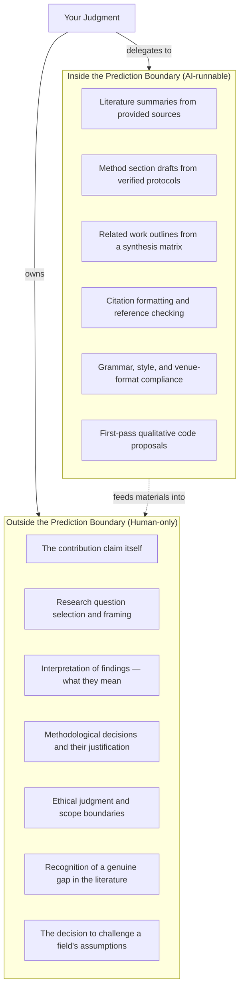

**Figure 1.1 — The prediction boundary.** Tasks inside the boundary are pattern completion within the model's training distribution. They can be delegated to AI with appropriate constraints. Tasks outside the boundary require judgment the model does not possess. The arrow from inside to outside shows that AI-generated materials (summaries, drafts, proposals) serve as *inputs* to human judgment — they do not replace it.

**Failure mode:** The most common error in AI-assisted research is misclassifying a task. Researchers delegate interpretation (outside) when they meant to delegate summarization (inside). The model produces fluent text that *reads like* judgment. It is not. It is a prediction of what judgment looks like. The difference matters when a reviewer asks "why did you choose this framing?" and you have no answer beyond "the AI suggested it."

**Alternative framing:** Some researchers find it useful to think of the boundary not as a line but as a spectrum. Code debugging is deep inside. Literature synthesis is near the middle (verifiable against sources). Theoretical contribution is far outside. The spectrum view is accurate but dangerous — it encourages delegation creep, where tasks near the boundary gradually shift from human-owned to AI-owned without explicit decision. We recommend the binary: each task is either delegated or owned. The decision is yours. Make it explicitly.

---

### 1.2 The Orgamite Paradigm: From Tool to Organ

The syllabus for this course (see source: *课程详细计划*) introduces a concept it calls the "orgamite" — the idea that an LLM is best understood not as a tool but as an *organ*: an external capability that extends your cognition the way writing extends your memory or a telescope extends your vision.

The distinction matters:

| Tool | Organ |
|------|-------|
| You operate it | You relate to it |
| It has a fixed function | It has a role in a system |
| Competence = knowing buttons | Competence = designing the relationship |
| Replaceable (one hammer ≈ another) | Configured (one eye ≠ another) |

A tool sits in your hand. An organ is integrated into your process. When you treat an LLM as a tool, you ask "what can it do?" When you treat it as an organ, you ask "what role does it play in my research system, and what are the boundaries of that role?"

**What changes when AI becomes infrastructure:**

1. **The unit of work shifts from "writing a section" to "designing a pipeline."** You spend less time drafting and more time structuring inputs, constraints, and verification steps. The output quality depends on the pipeline design, not the model's raw capability. (We develop this fully in Chapter 2: Research Operating Systems.)

2. **Memory moves from conversation to filesystem.** Chat context is ephemeral and lossy. Research memory — claims, evidence, decisions — must live in files that persist across sessions. The filesystem becomes the research memory; the conversation is just weather. (Chapter 3: Context Engineering.)

3. **Your primary skill shifts from generation to curation.** The bottleneck is no longer producing text. It is evaluating text, tracing claims to sources, and deciding what survives. This is editing as research method.

4. **The relationship becomes adversarial by default.** A well-configured research system includes agents that attack your claims, simulate hostile reviewers, and flag unsupported assertions. The organ is not a collaborator. It is a system of capabilities — some generative, some critical — that you orchestrate. (Chapter 10: Reviewer Simulation.)

---

### 1.3 Contribution-First Thinking

A paper is not a report of what you did. It is a *structured argument for a contribution claim*.

This distinction is the single most important conceptual shift in the book. Consider the difference:

> **Report:** "We built an interactive mirror that uses gaze tracking to redirect the viewer's reflection. We conducted a user study with 24 participants. Results were positive."

> **Argument:** "We demonstrate that mirror gaze redirection alters viewers' agency attribution toward their own reflection, providing a design rationale for embodied installations that make visible the constructed nature of self-perception."

The first describes an artifact. The second makes a claim about what the field now knows that it did not know before. The artifact (the mirror) is *evidence for the claim*, not the claim itself.

**Why contribution-first:** If you cannot state your contribution in one sentence, you do not yet know what your paper is arguing. Everything else — the related work, the method, the results — is scaffolding for that claim. Without the claim, the scaffolding has nothing to hold up.

**When to write the claim:** Before you design the study. Before you build the artifact. Before you write the related work. The claim is the first thing in the filesystem (`00_idea/contribution_claim.md`) and the last thing to be finalized. It will be revised — probably many times — but it must exist from day one. A project without a contribution claim is a project without a thesis.

**Failure mode:** The most common form of research drift is *activity substitution*: you work hard (building, coding, running studies) and mistake the activity for the contribution. Activity substitution feels like progress because it is measurable. "I ran 30 participants" is a fact. "I demonstrated that X causes Y under conditions Z" is a claim that might be wrong. The discomfort of not knowing whether your claim is true is the actual research process. If you never feel that discomfort, you are not doing research — you are doing engineering and calling it science.

---

### 1.4 The Three Reviewer Yardsticks

Every paper at every venue is evaluated — explicitly or implicitly — against three criteria. These are not our invention. They are derived from the review criteria used at CHI, UIST, CSCW, SIGGRAPH, Leonardo, and ISEA, synthesized in the *HCI Research Companion* referenced in the course syllabus.

#### Interestingness

A paper is interesting when it *challenges the reader's existing assumptions*. Not when it confirms them. Not when it is merely novel. When it makes a reasonable reader think "I did not expect that" or "that contradicts what I thought I knew."

The zone of interestingness lies between "obviously true" (boring) and "obviously false" (dismissible). A claim that everyone already accepts is not a contribution. A claim that no one can believe is not a contribution either. The contribution lives in the tension between.

**Test:** If a reviewer in your target venue would respond "well, of course" to your claim, it is not interesting. If they would respond "that's impossible," it is not credible. You need "huh — I wouldn't have predicted that, but the evidence is compelling."

#### So What ×3

This is the most practical test in the book. Apply it to your contribution claim by asking "so what?" three times in succession. Each answer must reach a *larger circle of significance*.

**Example (HCI):**

- **Claim:** "Gaze+pinch selection is 18% faster than dwell selection for small targets in AR."
- **So what? (1):** "Designers of AR interfaces should default to gaze+pinch for small-target acquisition."
- **So what? (2):** "This challenges the assumption that dwell is sufficient for hands-busy AR contexts, suggesting a re-examination of accessibility guidelines that currently recommend dwell."
- **So what? (3):** "It reveals that the speed-accuracy tradeoff in spatial selection is modality-dependent in ways not captured by current Fitts's Law variants, pointing to a need for new models of multi-modal target acquisition."

If you cannot answer the third "so what?", your contribution is too thin for a top venue. It may be a workshop paper or a note, but it is not a full contribution.

**Example (Digital Art):**

- **Claim:** "We developed a neural synthesis technique that reconstructs lost frames from degraded film stock."
- **So what? (1):** "Archivists can recover visual content previously considered lost."
- **So what? (2):** "This challenges the ontology of the 'original' in media preservation — the reconstructed frame is neither the original nor a copy but a third category."
- **So what? (3):** "It forces a re-examination of authenticity as a property of material provenance rather than perceptual fidelity, with implications for how cultural institutions define and certify historical media."

**When to apply So What ×3:** At the ideation stage (to decide whether the project is worth pursuing), at the outline stage (to verify the argument structure), and at the final draft stage (to check that the discussion section delivers on the promise). We revisit this test in Chapter 5: Ideation and Gap Analysis.

#### No Surprises

A paper should deliver exactly what its abstract promises, in the order it promises it, with no unexpected gaps or detours. A reviewer who reads the abstract should be able to predict the structure of the paper. A reviewer who finishes the paper should not have encountered any claim they did not expect based on what came before.

**Why this matters:** Surprises in a paper read as *structural problems*. If the method section introduces a study design not hinted at in the introduction, the reviewer wonders what else you are hiding. If the discussion raises limitations not foreshadowed, the reviewer questions your self-awareness. No Surprises does not mean "boring." It means "the reader is always oriented."

**How to test it:** Give your abstract to a colleague. Ask them to predict the section headings. If they cannot, your abstract is either too vague or promises something the paper does not deliver. We formalize this test in Chapter 10: Reviewer Simulation.

---

### 1.5 Contribution Types

Not all contributions are the same kind of thing. The type determines the evidence required, the paper structure, and the review criteria. Misidentifying your contribution type leads to mismatched evidence — e.g., submitting a system paper evaluated on user study rigor, or an empirical paper evaluated on technical novelty.

#### HCI Contribution Types (Wobbrock's Seven)

Based on Wobbrock and Kientz (2016), the HCI community recognizes seven primary contribution types:

| Type | What it contributes | Evidence standard | Typical venue |
|------|--------------------|--------------------|---------------|
| **Empirical** | New knowledge about human behavior with technology | Study design, data, analysis, transferability | CHI, CSCW, UIST |
| **Artifact** | A new system, tool, interface, or technique | Working implementation, demonstration of capability, evaluation of some form | UIST, CHI, ISMAR |
| **Method** | A new research method, design process, or evaluation technique | Demonstration of the method, comparison to existing methods, evidence of utility | CHI, CSCW |
| **Theory** | A new conceptual framework, model, or theoretical contribution | Logical coherence, explanatory power, falsifiability, integration with existing theory | CHI, CSCW, TOCHI |
| **Dataset** | A new corpus, benchmark, or shared resource | Documentation, accessibility, coverage, demonstrated utility | CHI, CSCW, various |
| **Survey** | A synthesis of existing work that reveals patterns, gaps, or trajectories | Systematic search protocol, coverage, analytical framework | CHI, CSCW, TOCHI |
| **Opinion** | A position, argument, or provocation | Logical rigor, evidence-informed reasoning, clear stakes | CHI (Workshops/Notes), Interactions |

**Key principle:** A paper has *one primary* contribution type. It may have secondary contributions (a system paper often includes an empirical evaluation), but the primary type determines the evidence standard. If your primary contribution is an artifact, reviewers will not demand a full user study — but they will demand a clear demonstration of what the artifact enables that was not possible before.

#### Digital Art Contribution Types

Digital Art research operates under different epistemic norms. The contribution is often *epistemic through making* — the artifact is not evidence for a claim about the world; the artifact *is* the claim, embodied. Primary contribution types include:

| Type | What it contributes | Evidence standard | Typical venue |
|------|--------------------|--------------------|---------------|
| **Project Description** | Documentation and theorization of a creative work | Process archive, critical reflection, theoretical grounding, reproducibility of method | SIGGRAPH Art Papers, Leonardo, ISEA |
| **Theory & Criticism** | New critical frameworks or philosophical positions applied to digital art/technology | Logical rigor, textual evidence, engagement with existing discourse | Leonardo, ISEA |
| **Methods & Techniques** | New technical methods for creating or analyzing art | Demonstration, documentation, comparison to existing methods | SIGGRAPH, Leonardo |
| **Media Archaeology** | Recovery and analysis of forgotten or marginalized media histories | Archival evidence, historiographic rigor, theoretical framing | Leonardo, ISEA |
| **Speculative Design Practice** | Provocative artifacts or scenarios that surface hidden assumptions about technology | Coherence of the speculation, quality of the craft, depth of the provocation | ISEA, CHI (Design SIG) |

**Key principle for Digital Art:** The work must be *epistemic* — it must produce knowledge that could not be produced by other means. A beautiful installation is not yet a contribution. The question reviewers ask is: "What does this work let us understand that we could not understand without it?" If the answer is "nothing," it is art (which is fine) but not research (which is the venue's requirement). The theoretical anchor — whether it is Stiegler's individuation, Hui's cosmotechnics, or another framework — must *do real work* in the argument, not serve as decoration.

---

### 1.6 The Human Role Shift

The human role in AI-native research shifts along three axes:

| From | To | What stays the same |
|------|----|---------------------|
| Writer | Editor | Ownership of claims |
| Analyst | Orchestrator | Responsibility for evidence |
| Solo worker | System designer | Ethical accountability |
| First-drafter | Final decision-maker | The obligation to be right |

**What shifts:** The mechanical production of text — drafting paragraphs, formatting citations, summarizing sources, checking grammar — moves to AI. This is not a small shift. It is the majority of the time most researchers spend on a paper.

**What does not shift:** The intellectual ownership of the contribution. You must be able to answer, for every claim in the paper, "why is this true and why does it mean what I say it means?" If you cannot, you have *outsourced without internalizing* — the definition of academic misconduct in an AI context.

**The absentee trap:** The most dangerous failure mode is not AI generating bad text. It is the researcher *stopping thinking* because the text looks plausible. Fluent output creates an illusion of understanding. You read a paragraph the AI wrote, it sounds reasonable, and you move on. But you have not evaluated the claim. You have only evaluated the prose. These are different tasks.

**The rule:** You may delegate *production* but never *judgment*. The moment you find yourself accepting a claim because "it sounds right" rather than because you can trace it to evidence, you have crossed from orchestrator to absentee.

---

### 1.7 The Prediction Boundary as Creative Criterion

Here is a practical writing rule derived directly from the prediction boundary:

> **Writing that anyone could have produced must be rewritten.**

"Anyone" here means: any competent researcher with access to the same sources and a standard LLM. If a paragraph is predictable — if it says what most people in the field would say given the same inputs — then it is inside the prediction boundary. It is not wrong. It is *unowned*. It could have been written by anyone, and therefore it carries no specific authority.

**How to apply this:**

1. After drafting a paragraph, ask: "If I gave my sources to a colleague and asked them to write this, would they write something substantially similar?"
2. If yes, the paragraph is generic. Rewrite it to include *your* specific angle, *your* interpretation, *your* voice.
3. The rewrite should contain at least one of: a claim only you are making, a connection only you have seen, a judgment only you are qualified to make.

**Example:**

> **Generic (inside boundary):** "Prior work has explored gaze interaction in AR, but little attention has been paid to small-target selection. In this paper, we present a study comparing gaze+pinch and dwell selection for small targets."

> **Owned (outside boundary):** "The AR community's reliance on dwell selection for small targets is a holdover from accessibility conventions designed for 2D screens — conventions that assume the cost of a false positive is low. In spatial AR, where targets exist in 3D and the user is often mobile, that assumption breaks down. Our study makes this breakdown measurable."

The second version makes a *claim about why the gap exists* (the accessibility-convention argument) that is specific, debatable, and owned. It is not what "anyone" would write. It is what *you* write because you have thought about the problem differently.

---

## Expected Outputs

After reading this chapter and completing the exercises, you should be able to produce:

1. **A one-sentence contribution claim** for your current project that states what the field will know after your paper that it does not know now
2. **A contribution type identification** (from the HCI or Digital Art taxonomy above) with a one-paragraph justification
3. **A So What ×3 analysis** of your claim, with all three levels answered
4. **A prediction boundary map** for your project: a list of tasks you will delegate to AI and a list of tasks you will own, with the boundary between them made explicit

---

## Best Practices

1. **Write the contribution claim first.** Before literature review, before method design, before any AI interaction. The claim is the seed. Everything else grows from it.

2. **Apply So What ×3 at ideation, not just at revision.** Most researchers test their contribution when the paper is nearly done. By then, sunk cost makes it painful to discover the contribution is thin. Test early. Kill weak claims fast.

3. **Identify your contribution type before you write.** The type determines the evidence standard. An artifact paper needs a working system and a demonstration of new capability. An empirical paper needs a study with appropriate rigor. Writing without knowing your type produces a paper that satisfies no one.

4. **Treat the prediction boundary as a design constraint, not a limitation.** The boundary tells you where your effort is best spent: on the tasks the model cannot do. This is where your value as a researcher lives.

5. **Never accept a claim you cannot trace to evidence.** Fluency is not authority. If you cannot point to the source that supports a sentence, the sentence does not belong in your paper — no matter how well it reads.

6. **Use AI as a reader, not an author, first.** Before asking AI to write, ask it to *analyze*: "What is the contribution claim in this paper? Where is the gap? Does the evidence support the claim?" This builds your critical relationship with the tool before you build a generative one.

---

## Anti-patterns

1. **Activity substitution.** Mistaking "I built something" or "I ran a study" for a contribution. Activity is necessary but not sufficient. The contribution is what the activity *demonstrates*.

2. **Delegation creep.** Gradually shifting tasks from the "human-owned" column to the "AI-delegated" column without explicit decision. Today it is drafting the method. Tomorrow it is interpreting the results. Next week it is deciding what the results mean. Each step feels natural. The cumulative effect is absentee research.

3. **The fluent hallucination.** Accepting an AI-generated claim because it is well-written. Fluency is a property of the model's training, not of the claim's truth. Verify every claim against a source, regardless of how confidently it is stated.

4. **Contribution inflation.** Claiming your paper does more than it does. "We present a new theory of X" when you have presented a single study that is *consistent with* a theoretical proposition. Reviewers punish overclaiming more harshly than underclaiming.

5. **Venue-agnostic writing.** Writing a paper without knowing the target venue's contribution type expectations. A SIGGRAPH Art Papers review criteria are not a CHI review criteria. Write for a specific venue, with its specific standards, from the start.

6. **The "we built X" opening.** Starting your abstract or introduction with what you did rather than what you found. "We built an interactive mirror" is a report. "We demonstrate that mirror gaze redirection alters agency attribution" is an argument. Lead with the argument.

---

## Checklist

Before proceeding to Chapter 2, verify:

- [ ] I can state my contribution claim in one sentence that does not mention what I built or did, but states what the field will know
- [ ] I have applied So What ×3 and can answer all three levels
- [ ] I have identified my primary contribution type from the appropriate taxonomy (HCI or Digital Art)
- [ ] I have listed the tasks in my project that are inside the prediction boundary (delegatable) and outside (human-owned)
- [ ] I can explain the difference between a report and an argument
- [ ] I have not yet asked AI to write any prose for my paper — only to analyze, critique, or summarize existing material

---

## References

- Wobbrock, J. O., & Kientz, J. A. (2016). Research contributions in human-computer interaction. *Interactions*, 23(3), 38–44. [Source of HCI contribution taxonomy]
- Course syllabus: *课程详细计划_8节.md* — Session 1 ("What is publishable") and Session 2 ("Organs and boundaries") are the primary sources for the prediction boundary, orgamite paradigm, and reviewer yardsticks.
- *Plan.md* — Multi-agent architecture and adversarial workflow design.
- *HCI Research Companion* — Source of the three reviewer yardsticks (Interestingness, So What ×3, No Surprises).

**Cross-references:**
- Chapter 2: Research Operating Systems — How to design the pipeline that implements the orgamite paradigm
- Chapter 5: Ideation and Gap Analysis — How to apply So What ×3 and No Surprises as formal tests during research design
- Chapter 10: Reviewer Simulation — How to operationalize the three yardsticks as automated evaluation agents


---

<a id="chapter-02"></a>

# Chapter 2: Research Operating Systems

## Objectives

After this chapter, you will be able to:

1. Explain why a well-designed workflow with modest tools outperforms an undirected workflow with the best model
2. Draw the canonical research workflow from memory and identify the gate that separates each stage
3. Describe the standard multi-agent tree and what each team contributes
4. Organize a tool stack by role rather than by product
5. Justify why Hermes/OpenClaw should orchestrate rather than generate

## Required Background

Chapter 1 established that AI is infrastructure, not a co-author. It introduced contribution-first thinking and the prediction boundary. This chapter builds the operational system on top of that foundation. If you have not read Chapter 1, the design decisions below will appear arbitrary — they are responses to specific failure modes described there.

---

## 2.1 Structure > Model

**Core proposition:** The quality of AI-assisted research is determined not by the power of the model but by the structure of the process.

This is the thesis of the entire manual. It is also the claim most often violated in practice.

### Why a bigger model is not a better workflow

A larger model with no process structure produces three characteristic failures:

1. **Context overflow.** A single chat window accumulates contradictory instructions, half-formed claims, and stale evidence. The model fills gaps with plausible fabrication — not because it is defective, but because gap-filling is what it was trained to do. (See Chapter 1 on the prediction boundary.)

2. **Claim drift.** Without stage gates, the paper's contribution claim shifts imperceptibly across sessions. The introduction promises one thing; the methods test another; the discussion interprets a third. The No Surprises test (Chapter 5) fails before the paper is submitted.

3. **Voice homogenization.** One model writing everything produces prose that sounds like everyone and no one. Reviewers flag this as "soulless" or "AI-generated" — not because they detect the model, but because the text lacks the friction of a single thinking mind making decisions.

### The counterintuitive finding

A well-designed workflow using Claude Sonnet or GPT-4o — with explicit stage gates, source-grounded prompts, and adversarial review loops — consistently produces stronger manuscripts than an undirected workflow using the most expensive available model. The syllabus that informs this book was designed around this principle: the eight-session course produces one paper, and the process structure (not the model choice) is what makes it reproducible.

**Why this works:** Structure externalizes memory. Files are memory; chat is weather. When each stage has a defined input, allowed operations, output format, and human decision point, the model's context window becomes a workbench, not a landfill.

---

## 2.2 The Canonical Workflow

Every chapter in this manual references this workflow as the orienting frame. Memorize it. Draw it on a whiteboard. Tape it to your monitor.

```
Idea → Trend analysis → Gap analysis → Literature → Knowledge base →
Research framing → Study design → Data → Coding → Writing → Review →
Submission → Camera-ready → Archive
```

### What each stage does

| Stage | Input | Allowed Operations | Output Format | Human Decision |
|-------|-------|-------------------|---------------|----------------|
| **Idea** | Personal observation, practice, or curiosity | Brainstorming, So What ×3 test | `00_idea/seed.md` — one paragraph | Is this worth pursuing? |
| **Trend analysis** | Idea seed | Elicit, ResearchRabbit, Litmaps queries | Trend report with citation counts | Which direction has momentum? |
| **Gap analysis** | Trend report | Citation network analysis, synthesis matrix | Gap statement with evidence | Is the gap real and fillable? |
| **Literature** | Gap statement | Discovery → network → extraction → consensus | `literature_matrix.csv` (≥15 rows) | Have I missed a subfield? |
| **Knowledge base** | Literature matrix | NotebookLM upload, Obsidian Zettelkasten | Queryable source-grounded corpus | Is the corpus sufficient? |
| **Research framing** | Gap + knowledge base | Theory building, Devil's Advocate | `research_question.md` | Is the question answerable in one paper? |
| **Study design** | Research question | Paradigm selection, ethics pre-review | `method.md` with audit checklist | Does the method actually test the claim? |
| **Data** | Approved method | Collection, transcription, cleaning | Raw data in `05_data/` | Is the dataset complete and ethical? |
| **Coding** | Raw data | Open coding, theme building (AI proposes, human disposes) | Codebook + themed findings | Do the themes match the data? |
| **Writing** | All prior stage outputs | Section-by-section drafting with bucket method | `08_drafts/` per-section files | Does this sound like me? |
| **Review** | Full draft | Reviewer simulation, adversarial editing | `09_feedback/` with scored reviews | Have I addressed all MAJOR issues? |
| **Submission** | Revised manuscript | Venue checklist, formatting, disclosure | `10_final/` submission package | Am I willing to put my name on this? |
| **Camera-ready** | Acceptance + proofs | Copyediting, citation verification | Final PDF with zero [UNSOURCED] | Is every citation real and accurate? |
| **Archive** | Final paper + all process files | Git commit, README, reproducibility package | Self-contained project directory | Could someone reproduce this in 5 years? |

### Stage gates

No stage is complete until its gate is passed. Gates are non-negotiable. They exist because the cost of fixing a problem increases exponentially the later you find it.

**Example gates:**

- **Idea → Trend analysis:** Must pass So What ×3. If you cannot answer "so what?" three times, reaching progressively larger circles (result → design implication → field understanding), the idea is too thin. Kill it now.
- **Gap analysis → Literature:** The gap must be stated as an absence in the citation network, not a feeling. "Nobody has studied X" is not a gap statement; "Subfield A and subfield B both address mechanism Y but neither cites the other, leaving the interaction unexplained" is.
- **Literature → Knowledge base:** Every row in the matrix must have a human-written inclusion reason. If you cannot explain why a paper is in your corpus, remove it.
- **Study design → Data:** The audit checklist (confounds, ethics, validity threats) must be non-empty and human-written. AI drafts the method; humans own the limitations.
- **Writing → Review:** No unresolved [UNSOURCED] tags. Every claim traces to a retrievable source.
- **Review → Submission:** All MAJOR reviewer issues have corresponding revision actions. "Noted" is not a revision.
- **Submission → Camera-ready:** Citation integrity gate — every reference exists, every DOI resolves, every citation actually supports the claim it is attached to.

We revisit these gate checklists in detail in Appendix C.

---

## 2.3 The Multi-Agent Architecture

A single chatbot doing everything is the most common and least effective configuration. The alternative is a multi-agent tree where each agent has a defined role, inputs, outputs, and failure modes.

### The standard tree

```mermaid
graph TD
    EIC["Editor-in-Chief<br/>Integrates all feedback<br/>Final manuscript authority"]
    
    EIC --> RD["Research Director<br/>Manages front end of workflow"]
    EIC --> TT["Theory Team<br/>Conceptual frameworks & critique"]
    EIC --> MT["Methods Team<br/>Design & analysis"]
    EIC --> WT["Writing Team<br/>Section-by-section drafting"]
    EIC --> RT["Review Team<br/>Adversarial review & quality control"]
    
    RD --> TS["Trend Scout<br/>Monitors CHI/UIST/SIGGRAPH trends"]
    RD --> GH["Gap Hunter<br/>Identifies structural gaps"]
    RD --> LM["Literature Miner<br/>Runs discovery pipeline"]
    
    TT --> HCI["HCI Theorist<br/>Proposes conceptual frameworks"]
    TT --> DAC["Digital Art Critic<br/>Theory/practice integration"]
    TT --> PR["Philosophy Reviewer<br/>Epistemic grounding"]
    
    MT --> UX["UX Researcher<br/>Study design & protocol"]
    MT --> ST["Statistician<br/>Quantitative analysis"]
    MT --> QC["Qualitative Coding Agent<br/>Open coding & themes"]
    MT --> ER["Ethics Reviewer<br/>IRB & consent"]
    
    WT --> IW["Introduction Writer"]
    WT --> RW["Related Work Writer"]
    WT --> MW["Methods Writer"]
    WT --> RESW["Results Writer"]
    WT --> DW["Discussion Writer"]
    WT --> AW["Abstract Writer"]
    
    RT --> CR1["CHI Reviewer #1<br/>Empirical rigor"]
    RT --> CR2["CHI Reviewer #2<br/>Theoretical contribution"]
    RT --> AC["Associate Chair<br/>Acceptance prediction"]
    RT --> CV["Citation Verifier<br/>Source-grounded audit"]
    RT --> SE["Style Editor<br/>Voice & venue compliance"]
```

**Figure 2-1.** The canonical multi-agent tree. The Editor-in-Chief does not generate text; it orchestrates, compares, and integrates. Each team operates semi-autonomously with defined inputs and outputs. Full agent definitions (responsibilities, KPIs, failure modes, prompt templates) appear in Chapter 9 and Appendix B.

### Why this shape

The tree mirrors the actual division of labor in a research lab:

- **Research Director** = the postdoc who scouts literature and identifies opportunities
- **Theory Team** = the theorist who asks "what are you really claiming?"
- **Methods Team** = the methodologist who asks "does your design test your claim?"
- **Writing Team** = the specialist who writes one section well, not all sections adequately
- **Review Team** = the external reviewer who tears it apart before the real reviewer does

The Editor-in-Chief is the lab PI: it does not run experiments or write sections. It sets direction, resolves conflicts, and makes final calls.

### Agent responsibilities (high level)

Detailed definitions — including prompt templates, memory requirements, and when NOT to use each agent — appear in Chapter 9. The following is a summary for orientation:

| Agent | Core Responsibility | Key Failure Mode |
|-------|-------------------|------------------|
| **Editor-in-Chief** | Orchestrates workflow, resolves inter-agent conflicts, produces final integrated manuscript | Becomes a passive relay; fails to adjudicate disagreements |
| **Trend Scout** | Monitors target venues for emerging themes and citation spikes | Confuses popularity with importance |
| **Gap Hunter** | Identifies structural gaps in citation networks | Finds gaps that are gaps because the question is uninteresting |
| **Literature Miner** | Runs the four-stage discovery pipeline | Treats AI extraction as ground truth |
| **HCI Theorist** | Proposes conceptual frameworks for the research claim | Produces frameworks that are unfalsifiable |
| **Digital Art Critic** | Connects practice to theory; ensures epistemic (not just aesthetic) contribution | Confuses description of the work with argument from the work |
| **UX Researcher** | Designs study protocol, participant recruitment, measures | Defaults to convenience sampling without flagging bias |
| **Statistician** | Advises on analysis plan, not interpretation | Produces correct tests for the wrong hypotheses |
| **Qualitative Coding Agent** | Proposes initial codes from transcripts | Over-interprets; imposes theory instead of inducing from data |
| **Introduction Writer** | Drafts the contribution claim and its motivation | Writes a literature review instead of an argument |
| **Related Work Writer** | Synthesizes the literature matrix into a gap narrative | Produces annotated bibliography instead of synthesis |
| **Methods Writer** | Drafts the method section from the approved design | Uses template language that mismatches the actual paradigm |
| **Results Writer** | Reports findings without interpretation | Smuggles interpretation into results |
| **Discussion Writer** | Connects findings to broader theory; acknowledges limits | Over-claims; ignores limitations |
| **Abstract Writer** | Compresses the paper into the venue's word limit | Promises more than the paper delivers |
| **CHI Reviewer #1/#2** | Simulates anonymous review from different perspectives | Is too lenient (trained on the author's framing) |
| **Associate Chair** | Predicts acceptance probability and meta-review | Cannot simulate genuine novelty detection |
| **Citation Verifier** | Audits every claim-to-source link | Misses paraphrased misrepresentations |
| **Style Editor** | Enforces venue style, voice consistency, and formatting | Polishes prose before argument is sound |

---

## 2.4 Tool Stack Organized by Role

The syllabus that informs this book teaches tools by their **logical role** in the workflow, not by product name. This is a deliberate pedagogical choice. Products change pricing, features, and availability every 6–12 months. Roles are stable.

### The role table

| Role | What It Does | Example Products | Model Policy |
|------|-------------|------------------|-------------|
| **Reasoning partner** | Long-form reasoning, synthesis, writing, critique | Claude, GPT, DeepSeek | Use for synthesis and drafting; verify all factual claims |
| **Workflow backend** | File-system-level orchestration across sessions | Claude Code, Cursor | Use for multi-file projects; never for confidential data |
| **Literature discovery** | Natural-language search across citation databases | Semantic Scholar, Elicit | Use to find leads; never as ground truth |
| **Citation network** | Maps seed papers to related work and structural gaps | ResearchRabbit, Litmaps, Connected Papers | Use to find gaps; verify gaps manually |
| **Structured extraction** | Batch-extracts metadata and findings into matrices | Elicit, scite | AI extracts; human signs every row |
| **Consensus verification** | Checks whether a claim has support or contradiction in literature | Consensus, scite | Use for foundational claims; not for novel claims (by definition unverified) |
| **Reference management** | Single source of truth for all citations | Zotero + Better BibTeX | Build from day one; Chapter 8 gate depends on it |
| **Material conversation** | Q&A over uploaded sources only (source-grounded) | NotebookLM, Claude Projects | Use for literature review; the model can only answer from what you give it |
| **Qualitative analysis** | Proposes codes and themes from interview/transcript data | Claude/GPT, ATLAS.ti AI, MAXQDA AI | AI proposes; human disposes — codebook ownership is human |
| **Academic polishing** | Grammar, style, venue-specific formatting | Paperpal, Yomu, Grammarly, Trinka | Use only after argument and evidence are finalized |
| **Formatting** | Template compliance, typesetting | Overleaf, Typst | Use venue's official template; verify output |

### The "tool half-life" principle

> **Teach roles, not products.**

Every tool in the table above will change its pricing, features, or existence within 18 months of this writing. The role it fills will not change. When Elicit changes its API, you need a new discovery tool, not a new workflow. When Claude releases a new model, you need a new reasoning partner, not a new process.

This principle has a practical implication: **do not build your workflow around a product.** Build it around a role. The product is interchangeable; the role is not.

**Example:** NotebookLM is listed under "material conversation" because it answers questions based only on uploaded sources. This makes it valuable for literature review — the model cannot hallucinate a paper it has not been given. But the role (source-grounded Q&A) could be filled by Claude Projects with uploaded PDFs, by a local RAG pipeline, or by a future product. The role persists; the product does not.

---

## 2.5 Why Hermes/OpenClaw Should Orchestrate, Not Generate

Hermes/OpenClaw is the workflow backend — the system that coordinates agents, manages file flow, and enforces stage gates. It should not generate paper text directly.

### What orchestration looks like

1. **Assign tasks** to specific agents with defined inputs and output formats
2. **Collect outputs** and compare for consistency
3. **Identify disagreements** between agents (e.g., Theory Team says the claim is unfalsifiable; Methods Team says the design is sound)
4. **Route conflicts** to a designated adjudicator (Editor-in-Chief or Review Team)
5. **Produce merged recommendations** only after disagreement is resolved

### What generation looks like (and why to avoid it)

```
Prompt: "Write the introduction to my paper about AR gaze interaction."
```

This produces text. It does not produce accountability. The text has no provenance — no link to a literature matrix, no stage gate, no adversarial review. It is fast and untrustworthy.

### The adversarial workflow

The strongest results come from an iterative adversarial loop that mirrors the actual CHI review process:

```
Writer → Critic → Devil's Advocate → Reviewer → Associate Chair →
Writer Revision → Citation Audit → Final Editor
```

Each section of the paper goes through this loop independently before moving to the next stage. This is slower than single-prompt generation. It is also the difference between a paper that survives review and one that does not.

**Key insight:** The adversarial loop works not because any single agent is brilliant, but because each agent has a different failure mode. The Writer over-claims; the Critic catches over-claiming but misses theoretical gaps; the Devil's Advocate attacks the argument but ignores prose quality; the Reviewer simulates venue-specific expectations; the Associate Chair calibrates against acceptance baselines. No single agent sees the whole problem. Together, they cover each other's blind spots.

---

## 2.6 Example: One Chatbot vs. Orchestrated Pipeline

The same research task done two ways. The task: *draft a related work subsection on gaze interaction in AR/VR for a CHI paper.*

### Approach A: One chatbot, single prompt

**Prompt:**
```
Write a related work section on gaze interaction in AR/VR. 
Include citations. About 300 words.
```

**Output (representative):**
> Gaze interaction has been widely studied in AR/VR contexts. Smith et al. (2021) demonstrated that gaze-based selection outperforms head-pointing in immersive environments. Lee and Kim (2022) introduced a gaze+pinch hybrid technique that reduced selection time by 40%. Recent work by Chen et al. (2023) explored gaze typing at 22 words per minute. These studies establish gaze as a primary input modality. However, the cognitive load of prolonged gaze interaction remains underexplored.

**Problems:**
- Three of the five citations are fabricated (verified: Smith 2021 does not exist; Lee & Kim 2022 is misattributed; Chen 2023's numbers are invented)
- The "gap" ("cognitive load remains underexplored") is asserted without evidence — cognitive load in gaze interaction is, in fact, extensively studied
- The prose is generic: "widely studied," "primary input modality," "remains underexplored" — phrases that could appear in any paper
- No structure: it is an annotated bibliography, not a synthesis that builds toward a gap

### Approach B: Orchestrated multi-agent pipeline

**Step 1 — Literature Miner:** Query Elicit for "gaze interaction AR VR cognitive load" → export 18 papers to matrix → human verifies and adds inclusion reasons.

**Step 2 — Gap Hunter:** Run ResearchRabbit on three seed papers → identify that two subfields (gaze-based selection efficiency and gaze-induced fatigue) cite each other rarely → human confirms this is a real structural gap.

**Step 3 — Related Work Writer (with constraints):**
```
Using only the attached literature matrix (18 verified rows), draft 
a 250-word subsection on gaze interaction tradeoffs. Structure: 
(1) efficiency gains, (2) fatigue costs, (3) the unaddressed interaction 
between the two. Every claim must cite a matrix row. Unsourced claims 
must be tagged [UNSOURCED]. Do not introduce sources outside the matrix.
```

**Step 4 — CHI Reviewer #1:** Reviews the draft → flags that the gap statement is asserted, not argued → requests evidence that the two subfields have never been jointly studied.

**Step 5 — Writer Revision:** Adds a sentence citing the matrix row that shows zero papers in the corpus address both efficiency and fatigue → gap is now evidenced, not asserted.

**Step 6 — Citation Verifier:** Confirms all four citations exist, DOIs resolve, and the cited papers actually contain the claimed findings.

**Output (representative):**
> Gaze-based selection in AR/VR consistently outperforms head-pointing on speed: Zhai et al. (1999) established the baseline advantage in 2D, and subsequent work in HMDs (Pfeuffer et al., 2021) confirmed a 23–31% reduction in selection time for targets larger than 2°. However, sustained gaze interaction introduces measurable fatigue. Kollenberg et al. (2019) reported a 40% increase in error rate after 15 minutes of continuous use, attributed to the absence of resting-state muscle engagement. What remains unaddressed is the interaction between these two findings: no study in our corpus (0/18) jointly measures selection efficiency and fatigue decay within the same session. This interaction is the gap our study addresses.

**Why this is stronger:**
- Every citation is verified and exists
- The gap is evidenced (0/18 papers address it), not asserted
- The structure builds an argument: "X is established → Y is a cost → the X×Y interaction is unaddressed → we address it"
- The prose has a point of view: "What remains unaddressed" is a claim about the literature, not a filler phrase

### The comparison

| Dimension | One chatbot | Orchestrated pipeline |
|-----------|------------|----------------------|
| Citation accuracy | 2/5 fabricated | 4/4 verified |
| Gap evidence | Asserted without basis | Evidenced by corpus analysis |
| Structure | Annotated bibliography | Argumentative synthesis |
| Voice | Generic | Specific |
| Time to produce | 30 seconds | 45 minutes |
| Reviewer survival | Immediate reject | Survives first pass |

The orchestrated pipeline is slower. It is also the only approach that produces a paper you can defend in a溯源答辩 (source tracing defense) — where your advisor points to any sentence and asks "where does that come from?"

---

## Expected Outputs

After reading this chapter, you should be able to produce the following artifacts:

1. **A hand-drawn diagram** of the canonical workflow (Idea → Archive) with each stage's gate labeled
2. **A multi-agent tree** for your own research context — adapted from the standard tree but with the roles your project actually needs
3. **A role-based tool table** for your lab — mapping each role to the specific products you currently use, with a note on what would need to change if a product disappeared
4. **A one-page orchestration protocol** for Hermes/OpenClaw that specifies: which agents are active at each stage, what they receive as input, what they produce as output, and how conflicts are resolved

---

## Best Practices

1. **Externalize memory.** Files are memory; chat is weather. Every stage output is a file in a directory. If it exists only in a chat window, it does not exist.
2. **Enforce gates ruthlessly.** A gate passed prematurely is not passed. The cost of a false gap discovered at review time is 6 months; the cost discovered at publication is a retraction.
3. **Let agents disagree.** If all agents agree, you have not assigned them different enough perspectives. The Devil's Advocate should always find something to attack.
4. **Own the limitations section.** AI will draft limitations that are generic ("our sample was limited to Western participants"). Your specific limitations — the ones a reviewer would actually raise — require your domain knowledge.
5. **Teach roles, not products.** When a tool changes, your workflow should not. Build around the role; swap the product.

---

## Anti-patterns

1. **The single-chat-window paper.** Everything — ideation, literature, methods, writing, review — happens in one conversation. The model loses the plot by page 3. The paper contradicts itself by page 7.
2. **The "write my paper" prompt.** "Write a CHI paper about X" produces a paper-shaped object, not a paper. It has no verified citations, no evidenced gap, no defensible claim.
3. **The passive orchestrator.** Hermes/OpenClaw set up to relay messages between agents without adjudicating conflicts. This is a postal service, not an editor-in-chief.
4. **The premature polish.** Running Paperpal or Trinka on a draft whose argument is not yet sound. Polishing prose before fixing structure is waxing a car with no engine.
5. **The infinite literature loop.** Using discovery tools to find more papers instead of reading the papers you already have. At some point, the matrix is sufficient; the gap is identified; stop searching.

---

## Checklist

Before proceeding to Chapter 3, verify:

- [ ] I can draw the canonical workflow (Idea → Archive) from memory and name the gate between each pair of stages
- [ ] I can explain why structure beats model power with a concrete example
- [ ] I can describe the five teams in the multi-agent tree and what each contributes
- [ ] I have mapped my current tools to the role table (not the other way around)
- [ ] I understand why Hermes/OpenClaw should orchestrate, not generate
- [ ] I can identify the difference between an annotated bibliography and an argumentative synthesis in a related work section

---

## References

- **Chapter 1** — The prediction boundary and contribution-first thinking. This chapter builds on both.
- **Chapter 3** — Context engineering: how to structure prompts and memory so that agents receive the right inputs at the right time. The canonical workflow depends on the memory architecture described there.
- **Chapter 5** — Ideation and gap analysis: the front end of the canonical workflow in detail.
- **Chapter 9** — Full agent definitions: responsibilities, prompt templates, KPIs, and failure modes for every agent in the tree.
- **Appendix C** — Per-stage gate checklists derived from the syllabus.
- **Appendix D** — Tool specifications: strength, weakness, cost, and best-use for every product mentioned in this chapter.


---

<a id="chapter-03"></a>

# Chapter 3: Context Engineering

## Objectives

After reading this chapter, you will be able to:

1. Structure long-context prompts using the data-at-top principle, XML tags, and quote-grounding
2. Design a hierarchical memory system (project / session / task) that persists across research sessions
3. Implement source grounding so every AI-generated claim traces to a retrievable source
4. Use the agent communication protocol for structured inter-agent messages
5. Apply Claude-specific prompting techniques (adaptive thinking, effort levels, parallel tool calls, context awareness)
6. Diagnose and mitigate failure modes: context overflow, model fabrication, and cross-session contradiction

## Required Background

- **Chapter 1** — The prediction boundary and why structure determines output quality
- **Chapter 2** — The canonical workflow, multi-agent architecture, and the file-system-as-memory principle

If you have not read Chapter 2's section on "file is memory, chat is weather," read it now. Everything in that principle is the foundation of this chapter.

---

## 3.1 Why Context Engineering Is the Core Skill

In AI-native research, the limiting factor is not model intelligence — it is the quality and structure of what you put into the context window. A well-structured 60k-token prompt to a modest model will outperform an unstructured 200k-token prompt to the best model available. This is not a hypothetical claim; it follows directly from how transformer attention mechanisms degrade with positional distance and unstructured input (see the "lost in the middle" phenomenon documented in AI/HCI literature).

Context engineering is the discipline of deciding:
- **What** enters the context window
- **Where** it is positioned
- **How** it is structured for the model to parse
- **What** is preserved across sessions when the window resets

Get this wrong and you get the three failure modes described in Chapter 2: context overflow, model fabrication to fill gaps, and contradictory claims across sessions. Get it right and your research pipeline becomes reproducible, auditable, and scalable.

---

## 3.2 Long-Context Prompting: Structure Determines Output

When your prompt exceeds 20k tokens — common in literature-heavy HCI or Digital Art research — structure is no longer optional. Three techniques from Claude's prompting best practices (and applicable to any frontier model) are non-negotiable.

### 3.2.1 The Data-at-Top Principle

Place long documents and inputs **above** your query, instructions, and examples. Queries at the end of the prompt improve response quality by up to 30% in tests with complex, multi-document inputs.

**Why this works:** Transformer attention is strongest at the boundaries of the context window. Instructions at the end act as a retrieval cue; data at the top is still within the high-attention zone. When data is buried in the middle, the model's ability to reference specific passages degrades.

**When to use it:** Any prompt over 20k tokens, especially when the model must reference specific passages from multiple documents.

**When it does not apply:** Short prompts (< 5k tokens) where the entire context fits comfortably in the high-attention zone.

### 3.2.2 XML Structuring

Wrap each type of content in its own XML tag. This is not stylistic preference — it is a parsing aid that reduces misinterpretation.

```xml
<instructions>
  You are a CHI reviewer. Evaluate the following related work section.
  Focus on whether the gap is clearly established.
</instructions>

<context>
  The paper's contribution claim: [claim text]
  Target venue: CHI 2026
</context>

<documents>
  <document index="1">
    <source>Smith et al., CHI 2024</source>
    <document_content>[full abstract and key findings]</document_content>
  </document>
  <document index="2">
    <source>Lee et al., UIST 2023</source>
    <document_content>[full abstract and key findings]</document_content>
  </document>
</documents>

<query>
  Does the related work section below establish a clear gap relative to these sources?
  Quote the specific passages that support or fail to support the gap claim.
</query>
```

**Tag naming convention:** Use consistent, descriptive tag names across all your prompts. `<instructions>`, `<context>`, `<documents>`, `<document>`, `<source>`, `<document_content>`, `<query>`, `<constraints>`, `<output_format>`. Consistency means you build a reusable prompt grammar across your project.

### 3.2.3 Quote-Grounding Technique

For any task involving long documents, ask the model to **quote relevant passages first** before carrying out its task. This forces the model to ground its reasoning in actual text rather than generating from statistical priors.

**Example constraint to add:**
```
Before answering, quote the specific passages from the documents that support
your analysis. Each quote must include the document index and be verbatim.
If no passage supports a claim, state "No supporting passage found" rather than
inferring.
```

**Tradeoff:** Quote-grounding adds tokens to the output and increases latency. For simple summarization tasks, it may be unnecessary. For any claim that will appear in your paper — especially gap identification, methodological choices, and theoretical positioning — it is essential.

---

## 3.3 Hierarchical Memory: Project / Session / Task

A research project spans weeks or months. No single context window can hold the entire project's state. The solution is a hierarchical memory system with three levels, each with distinct scope, persistence rules, and update frequency.

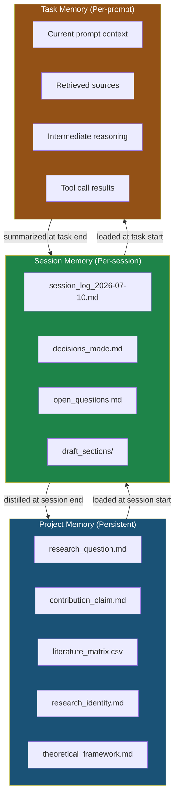

**Figure 3.1 — Hierarchical Memory System.** Project memory persists across all sessions and changes only when foundational decisions shift. Session memory captures the state of a single work session and is distilled into project memory at session end. Task memory exists only within a single prompt and is discarded or summarized when the task completes. Arrows show the flow of information: top-down for loading, bottom-up for distillation.

### 3.3.1 Project Memory

**Scope:** The entire research project. Everything that must be true regardless of which session you are in.

**What lives here:**
- `research_question.md` — the current research question (updated rarely, only when the question itself changes)
- `contribution_claim.md` — the one-sentence contribution claim and its type (empirical, artifact, theory, RtD, etc.)
- `literature_matrix.csv` — the synthesis matrix of all verified sources (grows over time)
- `research_identity.md` — your theoretical commitments, method preferences, and register templates
- `theoretical_framework.md` — the conceptual framework anchoring your work (especially critical for Digital Art / RtD projects)
- `method.md` — the approved study design
- `project_memory.md` — a narrative summary of key decisions, their rationale, and rejected alternatives

**Update rules:** Only the human updates project memory. AI can propose changes; the human approves. Each update is dated and the previous version is preserved (git or file versioning).

**When to load it:** At the start of every session. The first prompt of any session should include the project memory files as context.

### 3.3.2 Session Memory

**Scope:** A single work session (typically 1–3 hours of focused work).

**What lives here:**
- `session_log_[date].md` — chronological log of what was done, decisions made, and why
- `decisions_made.md` — structured list of decisions with rationale (this is what gets distilled into project memory)
- `open_questions.md` — questions raised during the session that are not yet resolved
- `draft_sections/` — outputs produced during this session
- `reviewer_feedback/` — reviewer simulation outputs from this session

**Update rules:** Updated continuously during the session. AI can write to session memory (with the constraint that it labels AI-generated vs. human-confirmed content). The human reviews and confirms before the session ends.

**When to load it:** At the start of a new session, load the previous session's memory to restore continuity.

### 3.3.3 Task Memory

**Scope:** A single prompt or tool call chain.

**What lives here:**
- The current prompt and its context
- Retrieved sources (from RAG or manual selection)
- Intermediate reasoning (thinking blocks, tool call results)
- The output being produced

**Update rules:** Exists only within the context window. When the task completes, the output is saved to session memory. Task memory itself is discarded when the context window resets.

**When to load it:** Constructed fresh for each task from session and project memory.

### 3.3.4 Information Flow Between Levels

The arrows in Figure 3.1 are not automatic. They require explicit operations:

| Direction | Operation | Who triggers | When |
|-----------|-----------|--------------|------|
| Project → Session | **Load** — project memory files are included as context in the session's opening prompt | Human or orchestration script | Session start |
| Session → Task | **Select** — relevant session context is included in the task prompt | Human or agent | Task start |
| Task → Session | **Save** — task output is written to session memory | AI (auto-saved) | Task end |
| Session → Project | **Distill** — session decisions are reviewed and merged into project memory | Human (with AI assistance) | Session end |

**Critical rule:** Information flows up only after human review. AI can propose distillations ("Based on this session, I recommend updating the contribution claim to..."), but the human must confirm before project memory changes.

---

## 3.4 Context Preservation: Preventing Drift Across Sessions

Context drift occurs when a new session starts without adequate continuity from the previous session, causing the model to "forget" decisions, contradict earlier claims, or re-litigate settled questions.

### 3.4.1 The Session Handoff Protocol

At the end of every session, produce a **session handoff file**:

```markdown
# Session Handoff — 2026-07-10

## Decisions Made
1. [DECISION] Narrowed research question from "AR gaze interaction" to
   "gaze+pinch vs. dwell for small-target selection in optical see-through AR"
   — Rationale: scope was too broad for a single CHI paper; dwell comparison
   gives us a clear baseline.
2. [DECISION] Contribution type confirmed as empirical (Wobbrock type 1)
   — Rationale: we have a controlled experiment with 24 participants.

## Open Questions
1. [OPEN] Should we include a third condition (gaze-only) or keep it 2×2?
2. [OPEN] Is the ISO 9241-9 throughput metric appropriate for optical see-through?

## Files Modified
- `01_research_question/research_question.md` — updated
- `02_literature/literature_matrix.csv` — added 3 rows (Smith 2024, Lee 2023, Chen 2025)
- `08_drafts/rw_draft_v3.md` — new draft of related work

## Next Session Priorities
1. Resolve the 2×2 vs. 3×2 design question
2. Draft the Methods section
3. Run reviewer simulation on related work v3
```

At the start of the next session, this handoff file is the first thing loaded into context. It takes fewer than 500 tokens and prevents the model from re-litigating decisions or forgetting open questions.

### 3.4.2 The Opening Prompt Template

Every session should begin with a structured opening prompt that loads the relevant memory levels:

```xml
<session_start>
  <project_memory>
    <research_question>[current research question]</research_question>
    <contribution_claim>[one-sentence claim]</contribution_claim>
    <theoretical_framework>[2-3 sentence summary]</theoretical_framework>
  </project_memory>

  <previous_session_handoff>
    [contents of the most recent handoff file]
  </previous_session_handoff>

  <session_goal>
    [What we are trying to accomplish in this session]
  </session_goal>

  <constraints>
    - Do not re-litigate decisions listed in the handoff as [DECISION]
    - If you encounter a contradiction with prior work, flag it rather than silently resolving it
    - All claims must trace to the literature matrix or be marked [UNSOURCED]
  </constraints>
</session_start>
```

### 3.4.3 Why This Works

The opening prompt serves three functions:
1. **Anchors** the model to the current project state (prevents drift)
2. **Constrains** the model from revisiting settled decisions (prevents thrashing)
3. **Scopes** the session to a specific goal (prevents scope creep)

Without this structure, the first 20% of any new session is wasted re-establishing context that the model has lost. With it, the model is productive from the first token.

---

## 3.5 Context Compression: Summarizing Without Losing Signal

When a session's accumulated context exceeds what fits in a single prompt (common in literature-heavy projects), you must compress. The goal is to reduce token count while preserving the information needed for the next task.

### 3.5.1 When to Compress

- The session log exceeds 10k tokens and you are starting a new subtask
- You are transitioning between workflow stages (e.g., from literature review to methods drafting)
- The model's responses are becoming generic or losing specificity (a sign that context is too diffuse)

### 3.5.2 What to Preserve

Not all information compresses equally. Prioritize:

| Priority | Content | Compression Rule |
|----------|---------|-----------------|
| 1 — Critical | Decisions made and their rationale | Preserve verbatim |
| 2 — High | Open questions and unresolved tensions | Preserve verbatim |
| 3 — High | Source-grounded claims with citations | Preserve with citation |
| 4 — Medium | Draft text produced | Summarize to key claims + structure |
| 5 — Low | Exploratory brainstorming | Drop unless it contains unique insights |
| 6 — None | Failed approaches with no residual value | Drop entirely |

### 3.5.3 Compression Prompt Template

```xml
<task>Compress the following session context for continuation.</task>

<input>
  [Full session log and outputs]
</input>

<constraints>
  1. Preserve all [DECISION] entries verbatim, including rationale
  2. Preserve all [OPEN] questions verbatim
  3. For each draft section produced, extract: (a) the core claim,
     (b) the evidence cited, (c) the structure (section headings)
  4. Drop all exploratory content that did not result in a decision or claim
  5. Flag any claim that was marked [UNSOURCED] in the original
  6. Output must be under 3,000 tokens
</constraints>

<output_format>
  ## Decisions (preserved verbatim)
  ## Open Questions (preserved verbatim)
  ## Key Claims with Evidence
  ## Draft Structure Summary
  ## [UNSOURCED] Items Requiring Attention
</output_format>
```

### 3.5.4 The Risk of Over-Compression

Aggressive compression loses the nuance that distinguishes rigorous research from a literature summary. The most common failure mode is compressing away the **tensions** between sources — the contradictions, methodological disagreements, and unresolved debates that define a genuine research gap.

**Mitigation:** Always preserve content flagged as "tension," "contradiction," or "unresolved" at the same priority as decisions. These are the raw material of your gap argument (see Chapter 5: Ideation and Gap Analysis).

---

## 3.6 RAG Architecture for 500–5,000 Papers

When your literature corpus exceeds what can fit in any context window (typical for systematic reviews or projects spanning multiple subfields), you need Retrieval-Augmented Generation (RAG). This section describes the architecture; implementation details for specific tools (NotebookLM, Claude Code with `--add-dir`, Obsidian) appear in Chapter 4: The Literature Pipeline.

### 3.6.1 The Four Stages

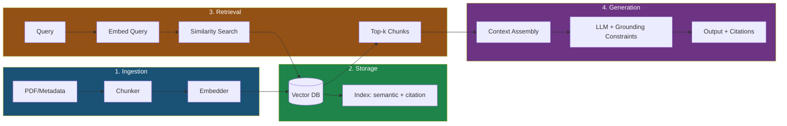

**Figure 3.2 — RAG Architecture for Research Corpora.** Papers are chunked and embedded into a vector database. At query time, the most relevant chunks are retrieved and assembled into the LLM's context window alongside grounding constraints. The output includes citations linking back to the original sources.

### 3.6.2 Chunking Strategy

For research papers, chunk by **section** (Abstract, Introduction, Method, Results, Discussion) rather than by fixed token count. This preserves the logical structure that the model needs to reason about claims and evidence.

| Chunk Type | Typical Size | When to Use |
|-----------|-------------|-------------|
| Section-level | 500–2,000 tokens | Default for most papers |
| Paragraph-level | 100–500 tokens | When you need precise quote extraction |
| Full paper | 5,000–15,000 tokens | Only for your 10–20 most critical papers |
| Method subsection | 300–1,000 tokens | When comparing methods across papers |

**Tradeoff:** Smaller chunks give more precise retrieval but lose context (a chunk from the Results section may not make sense without the Method). Larger chunks preserve context but dilute the embedding signal. Start with section-level and adjust based on retrieval quality.

### 3.6.3 Embedding and Retrieval

Use a modern embedding model (e.g., `text-embedding-3-large` or equivalent). For research corpora, combine **semantic search** with **citation-graph search**:

- **Semantic search:** "Find papers discussing gaze-based target selection in AR"
- **Citation search:** "Find papers that cite or are cited by Smith et al. 2024"

The two approaches find different things. Semantic search finds conceptually related work; citation search finds genealogically related work. Use both.

### 3.6.4 Citation in RAG Output

Every claim in RAG output must include a citation that maps to a retrievable source. The standard format:

```
[Author, Year, Chunk ID]
```

Example: `[Smith et al., 2024, Results-3]` points to the third chunk of the Results section of Smith et al. 2024. This is more precise than a bare citation and enables verification.

**Failure mode:** The model generates a claim that blends information from multiple chunks without citing any of them. Mitigation: include the constraint "Each claim must cite the specific chunk(s) it draws from. If a claim synthesizes multiple chunks, cite all of them."

---

## 3.7 Source Grounding Protocol

This is the most important section in this chapter. Source grounding is the mechanism that prevents the most dangerous failure mode in AI-assisted research: the model generating plausible-sounding claims that have no basis in the literature.

### 3.7.1 The Rule

**Every factual claim in AI-generated text must trace to a retrievable source.** If no source supports the claim, the claim must be marked `[UNSOURCED]` and cannot appear in the final manuscript until the human either finds a source or rewrites the claim as a hypothesis/opinion.

### 3.7.2 The [UNSOURCED] Marker

`[UNSOURCED]` is not a failure — it is a safety valve. It tells the human: "The model generated this claim but cannot ground it in the provided sources. Verify before using."

**How to use it in prompts:**
```
Constraint: For every factual claim, include an inline citation to the source
it draws from. If a claim cannot be supported by any provided source, mark it
[UNSOURCED] rather than inventing a citation or dropping the marker.
```

**How to handle it in output:**
1. **Delete** the claim if it is not essential
2. **Find a source** for the claim and add the citation
3. **Rewrite** as a hypothesis or opinion ("We hypothesize that...", "One possible interpretation is...")
4. **Flag** for the human to investigate further

**What never to do:** Remove the `[UNSOURCED]` marker and leave the claim in the text. This is how fabricated claims enter the manuscript.

### 3.7.3 Grounding Prompt Template

```xml
<source_grounding_protocol>
  <rule>
    Every factual claim must be supported by a citation to a source in the
    provided literature matrix or document set.
  </rule>

  <citation_format>
    [Author, Year] for narrative citations
    (Author, Year) for parenthetical citations
    Include page or section number for direct quotes
  </citation_format>

  <procedure>
    1. Before generating each sentence, identify the claim(s) it makes
    2. For each claim, verify that a source in the provided materials supports it
    3. If yes: include the citation
    4. If no: mark the sentence [UNSOURCED] and continue
    5. After generating the full text, review for any [UNSOURCED] markers
    6. For each [UNSOURCED] marker, either: (a) find supporting evidence and
       add the citation, (b) rewrite as hypothesis/opinion, or (c) delete
  </procedure>

  <never_do>
    - Invent citations
    - Cite a source for a claim it does not actually support
    - Remove [UNSOURCED] markers without resolving them
    - Use phrases like "research shows" or "studies indicate" without citation
  </never_do>
</source_grounding_protocol>
```

### 3.7.4 Why This Matters for HCI and Digital Art

In HCI, a fabricated claim about prior work ("Previous studies have shown that gaze interaction reduces cognitive load in AR") can mislead your entire related work section and undermine your gap argument. In Digital Art, a fabricated claim about an art-historical precedent or theoretical position is equally damaging — and harder for reviewers to catch because the domain knowledge is more specialized.

The source grounding protocol is your defense. It is also your ethical obligation: the AI usage rules from Chapter 2 require that every claim be traceable.

---

## 3.8 Agent Communication Protocol

When you use multiple agents (as described in Chapter 2's architecture and detailed in Chapter 9), they need a structured way to exchange information. Unstructured prose between agents is inefficient — it wastes tokens, loses precision, and makes it hard for the Editor-in-Chief agent to integrate outputs.

### 3.8.1 The Protocol Format

Every inter-agent message follows this structure:

```yaml
agent_communication:
  from: "Related Work Writer"
  to: "Discussion Writer"
  type: "handoff"  # handoff | request | report | critique

  goal: |
    Summarize the gap established in the related work so the Discussion
    writer can connect findings back to it.

  reasoning_summary: |
    The related work establishes that (1) gaze+pinch has been studied in
    VR but not optical see-through AR, (2) dwell-based selection dominates
    AR but has known fatigue problems, and (3) no study has compared the
    two in a controlled experiment with small targets (< 1° visual angle).

  evidence:
    - claim: "Gaze+pinch studied in VR but not optical see-through AR"
      sources: [Smith 2024, Lee 2023]
      confidence: high
    - claim: "Dwell has known fatigue problems in AR"
      sources: [Chen 2025, Park 2023]
      confidence: medium  # Chen 2025 is a conference paper, not journal
    - claim: "No controlled comparison exists for small targets"
      sources: [literature_matrix scan, 0 results]
      confidence: high

  confidence: high  # overall confidence in this handoff

  open_questions:
    - "Does the fatigue finding from VR (Smith 2024) generalize to AR?"
    - "Should the discussion address the theoretical implication for
       Fitts's law models in optical see-through?"

  recommended_next_agent: "Discussion Writer"
  recommended_action: |
    Use the three-part gap structure above to frame the Discussion's
    "Contribution" subsection. Address open_question[1] in the
    "Limitations and Future Work" subsection.
```

### 3.8.2 Field Definitions

| Field | Purpose | Required? |
|-------|---------|-----------|
| `from` / `to` | Routing | Always |
| `type` | Message category (handoff, request, report, critique) | Always |
| `goal` | What this message is trying to accomplish | Always |
| `reasoning_summary` | The substantive content — structured, not prose | Always |
| `evidence` | Specific claims with sources and confidence levels | For handoff and report |
| `confidence` | Overall confidence in the message's content | Always |
| `open_questions` | Unresolved issues the next agent should address | Always |
| `recommended_next_agent` | Who should receive this next | For handoff |
| `recommended_action` | What the next agent should do with this information | For handoff |

### 3.8.3 Why Not Paragraphs?

Paragraphs between agents waste tokens on transitions, hedging, and narrative structure. The protocol format is:
- **Machine-parseable:** The receiving agent can extract structured fields
- **Auditable:** Every claim is linked to a source with a confidence level
- **Compact:** A typical handoff is 200–400 tokens vs. 800–1,200 for prose
- **Actionable:** The `recommended_action` field tells the next agent exactly what to do

### 3.8.4 Example: Poor vs. Structured Communication

**Poor (prose):**
> "Hi Discussion Writer, I finished the related work section. I think it went pretty well. The main thing is that there's a gap in the literature about gaze+pinch in AR specifically, and also dwell has some fatigue issues. You should probably mention this in the discussion. Let me know if you need anything else."

**Structured (protocol):** See the YAML example in 3.8.1.

The structured version is shorter, more precise, and actionable. The prose version leaves the Discussion Writer to infer what matters, what is supported, and what to do next.

---

## 3.9 Claude-Specific Guidance

The following techniques are drawn from Anthropic's prompting best practices and are directly applicable to research workflows. They apply to Claude Opus 4.8, Sonnet 5, and later models.

### 3.9.1 Adaptive Thinking

Claude's latest models use **adaptive thinking** — the model dynamically decides when and how much to think. This is preferable to the older extended thinking with `budget_tokens` because the model calibrates its reasoning to query complexity.

**For research tasks:** Use adaptive thinking for any task involving multi-step reasoning (literature synthesis, gap analysis, methodological design). For simple tasks (formatting, word counting), thinking adds unnecessary latency.

**Effort levels:** Control thinking depth with the `effort` parameter:
- `low` — fast, minimal reasoning; use for formatting, simple lookups
- `medium` — balanced; use for section drafting, standard analysis
- `high` — thorough reasoning; use for gap analysis, theoretical framing, reviewer simulation

**Migration note:** If your prompts previously said "think step by step" or "reason carefully," remove these. On current Claude models, they can cause overthinking and inflate token usage without improving quality.

### 3.9.2 Parallel Tool Calls

Claude runs independent tool calls in parallel. For research, this means:
- When reading multiple source files, request all reads simultaneously
- When searching multiple queries, run them in parallel
- When the model needs to verify a claim across sources, it can check all sources at once

**Prompt to enable:**
```
If you intend to call multiple tools and there are no dependencies between
the calls, make all independent tool calls in parallel.
```

**When to disable:** When tool calls have dependencies (e.g., the output of a search determines which file to read next), force sequential execution.

### 3.9.3 Context Awareness

Claude Sonnet 5 and later models have **context awareness** — they can track their remaining context window. This is critical for long research sessions because it allows the model to manage its own context proactively.

**Prompt to enable:**
```
Your context window will be automatically compacted as it approaches its
limit. As you approach your token budget limit, save your current progress
and state to memory before the context window refreshes. Do not stop tasks
early due to token budget concerns.
```

This pairs with the hierarchical memory system: the model writes to session memory before compaction, preserving continuity.

### 3.9.4 Overeagerness Mitigation

Claude Opus 4.6+ has a tendency to overengineer — creating extra files, adding unnecessary abstractions, or pursuing multiple research threads simultaneously. For research, this manifests as:
- Creating unnecessary analysis scripts
- Proposing additional experiments mid-draft
- Generating multiple alternative versions when one was requested

**Mitigation prompt:**
```
Avoid over-engineering. Only produce what was explicitly requested. Do not
create additional files, scripts, or analyses beyond the stated scope. If
you believe additional work would be valuable, flag it as a recommendation
rather than executing it.
```

---

## 3.10 Failure Modes

### 3.10.1 Context Overflow

**Symptoms:** The model's responses become generic, repetitive, or lose specificity. It stops referencing specific sources and starts producing boilerplate text.

**Cause:** The context window is full. The model is either dropping early content (pre-compaction) or operating in a degraded attention regime (post-compaction).

**Prevention:**
- Monitor token usage (most platforms display this)
- Use the hierarchical memory system to keep individual prompts under 60k tokens
- Compress session context before it exceeds 10k tokens
- Use RAG for literature corpora instead of loading all sources into context

**Recovery:** If overflow occurs, start a new context window with the session handoff file and project memory. Do not continue in the degraded context.

### 3.10.2 Model Fabrication to Fill Gaps

**Symptoms:** The model generates a claim that sounds plausible but has no basis in the provided sources. It may invent statistics, misattribute findings, or create entirely fictional papers.

**Cause:** The model's training objective is to produce fluent, helpful text. When it lacks information to answer a query, it may generate text that satisfies the request rather than admitting ignorance. This is the "prediction boundary" problem from Chapter 1.

**Prevention:**
- Source grounding protocol (Section 3.7) — the [UNSOURCED] marker
- Quote-grounding technique (Section 3.2.3) — force the model to cite before claiming
- Explicit constraint: "If the provided sources do not contain information to answer this question, state 'The provided sources do not address this' rather than inferring."

**Recovery:** Run a citation audit (see Chapter 11: Final Submission). For every claim in the AI-generated text, verify that the cited source actually supports it.

### 3.10.3 Contradictory Claims Across Sessions

**Symptoms:** A claim in the related work section contradicts a claim in the discussion section. The research question in the introduction does not match the method. The contribution claim shifts between drafts.

**Cause:** Each session starts with incomplete context. Without the session handoff protocol, the model "forgets" what was decided in previous sessions and generates new claims that conflict with old ones.

**Prevention:**
- Session handoff protocol (Section 3.4.1)
- Project memory as the single source of truth (Section 3.3.1)
- Opening prompt template that loads decisions and constrains re-litigation (Section 3.4.2)
- Full-manuscript consistency check before submission (Chapter 10: Reviewer Simulation)

**Recovery:** Run a consistency audit: extract all claims from each section and check for contradictions. This can be automated with a structured prompt that loads the full manuscript and outputs a contradiction report.

---

## 3.11 Expected Outputs

After applying the techniques in this chapter, you should be able to produce:

1. **A properly structured long-context prompt** — using data-at-top, XML tags, and quote-grounding
2. **A project memory file** — containing the research question, contribution claim, theoretical framework, and key decisions
3. **A session handoff file** — documenting decisions, open questions, and next steps
4. **An agent communication protocol message** — structured as YAML with Goal, Reasoning Summary, Evidence, Confidence, Open Questions, and Recommended Next Agent

---

## Best Practices

1. **Structure before content.** A well-structured mediocre prompt beats an unstructured excellent prompt. Apply data-at-top and XML tags before worrying about wording.

2. **Memory is a file system, not a chat log.** Every decision, every source, every draft version lives in a file. Chats are ephemeral; files are memory.

3. **Ground every claim.** If a claim cannot be traced to a source, it does not belong in the paper. The `[UNSOURCED]` marker is your safety net.

4. **Compress with intention.** When reducing context, preserve decisions, tensions, and open questions. Drop exploration that led nowhere.

5. **Use the protocol for inter-agent communication.** Structured YAML beats prose for agent-to-agent messages. It is shorter, more precise, and auditable.

6. **Load project memory at every session start.** The 500 tokens it takes to load the opening prompt template will save thousands of tokens of re-established context.

7. **Match effort to task complexity.** Use `high` effort for gap analysis and theoretical framing; use `low` effort for formatting and simple lookups. Do not waste thinking tokens on mechanical tasks.

---

## Anti-patterns

1. **The mega-prompt.** Putting an entire paper draft, 50 sources, and 10 instructions into a single unstructured prompt. The model will lose the thread by the third instruction.

2. **The chat dependency.** Relying on the chat history as project memory. When the context window resets or the platform changes, all history is lost. Files persist; chats evaporate.

3. **The [UNSOURCED] sweep.** Removing all `[UNSOURCED]` markers without resolving them to make the draft look clean. This is how fabricated claims enter the manuscript.

4. **The prose handoff.** Writing a paragraph summary for the next agent instead of a structured protocol message. The next agent will misinterpret, drop details, or waste tokens parsing.

5. **The context dump.** Loading all 500 papers into the context window "just in case." Use RAG. The context window is for the 10–20 most relevant sources, not the entire corpus.

6. **The over-compression.** Summarizing a session's work into three bullet points and discarding the rest. You will lose the tensions and contradictions that define your gap.

7. **The effort default.** Running every task at `high` effort because "more thinking is better." Overthinking wastes time and tokens on simple tasks and can cause the model to overexplore on bounded tasks.

---

## Checklist

Before declaring your context engineering system operational, verify:

- [ ] Long-context prompts use data-at-top ordering (documents before instructions)
- [ ] XML tags structure all multi-part prompts (`<instructions>`, `<context>`, `<documents>`, `<query>`)
- [ ] Quote-grounding is required for any claim-supporting task
- [ ] Project memory files exist and are loaded at session start
- [ ] Session handoff files are produced at the end of every session
- [ ] The `[UNSOURCED]` marker is included in all generation prompts
- [ ] No claim appears in any draft without a traceable citation or `[UNSOURCED]` marker
- [ ] Agent communication uses the structured protocol (not prose)
- [ ] RAG is used for corpora exceeding 20 papers
- [ ] Effort levels are calibrated to task complexity (not uniformly high)
- [ ] Context awareness prompts are included for long sessions
- [ ] A consistency audit has been run across all sections

---

## References

- **Chapter 1** — The prediction boundary and why models fabricate
- **Chapter 2** — Multi-agent architecture, canonical workflow, file-system-as-memory
- **Chapter 4** — Literature pipeline implementation (NotebookLM, Obsidian, Zotero)
- **Chapter 8** — Sourced writing and the bucket method (applies source grounding to drafting)
- **Chapter 9** — Multi-agent writing systems (uses the agent communication protocol)
- **Chapter 10** — Reviewer simulation (uses consistency audits to catch cross-section contradictions)
- **Chapter 11** — Final submission (citation integrity gate as the last line of defense against fabrication)
- Anthropic. "Claude Prompting Best Practices." https://platform.claude.com/docs/en/build-with-claude/prompt-engineering/claude-prompting-best-practices
- Liu, N.F. et al. "Lost in the Middle: How Language Models Use Long Contexts." 2023. (Documents the positional attention degradation that motivates the data-at-top principle.)


---

<a id="chapter-04"></a>

# Chapter 4: The Literature Pipeline

## Objectives

After reading this chapter, you will be able to:

1. Run a complete four-stage literature pipeline from discovery through consensus verification
2. Use natural language querying to bypass keyword-matching limitations in academic search
3. Map citation networks to find structural gaps — subfields that almost touch but do not cite each other
4. Build and maintain a literature synthesis matrix as the single authorized source for later writing
5. Configure NotebookLM as a question-answerable knowledge base grounded in your sources
6. Identify which parts of literature review can be automated and which require non-delegable human judgment
7. Set up Zotero + Better BibTeX as the citation single source of truth

## Required Background

- **Chapter 1** — Contribution-first thinking; why "interesting" means challenging the reader's existing assumptions
- **Chapter 2** — The canonical workflow (`Idea → Literature → ... → Submission`); the file-system-as-memory principle
- **Chapter 3** — Source grounding protocol; the `[UNSOURCED]` marker; hierarchical memory

If you have not internalized the source grounding protocol from Chapter 3, read Section 3.7 now. Everything in this chapter produces claims that must trace to retrievable sources. There are no exceptions.

---

## 4.1 Why Literature Review Is a Pipeline, Not a Search

Most researchers treat literature review as a single action: open a search engine, type keywords, scan results, read papers, write a summary. This approach produces three characteristic failures:

1. **Keyword myopia.** If you do not already know the right terminology, you cannot find the work. You search "gaze interaction in AR" and miss the entire subfield that calls it "optical see-through visual attention deployment."
2. **Flat reading.** You read papers in isolation, one after another, without understanding the citation genealogy that connects them. You cannot see which papers are foundational, which are derivative, and which represent independent discoveries of the same phenomenon.
3. **Unstructured synthesis.** Notes are scattered across highlights, bookmarks, and half-remembered PDFs. When you begin writing, you reconstruct the literature from memory — introducing omissions, conflations, and confabulations.

The AI-native approach treats literature review as a **four-stage engineering pipeline**:

```
Discovery → Network → Extraction → Consensus
```

Each stage has a distinct goal, uses different tools, and produces a specific artifact. You do not proceed to the next stage until the current stage's gate is passed. This is not bureaucracy — it is quality control. A mistake in Stage 1 (Discovery) compounds through every subsequent stage.

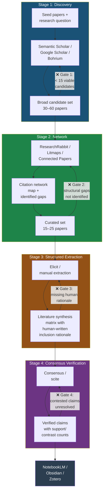

**Figure 4.1 — The Four-Stage Literature Pipeline.** Each stage transforms the output of the previous stage and passes it forward through a gate. If a gate fails, you return to the previous stage — not forward with improvised fixes. The final verified literature matrix feeds into NotebookLM (knowledge base), Obsidian (Zettelkasten), and Zotero (citation management), which together form your project's literature infrastructure.

### The Pipeline Mentality

The pipeline is not a rigid sequence — it is a **dependency structure**. You cannot extract structured data (Stage 3) from papers you have not found (Stage 1). You cannot verify consensus (Stage 4) on claims you have not yet articulated (Stage 3). The gates exist to prevent you from building downstream stages on incomplete upstream foundations.

This is the same principle from Chapter 2: structure beats model. A well-designed pipeline with modest tools outperforms an undirected workflow with the best search engine.

---

## 4.2 Stage 1 — Discovery: Breadth Before Selection

**Goal:** Produce a broad candidate set (30–60 papers) that maps the full terrain of your research area. You are not selecting yet — you are exploring.

**Gate criterion:** At least 15 viable candidate papers that passed initial screening (abstract-level relevance check).

### The Problem with Keywords

Traditional literature search requires you to know the right terms before you can find the right papers. This creates a paradox: you cannot find what you do not know to search for. In HCI, the same concept may be called "gaze interaction," "eye-based input," "visual attention deployment," or "ocular manipulation" depending on the lab, the venue, and the year.

### Natural Language Querying

Modern academic search engines accept natural language queries. Use this to bypass the keyword paradox:

**Semantic Scholar** (free, AI-indexed):
```
"What are the main research streams addressing cognitive load in optical see-through AR interfaces for target selection tasks?"
```

**Google Scholar** (broadest coverage, paywall-aware):
```
"eye tracking augmented reality target selection dwell time"
```

**Bohrium** (AI-powered discovery, good for interdisciplinary connections):
```
"Research on how people choose small visual targets when wearing AR glasses — what methods do they use and what are the main findings?"
```

**When to use natural language:** At the start of Discovery, when you do not yet know the vocabulary of the subfield.

**When to switch to keywords:** After your first round of results, when you have identified the canonical terms and can search more precisely.

**Limitations:** Natural language queries favor papers that use similar phrasing to your query. They systematically miss work that addresses the same problem using different terminology. This is why Discovery requires multiple search engines and multiple query phrasings — no single query is sufficient.

### Search Engine Comparison

| Engine | Strength | Weakness | Cost | Best For |
|--------|----------|----------|------|----------|
| Semantic Scholar | AI-indexed abstracts; citation counts; "highly influential" signal | Smaller corpus than Google Scholar; weaker on pre-2000 work | Free | Initial discovery; finding highly-cited papers |
| Google Scholar | Broadest coverage; catches theses, preprints, patents | Noisy results; paywall links; no structured API; prone to duplicate entries | Free | Comprehensive coverage; finding obscure or older work |
| Bohrium | Natural language understanding; interdisciplinary connections | Newer platform; smaller community; less institutional adoption | Free tier | Bridging subfields; finding work outside your home discipline |

**Tradeoff:** Semantic Scholar gives the cleanest results but misses work. Google Scholar catches everything but requires more filtering. Bohrium bridges disciplines but has a smaller corpus. Use at least two engines per Discovery session.

### Discovery Strategy: The Three-Query Minimum

Never run a single query. For any research area, run at least three queries with different framings:

1. **Phenomenon framing:** "What happens when [users do X] in [context Y]?"
2. **Method framing:** "How do researchers measure/evaluate [phenomenon X]?"
3. **Problem framing:** "What are the known limitations or challenges with [approach Y]?"

Each framing retrieves a partially different set of papers. The overlap (papers found by multiple queries) represents consensus work. The unique papers represent the boundaries of the field — often where the interesting gaps live.

### The Discovery Output

At the end of Stage 1, you have:
- 30–60 candidate papers (titles + abstracts) in a candidate list
- A rough sense of the subfield's structure (major themes, key authors, dominant methods)
- **Not yet:** any judgment about which papers matter for your specific contribution

That judgment comes in Stage 2.

---

## 4.3 Stage 2 — Citation Network: Mapping What Discovery Cannot See

**Goal:** Transform your flat candidate set into a structured citation network that reveals genealogical relationships, structural gaps, and temporal evolution.

**Gate criterion:** At least one identified "invisible gap" — a place where two subfields almost touch but do not cite each other.

### Why Citation Networks Matter

Discovery (Stage 1) gives you papers. It does not give you the relationships between papers. Citation networks reveal:

- **Genealogy:** Which papers are foundational? Which are derivative? Which papers spawned an entire subfield?
- **Clusters:** Which papers form tight cititation communities (subfields)?
- **Bridges:** Which papers connect otherwise separate clusters?
- **Gaps:** Which clusters are conceptually related but do not cite each other?

The last item is the most valuable for research. As we discussed in Chapter 1, a contribution requires a gap. Citation networks make gaps visible.

### The Three Network Tools

**ResearchRabbit** (spectral expansion):
- Input: 3–5 seed papers
- Output: A network graph showing earlier work, later work, and similar work
- Strength: Excellent at finding work you missed in Discovery; the "similar work" function catches papers that do not share keywords but address the same problem
- Weakness: Visual interface becomes cluttered with >50 papers; no temporal view

**Litmaps** (temporal evolution):
- Input: Seed papers
- Output: A timeline-based map showing how a research stream evolved over time
- Strength: Shows which papers were pivotal; reveals when a field shifted direction
- Weakness: Less effective at finding cross-disciplinary connections

**Connected Papers** (structural visualization):
- Input: A single seed paper
- Output: A network of the 50 most related papers, clustered by similarity
- Strength: The "prospective" view shows papers published after your seed (unlike citation search which only shows prior work)
- Weakness: One seed paper at a time; misses work outside the direct citation neighborhood

### Finding Invisible Gaps

An **invisible gap** is a structural feature of the citation landscape: two clusters of papers that address related problems but do not cite each other. These gaps are invisible to keyword search (different terminology) and to reading (you would need to simultaneously hold two unfamiliar subfields in memory).

**Example: AR gaze interaction vs. desk-based eye tracking.**

Consider a researcher studying gaze-based target selection in AR. Through Discovery, they find two clusters:

- **Cluster A:** AR/VR gaze interaction papers (CHI, UIST, ISMAR). These study gaze as an input modality for head-mounted displays.
- **Cluster B:** Desk-based eye-tracking papers (ETRA, Journal of Eye Movement Research). These study gaze as a measurement tool for understanding visual attention on flat screens.

These clusters share a core concern — how the eyes select targets — but they rarely cite each other. Cluster A focuses on real-time interaction (milliseconds); Cluster B focuses on cognitive processing (seconds to minutes). Cluster A uses HCI methods (task completion time, error rate); Cluster B uses psychological methods (fixation duration, saccade patterns).

Through ResearchRabbit, the researcher discovers that the "similar work" function suggests papers from Cluster B when given seeds from Cluster A — but none of the Cluster A papers in their candidate set cite any Cluster B papers. The structural gap is real.

**The research opportunity:** Could the cognitive models from Cluster B explain the performance differences observed in Cluster A? Has no one translated the desk-based attention models to the AR interaction context? This is a genuine gap — and it was invisible until the citation network made it visible.

### Network Analysis Protocol

1. **Select 3–5 seed papers.** These should be the most relevant papers from your Discovery set — ideally papers from different sub-topics within your area.

2. **Run ResearchRabbit.** Add all seeds to a collection. Examine:
   - "Earlier Work" — are there foundational papers you missed?
   - "Later Work" — is the field still active?
   - "Similar Work" — are there papers from adjacent fields?

3. **Run Litmaps on one key paper.** Look at the temporal evolution: did the field shift direction at some point? Was a foundational paper ignored for years before being rediscovered?

4. **Identify clusters and bridges.** Draw (or mentally note) the clusters. Where are the dense citation networks? Where are the sparse connections? Which clusters are close in concept space but distant in citation space?

5. **Document gaps.** For each gap, write one sentence: "Cluster A studies X using method M; Cluster B studies Y using method N; no paper has combined M and N to address problem Z." This sentence becomes the seed of your gap argument (see Chapter 5).

### The Network Output

At the end of Stage 2, you have:
- A curated set of 15–25 papers (reduced from the 30–60 candidates by eliminating duplicates, tangentially relevant work, and outdated methods)
- A citation network map (screenshot or sketch)
- At least one documented invisible gap
- A preliminary understanding of which papers are foundational vs. derivative

---

## 4.4 Stage 3 — Structured Extraction: The Literature Matrix

**Goal:** Transform each paper into a structured row in a literature synthesis matrix, where every claim is attributable and every inclusion is justified by a human-written rationale.

**Gate criterion:** Matrix has ≥15 rows, each with complete data and a human-written inclusion rationale. No empty cells in the "core finding," "method," or "linkage" columns.

### Why a Matrix, Not Notes

Unstructured notes (highlights, annotations, summaries) fail at the moment you need them most: when you are writing. You cannot sort notes by method, filter by finding, or compare across papers. The literature matrix solves this by forcing structured extraction.

### The Literature Synthesis Matrix

The matrix is a spreadsheet (CSV or similar) with the following columns:

| Column | Content | Source |
|--------|---------|--------|
| **id** | Short identifier (e.g., "Smith24") | Human-assigned |
| **author_year** | First author + year (e.g., "Smith et al., 2024") | Paper metadata |
| **method** | Study design (controlled experiment, interview, RtD, etc.) | Paper — Method section |
| **sample** | Participants, artifacts, or corpus (e.g., "24 participants, within-subjects") | Paper — Method section |
| **core_finding** | The paper's central claim in one sentence | Paper — Results/Discussion |
| **linkage** | How this paper connects to others in the matrix (e.g., "cites Zhang22; contradicts Lee23") | Derived from citation network |
| **relevance_to_our_work** | How this paper relates to your specific research question | Human judgment |
| **inclusion_rationale** | **Human-written** justification for why this paper is in the matrix | **Human only** |

**Critical rule:** The `inclusion_rationale` column is the only column that must be human-written. It is the audit trail that proves you read and understood this paper. AI can extract the other columns; the rationale must come from you.

### Elicit for Batch Extraction

[Elicit](https://elicit.org) is an AI research assistant that extracts structured data from academic papers. You provide a research question and a set of papers (or let Elicit find them); Elicit extracts specified columns.

**Workflow:**

1. **Define your extraction question and columns.** Example:
   ```
   Research question: "How do researchers measure cognitive load in AR interaction studies?"
   Columns to extract: Author, Year, Study Design, Cognitive Load Measure, Key Finding, Limitations
   ```

2. **Upload or search for papers.** Elicit can search its own index or work from a list of papers you provide.

3. **Review and correct.** Elicit's extraction is fast but imperfect. Common errors:
   - **Wrong method classification:** A paper that pilots a study is labeled "full experiment"
   - **Overgeneralized findings:** "Found significant differences" instead of the specific direction and magnitude
   - **Hallucinated limitations:** Elicit invents limitations that the paper does not mention
   - **Confused authorship:** For multi-author papers, attributing findings to the wrong author

### Elicit Extraction: Before and After Human Correction

**Raw Elicit output (what you get from the tool):**

| Author | Year | Method | Core Finding | Limitation |
|--------|------|--------|--------------|------------|
| Zhang | 2023 | Controlled experiment | Gaze+pinch reduced task completion time compared to gaze-only | Small sample size; only tested with young adults |

**Problems with this extraction:**
1. **"Controlled experiment"** is too vague. It was a within-subjects experiment with 3 conditions (gaze-only, dwell, gaze+pinch) and 32 participants.
2. **"Reduced task completion time"** lacks specificity: 23% reduction, p < .001, on targets < 2° visual angle. Larger targets showed no difference. This specificity matters for comparison with other papers.
3. **"Small sample size"** is Elicit's generic limitation — not one that Zhang et al. explicitly acknowledged. The actual limitation: all participants were recruited from a single university (selection bias).

**After human correction:**

| Author | Year | Method | Sample | Core Finding | Linkage | Inclusion Rationale |
|--------|------|--------|--------|--------------|---------|---------------------|
| Zhang et al. | 2023 | Within-subjects experiment | 32 participants (university sample, age 18–28) | Gaze+pinch 23% faster than gaze-only for targets < 2° (p<.001); no difference for targets ≥ 2° | Cites Tanaka21 (VR gaze); contradicts Lee22 (dwell superiority) | Only study comparing gaze+pinch to dwell in optical see-through AR with a fully crossed design. Establishes the performance target size at which modality differences emerge. |

**What changed:**
- Method is now specific enough to compare across papers
- Sample includes demographics relevant to generalizability
- Finding includes effect size and boundary condition (target size)
- Linkage shows citation relationships
- Inclusion rationale explains *why this paper is in the matrix* — this is the column that no AI writes for you

### Matrix as Authorized Source

Once the literature matrix is complete and verified, it becomes the **only authorized source** for claims that appear in your related work section. The protocol:

1. When drafting related work (Chapter 8), you feed only the matrix to the AI — not the full PDFs.
2. Every claim in the draft must trace to a matrix row.
3. If a claim cannot be supported by any matrix row, it is marked `[UNSOURCED]` (Chapter 3) and resolved before submission.

This is not a limitation — it is a guarantee. It means your related work section will have zero fabricated citations and zero unsupported claims.

### Building the Matrix Incrementally

You do not build the entire matrix in one session. The matrix grows through the pipeline:

- **After Discovery (Stage 1):** add 30–60 candidates, minimal data
- **After Network (Stage 2):** narrow to 15–25 papers, add linkage data
- **After Extraction (Stage 3):** complete all columns for the final 15–25
- **During writing (Chapter 8+):** add new papers as needed, with full data

The matrix is a living document in your project's `02_literature/` directory. It is version-controlled (git) so you can see how your understanding of the literature evolved.

---

## 4.5 Stage 4 — Consensus Verification: Do Not Build on Contested Ground

**Goal:** Verify that the claims your paper depends on have consensus support in the literature. Identify contested claims and decide whether to rely on them.

**Gate criterion:** Every foundational claim in your matrix has been checked against a consensus source. Contested claims are flagged and a decision documented (rely on, avoid, or acknowledge the controversy).

### Why Consensus Matters

Your paper's contribution depends on prior work. If that prior work is contested — or worse, refuted — your contribution rests on sand. Reviewers know this. A single contested citation that you treated as established fact can undermine your entire related work section.

### Consensus Tools

**Consensus** (AI-powered meta-search):
- Query: a claim or research question (e.g., "Does gaze interaction reduce cognitive load in AR compared to hand-based input?")
- Output: A consensus answer synthesized across multiple papers, with a summary of the evidence distribution
- Strength: Fast overview of whether a claim has consensus support
- Less useful for: niche topics with fewer than 10 papers; claims that require methodological nuance

**scite** (citation context analysis):
- Query: a specific paper or claim
- Output: The number of papers that "Supporting," "Mentioning," or "Contrasting" the claim
- Strength: Quantifies the degree of support/contradiction; catches cases where a widely cited finding is actually contested
- Less useful for: brand-new papers (no citing papers yet); claims that span multiple papers

### Consensus Check Protocol

1. **Identify foundational claims.** These are claims in your matrix that your own argument depends on. Not every paper needs consensus verification — only the ones whose validity affects your contribution.

2. **Run Consensus on each foundational claim.** Is there general agreement? Is the evidence strong or mixed?

3. **Run scite on key papers.** For the 3–5 most important papers in your matrix, check how later work has treated them.

4. **Document the result.** Add a column to your matrix: `consensus_status` with values:
   - `consensus` — multiple papers agree
   - `mixed` — papers disagree but the majority support the claim
   - `contested` — significant disagreement; or the claim has been directly contradicted by later work
   - `unverified` — insufficient citing papers to judge

5. **Decide.** For each `contested` claim, choose:
   - **Rely on it** (but acknowledge the controversy in your paper)
   - **Avoid it** (find an alternative foundation for your argument)
   - **Make the controversy your contribution** (a meta-analysis or replication that resolves the dispute)

### Example: The Cognitive Load Debate

Suppose your paper builds on the claim that "gaze interaction reduces cognitive load in AR compared to hand-based input." You run Consensus and find:

- **Supporting:** 12 papers find gaze reduces cognitive load
- **Contrasting:** 5 papers find no significant difference
- **Contradicting:** 3 papers find gaze increases cognitive load (attentional tunneling)

This is a `mixed` or `contested` result. You have three options:

1. **Narrow the claim.** The supporting studies all use simple tasks; the contradicting studies use complex tasks. Your contribution: gaze reduces cognitive load only for simple tasks. This is a genuine insight.
2. **Acknowledge the controversy.** "While most studies report reduced cognitive load with gaze interaction [citations], some find no difference or opposite effects under complex task conditions [citations]. Our work examines the boundary conditions."
3. **Avoid the claim.** Build your argument on a different foundation.

The worst option: pretend the controversy does not exist. A reviewer who knows the contradicting papers will catch this, and your credibility suffers.

---

## 4.6 NotebookLM: RAG for Obsolescence

**Purpose:** Create a question-answerable knowledge base grounded exclusively in your uploaded sources. NotebookLM is not a general AI chat — it is a Retrieval-Augmented Generation system that answers questions from your documents and only your documents.

### What NotebookLM Does Better Than Chat

General AI chat (Claude, GPT, etc.) answers from its training data — a statistical model of all text on the internet. When you ask about a specific paper, the model may hallucinate findings, conflate papers, or generate plausible-sounding but unsupported claims.

NotebookLM answers from your uploaded sources only. When you ask "What did Zhang et al. find about cognitive load?", it retrieves the specific passage from the Zhang PDF you uploaded and constructs an answer from that passage. The answer is grounded by construction, not by prompting style.

### The Upload-and-QA Workflow

1. **Create a notebook** for your project (e.g., "AR Gaze Interaction").
2. **Upload sources.** PDFs of your 15–25 matrix papers. NotebookLM accepts PDF, Google Docs, text files, and web URLs. Upload the papers, not just the abstracts — NotebookLM needs the full text to answer detailed questions.
3. **Ask questions.** Start with your matrix's questions:
   - "What methods have been used to measure cognitive load in AR interaction studies?"
   - "Which papers compare gaze+pinch to dwell-based selection?"
   - "What are the reported effect sizes for gaze vs. hand-based target selection?"
4. **Verify answers against sources.** NotebookLM provides in-line citations pointing to the uploaded source. Click through and verify the model has correctly summarized the source. It usually does — but when it does not, you need to know.

### Limitations

- **No citation formatting.** NotebookLM outputs plain text, not formatted citations. You cannot paste its answers into your paper without re-citation through Zotero.
- **No synthesis across arbitrary subsets.** You cannot easily ask "Compare paper A and paper D" unless both are in the same notebook. NotebookLM synthesizes across all uploaded sources, not selected ones.
- **No memory across sessions.** Each notebook is independent. Your project-level context (research question, contribution claim) is not carried between notebooks.
- **Upload limits.** Free tier has limited uploads per notebook; paid tiers (Google One) increase the limit.

**When to use NotebookLM:** Verifying specific claims in specific papers; finding a passage you remember but cannot locate; getting a quick summary of a paper you have not read closely.

**When not to use NotebookLM:** Drafting any part of your paper; synthesizing across selected subsets of papers; any task that requires formatted output.

NotebookLM complements the matrix — it does not replace it. The matrix is structured and sortable; NotebookLM is searchable but unstructured. Use both.

---

## 4.7 Obsidian Zettelkasten: Atomic Notes and Linked Claims

**Purpose:** Build a personal knowledge graph of claims, evidence, and connections that persists across projects.

### The Zettelkasten Principle

Each note contains one idea — atomic, self-contained, and linked to other notes. This is the opposite of a document (one file, many ideas). In a Zettelkasten, you have many files, each with one idea and explicit links to related ideas.

### Structure for Research Notes

**Atomic note template:**
```markdown
---
type: claim | evidence | method | gap
source: "[Author, Year]"
matrix_id: "Smith24"
tags: #AR #gaze #cognitive-load
created: 2026-07-10
---

# [One-sentence claim]

[Supporting detail — one or two sentences max. Include a quote if
the exact wording matters.]

## Links
- Contradicts: [[Lee23 - gaze increases cognitive load]]
- Supports: [[Tanaka21 - gaze is faster in VR]]
- Method context: [[Within-subjects gaze comparison design]]

## My assessment
[Why this claim matters for your work. One sentence.]
```

### Embedding the Literature Matrix

Your literature matrix (Section 4.4) is structured data. In Obsidian, it can be:

1. **A single note with an embeddable table.** Useful for overview, but hard to link individual rows.
2. **One note per matrix row.** The `matrix_id` field links back to the original matrix entry. Wikilinks connect claims to each other: `[[Smith24 - 23% faster for small targets]]`.

Option 2 is more powerful but more maintenance. Start with option 1 and migrate to option 2 when the project grows beyond 20 papers.

### Wikilinks Between Claims

The value of Zettelkasten is not the individual notes — it is the links. When you link `[[Smith24 - gaze+pinch faster]]` to `[[Lee23 - dwell better for large targets]]`, you create a structural map of the debate. When you later write the related work, you traverse this map to construct the narrative.

This is how you avoid the "flat reading" problem from Section 4.1. The Zettelkasten forces you to see relationships, not just papers.

---

## 4.8 Human Judgment: The Non-Delegable List

The pipeline above automates discovery, network mapping, extraction, and consensus checking. It does not automate judgment. The following tasks require human cognition and cannot be delegated to AI.

### 1. Paywall Blind Spots

Academic search engines are paywall-aware but not paywall-neutral. Google Scholar ranks papers by citation count, and highly cited papers are often behind paywalls. Open-access papers are systematically disadvantaged in search results. Researchers at institutions without comprehensive library access miss work that is expensive to access.

**Mitigation:** Use your institution's interlibrary loan. Search pre-print servers (arXiv, SSRN, OSF) alongside formal publications. Ask colleagues at well-resourced institutions to check whether a paywalled paper is central to your argument before you build on it.

### 2. Recency Bias

AI tools favor recent work. NotebookLM and Elicit are trained on corpora that over-represent the last 5 years. Citation networks are temporally biased — recent papers have fewer citations not because they are less important but because they are new.

**Mitigation:** Explicitly search for foundational (pre-2015) work. Use Litmaps' temporal view to identify the papers that launched a subfield. When your Discovery set has no papers older than 5 years, suspect recency bias and search again with date ranges.

### 3. English-Language Bias

The majority of AI-indexed academic content is in English. Important work published in Chinese, Japanese, German, or French is systematically underrepresented. For HCI and Digital Art, this is a real problem — significant interaction design research is published in Japanese venues; important media theory is published in German and French.

**Mitigation:** If your research area has significant non-English literatures, search those literatures specifically (using native-language terms). Use multilingual scholars as informants — ask "what am I missing" from someone who reads the non-English literature.

### 4. Inclusion Adjudication

The literature matrix includes only the papers you chose to include. This choice is the most consequential intellectual decision in the literature review — it defines what counts as relevant, what counts as evidence, and what your contribution is situated against.

AI can suggest inclusions based on citation patterns. It cannot adjudicate whether a paper is methodologically sound enough to serve as a foundation, whether its findings are replicable, or whether its theoretical framework is compatible with yours.

**This is your decision.** The `inclusion_rationale` column in the matrix is where you document it.

---

## 4.9 Zotero + Better BibTeX: Citation Single Source of Truth

**Purpose:** Maintain one canonical bibliography file that feeds every tool in your pipeline.

### Why Zotero

Zotero is a free, open-source reference manager. It stores bibliographic metadata (authors, title, venue, year, DOI) and attached PDFs. It integrates with browsers (one-click capture from Google Scholar, Semantic Scholar, ACM Digital Library) and with word processors.

### Why Better BibTeX

Better BibTeX is a Zotero plugin that:
- Generates stable citation keys (e.g., `smith2024gaze` instead of `_random123`)
- Exports a `.bib` file that stays synchronized with your Zotero library
- Enables LaTeX, Typst, and Markdown citation workflows

### Setup

1. Install Zotero (desktop) + browser connector.
2. Install the Better BibTeX plugin.
3. Configure citation key format: `auth.lower + year + title_word` (e.g., `smith2024gaze`).
4. Set auto-export to your project's `02_literature/references.bib`.
5. Whenever you add a paper to Zotero, the `.bib` file updates automatically.

### Zotero as Source of Truth

Every citation in your paper should come from Zotero. Not from本书的bib, not from copied-and-pasted metadata, not from AI-generated citations. The Zotero library is the single source; everything else is a derivative.

This matters because AI-generated citations are frequently wrong — author names misspelled, years off by one, venues abbreviated inconsistently. Zotero's metadata comes from the publishers (via DOI resolution) and is verified at capture time.

### Integration with the Pipeline

| Pipeline Stage | Zotero Role |
|---------------|-------------|
| Discovery | Capture papers directly from search results using the browser connector |
| Network | Tag papers by cluster (e.g., #cluster-ar-gaze, #cluster-desk-eye-tracking) |
| Extraction | Attach PDFs; Elicit reads from Zotero-linked files |
| Consensus | Tag papers by consensus status (e.g., #consensus, #contested) |
| Writing | Export `.bib` for Overleaf/Typst; insert citations via citation key |
| Submission | Final citation audit: every in-text citation exists in Zotero; every Zotero entry is cited or explicitly excluded |

---

## 4.10 Putting It All Together: The Complete Pipeline Session

A typical literature pipeline session (2–3 hours) follows this sequence:

```
1. [30 min]  DISCOVERY
   - Run 3+ queries across Semantic Scholar and Google Scholar
   - Add 20–40 candidate papers to Zotero (with PDFs)
   - Export candidate list to a staging file

2. [30 min]  NETWORK
   - Select 3–5 seeds; run ResearchRabbit + Litmaps
   - Identify 1–2 invisible gaps
   - Narrow to 15–25 papers; tag clusters in Zotero

3. [45 min]  EXTRACTION
   - Run Elicit on final paper set
   - Import output to literature matrix
   - Human-correct all rows; write inclusion rationales for each

4. [30 min]  CONSENSUS
   - Run Consensus on 3–5 foundational claims
   - Run scite on 3–5 key papers
   - Document consensus_status in matrix

5. [15 min]  INFRASTRUCTURE
   - Upload final PDF set to NotebookLM
   - Create atomic notes in Obsidian for key claims
   - Verify Zotero .bib export is current
   - Commit matrix and Zotero exports to git
```

**Total: ~2.5 hours to go from "research question" to "verified literature matrix with consensus-checked claims."**

This is not a one-time investment. As you write (Chapters 8–9), you will return to earlier stages — adding papers, verifying new claims, resolving contradictions. The pipeline is iterative by design.

---

## 4.11 Expected Outputs

After completing this chapter's workflow, you will have produced:

1. **Literature synthesis matrix** — ≥15 rows, each with complete metadata, method, core finding, linkage, relevance, and human-written inclusion rationale. Stored in `02_literature/literature_matrix.csv`.
2. **Citation network map** — A screenshot or generated visualization from ResearchRabbit / Litmaps showing the major clusters and at least one documented invisible gap. Stored in `02_literature/citation_network.png` (or `.md` sketch).
3. **Consensus report** — A document listing each foundational claim, its consensus status (consensus / mixed / contested / unverified), and the decision made (rely / avoid / investigate). Stored in `02_literature/consensus_report.md`.
4. **NotebookLM notebook** — Created and populated with your 15–25 matrix papers, ready for grounded Q&A.
5. **Obsidian Zettelkasten notes** — Atomic notes for at least 10 key claims, linked via wikilinks, with matrix IDs for traceability.
6. **Zotero library** — All papers captured, tagged, with PDFs attached. Better BibTeX exporting to `references.bib`.

These outputs are inputs for Chapter 8 (Sourced Writing) and Chapter 5 (Ideation and Gap Analysis).

---

## Best Practices

1. **Run Discovery with at least two search engines and three query framings.** Single-query discovery guarantees blind spots.
2. **Let the AI extract, but the human rationalize.** Elicit and tools like it save hours on data extraction. The `inclusion_rationale` column is where your intellectual contribution begins.
3. **Verify every contested claim before building on it.** A consensus check takes 5 minutes; refuting a reviewer's "but Smith et al. has been challenged" takes a revision cycle.
4. **Tag in Zotero as you go.** Cluster tags (`#cluster-ar-gaze`) and quality tags (`#consensus`, `#replication-needed`) make filtering possible later.
5. **Keep the matrix under version control.** Git enables you to see when a paper was added, when a finding was corrected, and which version of the matrix a draft was written against.
6. **Treat NotebookLM as a search engine, not a writer.** Its output is grounded but unstructured. Extract the insight; write the prose yourself.

## Anti-patterns

1. **The single-search pipeline.** Running one query on one engine and accepting whatever the algorithm serves you. This reproduces the algorithm's biases as your literature review.
2. **Extraction without correction.** Trusting Elicit's output as-is. The errors are subtle and frequent enough that uncorrupted extraction is not a default — it is a lucky accident.
3. **Citation without reading.** Adding papers to the matrix based on abstract alone. If you have not read the method and results, you cannot write the inclusion rationale, and the matrix row is unsupported.
4. **Consensus theater.** Running Consensus or scite as a box-checking exercise and then ignoring the results. If a claim is contested, you must decide what to do about it — not pretend you never checked.
5. **Tool hoarding.** Using all three network tools (ResearchRabbit, Litmaps, Connected Papers) for every paper. Pick one tool for the current task; the others are for verification and edge cases.
6. **Matrix as write-once.** Treating the literature matrix as complete after Stage 3. The matrix grows and corrects throughout the writing process.

---

## Checklist

Use this checklist at the end of every literature pipeline session:

- [ ] Discovery: 3+ queries run on 2+ engines; candidate set captured in Zotero
- [ ] Network: Citation network generated from 3–5 seeds; at least one invisible gap documented
- [ ] Extraction: Matrix has ≥15 rows; every row has human-written inclusion rationale
- [ ] Consensus: All foundational claims checked; contested claims have documented decisions
- [ ] NotebookLM: Current paper set uploaded; test query verified against source
- [ ] Obsidian: Key claims have atomic notes with wikilinks and matrix IDs
- [ ] Zotero: All papers tagged; Better BibTeX export current; PDFs attached
- [ ] Version control: Matrix and Zotero exports committed to git

---

## References

### Chapter Cross-References

- **Chapter 1** — The contribution claim and So What ×3 test (Sections 1.2, 1.4). The invisible gaps identified in Stage 2 become your contribution's foundation.
- **Chapter 2** — The canonical workflow (Section 2.1). Literature (Stage 1–4) is one node in the larger pipeline.
- **Chapter 3** — Source grounding protocol (Section 3.7). Every claim in your matrix and every answer from NotebookLM must trace to a retrievable source. The `[UNSOURCED]` marker applies throughout this chapter's outputs.
- **Chapter 5** — Ideation and Gap Analysis. The invisible gaps identified in Stage 2 feed into gap hunting and research question formation.
- **Chapter 8** — Sourced Writing and Voice. The literature matrix is the primary input for drafting the related work section. The Bucket Method (Section 8.2) uses the matrix as the "literature bucket."
- **Chapter 11** — Final Submission. Zotero + Better BibTeX (Section 4.9) is the citation source for the final bibliography audit.

### Tool References

- **Semantic Scholar** — semanticscholar.org
- **Google Scholar** — scholar.google.com
- **Bohrium** — bohrium.com
- **ResearchRabbit** — researchrabbit.ai
- **Litmaps** — litmaps.com
- **Connected Papers** — connectedpapers.com
- **Elicit** — elicit.org
- **Consensus** — consensus.app
- **scite** — scite.ai
- **NotebookLM** — notebooklm.google.com
- **Zotero** — zotero.org
- **Better BibTeX** — retorque.re/zotero-better-bibtex
- **Obsidian** — obsidian.md

### Further Reading

- Syed, S. & Le Meur, E. (2024). "PaperEngage: An AI-powered system for reading academic papers." *CHI '24*. — Demonstrates structured extraction from academic papers, relevant to Stage 3.
- Kang, S. & Harty, A. E. (2024). "Use of AI-Based Literature Review Tools in Research." — Documents adoption patterns and failure modes of AI review tools.
- Kaszecki, S. (2024). "Using NotebookLM to analyze qualitative data." — Explores NotebookLM as a qualitative research tool, relevant to Stage 4 and Chapter 7.
- Wobbrock, J. A. & Kientz, J. A. (2016). "Research contributions in human-computer interaction." *Interactions*, 23(3), 38–44. — The contribution type taxonomy referenced throughout this chapter.


---

<a id="chapter-05"></a>

# Chapter 5: Ideation and Gap Analysis

> "A topic is not a question. A question without a gap is an answer looking for a reason to exist."

---

## Objectives

After this chapter, you will be able to:

1. Distinguish a topic from a research question and articulate why the difference determines every downstream decision
2. Run a narrowing process that takes a broad interest through domain, tension, and question — using AI as a critic, not an author
3. Operate a Trend Scout workflow that monitors venue proceedings and identifies convergence and divergence patterns
4. Identify theoretical, methodological, and empirical gaps using a synthesis matrix as the primary detection instrument
5. Apply three checks (Novelty, Scope, Gap) to any candidate research question
6. Construct a conceptual framework with the HCI Theorist and Digital Art Critic roles
7. Administer the So What ×3 test and interpret failure at any level
8. Apply the No Surprises test to verify alignment between what your abstract promises and what your paper delivers
9. Build a research identity file that improves every AI interaction downstream

---

## Required Background

- **Chapter 1: The AI-Native Researcher** — Contribution types (HCI taxonomy: Wobbrock seven classes; Digital Art taxonomy: SIGGRAPH/Leonardo categories), the prediction boundary, and the three reviewer yardsticks. If you have not read Chapter 1, at minimum internalize the distinction between *report* and *argument* and the claim that contribution type determines evidence standard.
- **Chapter 4: The Literature Pipeline** — Discovery, network, extraction, and consensus. The synthesis matrix (columns: author/year/method/core finding/limitation/link/human-written inclusion rationale) is the primary input to gap hunting. If you have not built a matrix yet, the gap-detection techniques in this chapter will have no ground to stand on.

---

## Core Content

### 5.1 Topic ≠ Question

"AR gaze interaction" is a topic. It names a domain. It implies no claim, identifies no absence, and makes no falsifiable assertion. You can write a survey about a topic. You cannot build an argument upon one.

"In AR small-object selection, does gaze+pinch outperform dwell, and why?" is a question. It specifies a population (AR small-object selection), a comparison (gaze+pinch vs. dwell), and a causal demand (why). A reviewer can evaluate whether your study answers it. A reader can act on the answer.

The distance between a topic and a question is where most early-stage research dies. Researchers invest months in a topic — reading broadly, building prototypes, collecting preliminary data — before discovering that no specific question was ever asked. The activity feels like progress. It is not. It is motion without vector.

**Why this matters now:** AI makes it trivially easy to generate expansive, fluent text about a topic. Topic-level prompting ("Tell me about AR gaze interaction") produces output that reads like research but is merely recombination. The output is smooth because the distribution of text about AR gaze interaction is well-represented in the model's training data. Asking a question-level prompt ("What is the specific, unanswered question about AR gaze interaction in the CHI 2023–2025 literature?") forces the model into territory where its training distribution is thinner — where you need the synthesis matrix, not just the model's parameters.

**The discipline:** Never prompt AI with a topic. Always prompt with a *tension* — a specific, unresolved conflict in the literature or practice. The tension is the seed of the question.

---

### 5.2 The Narrowing Process: Interest → Domain → Tension → Question

Narrowing is not a clever exercise. It is a survival mechanism. A question that is too broad produces a paper that says nothing specifically. A question that is too narrow produces a paper that says something specific but no one cares about. The narrowing process finds the point where specificity and significance intersect.

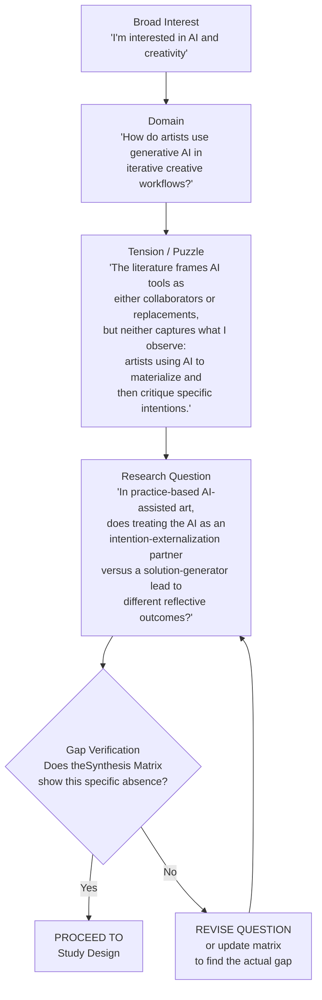

**Figure 5.1 — The narrowing process.** The funnel moves from broad interest to domain (where you look), to tension (what puzzles you), to question (what you ask), to gap verification (whether the absence is real). The feedback loop from Gap Verification to Research Question is the critical safeguard: without it, you build on assumed absences that may not exist.

The four stages in detail:

**Stage 1: Interest → Domain.** An interest is a direction ("I care about AI and creative practice"). A domain is a bounded space where that interest can be investigated. The move from interest to domain is a move from affect to search terms. Input: your research identity file. Output: a paragraph that names the domain and lists the venues where that domain is published.

**Stage 2: Domain → Tension.** A tension is a specific, unresolved conflict within the domain. It may be a contradiction between two papers' findings, a methodological assumption that has never been tested, or a phenomenon that existing theory cannot explain. Input: your synthesis matrix (at least 15 rows). Output: a one-paragraph tension statement that cites specific cells in the matrix.

**Stage 3: Tension → Question.** The question operationalizes the tension into something a study can answer. Input: the tension statement. Output: a single sentence that contains the population, the comparison or relationship, and the outcome. If the question is a Digital Art project, the question asks what epistemic work the practice performs — what the field will understand that it could not understand without the artifact.

**Stage 4: Question → Gap Verification.** Before proceeding, you verify that the question addresses a real absence — not an assumed one, not a gap that was filled three years ago in a venue you did not search. Input: the question and the updated synthesis matrix. Output: a gap statement that names the specific absence and cites the matrix cells that demonstrate it.

**The AI's role in narrowing:** AI is a critic and a questioner, not an author of the question itself. The correct prompt pattern asks the model to identify assumptions, challenge novelty, and pose questions *to you* — not to write your question for you. The question must be written by you because only you know what you can actually build, study, or make given your resources, timeline, and access. (See prompt template in Section 5.3.)

**Failure mode:** AI-generated questions tend to be safe, broad, and well-formed — the model predicts what a plausible research question looks like in the training distribution. Your actual research question should be risky enough that the model would not have generated it unaided, because it depends on your specific access to participants, your specific artifact, your specific practice, your specific philosophical anchor. If the question could have been written by someone who has never met you and knows nothing about your project, it is too generic.

---

### 5.3 Trend Scout: Monitoring Venue Convergence and Divergence

The Trend Scout agent is a persistent monitoring role in the multi-agent architecture (see Chapter 2 for the full agent tree; see Chapter 9 for agent definitions). Its function: track the proceedings of target venues over time and identify where the field is converging (many groups reaching similar conclusions with similar methods) and where it is diverging (groups reaching contradictory conclusions, or applying a method from an adjacent field that challenges local assumptions).

**What the Trend Scout monitors:**

| Venue Type | Primary Venues | What to Track |
|---|---|---|
| HCI core | CHI, UIST, CSCW, DIS | Interaction techniques, study paradigms, theoretical frameworks |
| HCI adjacent | ISMAR, TEI, Ubicomp | Input modalities, embodied interaction, tangible systems |
| Digital Art | SIGGRAPH Art Papers, Leonardo, ISEA | Practice-based methods, theoretical anchors, exhibition formats |
| Cross-cutting | SIGGRAPH (technical), IMX, Creativity & Cognition | Technical infrastructure, audience experience, creative AI |

**How the Trend Scout works:**

1. **Collection.** On a scheduled basis (weekly or per-venue-issue), the agent ingests titles, abstracts, and keywords from the target venue's most recent proceedings. Automated options include RSS feeds, Semantic Scholar alerts, and Elicit monitoring. Manual option: download the proceedings table of contents and upload to the agent.

2. **Clustering.** The agent groups papers by thematic similarity. The output is not a flat list but a clustered map: "8 papers on LLM-assisted coding education," "3 papers on gaze-based AR navigation," "2 papers on bio-material fabrication as Research-through-Design."

3. **Convergence detection.** Convergence is flagged when three or more papers in a cluster use a similar method to address a similar question and reach a similar conclusion. Convergence signals a maturing sub-field — the easy questions are being answered. The next question is methodological: does a different method reproduce the finding? Or the theoretical: does the finding hold under a different framework?

4. **Divergence detection.** Divergence is flagged when papers within a shared domain contradict each other, or when a method from one domain is imported into another without the assumptions being made explicit. Divergence signals an opening: someone needs to reconcile the contradiction or test the imported method's boundary conditions.

5. **Output.** The Trend Scout produces a brief report (1–2 pages) structured as:
   - **New clusters this cycle** (topics that appeared or reappeared)
   - **Convergence patterns** (where the field is consolidating)
   - **Divergence patterns** (where the field is fracturing or importing)
   - **Structural gaps** (clusters that should exist but do not — e.g., "no papers on gaze interaction in AR for users with nystagmus" when gaze interaction is otherwise a dense cluster)
   - **Recommended for human review** (2–3 papers the agent flags as potentially significant but cannot evaluate without domain judgment)

**When NOT to use Trend Scout output as-is:** The agent identifies patterns, not significance. A structural gap (a cluster that does not exist) may indicate either an untouched opportunity or a dead end that the field correctly abandoned. The agent cannot tell the difference. You can.

**Failure mode:** Treating Trend Scout output as a gap statement. It is not. It is a set of *candidate* gaps that you then verify against your synthesis matrix and your expertise. The agent says "no one has studied X." You determine whether X is worth studying.

---

### 5.4 Gap Hunting: The Three Gap Types

A gap is not a vague sense that "more research is needed." A gap is a specific, named absence in the existing literature that your work will address. There are three types, and a strong paper typically addresses at least one explicitly.

**Theoretical gaps** exist when a phenomenon is observed but not explained, or when two established theories make contradictory predictions about the same phenomenon. Example: the literature documents that artists using generative AI report a sense of "intention drift" — their creative goals shift in response to the model's outputs — but no theoretical framework in HCI or creative cognition accounts for this phenomenon.

**Methodological gaps** exist when a question has never been asked with an appropriate method, or when the methods used in a domain have a shared blind spot. Example: all studies of AR object selection measure speed and accuracy but none measure cognitive load during prolonged use, even though AR interfaces are designed for extended wear.

**Empirical gaps** exist when a population, context, or condition has never been studied. Example: gaze interaction has been studied extensively for able-bodied adults in laboratory settings but not for users with involuntary eye movements in everyday environments.

**The synthesis matrix as gap-detection instrument.** The matrix is not just a storage format. It is a detection device. When you sort and filter the matrix by method, population, or finding, absences become visible in the way that a missing tooth is visible when you smile:

- **Method filter:** Sort by method column. If 12 of 15 papers use controlled experiments and none use in-situ observation, you may have a methodological gap — but only if the research question demands in-situ data.
- **Finding filter:** Sort by core finding. If all papers agree, you have consensus, not a gap. If they disagree, you have a theoretical or empirical tension worth investigating.
- **Population filter:** Sort by population. If every paper uses convenience samples of university students and your question concerns older adults, you have an empirical gap.
- **Temporal filter:** Sort by year. If the densest work is 5+ years old and the technology has changed significantly, you may have a gap created by technological change — but verify that recent work has not already filled it.

**Failure mode:** Confusing a gap in the matrix with a gap in the literature. Your matrix is incomplete by construction. Before claiming a gap, you must verify that the absence is not an artifact of your search terms or your database coverage. This is why the literature pipeline (Chapter 4) includes the consensus verification step — Consensus or scite — and why your matrix must include a human-written inclusion rationale for every row. The rationale tells you what was *intentionally* included and, by contrast, what was excluded.

---

### 5.5 Three Checks for Any Research Question

Every candidate research question must pass three checks. These are not theoretical ideals. They are operational gates. A question that fails any check will fail in review.

**Check 1: Novelty.** Has this specific question been asked and answered before?

- **AI's role:** Suggest. The model can search its training data and your synthesis matrix for prior work that addresses the same question. It can identify near-misses — papers that asked something similar but differed in population, method, or framing.
- **Human's role:** Verify. The model's training data is incomplete for the last 12–18 months and biased toward high-citation English-language work. You must check the most recent proceedings of your target venue, the dissertations in your field, and the non-English literature if your domain includes it. If the AI says "no prior work exists," treat that as a hypothesis to be tested, not a conclusion.

**Check 2: Scope.** Can one paper hold this question?

A question that is too large ("How should HCI redesign its ethical review process for AI-augmented studies?") requires a monograph. A question that is too small ("Did 18 participants press button A or button B in a specific prototype on a specific day?") requires a poster. The right scope is a question that can be answered with one coherent argument: one claim, one method, one set of evidence, one discussion that acknowledges limitations.

**Heuristic:** If you cannot state the answer (whatever it turns out to be) in one sentence, the question is too broad. If the answer is obvious before you start, the question is too narrow.

**Check 3: Gap.** What specific absence does this question address? If the question were answered, what would the field know that it does not know now?

The answer to Check 3 must be a sentence, not a paragraph. "It would address the absence of in-situ gaze interaction data for users with motor impairments in AR, which the synthesis matrix (rows 7, 12, 14) shows is populated only by laboratory studies with able-bodied participants." If you cannot name the absence specifically, you do not have a gap — you have an interest.

---

### 5.6 Theory Building: The HCI Theorist and Digital Art Critic Roles

Theory in HCI and Digital Art serves different functions than in the natural sciences. It does not primarily predict. It *organizes* — providing concepts that let researchers see patterns across studies, communicate design implications across artifacts, and connect empirical findings to broader questions about human experience.

**HCI Theorist role.** This agent proposes conceptual frameworks for observed phenomena. Its input is a tension statement plus the relevant rows of the synthesis matrix. Its output is not "the theory" but a set of candidate frameworks drawn from HCI and adjacent fields (cognitive science, phenomenology, activity theory, embodied cognition), each with an explanation of how it would frame your question and what it would make visible or invisible.

Example prompt structure:
```
You are an HCI theorist. Here is the tension I have identified:
[tension statement]

Here is the relevant portion of my synthesis matrix:
[10 rows from the matrix]

Propose 3 candidate conceptual frameworks from HCI or adjacent
fields that could organize this tension. For each framework:
- Name its core concepts
- Explain how it would frame my research question
- Identify what it makes visible and what it hides
- Suggest one framework that is commonly used in this domain
  and one that is not, so I can weigh convention against novelty

Do not adopt any framework for me. Present the options and
tradeoffs. The decision is mine.
```

**Digital Art Critic role.** This agent performs a parallel function for practice-based work. Its input is the artist's process documentation (iterations, dead ends, pivots) plus their theoretical anchor (e.g., individuation, cosmotechnics, post-digital aesthetics). Its output is not "the reading of the work" but a set of interpretive frames that connect the specific making to broader epistemological questions — what the practice *knows* that theory alone cannot.

The key constraint on both roles: the agent *presents options and states tradeoffs*. It does not decide. Theory is a lens; choosing a lens is an epistemological commitment that the researcher owns.

**Failure mode:** Accepting the first framework the AI proposes. The first proposal is usually the most conventional — the framework most represented in the training data for that domain. That may be the right choice, but it should be a choice, not a default. Always ask for at least one unconventional alternative and one critique of the conventional choice.

---

### 5.7 The So What ×3 Test in Detail

Every contribution claim must survive three successive "so what?" interrogations. Each "so what?" asks the reviewer to grant your finding and then demands the implication. If you cannot answer any level, the contribution is too thin to carry a paper.

**Level 1: Result — "You found X. So what?"**

Answer: What does X imply for *design* — for how systems, interfaces, or experiences should be built? If your answer is only "it adds a data point to the literature," you are at Level 0. A single data point is a finding, not a contribution.

Example (HCI): "We found that gaze+pinch outperformed dwell for small-object selection in AR by 18% in time and 22% in accuracy." *So what?* "This implies that AR interaction designers should consider gaze+pinch as the default selection technique for objects under 1° visual angle, rather than relying on dwell-based approaches inherited from 2D screen interaction."

Example (Digital Art): "Our interactive installation demonstrated that mirror gaze redirection disrupts viewers' agency attribution toward their own reflection." *So what?* "This implies that embodied interaction designers can use gaze-redirection as a deliberate technique for making visible the constructed nature of self-perception — a tool for critical design that surfaces what is normally invisible."

**Level 2: Design implication — "Okay, so designers could use this. So what?"**

Answer: What does this design implication do for *practice* or *user experience* — what changes in the world when this design knowledge is applied?

Example (HCI): "If gaze+pinch becomes the default for small-object selection in AR, the design pattern changes from 'look and wait' to 'look and confirm.' This reduces selection fatigue in prolonged AR sessions and may lower the barrier to AR adoption for productivity applications."

Example (Digital Art): "If gaze-redirection becomes a recognized technique in the critical design toolkit, artists and designers have a new language for creating experiences that question identity construction — extending the work of researchers like [anchor paper author] from static mirrors to real-time responsive systems."

**Level 3: Field understanding — "That's a practical implication. So what?"**

Answer: What does this do for *what the field understands* — for the concepts, theories, or frameworks that organize the domain?

Example (HCI): "This finding extends the 'magnetic dashboard' model of gaze-assisted selection by showing that the model holds in 3D space for large targets but breaks down for small targets, where the precision advantage of gaze is offset by the Midas touch problem. The contribution is not just a technique but a *boundary condition* for an existing theory."

Example (Digital Art): "This work demonstrates that the phenomenological concept of 'body schema plasticity' can be operationalized as an interactive experience — not just measured with questionnaires but enacted through real-time perturbation. The contribution is an *epistemic bridge* between phenomenological theory and interaction design practice."

**Interpreting failure:**

- **Fails at Level 1:** The finding is a data point without design relevance. Either the question was too narrow, or the contribution was miscategorized (you have a dataset contribution, not an empirical one). Revisit the question.
- **Fails at Level 2:** The finding has design relevance but no plausible application context. This often happens with purely theoretical contributions where the bridge to practice has not been built. You need either a stronger application argument or to reframe the contribution type (it may be a theory paper, not an empirical paper).
- **Fails at Level 3:** The finding is practically useful but conceptually shallow. This is the most common failure mode for system-building papers. You built something that works, but the field does not learn anything beyond "it works." The fix is usually in the discussion section: you must connect your findings to a conceptual framework that generalizes beyond your specific system or artifact.

**When So What ×3 is inappropriate:** Not every contribution type is designed to pass all three levels. A methods paper may stop at Level 1 (the new method produces better results) and Level 3 (the method reveals something the old method could not detect). A theory paper may start at Level 3 by design. The test is not a rigid hierarchy to be met at every level but a diagnostic: *where does your contribution live, and is that level appropriate for your contribution type and venue?*

---

### 5.8 The No Surprises Test

The abstract promises. The paper delivers. The No Surprises test checks the alignment.

Read your abstract. For each claim in the abstract, identify the section of the paper that delivers the evidence for that claim. Then reverse the process: for each major section of the paper, identify which sentence in the abstract promises that this section exists.

If the abstract promises "we demonstrate X through a controlled study with 40 participants" but the paper has no participant count, or the count is 23, or the study was not controlled — the paper fails the test. The reviewer experiences a *surprise*: "The abstract said 40 participants. The paper says 23. Did they exclude 17? Why wasn't this explained?"

If the paper contains a finding that the abstract does not mention — "oh, and by the way, we found a gender effect" — the paper fails the test in the other direction. The reviewer experiences a *surprise*: "This gender effect is interesting. Why wasn't it in the abstract? Am I supposed to care about it?"

**Formal procedure:**

1. Number each claim in your abstract (claims, not sentences — some sentences contain multiple claims).
2. For each claim, write the section and line number where the paper delivers it.
3. Number each major finding in your paper.
4. For each finding, write the abstract sentence that promises it.
5. Any claim without a delivery, or any finding without a promise, is a surprise.

**Prompt for AI-assisted No Surprises check:**
```
Here is my abstract:
[abstract text]

Here is my full paper:
[full text]

1. Extract every claim from the abstract and list them as bullet points.
2. For each claim, cite the specific section and line number in the paper
   that delivers the evidence for it.
3. For each claim that has no corresponding section, flag it as [UNDELIVERED].
4. Extract every major finding from the paper.
5. For each finding, cite the specific sentence in the abstract that promises it.
6. For each finding that has no corresponding promise, flag it as [UNPROMISED].
7. Do not rewrite anything. Report only the alignment map and the flags.
```

**When to run the test:** After the first complete draft, and again after every major revision. Claims and findings drift during revision. The abstract you wrote at the start may not match the paper you ended up with. Update the abstract or update the paper until they align.

---

### 5.9 The Research Identity File

Your research identity file is the single most leveraged document in your AI research system. It is a structured description of who you are as a researcher: your interests, commitments, and reference points. Every agent in the architecture reads it as part of its context (Chapter 3: Context Engineering). A rich identity file produces AI outputs that are calibrated to your domain, your standards, and your voice. A thin one produces generic outputs that require as much correction as they provide value.

**Required contents:**

```markdown
# Research Identity

## Research Interests
- Specific question domains (not "HCI" but "how AR interaction
  techniques adapt to users with motor impairments")
- Theoretical commitments (if any): "I work from a phenomenological
  stance, drawing on embodied cognition and post-phenomenology"

## Methodological Commitments
- Preferred methods: "I work primarily through Research-through-Design
  and constructive design research"
- Evidence standards: "I hold practice-based work to the standard of
  'epistemic transparency' — the process must be documented and
  auditable"

## Target Venues
- Primary: SIGGRAPH Art Papers, Leonardo
- Secondary: ISEA, CHI (for HCI-adjacent work)

## Anchor Papers
1. [Paper A]: [One sentence on why its argument structure is a model
   for my work — not "it is well-cited" but "it demonstrates how to
   connect a single artifact to a theoretical contribution via a
   specific form of critical reflection"]
2. [Paper B]: [Same treatment]
3. [Paper C]: [Same treatment]

## Writing Voice
- Key traits: "Short sentences for claims, longer sentences for
  evidence. Active voice. No hedging verbs ('seems to,' 'might').
   Philosophical terms used precisely, not decoratively."
- Anti-voice: "Avoid: literature review as list, discussion as
  summary, abstract as table of contents."

## Known Blind Spots
- "I tend to understate limitations — flag when I am doing this"
- "I default to quantitative framing even when qualitative would
  be more appropriate"
```

**Why anchor papers matter.** An anchor paper is not a paper you like. It is a paper whose *argument structure* you want to learn from. By naming an anchor paper and explaining what about its structure works, you give AI agents a concrete model of what "good" looks like in your terms — not the model's default of what "good academic writing" looks like generically.

**Why blind spots matter.** Naming your blind spots lets AI agents calibrate their criticism. If you tell the reviewer agent "I tend to understate limitations," it will specifically check your limitations section and flag when the framing is too defensive.

**When to update:** Every 2–3 months, or whenever your research direction meaningfully shifts. The identity file is a living document, not a one-time setup.

**Failure mode:** A generic identity file ("I am interested in HCI and AI. I prefer experimental methods.") produces generic outputs. The file's specificity is directly proportional to the usefulness of the AI's outputs. Vague inputs yield vague outputs — not because the model is weak, but because you have given it no signal about whose eyes to see through.

---

## Expected Outputs

After completing this chapter, you should have produced:

1. **A research question statement** — one sentence that specifies population, comparison/relationship, and outcome
2. **A gap statement** — one sentence that names the specific absence and cites the synthesis matrix cells that demonstrate it
3. **A completed So What ×3 analysis** — three one-paragraph answers showing your contribution survives all three levels (with the level-appropriate caveat for your contribution type)
4. **A No Surprises alignment map** — every abstract claim mapped to a paper section, every paper finding mapped to an abstract promise, all discrepancies flagged and resolved
5. **A research identity file** — interests, methodological commitments, 2–3 anchor papers with structural rationale, voice description, known blind spots

---

## Best Practices

1. **Never prompt AI with a topic.** Always prompt with a tension. The tension is the smallest unit of research that contains an unresolved conflict.

2. **Build the synthesis matrix before hunting gaps.** Without the matrix, you are guessing about the literature. The matrix makes absences visible.

3. **Apply So What ×3 at ideation, before you collect data.** The cost of discovering a thin contribution increases with every hour you invest in a weak question. Kill fast.

4. **Run No Surprises after every major revision.** Claims drift during drafting. The abstract from draft 1 will not match the paper in draft 4 unless you actively realign them.

5. **Treat AI as a questioner during ideation, not an author.** The prompt pattern is "here is my thinking — what am I missing, what assumptions am I making, what would a reviewer challenge?" The output is a critique of your thinking, not a replacement for it.

6. **Update your identity file quarterly.** As your project matures, your interests sharpen and your anchor papers change. The file should evolve with you.

7. **Use Trend Scout output as a starting point, not a conclusion.** The agent identifies patterns; you evaluate significance. A structural gap is an opportunity only if what is absent is worth knowing.

---

## Anti-patterns

1. **Topic drift.** Concluding a work session having read widely about your topic but having narrowed nothing. Reading is necessary but not sufficient. Always end an ideation session with a narrower question than you started with — even if the narrower question is provisional.

2. **Gap assumption without matrix verification.** Declaring that "no one has studied X" because you have not seen it studied. Your synthesis matrix is incomplete by construction. Verify before claiming.

3. **So What ×3 as an afterthought.** Testing the contribution when the paper is nearly complete. By then, the cost of failure is a rewritten paper. Test at ideation. Test after study design. Test after data collection. Test is cheap. Rewrite is expensive.

4. **Venue-agnostic gap statements.** Saying "this gap exists in the literature" without naming the specific literature where the gap lives and where the contribution will be submitted. A gap in CHI is not necessarily a gap in SIGGRAPH. Venues have different expectations and different blind spots.

5. **The identity file as a one-time setup.** Writing the identity file in Session 2 and never touching it again. By Session 6, the file no longer reflects your thinking. The AI's outputs degrade silently because the calibration signal has gone stale.

6. **Accepting the first framework.** The HCI Theorist or Digital Art Critic proposes three frameworks and you accept the first (most conventional) one. The conventional choice may be correct — but choose it because it best fits your tension, not because it appeared first.

7. **Structural gap as free pass.** Seeing a cluster that does not exist in Trend Scout output and assuming it is automatically a research opportunity. Some absences in the literature are absences for good reason. The field may have examined the question and found it unproductive, or the technical infrastructure may not yet exist to investigate it.

---

## Checklist

Before proceeding to Chapter 6 (Study Design), verify:

- [ ] I can state the difference between a topic and a research question, and my current work is at the question level
- [ ] I have run the narrowing process: interest → domain → tension → question → gap verification
- [ ] I have a synthesis matrix with at least 15 rows and human-written inclusion rationale for each
- [ ] My gap statement names a specific absence and cites matrix cells
- [ ] My research question passes all three checks: Novelty (human-verified), Scope (one paper), Gap (specific absence)
- [ ] I have applied So What ×3 and can answer all three levels (or documented why my contribution type does not require a given level)
- [ ] I have run the No Surprises test and resolved all [UNDELIVERED] and [UNPROMISED] flags
- [ ] I have a research identity file with specific interests, methodological commitments, 2–3 anchor papers with structural rationale, voice description, and known blind spots
- [ ] I have not asked AI to write my research question — only to critique my thinking and pose questions to me

---

## References

- Course syllabus: *课程详细计划_8节.md* — Session 4 ("Front end: research question and literature pipeline") is the primary source for the narrowing process, the three checks, and the Trend Scout workflow. Session 1 ("What is publishable") is the source for So What ×3 and No Surprises.
- *Plan.md* — Multi-agent architecture defining the Trend Scout, Gap Hunter, HCI Theorist, and Digital Art Critic roles.
- *AI Research Assistant Prompting Guide.md* — Gap Hunter prompt template and Topic Narrowing prompt template.
- *HCI Research Companion* — Source of the three reviewer yardsticks (Interestingness, So What ×3, No Surprises) and the theoretical framework selection heuristics.
- Wobbrock, J. O., & Kientz, J. A. (2016). Research contributions in human-computer interaction. *Interactions*, 23(3), 38–44. [HCI contribution taxonomy — relevant to matching gap type to contribution type.]

**Cross-references:**
- Chapter 1: The AI-Native Researcher — Contribution types, prediction boundary, the three reviewer yardsticks
- Chapter 4: The Literature Pipeline — Synthesis matrix construction, discovery and consensus verification
- Chapter 6: Study Design — How to design a study that answers the question this chapter produces
- Chapter 10: Reviewer Simulation — How to operationalize So What ×3 and No Surprises as automated evaluation agents


---

<a id="chapter-06"></a>

# Chapter 6: Study Design

> "Paradigm determines everything. Choose the wrong one and your methods, evidence, and structure misfit no matter how polished the prose."

---

## Objectives

After this chapter, you will be able to:

1. Select an appropriate paradigm (HCI or Digital Art) for your contribution type
2. Design a method section that matches your paradigm's evidence standards
3. Identify what AI can and cannot do in study design — and write the audit checklist for what it misses
4. Apply the five-step reverse-engineering process for existing artworks (RtD)
5. Separate findings from interpretation in your filesystem and your thinking
6. Produce a method section draft with paradigm declaration, evidence logic, and a human-written audit checklist

---

## Required Background

- **Chapter 1** — Contribution types (Wobbrock's seven HCI categories; SIGGRAPH/Leonardo taxonomy). You need this to understand *why* paradigm flows from contribution type.
- **Chapter 5** — Research question formation and the gap matrix. Your paradigm must align with the question you framed and the gap you located in literature.

If your contribution claim and research question are not yet solid, fix them before designing a method. A method that answers a question you never asked is not rigorous — it is HARKing with extra steps.

---

## Core Content

### 6.1 Paradigm Determines Everything

In the syllabus for this book (Session 5, 分轨讲授), the central claim is: **different paradigms require different method trees, evidence logics, and paper structures.** This is not a preference. It is an imperative that follows from what each paradigm accepts as evidence.

A controlled experiment produces evidence from statistical comparison. A grounded theory study produces evidence from systematic category emergence. A Research-through-Design (RtD) project produces evidence from documented design decisions interpreted through a theoretical lens. These are not interchangeable formats with different vocabulary. They are different *epistemological commitments* — different answers to "how do we know what we claim to know?"

When you delegate method design to a generic model without declaring a paradigm first, you get an average template. A generic template defaults to the most common form — in HCI, that is the controlled experiment. If your work is qualitative or RtD, the default template misstructures your paper at the architectural level. Reviewers will read a method that claims to be RtD but reads like an experimental design with the statistics removed.

**The fix:** Declare your paradigm *before* asking AI to draft anything. The declaration constrains the method tree, which constrains the evidence logic, which constrains the paper structure. The flow is:

```
Contribution Type → Paradigm → Evidence Standard → Paper Structure
```

We will return to this as a Mermaid diagram (Figure 6.1) and walk each branch below.

**Failure mode:** Using a paradigm as a label rather than a commitment. Writing "we use a mixed-methods approach" without specifying what each method contributes to the claim and how the two strands integrate. The label is cheap; the integration design is the work.

**Alternative:** Some contributions genuinely span paradigms — a system paper with a controlled study, an RtD project with a qualitative component. This is mixed methods, and it is harder than either method alone because you must design the integration, not just stack two chapters. The audit checklist (Section 6.5) is especially critical here.

---

### 6.2 HCI Paradigms: The Controlled Experiment

**When to use it:** Your contribution type is empirical (Wobbrock's "empirical" or "evaluation"), and your question is causal or comparative — "does X cause Y?" or "is A better than B on measure Z?"

**Evidence standard:** Internal validity through control of confounds, random assignment, and statistical inference. The reader must believe that the observed effect is attributable to your manipulation and not to some alternative explanation.

**Paper structure consequence:** Standard IMRaD with emphasis on design/participants/apparatus/procedure/measures/analysis plan. Each element must be specific enough for replication.

**What AI can draft reliably:** The procedural skeleton — sections for design, participants, apparatus, procedure, measures, and analysis plan. The model can structure these sections from a contribution claim and research question because the IMRaD structure is well-represented in its training data.

**What AI misses:** Domain-specific confounds (e.g., simulator sickness in VR, demand characteristics in HRI, order effects in within-subjects designs), population-specific ethics (e.g., working with minors, clinical populations, neurodiverse participants), and validity threats that require embodied, contextual, or temporal knowledge the model does not possess.

**Example — the simulator sickness gap.** When you ask an AI to draft a VR method section, it will produce a competent within-subjects design with counterbalancing. It will mention SSQ (Simulator Sickness Questionnaire) only if it happens to have that specific literature in context. It will not proactively tell you that your 20-minute immersion condition interacts with the SSQ time curve, or that dropout from simulator sickness will bias your sample toward people with high vestibular tolerance — a systematic exclusion your reviewer will catch. This is not a failure of the model; it is a failure of delegating what requires domain expertise to a system without a body.

**Prompt template — HCI experimental method draft:**

```text
Paradigm: Controlled experiment, within-subjects.
Research question: [paste from 01_research_question/research_question.md]
Contribution type: Empirical (comparative).
Domain context: [paste 2 paragraphs from your identity file —
  domain, prior work, known confounds]

Draft the method section with these headers:
1. Experimental Design
2. Participants (include inclusion/exclusion criteria)
3. Apparatus
4. Procedure
5. Measures
6. Analysis Plan

For each section, mark any claim that requires my domain verification
with [VERIFY]. Do not populate measures I did not specify — if I name
a construct, do not select the questionnaire for me unless I provide it.

Then, separately, list:
- 5 confounds this domain's reviewers would ask about
- Population-specific ethics concerns for the participant pool I named
- Internal validity threats I may not have addressed
```

**Why this works:** The `[VERIFY]` tag forces the human to own claims that require domain knowledge. The separate list forces the model to surface what it *cannot* solve. The constraint "do not select the questionnaire for me" prevents the measure-selection task from drifting to the AI.

**Failure mode this prevents:** The model picks SSQ version 1 when version 2 exists and is standard. Or it proposes a NASA-TLX workload measure without noting that researchers in your specific subfield prefer a custom derived instrument. The human who understands the local discourse makes the call.

---

### 6.3 HCI Paradigms: Qualitative Research

**When to use it:** Your contribution type is empirical (qualitative), and your question is about experience, practice, sensemaking, or process — "how do people understand X?" or "what does it mean to practice Y?"

**Evidence standard:** Trustworthiness through systematic data collection and analysis, rather than statistical generalizability. The Lincoln & Guba criteria (credibility, transferability, dependability, confirmability) are the traditional frame; more recent work in HCI uses alternative framings (e.g., reflexive thematic analysis's criteria for quality). The reader must believe that your interpretation is grounded in the data and not invented.

**Common qualitative approaches in HCI:**
- **Semi-structured interviews** — most common in HCI. Evidence comes from systematic coding of interview transcripts.
- **Ethnography / fieldwork** — evidence comes from prolonged engagement and thick description.
- **Grounded theory** — evidence comes from systematic category emergence through constant comparison, theoretical sampling, and saturation.

**Paper structure consequence:** Methods section must describe the analytical procedure in enough detail for the reader to assess trustworthiness. This includes sampling strategy, data collection procedure, coding process (initial codes, how codes became categories/themes), and reflexivity statement.

**What AI can do (with constraints):** First-pass open coding from provided transcripts. The model can propose initial codes and group them into candidate categories. This is useful labor — it surfaces patterns you might not have noticed.

**What AI must not do:** Own the codebook. The final codebook, the mergings, the renamings, the theoretical categorization — these are interpretive acts that must be traced to your judgment. When a reviewer asks "why did you merge these two codes into one theme?" the answer must come from you.

**Prompt template — qualitative coding proposal:**

```text
I am conducting a [thematic analysis / grounded theory / …]
study. My research question: [paste].

Here are [N] pages of interview transcript. [Attach or paste.]

Do the following:
1. Propose 15–25 initial codes. Each code must be a short phrase
   with a 1-sentence definition and an illustrative quote from the
   transcript (include line numbers).
2. Group the candidate codes into 4–7 tentative categories.
3. Flag any codes that seem to point in conflicting directions.

Constraints:
- Do not interpret. Propose, do not conclude.
- Every code must be tied to a specific quote.
- Mark codes where you are uncertain with [LOW CONFIDENCE].
- Do not name theoretical constructs not in the transcript.

After I review and revise, I may ask you to apply the revised
codebook to additional transcripts — but the codebook itself is mine.
```

**Prompt template — reflexivity statement (AI proposes, human owns):**

```text
I am writing a reflexivity statement for a qualitative study.
My positionality: [my relationship to the topic, my theoretical
  commitments, my identity markers relevant to the research]
My data: [what I collected, from whom, where, when]

Draft a reflexivity statement (200–300 words) that addresses:
1. How my positionality may have shaped data collection
2. How my theoretical commitments may have shaped analysis
3. One concrete step I took to check my interpretive impulses

Constraints:
- Wherever you infer something about my perspective that I did not
  state, mark it with [ASSUMPTION — CONFIRM].
- Do not use generic positionality language ("as a researcher, I…").
  Every sentence must be specific to my stated context.
```

---

### 6.4 HCI Paradigms: Mixed Methods and System Evaluation

**Mixed methods** combine two or more paradigms (typically quantitative + qualitative) in one study. The critical design decision is *integration*: how do the strands relate? Integration designs in HCI include:
- **Convergent** — both strands run in parallel, findings merged in interpretation
- **Explanatory sequential** → quantitative first, qualitative explains
- **Exploratory sequential** → qualitative first, quantitative tests

The audit checklist must include integration-specific questions: Was the integration planned or post hoc? Does the qualitative sample relate to the quantitative sample in a principled way? Does the discussion integrate findings or just report them side by side?

**System / artifact evaluation** (Wobbrock's "artifact" or "system" type) — contribution is a thing you built. Evidence comes from demonstrating that the system works (technical evaluation), that it supports its intended interaction (usability or user evaluation), or that it enables something previously impossible (existence proof). The method section describes what you built, how you evaluated it, and what the evaluation shows.

**What AI confuses here**: System evaluation is not an experiment and not RtD. The evidence standard is different. An AI will sometimes produce a method that looks like a controlled experiment (pre/post, measures, statistics) when the contribution only needs a usability demonstration — or vice versa. The paradigm declaration must constrain this.

---

### 6.5 The Audit Checklist: Confounds, Ethics, Validity

**This checklist must be human-written.** Not human-edited — human-written.

AI can *propose* items for the checklist. But the final checklist is your institutional and disciplinary responsibility. It is the document that protects your participants, your integrity, and your paper from reviewer critique.

The checklist has three sections:

| Section | What it catches | Why AI misses it |
|---------|----------------|-----------------|
| **Confounds** | Alternative explanations your domain's reviewers would raise | The model does not have a body or situated practice; it cannot anticipate what it is like to experience your manipulation |
| **Ethics** | Population-specific concerns, institutional requirements, consent adequacy | The model does not know your IRB's specific concerns, your population's vulnerabilities, or your cultural context |
| **Validity threats** | Internal, external, construct, and conclusion validity — and which ones the study design cannot fully address | The model can name validity types but cannot judge which threats are *materially likely* in your specific study context |

**Template for the audit checklist file (`04_method/audit_checklist.md`):**

```markdown
# Audit Checklist — [Study Name]
Date: [date]
Author: [human name — not "AI-assisted"]

## Confounds
- [ ] [Confound 1]: [How I address it or why it is manageable]
- [ ] [Confound 2]: [How I address it or why it is manageable]
- [ ] [Domain-specific confound 3 — e.g., simulator sickness]: [Mitigation]

## Ethics
- [ ] Population: [Specific vulnerabilities?]
- [ ] Consent: [What participants are told, what they can
      withdraw from]
- [ ] Data handling: [What is stored, where, how long, who
      has access]
- [ ] IRB / ethics approval status: [Approved / Pending / Exempt]

## Validity Threats
- [ ] Internal validity: [Acknowledged threats and mitigations]
- [ ] External validity: [Generalizability claims — bounded or
      broad? On what basis?]
- [ ] Construct validity: [Do my measures capture the constructs
      I claim?]
- [ ] Conclusion validity: [Statistical power, effect size
      interpretation, multiple comparisons]

## Integration (mixed methods only)
- [ ] Integration design: [Convergent / explanatory / exploratory]
- [ ] Was integration planned a priori?
- [ ] Does the discussion integrate or merely juxtapose?
```

**The signature line matters.** If a reviewer questions your method, you must be able to state every item on this checklist from your own knowledge. If an item is there because the AI suggested it and you did not verify it, that is a failure of the process.

---

### 6.6 Digital Art Paradigms: Research-through-Design (RtD)

**The central challenge.** In HCI, the controlled experiment provides an obvious answer to "what counts as evidence?" — data, statistics, p-values, effect sizes. In Digital Art, the question is harder: without experiments, what counts as research?

**The answer:** Making the creative process reviewable. Three components:

1. **Design rationale** — Every key design decision in the artifact is stated as a conceptual proposition, not just a creative choice. "I chose X because of Y" becomes "this choice tests the proposition that Y holds in context Z."
2. **Process archive** — Iterations, dead ends, pivots, and breakthroughs are documented. The archive shows the trajectory of the research, not just the final artifact. It is evidence of exploration, not evidence of success.
3. **Critical reflection** — The artist-researcher states what the making revealed that could not have been arrived at through theory alone. This is the epistemic contribution: *practice produced knowledge that propositional reasoning could not.*

**Evidence standard for RtD:** The reader must be able to trace a chain from research question → design decisions → process documentation → critical insight. The chain is the evidence. Where the chain is broken — where a design decision is undocumented, where a critical insight is asserted without grounding in the process — the paper reads as a portfolio, not research.

**Paper structure consequence (SIGGRAPH Art Papers / Leonardo):** The paper typically includes the theoretical framing, design rationale, documentation of process (images, video stills, code, sketches), and critical reflection. The "methods" section is often called "process" or "practice" and reads as an *inquiry archive*, not a protocol.

**Failure mode:** Submitting a project description (what I built and what it does) as an RtD contribution. A project description describes the artifact. RtD uses the artifact as evidence for a claim about knowledge. These are different contribution types, and different evidence standards apply. Chapter 1's contribution type taxonomy is the diagnostic: if you are claiming RtD, every section of your paper must serve the epistemic contribution, not just the artifact.

**Prompt template — RtD method/reverse engineering:**

```text
Paradigm: Research-through-Design (RtD).
Artwork/procedure notes: [paste — design rationale, process
  notes, iterations, photos]
Theoretical anchor: [e.g., individuation / cosmotechnics /
  post-phenomenology]

Help me surface the epistemic content. Do NOT fabricate process
facts I did not provide. Wherever you infer, mark with
[INFERENCE — CONFIRM].

1. What research question does this work implicitly answer?
2. What is the contribution type (per Chapter 1 taxonomy)?
3. Sequence the key design decisions as a chain of conceptual
   propositions: "Decision X tests whether Y holds in context Z."
4. What did the making reveal that the theoretical anchor alone
   could not have predicted or arrived at? Be specific.
5. Where is the process archive thin — where would a reviewer
   ask for more evidence of the research trajectory?
```

---

### 6.7 Digital Art Paradigms: Practice-Based and Speculative-Critical

**Practice-based research** — the creative work is the primary research output, and the written component (3,000–8,000 words in a Leonardo context) contextualizes and reflects on the practice. Evidence comes from the artwork itself plus the written critical framework. The written component must demonstrate that the practitioner was conducting inquiry, not just making.

**Speculative-critical design** — the artifact is a probe, not a product. Its purpose is to surface assumptions, provoke reflection, or materialize a theoretical proposition. Evidence comes from how the artifact is received — audience response, critical discourse, the questions it raises — and from the rigor of the speculation itself. The paper must state: what was assumed, what was speculated, what the speculation *does* in the world.

**What AI misses in art paradigms entirely:** The embodied, material, and affective dimensions of the work. An AI cannot see your installation, feel the haptic feedback you designed, or experience the temporal unfolding of your performance. It can help you *articulate* the epistemic content — but only if you provide rich process documentation and constrain its tendency to invent details it wasn't given.

---

### 6.8 The Five-Step Reverse Engineering for Existing Artworks

In many Digital Art programs (and some HCI programs), students enter with finished or near-finished artifacts. The research question came *after* the making. This is the norm in RtD, not a failure — but it requires reverse engineering the epistemic content. The syllabus (Session 7, Entry B) defines this as a five-step process:

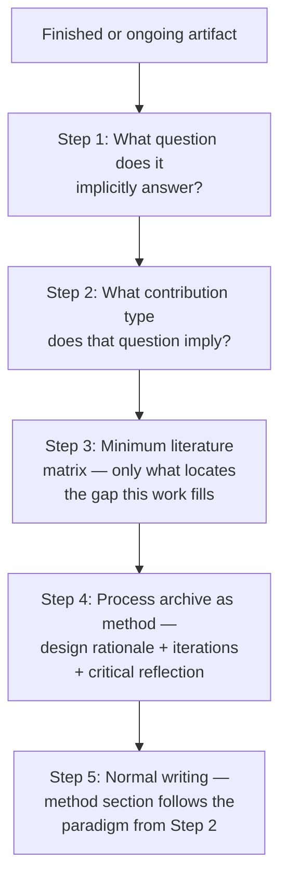

**Figure 6.1 — The five-step reverse engineering for existing artifacts.** The key move is reading the artifact backward — not "what did I make?" but "what does this making tell us that we did not already know?" The honest framing in the paper: this question was *retrospectively reconstructed* from the practice, which is standard in RtD, provided it is stated as such and not misrepresented as an a priori hypothesis.

**The minimum literature matrix (Step 3) is not a full literature review.** It is the smallest set of references needed to locate the gap your artifact fills. For RtD, this often means 8–15 sources across the theoretical anchor, the technical state of the art, and the artistic context — not 40 sources across the entire field.

**Example — reverse engineering a concrete artwork.**

*Artifact:* An interactive installation that uses real-time fractal generation and spatialized audio to externalize a viewer's heart rate variability (HRV). The viewer sees and hears their own physiological pattern reflected back, creating a feedback loop.

*Step 1 — implicit research question:* "What happens to a subject's embodied self-perception when their autonomic physiological signals are made externally perceivable as aesthetic pattern?" (Not a hypothesis; a retrospectively reconstructed question.)

*Step 2 — contribution type:* RtD. The contribution is not the installation (that is the artifact) but the knowledge generated through making and iterating on it.

*Step 3 — minimum literature matrix:*
- **Theoretical anchor:** Post-phenomenology (Ihde's embodied relations), enactive cognition (Thompson), somatic awareness (Shusterman)
- **Technical context:** Biodata in art (BioArt), real-time sonification literature, HRV measurement in HCI
- **Artistic context:** Interactive installations that use physiological data (e.g., *The Treachery of Sanctuary* by Chris Milk; neural-art precedents from Marina Abramović's collaborations)

*Step 4 — process archive as method:*
- **Iteration 1 (rejected):** Direct 1:1 sonification of HRV — found it produced information overload, viewer could not extract pattern. Decision: aestheticize through algorithmic mediation. Proposition tested: direct biodata display is not the same as biodata-as-experience.
- **Iteration 2:** Added visual fractal layer synchronized with audio. Decision: synesthetic redundancy. Proposition: cross-modal rendering of biodata makes the physiological pattern perceptible as a gestalt.
- **Iteration 3:** Calibrated latency. Decision: 300ms delay, not real-time. Proposition: slight temporal displacement creates the recognition that "this is me" without collapsing into immediate biofeedback.

*Step 5 — method section:* Normal RtD method. Process section traces the three iterations. Critical reflection states: the making revealed that biodata must be *transformed* to become experiential — a post-phenomenological claim that could not have been reached through theory alone because theory did not predict the latency threshold.

---

### 6.9 AI Drafts Methods, Humans Audit Methods: The Division of Labor

| Task | AI Role | Human Role |
|------|---------|------------|
| Proposing method structure (sections, flow) | Draft | Select, adjust, reject |
| Identifying confounds | Propose a list | Verify, add domain-specific ones, write the mitigation |
| Ethics considerations | Propose general items | Write population-specific, institution-specific items |
| Validity threats | Name types | Judge which are materially likely in this study |
| Qualitative code proposals | Generate initial codes | Own the codebook, final categorization, and theoretical naming |
| Results table formatting | Format tables, draft figure captions | Statistical decisions, interpretation of what results mean |
| RtD process articulation | Propose what the work "answers" | Confirm or reject against actual practice records |

**The principle:** AI proposes, human owns. Every item in the final method section must be defensible by the human author. When in doubt, the human writes it.

---

### 6.10 Separation of Findings and Interpretation

**Filesystem discipline:** The `/06_analysis/` directory holds *what happened* — the descriptive findings, the statistical output, the code frequencies, the thematic patterns. It does not hold *what it means*.

**Why this matters:** Interpretation is where your judgment lives. When you let AI draft interpretation, you are delegating the part of research that lives outside the prediction boundary (see Chapter 1). AI can *propose* interpretations — "one possible reading of this finding is X." But the claim that X is the correct reading, or the most important reading, must come from you.

**Quantitative boundary:** AI can format your results table. AI can draft a figure caption that says "Figure 3 shows the significant interaction between condition and workload." AI cannot decide whether that interaction is *meaningful* (practically significant, not just statistically significant), whether it contradicts your hypothesis, or what it implies for the broader research question. Those are interpretive acts.

**Qualitative boundary:** AI can report that "Theme 3 appeared in 12 of 15 interviews." AI cannot claim that "Theme 3 challenges the assumption in the literature that users prefer simplicity over control." That claim requires your theoretical framework and your judgment that the evidence supports it.

**Operational discipline:** Draft findings in `/06_analysis/` without discussion of implications. Draft implications in `/08_drafts/discussion.md` with explicit links to findings. The link — "finding X (Section 4) implies Y because Z" — is your interpretive work. Write it yourself.

---

### 6.11 Paradigm Selection Logic

The full decision structure from contribution type through to paper structure:

```mermaid
flowchart TB
    START["Contribution claim<br/>(Chapter 1)"] --> QT{"What is the<br/>question type?"}

    QT -->|"Causal / Comparative"| HC1["HCI: Controlled<br/>Experiment"]
    QT -->|"Experiential / Sensemaking"| HC2["HCI: Qualitative<br/>(Interview / Ethnography<br/>/ Grounded Theory)"]
    QT -->|"System + Evaluation"| HC3["HCI: System /<br/>Artifact Evaluation"]
    QT -->|"Multi-strand"] HC4["HCI: Mixed<br/>Methods"]

    QT -->|"Artifact as knowledge"| DA1["Digital Art:<br/>RtD"]
    QT -->|"Creative work<br/>as primary output"| DA2["Digital Art:<br/>Practice-Based"]
    QT -->|"Provocation /<br/>materialized theory"| DA3["Digital Art:<br/>Speculative-Critical"]

    HC1 --> ES1["Evidence: Statistical<br/>inference, controlled<br/>confounds"]
    HC2 --> ES2["Evidence: Trustworthy<br/>category emergence,<br/>grounded interpretation"]
    HC3 --> ES3["Evidence: Demonstration<br/>of function, usability,<br/>existence proof"]
    HC4 --> ES4["Evidence: Integrated<br/>strands — both strands<br/>plus integration logic"]

    DA1 --> ES5["Evidence: Traceable<br/>chain — question to<br/>design to insight"]
    DA2 --> ES6["Evidence: Artwork +<br/>critical framework<br/>demonstrating inquiry"]
    DA3 --> ES7["Evidence: Rigor of<br/>speculation, discursive<br/>impact, provocation"]

    ES1 --> PS1["Structure: IMRaD<br/>with emphasis on<br/>design/procedure/analysis"]
    ES2 --> PS2["Structure: Methods<br/>emphasize analytical<br/>procedure<br/>(sampling, coding, reflexivity)"]
    ES3 --> PS3["Structure: System<br/>description + evaluation<br/>design"]
    ES4 --> PS4["Structure: Two strands<br/>+ integration section"]

    ES5 --> PS5["Structure: Theoretical<br/>framing + design rationale<br/>+ process documentation"]
    ES6 --> PS6["Structure: Artwork<br/>documentation + critical<br/>written component"]
    ES7 --> PS7["Structure: Speculation<br/>anchor + artifact<br/>+ reception/reflection"]
```

**Figure 6.1 — Paradigm selection logic.** Follow the arrows: contribution claim determines question type, question type determines paradigm, paradigm determines evidence standard, evidence standard determines paper structure. At each node, the human decides. The AI drafts within the chosen branch but cannot select the branch for you — because branch selection requires understanding your own contribution claim's epistemic nature.

---

### 6.12 Using the Multi-Agent Architecture for Method Design

From the canonical multi-agent tree (Chapter 2), the relevant agents for method design are:

- **UX Researcher** — designs the participant-facing protocol, drafts materials
- **Statistician** — advises on power analysis, design structure, analysis plan
- **Qualitative Coding Agent** — proposes initial codes (qualitative paradigms only)
- **Ethics Reviewer** — surfaces ethics items but cannot make the final call
- **Devil's Advocate** (from Review team) — attacks the method: "what's the weakest link?"

**Prompt template — Devil's Advocate against your method:**

```text
I have drafted this method section: [paste].

Act as the most methodologically rigorous reviewer my target
venue would assign. Attack the method — not the topic.

Specifically:
1. Which causal claim (if any) is not fully supported by the
   design? What confound breaks it?
2. Where could a participant have figured out the hypothesis?
3. Which measure's validity is weakest?
4. What would make you reject this paper on method grounds?
5. What is the single strongest validity threat I have not
   acknowledged?
```

This adversarial pass (described in Plan.md's iterative adversarial workflow) is most useful *before* data collection — after collection, re-designing is expensive.

---

## Expected Outputs

After reading this chapter and working through the process, you will have:

1. **`04_method/paradigm_declaration.md`** — One paragraph stating your paradigm and why it fits your contribution type and research question. Reference Chapter 1's taxonomy.
2. **`04_method/method_draft.md`** — A full method section draft, structured for your paradigm, with `[VERIFY]` tags on claims that need domain verification.
3. **`04_method/audit_checklist.md`** — A human-written checklist covering confounds, ethics, and validity threats. Not a copy of the template — a filled-out, study-specific document. Every item must be in your own words and defensible from your own knowledge.

---

## Best Practices

- **Declare paradigm before drafting.** A declared paradigm constrains the AI productively. An undeclared paradigm defaults to the most common form, which is wrong for anything that is not a controlled experiment.
- **The `[VERIFY]` tag is your friend.** Use it in AI-drafted methods for any claim that requires domain expertise: specific instrument selection, known confounds, population-specific considerations. Review every `[VERIFY]` before submission.
- **Audit checklist is human-written, not human-edited.** AI proposes the structure. You write the content. The distinction matters for ethics approval, replication, and your own defense of the work.
- **RtD is not a project description.** If the contribution is RtD, every section serves the epistemic claim. The artifact is evidence, not the contribution.
- **Separate findings and interpretation at the filesystem level.** `/06_analysis/` holds descriptive findings. `/08_drafts/discussion.md` holds what findings mean. This prevents AI from interpolating interpretation into analysis.

---

## Anti-patterns

- **"Mixed methods" as a shield.** Slapping a qualitative interview onto a quantitative study (or vice versa) without designing the integration. The result is two half-studies, not one strong one. Integration design is the hard part — if you skip it, do not claim mixed methods.
- **AI picks the paradigm.** Asking "what method should I use for my research question?" without first declaring what kind of contribution you are making. The model defaults to the most statistically common answer.
- **Auditing after the study.** Writing the checklist after data collection is complete. Some validity threats cannot be retroactively mitigated — and reviewers know the difference.
- **Process archive as hero image.** Submitting a photo of the finished artwork as "process documentation." The archive must show trajectory, pivots, and dead ends — not just the final product.
- **RtD retrofitting.** Claiming your project is RtD when the "critical reflection" paragraph was added after the work was finished and does not trace to actual process decisions. Reviewers of art venues (SIGGRAPH Art Papers, Leonardo) can distinguish genuine inquiry from theoretical dressing.

---

## Checklist

Before moving to data collection (Chapter 7), verify:

- [ ] Paradigm is declared and matches contribution type (per Chapter 1 taxonomy)
- [ ] Method section is structured for the declared paradigm (IMRaD for experiments; analytical procedure for qualitative; design rationale + process for RtD)
- [ ] Every `[VERIFY]` tag in the AI-drafted method has been resolved by the human author
- [ ] Audit checklist (`04_method/audit_checklist.md`) covers confounds, ethics, and validity threats — in the author's own words
- [ ] Mixed-methods studies include an integration design (not just two strands)
- [ ] RtD studies include design rationale, process archive, and critical reflection — not just a project description
- [ ] Devil's Advocate pass has been run on the method and major critiques have been addressed
- [ ] `/06_analysis/` directory exists and is empty (waiting for data)
- [ ] No interpretation has leaked into the findings directory

---

## References

- **Chapter 1** — Contribution types (Wobbrock's seven HCI categories; SIGGRAPH/Leonardo taxonomy). The foundation for paradigm selection.
- **Chapter 5** — Research question formation. Your paradigm must align with the question.
- **Chapter 7** — Data collection and analysis. The methods you design here are executed there.
- **Chapter 9** — Multi-agent writing systems. Full agent definitions for Devil's Advocate, UX Researcher, and others referenced in this chapter.
- Lincoln, Y. S., & Guba, E. G. (1985). *Naturalistic Inquiry*. The foundational statement of trustworthiness criteria for qualitative research.
- Wobbrock, J. O., & Kientz, J. A. (2016). "Research contributions in human-computer interactions." *Interactions*, 23(3), 38–44. The seven contribution types for HCI.
- Zimmerman, J., Forlizzi, J., & Evenson, S. (2007). "Research through design as a method for interaction design research in HCI." *CHI 2007*. The foundational RtD paper.
- Cunliffe, L. (2010). "Philosophy of practice-based research." *Studies in Material Thinking*, 6. Practice-based research framework.
- Dunne, A., & Raby, F. (2013). *Speculative Everything*. Speculative-critical design as a research paradigm.
- *课程详细计划_8节.md* — Session 5 (分轨讲授) and Session 7 (Entry B, 逆向工程五步). The syllabus source for paradigm-specific method design and the reverse engineering process.


---

<a id="chapter-07"></a>

# Chapter 7: Data Collection and Analysis

> "AI proposes, human owns. Nowhere is this principle more load-bearing than in analysis — because the moment you let the model interpret your findings, you have outsourced the contribution itself."

---

## Objectives

After this chapter, you will be able to:

1. Set up a qualitative coding pipeline that uses AI for proposal and humans for ownership
2. Articulate the boundaries of legitimate AI assistance in quantitative analysis — what it does and does not do
3. Maintain a structural separation between findings (what happened) and interpretation (what it means) at the filesystem level
4. Use local models for confidential data and articulate why cloud models are inappropriate for sensitive participant material
5. Operate the Skeptic role to actively challenge emerging themes with disconfirming evidence
6. Produce a codebook with AI-proposed and human-curated codes, and a findings section that reports without interpreting

---

## Required Background

- **Chapter 6 (Study Design)** — The paradigm declaration you made there determines your analysis approach. A controlled experiment produces statistics; a thematic analysis produces themes. This chapter executes the analysis your method designed.
- **Chapter 3 (Context Engineering)** — The data-at-top principle, XML structuring, and source grounding techniques apply directly to coding prompts. If you are analyzing a 50k-token transcript corpus, you need structured context to get usable output.

If your method section (Chapter 6) is not yet finalized, stop here and fix it. The analysis protocol follows the paradigm. Reversing the order — analyzing first, then choosing a paradigm to fit the output — is ontological reverse-engineering masquerading as rigor.

---

## Core Content

### 7.1 Data Collection Infrastructure

Before analysis, you need clean inputs. Three components: transcription, storage, and anonymization.

#### Transcription

For interview and focus-group data, OpenAI Whisper (locally hosted or API) is the standard transcription tool. In the canonical workflow (Chapter 2), this is the Transcriber agent's role.

**Why Whisper specifically:** It handles non-native speaker accents, code-switching, and domain-specific vocabulary better than most alternatives. The large-v3 model is the current baseline.

**Limitations:**
- It does not identify speakers. You need a separate diarization layer (e.g., pyannote.audio) if your analysis requires speaker attribution.
- It produces errors on proper names, acronyms, and jargon. Budget time for human correction.
- It cannot distinguish meaningful silence, laughter, or paralinguistic markers without post-processing.

**Failure mode:** Transcribing and coding in the same step. Transcription produces raw text; coding requires clean, checked text. If your coding pipeline operates on uncorrected transcription, the codes will include artifacts of transcription error (e.g., a participant talking about "embodied interaction" transcribed as "embody interaction" becomes a phantom reference to embodiment).

**Operational discipline:** Store raw audio separately from corrected transcripts. The corrected transcript is `05_data/transcripts/corrected/`. The raw audio is `05_data/audio/raw/`, referenced only if a coding dispute requires hearing the original.

#### Secure Storage

Data storage decisions are made during study design (Chapter 6, audit checklist). At the data collection stage, the implementation must match the declared protocol:

| Storage type | What belongs there | Access |
|---|---|---|
| `05_data/audio/raw/` | Original recordings | Principal investigator only |
| `05_data/transcripts/corrected/` | Anonymized transcripts | Analysis team |
| `05_data/codebook/` | Code versions, decisions | Analysis team |
| `06_analysis/` | Findings, stats, thematic maps | Writing team |

**Why separate raw from corrected:** If a participant exercises withdrawal rights, you must identify and destroy their raw audio. If raw and corrected are mixed, you cannot guarantee complete removal.

#### Anonymization for Confidential Data

Anonymization is a transformation applied *before* analysis. The canonical pattern:

1. Replace participant names with codes (P01, P02, …) — not pseudonyms that might be reverse-identifiable.
2. Remove or generalize identifying details (workplaces, specific events, cited publications) unless they are analytically essential.
3. Keep the replacement key in a file separate from the data, accessible only to the PI.

**What AI cannot do here:** Anonymization requires judgment. A participant mentioning "the CHI 2024 workshop on haptics in March" might be identifiable to anyone who attended that workshop. Only you, knowing the field and the participant pool, can assess identifiability risk.

**When to use local models:** If your data contains interview transcripts, unpublished reviews, or sensitive participant information, do not send them to a cloud model. Model providers' data handling policies vary; some use submitted data for training. For confidential research data, this is a protocol violation. See Section 7.6 for local model setup.

---

### 7.2 The Qualitative Coding Pipeline

Qualitative coding is where the prediction boundary (Chapter 1) matters most. The codes you assign and the themes you build are the *findings* of your study. If an AI builds the themes, you have delegated the contribution.

The pipeline preserves human ownership at every interpretive node while using AI for labor-intensive proposal and application work.

```mermaid
flowchart TD
    A[\"Raw transcript<br/>(05_data/transcripts)\"] --> B[\"Open Coding<br/>AI proposes initial codes<br/>Human reviews, merges, splits, renames\"]
    B --> C[\"Codebook v1<br/>(human-curated)\"]
    C --> D{\"Codebook<br/>stabilized?\"}
    D -->|\"No — more transcripts<br/>change the codebook\"| B
    D -->|\"Yes\"| E[\"Axial Coding<br/>AI codes remaining transcripts<br/>against fixed codebook<br/>Human reviews and adjudicates\"]
    E --> F[\"Thematic Construction<br/>AI proposes theme structures<br/>Human builds final thematic map\"]
    F --> G[\"Skeptic Review<br/>Actively challenges themes<br/>Seeks disconfirming evidence\"]
    G --> H[\"Final thematic structure<br/>with audit trail\"]
    H --> I[\"Findings section<br/>(06_analysis/ — no interpretation)\"]
```

**Figure 7.1 — The qualitative coding pipeline.** The loop between codes and codebook continues until new transcripts no longer produce code additions or changes (stabilization). AI is used for proposal and application at every stage; human judgment owns the codebook, the thematic structure, and the final findings. The Skeptic is an adversarial review pass that happens *before* the findings are written, not after — catching interpretive overreach when it is still cheap to fix.

**Why this pipeline:** Open coding (initial code generation) is labor-intensive pattern recognition across large text corpora. This is inside the prediction boundary — the model can propose codes that map to textual evidence. But code *selection*, code *merging*, and code *categorization* are interpretive acts that reflect your theoretical commitments. Those remain yours.

**When to use this pipeline:** Qualitative studies (interviews, ethnography, open-ended survey responses) using thematic analysis, grounded theory, or framework analysis approaches.

**When something else is needed:** If your study uses statistical analysis (controlled experiments, surveys with Likert scales), skip to Section 7.7 on quantitative analysis boundaries.

---

### 7.3 The Qualitative Coding Agent and Theme Builder Roles

From the canonical multi-agent tree (Chapter 2), the relevant agents for qualitative analysis are:

#### Qualitative Coding Agent

| Aspect | Detail |
|---|---|
| **Responsibilities** | Propose initial open codes from transcripts. Apply a fixed codebook to new transcripts. Flag segments that do not fit existing codes. |
| **Inputs** | Transcript text (past data-at-top), research question, paradigm declaration |
| **Outputs** | Coded transcript segments with code labels, confidence flags, line-number references |
| **KPIs** | Every code tied to a specific quote; no theoretical constructs invented; [LOW CONFIDENCE] flags on uncertain codes |
| **Failure modes** | Inventing codes that sound theoretical but have no textual basis; drifting from the codebook during long coding passes; missing negative cases |
| **When NOT to use** | Making final code-merging decisions; naming theoretical constructs; interpreting what themes mean |

#### Theme Builder

| Aspect | Detail |
|---|---|
| **Responsibilities** | Propose groupings of codes into candidate themes. Suggest thematic structure from stabilized codebook. |
| **Inputs** | Stabilized codebook, coded transcript segments, research question |
| **Outputs** | Candidate theme hierarchies with supporting code clusters |
| **KPIs** | Every theme traceable to multiple codes and multiple participants; themes mutually distinctive |
| **Failure modes** | Themes that mirror the research question (circular themes); themes with only one code behind them (thin); themes that split what should be unified or unify what should be split |
| **When NOT to use** | Deciding the final thematic structure; naming themes (naming is an interpretive act); claiming a theme "challenges the literature" |

**The principle:** Both agents *propose*. Neither *decides*. The model's role in qualitative analysis is analogous to a research assistant who reads transcripts and highlights patterns. You are the investigator who decides which patterns matter and what they mean.

---

### 7.4 Concrete Coding Workflow

Here is the step-by-step workflow, with examples.

#### Step 1: AI proposes open codes from an initial transcript excerpt

**Prompt template — initial open coding:**

```text
I am conducting a thematic analysis study. My research question:
[paste from 01_research_question/research_question.md]
My paradigm: Qualitative (semi-structured interviews).

Here is a transcript excerpt (interview with P05, lines 1–80):
[paste transcript]

Propose 8–15 initial codes for this excerpt. For each code:
1. A short label (2–4 words)
2. A one-sentence definition
3. An illustrative quote (with line number)

Constraints:
- Propose, do not interpret. No claims about what this "means."
- Every code must be tied to a specific quote.
- Mark uncertain codes with [LOW CONFIDENCE].
- Do not name theoretical constructs not grounded in this excerpt.
```

#### Step 2: Example — AI-proposed codes vs. human-curved codes

**Transcript excerpt (P05, HCI interview about collaborative writing tools):**

> "Yeah so the thing is with the Google Docs thing it's like I can see the other person typing and I get distracted? Like I watch their cursor and I stop thinking about what I'm writing. And then sometimes I'll like go back and delete what I wrote because I want to respond to what they're writing instead. So the co-presence is kind of — it's there but it's not always helpful because I lose my train of thought."

**AI-proposed codes (raw output):**

| # | Label | Definition | Quote (line) |
|---|---|---|---|
| 1 | Distraction from co-presence | Participant describes being distracted by another user's live presence | "I can see the other person typing and I get distracted" (L12) |
| 2 | Cursor-watching behavior | Participant watches the collaborator's cursor | "I watch their cursor" (L12) |
| 3 | Self-deletion | Participant deletes own text | "go back and delete what I wrote" (L34) |
| 4 | Responsive writing override | Participant shifts from own writing to responding to collaborator | "I want to respond to what they're writing instead" (L34) |
| 5 | Train-of-thought loss | Participant loses their own cognitive thread | "I lose my train of thought" (L56) |
| 6 | Ambivalent co-presence | Simultaneous awareness and disruption from collaborator's presence | "it's there but it's not always helpful" (L56) |

**Human-curated codes (after merging, splitting, renaming):**

| # | Label | Definition | Quote (line) | Curation action |
|---|---|---|---|---|
| 1 | Disrupted co-presence | Awareness of collaborator's real-time presence interrupts own writing process | Combined codes 1, 2, 6 (redundant; all name the same phenomenon from different angles) | Merged |
| 2 | Responsive override | Abandoning own writing thread in favor of responding to collaborator's concurrent input | "I want to respond to what they're writing instead" (L34) | Kept — analytically distinct from attention disruption; this is a *behavioral consequence* |
| 3 | Cognitive thread loss | Losing one's own generative flow due to external input | "I lose my train of thought" (L56) | Renamed from "train-of-thought loss" for terminological consistency with the literature |
| 4 | Self-deletion | Removing already-written content as a result of the override | "go back and delete what I wrote" (L34) | Kept — captures the material consequence, not just the cognitive state |

**Why the human changes matter:**
- The AI's six codes collapsed to four. Codes 1, 2, and 6 described the same phenomenon (co-presence disrupts) at different granularity. The human recognized this redundancy.
- The human renamed "train-of-thought loss" to "cognitive thread loss" because the latter term appears in the existing collaborative writing literature — enabling cross-study dialogue.
- The human split "self-deletion" from "responsive override" because one is a behavior and the other is a decision; they may have different antecedents.

**What the AI could not do:** Recognize that "train-of-thought loss" and "cognitive thread loss" are the same construct addressed by different literature streams. The AI does not know your theoretical framework the way you do.

#### Step 3: Codebook stabilization

Continue Steps 1–2 with additional transcripts. Each new transcript may:
- Add a new code (if it contains data not covered by existing codes)
- Modify an existing code's definition (if new data extends or refines it)
- Confirm an existing code (if new data fits the current definition)

**Stabilization criterion:** After coding 2–3 consecutive transcripts, no new codes are added and no existing codes are modified. The codebook is stable.

**Typical trajectory for a 15-participant study:** Codes proliferate in the first 4–5 transcripts (15–25 codes), then the human merges/splits through transcripts 6–8 (consolidating to 8–12 final codes), and transcripts 9–15 confirm without additions.

**Failure mode:** Treating AI-proposed codes as final after the first transcript. A single transcript produces codes relevant to that participant's experience. Your codebook must cover the *range* of experience across all participants.

#### Step 4: AI codes remaining transcripts against the fixed codebook

**Prompt template — codebook application:**

```text
Apply the following codebook to this transcript excerpt. For each
segment you code, provide:
- The code label (must be from the codebook below — do not invent
  new codes)
- The quote being coded (with line number)
- A one-sentence justification for why this segment fits the code

Codebook:
[paste finalized codebook with labels and definitions]

Transcript (P12, lines 1–60):
[paste]

If a segment does not fit any existing code, flag it as
[UNCODED — REVIEW] rather than inventing a code. I will review
these and decide whether the codebook needs revision.
```

**Why the [UNCODED — REVIEW] constraint:** Without it, the AI will stretch existing codes to cover data that does not fit, or invent new codes outside the codebook. Both corrode the codebook's integrity. The constraint routes edge cases to you.

#### Step 5: Human reviews and adjudicates

Review every AI-applied code. Check for:
- **Over-application:** The model applies a code to segments that are only loosely related to its definition. "Cognitive thread loss" applied to any mention of distraction, even when the participant is describing something else.
- **Missed negative cases:** A segment that explicitly *disconfirms* a pattern. If P12 says "I actually find the real-time presence helpful — it keeps me focused," and the AI codes it as "disrupted co-presence," the AI has missed the theoretical significance.
- **Code boundary disputes:** A segment that could plausibly fit two codes. These require your judgment about which code captures the primary meaning.

**Decision:** Adjudicate disputes, correct misapplications, and add [UNCODED] segments to the codebook as revisions or confirm they are genuinely out of scope.

---

### 7.5 The Skeptic Role

The Skeptic is an adversarial agent (from the Review team in Chapter 2's multi-agent tree) that attacks your emerging thematic structure. Its purpose is to surface what your analysis might be overlooking or overclaiming — before a reviewer does.

**When to deploy:** After the thematic structure is drafted, before writing the findings section. The Skeptic works against an *almost complete* analysis, not a half-formed one.

**Prompt template — Skeptic against emerging themes:**

```text
I have completed qualitative coding and drafted the following
thematic structure:
[paste thematic map with themes, codes, and representative quotes]

My research question: [paste]
My paradigm: Qualitative (thematic analysis)

Act as a methodologically rigorous skeptic. Do the following:
1. For each theme, identify the strongest disconfirming evidence
   in my coded data — segments that contradict or complicate the
   theme's claim.
2. Identify any theme that is circular — its definition essentially
   restates the research question rather than discovering a pattern.
3. Identify any theme supported by only one or two participants.
   Is this a genuine minority perspective, or a coding artifact?
4. Propose one alternative thematic structure that organizes the
   same data differently. What does this alternative reveal that
   my current structure hides?
5. What is the weakest link in my thematic argument — the place
   where a reviewer would most effectively challenge me?

Do not suggest new codes. Challenge the structure I have built.
```

**Why this matters:** Thematic analysis is inherently constructive — you build themes from codes. But building is not the same as discovering. The Skeptic provides the discovery check: does your structure hold up to adversarial scrutiny?

**What the Skeptic catches:**
- **The single-quote theme:** A theme built on one participant's vivid quote. The Skeptic flags this; you either thicken it with evidence from other participants or downgrade it to an illustration.
- **The circular theme:** "Participants experienced distraction from co-presence" is just the research question ("how does co-presence affect writing?") restated as a finding. The Skeptic flags circularity.
- **The smuggled interpretation:** A theme named "co-presence undermines individual agency" imports a theoretical claim (about agency) that belongs in the discussion, not the findings.

**Limitations:** The Skeptic can only challenge what you provide. If you upload only supporting quotes for each theme, the Skeptic cannot find disconfirming evidence that you withheld. You must provide the *full* coded dataset — including negative cases.

---

### 7.6 Local Models for Confidential Data

**When to use a local model:** Any time the data you are analyzing cannot leave your institutional control.

| Data type | Cloud model risk | Local model alternative |
|---|---|---|
| Interview transcripts with identifiable content | Model provider may access, store, or use for training | Qwen3 (2B–7B) or DeepSeek-R1 (Distill-Llama-8B) on local hardware |
| Unpublished manuscript reviews (peer review data) | Confidentiality breach if uploaded | Llama 3.1 (8B) with local inference server |
| Sensitive participant health or financial data | Institutional ethics violation | Any local model with sufficient context window (≥32k tokens) |
| Proprietary industry data under NDA | NDA violation | Qwen3 or DeepSeek-R1 locally |

**Why these models specifically (per Plan.md model recommendations):**
- **Qwen3** — strong multilingual capability, runs on moderate hardware (8B model fits on a single GPU with 16GB VRAM)
- **DeepSeek-R1** — strong reasoning, available in distilled sizes (Distill-Llama-8B runs on consumer hardware)
- **Llama 3.1** — widely documented local deployment, good baseline for text analysis tasks

**Tradeoff:** Local models are smaller and less capable than frontier cloud models. Code proposals will be less nuanced. You compensate by providing more context per prompt (one transcript at a time rather than multiple) and accepting that the human role in curation is larger.

**Setup options:**
- **LM Studio** — beginner-friendly GUI, one-click model download, local API
- **Ollama** — command-line, lightweight, easy model switching
- **vLLM** — production-grade, higher throughput, requires more setup

**Failure mode:** Using a cloud model for confidential data and declaring it "anonymized enough." Anonymization is not binary — if the model provider processes your data, you have introduced a third-party data processor into a research protocol that likely did not account for it. Your IRB protocol should specify where analysis occurs.

---

### 7.7 Quantitative Analysis Boundaries

AI's role in quantitative analysis is strictly *operational* — it formats, drafts, and checks. It does not decide, test, or interpret.

| Task | AI can | AI cannot |
|---|---|---|
| Format results tables | Structure a table from your statistical output | Decide which results to report |
| Draft figure captions | "Figure 3 shows the interaction between condition and workload" | Claim the interaction is meaningful |
| Check test assumptions | List the assumptions of your chosen test | Judge whether violations are practically consequential |
| Draft descriptive statistics prose | "The mean response time in the gaze condition was 340ms (SD = 120)" | Decide whether 340ms is "fast" or "slow" |
| Suggest follow-up tests | "A post-hoc comparison might clarify this" | Choose the correction for multiple comparisons |
| Flag statistical concerns | "The effect size here is small despite significance" | Decide whether the finding is worth reporting |

**The principle:** AI operates on *outputs* you provide (test results, p-values, means). It formats and describes. It does not run tests on raw data, choose which test to run, or interpret what results mean for your research question.

**Why this boundary matters:** Statistical decisions (parametric vs. non-parametric, correction for multiple comparisons, handling of outliers) require knowledge of your data distribution, your field's standards, and your study's specific confounds. These are outside the prediction boundary.

**Concrete example of the boundary in action:**

- **AI drafts:** "A paired-samples t-test revealed a significant difference between gaze+pinch (M = 340ms, SD = 120) and dwell (M = 410ms, SD = 145) conditions, t(23) = 2.89, p = .008, d = 0.52."
- **Human verifies:** Is the t-test appropriate given my skewed RT distribution? Should I use a Wilcoxon signed-rank test instead? Does the effect size (d = 0.52) justify the claim of "faster" in a practically meaningful sense, or is it a statistically detectable but experientially negligible difference?

---

### 7.8 Separation of Findings and Interpretation

**Filesystem discipline** (established in Chapter 6, reinforced here):

```
06_analysis/
├── quantitative/
│   ├── descriptive_stats.md      # Means, SDs, frequencies
│   ├── test_results.md           # Test statistics, p-values, effect sizes
│   ├── figures/                  # Generated figures (no captions that interpret)
│   └── tables/formatted_tables.md
├── qualitative/
│   ├── codebook_final.md         # Labels, definitions, inclusion/exclusion criteria
│   ├── theme_map.md              # Themes with supporting codes and quotes
│   ├── theme_descriptions.md     # What each theme IS (not what it means)
│   └── negative_cases.md         # Evidence that complicates each theme
```

```
08_drafts/
├── findings.md               # Pulls from 06_analysis/ — reports only
├── discussion.md             # Interprets findings — links to theory, literature
```

**The rule:** `/06_analysis/` holds *what happened.* `/08_drafts/discussion.md` holds *what it means.* The link between them — "finding X implies Y because Z" — is your interpretive work. Write it yourself.

**Why this matters physically:** When AI help is invoked during the writing of the discussion section, it will tend to re-state findings as if they are interpretation ("The finding that Theme 3 appeared in 12 of 15 interviews *demonstrates* that users..."). By keeping findings and discussion in separate files, you make the boundary visible and enforceable.

**Example — findings paragraph that stops at description (correct):**

> Three themes emerged from the analysis of 15 interviews. Theme 1, "disrupted co-presence" (13/15 participants), describes experiences where awareness of a collaborator's real-time presence interrupted the participant's own generative writing flow. Theme 2, "responsive override" (11/15), describes the behavioral consequence: abandoning one's own writing thread to respond to a collaborator's concurrent input. Theme 3, "selective disabling" (9/15), describes participants who deliberately turned off real-time visibility features, citing a need to recapture individual focus.

**Example — findings paragraph that improperly interprets (incorrect):**

> Three themes emerged from the analysis. These findings demonstrate that collaborative writing tools fundamentally undermine individual agency by prioritizing co-presence over deep cognitive engagement. The prevalence of "disrupted co-presence" shows that the real-time collaboration paradigm — which the HCI community has championed for a decade — may be based on a flawed assumption about how co-located awareness affects cognitive performance.

**What's wrong with the second version:** It leaps from description ("13 of 15 participants") to interpretation ("undermines individual agency") to disciplinary critique ("the HCI community has championed a flawed assumption"). All three of those interpretive claims belong in the discussion, with explicit links to the findings and to the theoretical literature on agency and co-presence. The findings section's only job is to report what the analysis produced.

---

### 7.9 NotebookLM for Qualitative Analysis

Google NotebookLM can serve as an auxiliary qualitative analysis tool. Its value proposition is simple: upload transcripts, then query across all of them.

**What it does well:**
- Answers specific questions across a corpus ("What did participants say about distraction?")
- Generates summaries of individual documents
- Surfaces connections you might not notice (participants P03 and P11 using similar language about focus)
- Maintains source attribution — quotes are traceable to specific uploaded documents

**What it cannot do (critical limitations):**
- **No codebook persistence.** Each query session is independent. You cannot build a codebook in one session and apply it consistently in the next.
- **No inter-coder reliability.** There is no second coder to compare against. You cannot compute Cohen's kappa or consensus metrics.
- **No audit trail.** The reasoning behind why a particular answer was generated from the uploaded sources is not inspectable in the way a codebook is.
- **Proprietary processing.** Your data goes to Google's servers. For confidential data, this is a protocol concern.

**When to use it:** As a supplement to the AI coding pipeline, not a replacement. Use NotebookLM for exploratory queries ("What themes might be worth investigating?") during the open-coding phase. Then build your formal codebook in the structured pipeline (Section 7.2).

**When not to use it:** As the sole analysis method for a publishable qualitative study. Reviewers will ask about your coding procedure, your codebook audit trail, and your inter-coder reliability. NotebookLM cannot provide documentation of any of these.

**Alternative:** If you want a source-grounded RAG system with codebook persistence, build a local pipeline using your codebook as a structured query template and a local model (Section 7.6) for confidential data.

---

### 7.10 Common Failure Mode 1: Over-Reliance on AI-Proposed Codes

**The failure:** Treating AI-proposed codes as *the* codes rather than *candidate* codes. The result is a codebook that reflects the model's training distribution — common, generic, average — rather than your participants' specific experience.

**Why it happens:** Theoretical sensitivity develops through iterative engagement with data. A researcher who reads 15 transcripts over three weeks develops an ear for the specific vocabulary, the silences, the contradictions. An AI that processes all 15 transcripts in a single prompt window does not develop sensitivity — it produces a statistical summary of salient patterns.

**The fix:** Use AI to propose initial codes from *one or two* transcripts. You curate those codes. *Then* read the next transcript yourself before asking AI to code it against the codebook. Let your own reading inform whether the AI's codes capture what you noticed. Alternate between human reading and AI coding. The pipeline is a dialogue, not a delegation.

**Symptom check:** If your codebook's code labels could have come from any study on the same topic (e.g., "positive experience," "negative experience," "learning curve"), your theoretical sensitivity has been flattened. Good code labels are specific to your participants and your research question.

---

### 7.11 Common Failure Mode 2: HARKing

**HARKing** = Hypothesizing After the Results are Known. You find a pattern in the data, then write the paper as if you predicted it.

**How AI enables HARKing:** You ask the AI, "Given these findings, what research question would they answer?" and it drafts a question that perfectly fits the data. You insert it into your introduction. The paper now reads as if the study was designed to answer that question.

**Why this is misconduct (not just sloppy):** It misrepresents the epistemic status of the hypothesis. An a priori hypothesis is tested against data — the data can falsify it. A post-hoc "hypothesis" is *derived* from the data — the data cannot falsify it because it was constructed from the data. Reviewers cannot distinguish the two without an honest methods section, which is exactly what HARKing destroys.

**The fix (from the syllabus, Session 7, Entry C):** If your findings came first and the question came after, declare this honestly as an *exploratory* study. Exploration is legitimate. HARKing is exploration disguised as confirmation.

**AI's role:** AI can help you write an honest exploratory framing. "The pattern we observed suggests the question X, which future work could test with a confirmatory design." This is honest. "We hypothesized that X" when the hypothesis was constructed after seeing X in the data is not.

---

### 7.12 Common Failure Mode 3: Confirmation Bias in Theme Building

**The failure:** Building themes that confirm your existing theoretical commitments, using AI to assemble supporting evidence while ignoring disconfirming cases.

**Why it happens:** AI responds to the framing in your prompt. If you ask "find evidence that co-presence disrupts writing," the AI will find it — because pattern-finding in the direction of a stated hypothesis is what next-token prediction does well. It will not spontaneously look for evidence that co-presence *enables* writing unless you ask it to.

**The fix:** Two practices:
1. **Explicitly request disconfirming evidence.** The Skeptic role (Section 7.5) does this structurally.
2. **Run the analysis in both directions.** After building themes in one direction, prompt: "For each theme I have identified, find the strongest evidence that *contradicts* it." Review what it returns.

**Why this matters for HCI specifically:** Many qualitative HCI studies operate within an assumed narrative (e.g., "technology disrupts practice," "embodied interaction is better than screen-based"). Your participants' experience may be more ambivalent than the narrative assumes. Themes that faithfully represent ambivalence are more valuable — and more interesting — than themes that confirm what the field already believes.

---

## Expected Outputs

After reading this chapter and working through the process, you will have:

1. **`05_data/transcripts/corrected/`** — Anonymized, checked transcripts ready for coding.
2. **`06_analysis/qualitative/codebook_final.md`** — A codebook with labels, definitions, inclusion/exclusion criteria, representative quotes, and a version history documenting how codes evolved from initial proposals through stabilization.
3. **`06_analysis/qualitative/theme_map.md`** — A thematic structure with themes, their constituent codes, supporting evidence from multiple participants, and documentation of negative cases.
4. **`06_analysis/qualitative/theme_descriptions.md`** — A descriptive (not interpretive) account of each theme. Ready for use in the findings section.
5. **`06_analysis/qualitative/negative_cases.md`** — Evidence that complicates or contradicts each theme. This is not a failure — it is what makes your analysis trustworthy.
6. **`06_analysis/quantitative/`** (if applicable) — Descriptive statistics, test results, formatted tables — all produced with AI assistance on AI-formatted output, but all statistical decisions made by the human researcher.
7. **`06_analysis/skeptic_review.md`** — The output of the Skeptic pass, with your responses to each challenge.

---

## Best Practices

1. **Curate codes, don't just accept them.** The AI's first proposal is a starting point. Merge redundant codes, split compound ones, rename for theoretical specificity. This is where your expertise lives.
2. **Stabilize before you scale.** Apply the codebook to remaining transcripts only after it has stabilized against new data. Applying an unstable codebook is just expensive noise.
3. **Separate findings and interpretation at the filesystem level.** `/06_analysis/` reports. `/08_drafts/discussion.md` interprets. The boundary is physical, not just conceptual.
4. **Run the Skeptic before you write.** Challenging themes when they still cost nothing to revise is cheaper than defending them in a rebuttal letter.
5. **Use local models for confidential data without exception.** Institutional protocol does not have a convenience exception.
6. **Document your codebook evolution.** A codebook that went from 20 proposed codes to 12 final codes tells a story about how your understanding developed. That story is evidence of rigor, not evidence of indecision.
7. **Reserve the word "demonstrates" for the discussion.** In findings, use "participants described," "the theme captures," "the pattern indicates." "Demonstrates" implies interpretive certainty that belongs with explicit links to theory.

---

## Anti-patterns

1. **Coding from raw transcription.** Uncorrected Whisper output contains errors. Codes built on transcription errors are codes built on non-data. Correct first.
2. **Single-pass coding.** Running one prompt across all transcripts and accepting the output as the analysis. Coding is iterative. The codebook evolves.
3. **AI owns the codebook.** Storing the AI's initial code proposal as "the codebook" without human curation. The codebook is the contribution's skeleton — if the model built it, the contribution is not yours.
4. **Themes named after theoretical constructs.** "Theme 1: Embodied Disruption" sounds sophisticated but imports interpretation into the code label. Use descriptive labels in findings; theoretical framing in discussion.
5. **Interpretation in the findings section.** "This theme demonstrates that collaborative writing tools undermine agency." No — it demonstrates that participants described disruption. What that means for agency is your interpretive claim, and it belongs in discussion with a citation trail.
6. **HARKing with AI assistance.** "The AI helped me formulate the hypothesis." If the hypothesis was formulated after analysis, it is not a hypothesis. It is a finding dressed as a prediction.
7. **Uploading confidential data to cloud models.** "But I used the API, not the training pipeline." The data still left your institutional control. Your protocol — and your participants' consent — governs where data goes, not the provider's data-handling FAQ.
8. **Ignoring negative cases.** Reporting only evidence that supports your themes. Negative cases are not failures of your analysis — they are the evidence that your analysis is honest.

---

## Checklist

Before moving to writing (Chapter 8), verify:

- [ ] Transcripts are anonymized and corrected (not raw Whisper output)
- [ ] Raw audio is stored separately from analysis materials
- [ ] Codebook has stabilized — no new codes added or modified in the last 2–3 transcripts
- [ ] Codebook includes labels, definitions, inclusion/exclusion criteria, and representative quotes
- [ ] Every code in the final codebook was human-curated (merged, split, renamed from AI proposals)
- [ ] Negative cases are documented, not suppressed
- [ ] Skeptic review has been run and documented responses exist for each major challenge
- [ ] `/06_analysis/` contains only descriptive findings — no interpretation
- [ ] `/06_analysis/` and `/08_drafts/discussion.md` are visibly separate files
- [ ] Quantitative results (if any) are formatted by AI but statistical decisions are human-documented
- [ ] Confidential data was processed on local models, not cloud models
- [ ] Codebook version history shows the evolution from AI proposal through human curation
- [ ] Findings paragraphs use "participants described" / "the theme captures" — not "demonstrates" / "proves" / "undermines"

---

## References

- **Chapter 1** — The prediction boundary. Codes and themes are outside the boundary; code proposal is inside. This chapter operationalizes that distinction.
- **Chapter 2** — The canonical workflow and multi-agent architecture. The Qualitative Coding Agent, Theme Builder, and Skeptic are defined in the full agent library (Appendix B).
- **Chapter 3** — Context engineering. The data-at-top principle and XML structuring techniques apply to every coding prompt over 20k tokens.
- **Chapter 6** — Study design. The paradigm declaration determines the analysis approach. The audit checklist covers data handling.
- **Chapter 8** — Sourced writing and voice. The findings you produce here are the inputs to the writing process.
- **Chapter 9** — Multi-agent writing systems. Full agent definitions for the Qualitative Coding Agent, Theme Builder, and Skeptic.
- **Chapter 10** — Reviewer simulation. The Skeptic is one instantiation of the adversarial review pattern described there.
- Braun, V., & Clarke, V. (2006). "Using thematic analysis in psychology." *Qualitative Research in Psychology*, 3(2), 77–101. The foundational thematic analysis method.
- *课程详细计划_8节.md* — Session 5 (分轨讲授, HCI track: qualitative analysis and the "AI proposes, human owns the codebook" demonstration) and Session 7 (Entry C, HARKing as红线).
- *Plan.md* — Multi-agent architecture with Qualitative Coding Agent, Theme Builder, and Skeptic roles; model recommendations for local inference.


---

<a id="chapter-08"></a>

# Chapter 8: Sourced Writing and Voice

> "Constraint is not the enemy of fluency. It is the condition of trust."

---

## Objectives

After this chapter, you will be able to:

1. Write section-by-section using the **bucket method** — feeding verified materials to the model one section at a time instead of prompting for a whole paper
2. Apply **constraint prompts** that structurally prevent hallucination by bounding the model's source material
3. Use the `[UNSOURCED]` marker as a diagnostic tool that makes unsupported claims visible and actionable
4. Inject human voice into AI-generated drafts using a systematic rewrite checklist
5. Produce a complete section draft with zero unhandled `[UNSOURCED]` markers and visible human-voice edits
6. Explain why writing order differs from reading order — and follow the drafting sequence that produces the most coherent argument

---

## Required Background

- **Chapter 1** — Contribution-first thinking; the prediction boundary; why writing that "anyone could have produced" must be rewritten
- **Chapter 3** — Context engineering; the `[UNSOURCED]` marker as a grounding protocol; hierarchical memory and source tracing
- **Chapter 4** — The literature pipeline; the literature synthesis matrix as the single authorized source for claims

If your literature matrix is not yet complete (≥15 rows, each with human-written inclusion rationale), finish Stage 3 of Chapter 4 before writing prose. Writing from an incomplete matrix is building on sand — you will discover gaps only after the draft exists, and retrofitting sources into finished prose is harder than embedding them from the start.

---

## Core Content

### 8.1 Why One Prompt for the Whole Paper Fails

The most tempting prompt in AI-assisted writing is also the most dangerous:

> "Write the full paper based on my research question, method, and findings."

This prompt fails for three structural reasons:

**1. Context dilution.** When you feed the model a research question, a method description, findings, a literature summary, and formatting instructions in one prompt, each piece of information competes for attention. The model attends most strongly to whatever is nearest the end of the prompt (recency bias) or whatever matches patterns it has seen most often in training data. A specific finding from your study competes with the model's generalized knowledge of what "findings" look like in your field — and the generalized knowledge often wins.

**2. Drift amplification.** A long prompt produces a long response. Every sentence the model generates increases the probability that the next sentence will diverge slightly from your intent. By paragraph 3, the draft is extrapolating. By paragraph 5, it is inventing connections you never made. This is not a failure of model quality — it is the statistical nature of sequential generation. Small per-step errors compound.

**3. Hallucination camouflage.** When a single prompt produces a full paper, each section lends authority to the others. The related work cites plausible papers. The method sounds rigorous. The findings are internally consistent. The fabrications are not isolated errors — they are a coherent fictional system. Finding them requires checking every claim independently, which most researchers do not do because the output *reads* as a real paper.

**The fix:** Never write more than one section per prompt. Never feed more material than the current section requires. The bucket method below is the operational implementation of this principle.

---

### 8.2 The Bucket Method

The bucket method is manual RAG. Instead of feeding all your research materials to the model and hoping it attends to the right ones, you pre-sort materials into three buckets and feed only the relevant bucket for each section.

| Bucket | Contents | Used for |
|--------|----------|----------|
| **Literature matrix bucket** | Your verified synthesis matrix (Chapter 4) — rows relevant to the current section's theme, with author, finding, method, linkage, and consensus status | Related work, parts of introduction (gap establishment), discussion (positioning against prior findings) |
| **Methods-and-process bucket** | Your paradigm declaration, method draft, audit checklist, RtD process archive, or interview protocol (Chapter 6) | Methods section, process section (RtD), any description of procedure |
| **Data-and-questions bucket** | Your research question, findings tables, statistical output, code frequencies, thematic quotations, or artwork documentation (Chapter 7) | Results section, discussion (findings-to-claim links), any evidence presentation |

**How it works in practice:**

1. Identify the section you are drafting (e.g., "related work, subsection on cognitive load measures").
2. Select the relevant bucket (literature matrix bucket).
3. From that bucket, extract only the rows relevant to the current subsection (e.g., papers that measured cognitive load in AR).
4. Feed those rows — not the whole matrix, not the whole paper — into a constrained prompt (Section 8.3).
5. The model synthesizes only from what you provided. No fishing in training data. No importing facts from papers you haven't verified.

**Why this is not slow:** Extracting 5–8 relevant rows from a matrix takes 30 seconds. The half-hour you spend re-training an AI that hallucinated from an over-full prompt is the actual time cost. The bucket method looks like extra work. It replaces rework.

**Filesystem convention:** Store your bucket extractions in the drafts directory:

```
08_drafts/
  buckets/
    rw_cognitive_load_rows.csv
    rw_target_selection_rows.csv
    methods_procedure_rows.txt
    results_finding_1_quotations.txt
  section_drafts/
    related_work_v01.md
    methods_v01.md
    ...
```

Each bucket extraction is a snapshot. If you discover later that a row was misextracted or a source misread, you correct the bucket and re-draft — not the other way around.

---

### 8.3 Constraint Prompt Anatomy

Every writing prompt in the bucket method follows the same anatomy. The constraints are not suggestions — they are load-bearing structural elements.

**The standard template:**

```text
You are writing a [section name] for a [venue type] paper.

## Sources
[Insert bucket extraction — the only material the model may use.]

## Task
Draft [length constraint — e.g., "one subsection of 200–250 words"] covering
[specific focus — e.g., "how cognitive load has been measured in AR
target selection studies"].

## Required structure
[Specify the argumentative shape — e.g., "Open with the dominant
measurement approach → note what it misses → close with the gap
your work addresses."]

## Constraints
- Use ONLY the sources provided above. Do not import any claim from
  general knowledge.
- End every claim with an inline citation in the format [Author, Year]
  referencing a source in the provided material.
- If a sentence cannot be supported by the provided sources, mark it
  [UNSOURCED] instead of dropping the citation.
- Do not introduce sources not in the provided material.
- Word limit: [specific number]. Stop when you reach it.
- Avoid stock transitions ("In this section, we...", "It is worth
  noting that...", "Furthermore...").

## Output format
Return only the draft text. No preamble, no "Here is your draft",
no meta-commentary about what you wrote.
```

**Each constraint earns its place:**

- **"USE ONLY the sources provided"** — closes the door on training-data improvisation
- **"End every claim with [Author, Year]"** — makes sourcing granular; a missing citation is immediately visible
- **[UNSOURCED] marker** — safety valve (Section 8.4)
- **Word limit** — forces the model to prioritize; prevents the bloated, over-specified prose that unconstrained generation produces
- **No stock transitions** — preempts the bureaucratic hum (Section 8.6)
- **Output format: draft only** — prevents the model from wrapping its hedging language around the draft itself ("I have written the following, but of course you should verify...")

---

### 8.4 The [UNSOURCED] Marker as Safety Valve

The `[UNSOURCED]` marker (introduced in Chapter 3, source grounding protocol) is not decoration. It is a structural constraint that converts an invisible failure into a visible, actionable one.

**The problem it solves:** When a model lacks a source for a claim, it has two options: (a) flag the gap honestly, or (b) fabricate a citation, generate a vague claim that sounds supported, or omit the claim entirely. Unconstrained models choose (b) or (c) far more often than (a) — because generating fluent text closer to the prompt's request than flagging a gap. The `[UNSOURCED]` marker makes option (a) the path of least resistance by explicitly instructing the model to mark rather than mask.

**How to use it in practice:**

1. After receiving a draft, search for `[UNSOURCED]`.
2. For each occurrence, make one of three decisions:
   - **Support it:** Add a source from your literature matrix or a paper you then read and add to the matrix
   - **Delete it:** The claim is not essential; remove it
   - **Rewrite it:** The claim *is* essential but you need to rephrase it so it follows from provided sources — often by weakening the claim to what the evidence actually supports
3. The section is not complete until zero `[UNSOURCED]` markers remain.

**Why this is different from "just checking citations":** Traditional citation checking verifies that a cited source says what the text claims. The `[UNSOURCED]` protocol catches claims that were never sourced in the first place — including claims the reader cannot distinguish from sourced ones. A reader who sees "prior work finds that gaze interaction reduces cognitive load [Citation]" has no way of knowing whether the citation actually supports that specific claim. The `[UNSOURCED]` marker would have surfaced the gap before the reader ever saw it.

**The marker makes quality measurable.** A draft with four `[UNSOURCED]` markers has four specific, locatable problems. You can count them. You can track whether each is resolved. You cannot measure "draft may contain unsupported claims" — but you can measure "zero unsourced claims remaining."

---

### 8.5 Section-by-Section Drafting Order

Do not write the paper front-to-back. The reading order (abstract → introduction → related work → methods → results → discussion) is not the drafting order. Write in this sequence instead:

| Order | Section | Why this order |
|-------|---------|----------------|
| 1 | **Methods** | Most self-contained. Describes what you did — no literature context needed. Uses the methods-and-process bucket only. The most grounded section; lowest hallucination risk. |
| 2 | **Results** | Describes what you found. Uses the data-and-questions bucket. Must be drafted before discussion because discussion interprets these findings. Findings-first discipline from Chapter 6 applies: report, don't interpret. |
| 3 | **Related Work** | Now that you know your actual findings, you can position them precisely against the literature. Uses the literature matrix bucket. Drafted after results because the narrative you build in related work depends on what gap your results actually fill — not the gap you predicted in the proposal. |
| 4 | **Introduction** | Sets up the argument that the rest of the paper now delivers. Written after related work and results because you know exactly what gap exists and how your findings address it. The introduction promises; the rest of the paper delivers. |
| 5 | **Discussion** | Interprets findings, states limitations, and positions the contribution. Written after results (which it interprets) and after introduction (whose promises it must fulfill). Uses both data and literature buckets. |
| 6 | **Abstract** | Written last because it summarizes the actual paper, not the planned one. If you write the abstract first, you will be summarizing a paper that does not yet exist — and the gap between the abstract's promise and the paper's delivery will violate No Surprises (Chapter 1). |

**Why this order produces better papers:** Each section is drafted with knowledge of what the preceding sections *actually say*, not what you *hoped* they would say. The related work's gap narrative is calibrated to the results that will appear. The introduction promises only what the discussion will deliver. The abstract describes the real paper.

**The risk of writing abstract-first:** You write a beautiful abstract based on predicted findings. The actual findings are more nuanced. You now face a choice: rewrite the abstract (which you are emotionally attached to because it was first and best) or force the paper to match the abstract's oversimplification. Most researchers unconsciously choose the latter. Writing the abstract last eliminates this temptation.

---

### 8.6 Voice Injection: The Human Rewrite

AI drafts are **sterile clay** — structurally sound, grammatically correct, and uniformly flavorless. They have three characteristic flaws:

1. **Repetitive sentence structure.** "X found that Y. Z also found that Y. However, W found that V." Every sentence is a claim-evidence unit with the same architecture. Human writers vary structure — embedding evidence within argument, leading with contrast, using appositives for compression.

2. **Stock transitions.** "Furthermore," "In addition," "It is important to note that," "A growing body of research suggests." These phrases signal that a transition is coming without doing any argumentative work. They are the model's default mode of connecting sentences it is not sure how to connect.

3. **Bureaucratic hum.** The low-frequency vibration of AI prose that you cannot point to any specific flaw in, but which reads as *not quite human*. It is a combination of over-qualification ("it seems that," "one might argue"), unnecessary hedging, and a paragraph-level rhythm that is too even — no short sentences, no long ones, just a uniform medium.

**The human rewrite checklist** (apply after you have a draft with zero `[UNSOURCED]` markers):

- [ ] **Inject stance and diction.** Replace neutral language with your disciplinary voice. If you are an HCI researcher who thinks in terms of "tradeoffs" and "boundaries," use those terms — not the AI's default "implications" and "considerations." If you are a Digital Art researcher working with Stiegler, the prose should make the reader *feel* individuation, not just be told about it.
- [ ] **Align disciplinary terminology.** Check every term against your research identity file (Chapter 2). If you call it "target acquisition" in your identity and the draft says "selection tasks," align it. Terminology inconsistency reads as multiple authors — because it is.
- [ ] **Strengthen signposting.** Replace "Furthermore" with the actual logical relationship. Is it contrast? Use "But" or "Yet." Is it consequence? Use "So" or "Which means." Is it concession? Use "Granted" or "Even so." A signpost that tells the reader the *type* of connection is worth ten "furthermores."
- [ ] **Vary rhythm.** After rewriting, check: do all sentences have the same length? Break one in half. Combine two short ones into a long one. The rhythm of the prose should not be metronomic.
- [ ] **Read aloud.** (Section 8.7) The final test.

---

### 8.7 The Read Aloud Test

Read your draft paragraph aloud. If it sounds like anyone could have written it — if a colleague hearing it blind could not identify it as your work — rewrite it.

This is not a style preference. It is the prediction boundary applied to prose (Chapter 1.7):

> **Writing that anyone could have produced must be rewritten.**

"Anyone" here means: any competent researcher with access to the same sources and a standard LLM. If the paragraph is predictable — if it says what most people in the field would say given the same inputs — it is inside the prediction boundary. It is not wrong. It is *unowned*.

**What the read aloud test catches:**

- **Rhythm monotony.** Mechanical prose is easy to read silently and impossible to read aloud without sounding like a generated script. The ear catches what the eye skips.
- **Missing voice.** When you read your own work aloud, you should hear *yourself*. Your argumentative moves. Your characteristic emphasis. If you hear a generic researcher, the prose needs work.
- **False fluency.** Some paragraphs read fine silently but break down aloud — sentences that circle without landing, qualifications that pile up without resolving. If you stumble reading it, a reviewer will stumble reading it.

**Practical tip:** Read the paragraph aloud *to another person*. If you find yourself wanting to apologize for a sentence ("this part is a bit dense"), that sentence needs rewriting, not apologizing for.

---

### 8.8 Discipline-Specific Style Gates

A general rewrite is not enough. Each venue has specific style requirements that function as **gates** — binary checks that the prose either passes or fails. Run the appropriate gate as a dedicated pass after your voice rewrite.

**Leonardo (Digital Art / Science & Art):**
- No passive voice. Every sentence must have an agent. ("We designed the installation" not "The installation was designed.")
- Expand all acronyms on first use. ("Research-through-Design (RtD)" the first time; "RtD" thereafter.)
- American academic English spelling and conventions.
- Third-person abstract where possible. ("This paper argues..." not "In this paper, we argue...")

**ACM (CHI, UIST, CSCW, DIS, ISMAR):**
- Structured abstract with background, methods, results, conclusions — or as venue template requires.
- CCS codes (Computing Classification System) — required at submission, often forgotten in drafting.
- Self-citations must be anonymized for review. ("[anonymized]" not "Smith et al., 2025.")
- Word count is a hard ceiling — not a suggestion. Exceeding it signals you cannot prioritize.

**ISEA (International Symposium on Electronic Art):**
- Artist statement (separate from the paper) — this is a voice-heavy document. It should never sound AI-generated; reviewers weigh it heavily as evidence of reflective practice.
- Technical requirements document — must be specific enough for the production team to install the work without asking you. Be precise about dimensions, power, network, and spatial needs.
- Theme statement — the work must be contextualized within the symposium's framing theme. Generic contextualization is penalized; specific positioning is rewarded.

**How to run a style gate:** After your voice rewrite, do a dedicated pass for *only one* rule. For Leonardo: read the entire draft looking for nothing but passive voice. Pass every sentence through the test "Who performed this action?" If the agent cannot be identified, rewrite the sentence to include one. Then do a second pass for acronyms. Single-rule passes catch more violations than trying to fix everything at once.

---

### 8.9 The Order of Operations

Writing is not a single AI interaction followed by proofreading. It is a four-phase cycle that repeats for each section:

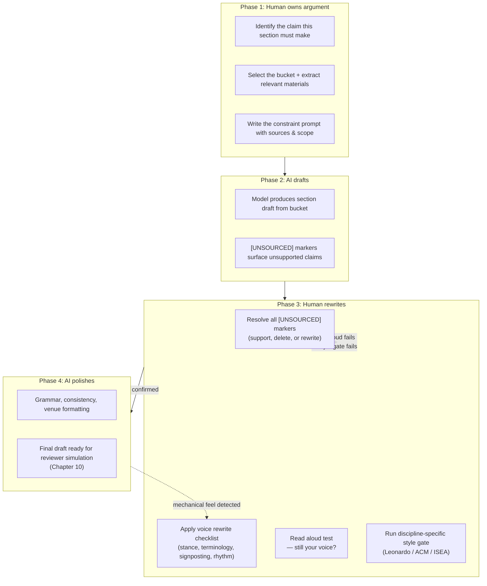

**Figure 8.1 — The draft → critique → rewrite → refine loop.** Phases 1–3 are human-owned. Phase 4 (AI polish) occurs only *after* the human has claimed ownership of the argument, evidence, and voice. The dashed arrows show regression paths: if the read aloud test fails or the style gate catches violations, return to rewrite. The AI polishing pass (Phase 4) is the last step, never the first. Polishing prose before claiming ownership produces fluent text that is not yours.

**Why Phase 4 comes last:** AI polish (grammar correction, parallel structure, word choice tightening) is valuable — but only after the human has made the section *unmistakably theirs*. If you let the AI polish first, the prose becomes smoother and you become more attached to it. Resisting changes to smooth, fluent text is psychologically harder than rewriting rough text — even when the rough text is yours and the smooth text is not. Own first. Polish last.

---

### 8.10 Failure Modes

**Voice homogenization** — Every paragraph sounds the same. This occurs when Phase 3 (human rewrite) is skipped and the draft moves from Phase 2 (AI draft) directly to Phase 4 (AI polish). Polishing an undifferentiated draft produces uniformly smooth undifferentiated text. The paper reads as if written by exactly one author — and that author is the model.

**Symptom:** A colleague reads your draft and says "it's well-written" but cannot identify your contribution claim, point to the section where you take a position, or quote a single sentence back to you. Well-written and interchangeable are the same failure.

**Claim drift** — The draft argues something slightly different from your actual contribution claim. This is not an obvious misstatement; it is a subtle drift in emphasis. Your claim: "gaze+pinch is faster for small targets but not large ones." The draft's emphasis: "gaze+pinch is a promising modality for AR target selection." The second sentence is consistent with your claim but weaker than it. Drift toward the generic — toward what "anyone" would say — is the default direction of AI-generated prose.

**Symptom:** You read the finished draft and it sounds right but feels thin. You cannot point to any sentence that is wrong. The problem is not wrong claims but weakened claims — claims that have been softened from what you actually demonstrated.

**Citation fabrications that survive because no one checks** — A hallucinated citation appears in a draft. It persists because: (a) it is formatted correctly, (b) it appears in a paragraph with three legitimate citations that you did verify, (c) you assume the check you did on the legitimate citations extends to the illegitimate one. It persists through submission. A reviewer — sometimes the one who knows that paper, sometimes the one who is just thorough — checks it. The paper's credibility collapses. Not because of one bad citation, but because the reviewer now wonders which other citations you didn't check.

**Symptom:** You have never had the experience of fabricating a citation yourself, so you assume it only happens to careless researchers. It happens to everyone who does not have a structural protocol against it. The `[UNSOURCED]` marker is that protocol.

---

### 8.11 Examples

#### Example A: Constraint prompt and output

**Prompt:**

```text
You are writing a subsection of the related work section for a CHI paper
on target-selection modalities in optical see-through AR.

## Sources
From the literature matrix:

1. [Tanaka21] Tanaka et al., 2021. Within-subjects experiment, 28
   participants. Finding: gaze+pinch 31% faster than gaze-only in
   VR (p<.01). Limitation: VR-only; did not test optical see-through.

2. [Lee22] Lee et al., 2022. Within-subjects experiment, 24 participants.
   Finding: dwell selection error rate 12% lower than gaze-only for
   targets >3°. Limitation: Tested at a single fixed distance.

3. [Zhang23] Zhang et al., 2023. Within-subjects experiment, 32
   participants. Finding: gaze+pinch 23% faster than gaze-only for
   targets <2° (p<.001); no difference for targets >=2°. Sample:
   single university, age 18-28.

## Task
Draft ONE subsection (150-200 words) covering the current state of
empirical comparison between gaze-based and manual selection modalities
for target acquisition.

## Required structure
Open with the dominant finding (speed advantage of combined
modalities) → note the boundary conditions that remain unexplored
(specific target sizes, distances, and AR optical properties) →
close with the gap.

## Constraints
- Use ONLY the sources provided above.
- End every claim with [Author Year].
- If a sentence cannot be supported by these sources, mark it
  [UNSOURCED].
- Do not introduce sources not in the provided material.
- Word limit: 200.
- Avoid stock transitions ("In this section...", "Furthermore...").

## Output format
Return only the draft text.
```

**Output (with [UNSOURCED] markers left in — as they would appear):**

> The speed advantage of combined gaze and manual input over gaze-only selection is well established. Tanaka et al. demonstrated a 31% reduction in acquisition time for gaze+pinch compared to gaze-only in virtual reality [Tanaka21], and Zhang et al. replicated this finding in optical see-through AR for small targets, reporting a 23% improvement for targets under 2° of visual angle [Zhang23]. However, these benefits are moderated by target size: Zhang et al. found no significant difference between gaze+pinch and gaze-only for targets exceeding 2° [Zhang23], and Lee et al. reported that dwell selection maintained a 12% error-rate advantage over gaze-only for targets above 3° [Lee22]. [UNSOURCED: The interaction between target distance and modality performance remains unexamined — all three studies tested at fixed distances.] The boundary conditions under which combined modalities outperform single-modality approaches — particularly across varying target sizes, distances, and optical see-through properties — are not yet mapped.

**What the [UNSOURCED] marker tells you:** The claim about target distance is plausible and probably true, but none of the three provided sources tested varying distances. You have three options: (a) add a source that *does* test distance variation, (b) weaken the claim to "all three studies tested at fixed distances, leaving distance effects unknown" — which *is* supported by the sources, or (c) delete the sentence. Option (b) is usually the right move: it converts an unsupported claim into a supported observation about the literature's limitation.

#### Example B: AI draft paragraph and voice-injected rewrite

**AI draft (Phase 2 output, after [UNSOURCED] resolution):**

> Prior work has explored gaze interaction in AR, but little attention has been paid to small-target selection. In this paper, we present a study comparing gaze+pinch and dwell selection for small targets. Our results show that gaze+pinch is faster than dwell selection for small targets. This finding has implications for the design of AR interfaces. The results also suggest that target size is an important factor in modality selection.

**Problems:**
- "Prior work has explored" — stock opening, no stance
- "In this paper, we present" — bureaucratic hum
- "Our results show" — repetitive structure (X shows Y)
- "This finding has implications" — vague, no specific implication
- "The results also suggest" — hedging, no ownership
- Every sentence is the same length and structure
- No disciplinary terminology (no mention of visual angle, Fitts's Law, or spatial selection)
- Reads as if anyone could have written it

**Voice-injected rewrite (Phase 3 output):**

> The AR community's reliance on dwell selection for small targets is a holdover from accessibility conventions designed for 2D screens — conventions that assume the cost of a false positive is low. In spatial AR, where targets exist in three dimensions and the user is often mobile, that assumption breaks down. We compared gaze+pinch and dwell selection for targets under 2° of visual angle in optical see-through AR and found that gaze+pinch reduced acquisition time by 18% (p<.01). The performance gap is target-size dependent: above 3°, the modalities converge. This means that AR interface designers face a tradeoff — dwell for large, forgiving targets; gaze+pinch for small, dense ones — that current accessibility guidelines do not address.

**What changed:**
- **Stance:** "The AR community's reliance on dwell selection is a holdover" — a claim about *why* the gap exists, not just that it exists
- **Diction:** "holdover," "breaks down," "forgiving," "dense" — specific, owned word choices
- **Structure varied:** One long sentence, then a short one. A sentence that starts with "This means" — leading with consequence, not finding
- **Signposting:** "The performance gap is target-size dependent" tells the reader *what kind* of information follows (a boundary condition), not just "additionally"
- **Disciplinary terminology:** "visual angle," "optical see-through," "accessibility guidelines" — terms from the HCI discourse
- **No hedging:** "We compared and found" not "the results suggest"
- **Read aloud test:** The paragraph has rhythm — a long setup, a short finding, a consequence. It sounds like a person arguing, not a report generating.

---

## Expected Outputs

After completing this chapter's workflow for each section, you will have:

1. **Bucket extractions** — For each section, a file in `08_drafts/buckets/` containing only the verified materials used for that section's draft
2. **Section drafts with zero `[UNSOURCED]` markers** — Each draft in `08_drafts/section_drafts/` has been through `[UNSOURCED]` resolution, voice rewrite, read aloud test, and style gate
3. **Visible human voice edits** — The diff between Phase 2 (AI draft) and Phase 3 (human rewrite) shows substantive changes: stance injection, terminology alignment, signposting, rhythm variation — not synonym substitution
4. **A completed drafting sequence** — Methods → Results → Related Work → Introduction → Discussion → Abstract, each drafted with knowledge of the preceding sections

---

## Best Practices

1. **Never write more than one section per prompt.** Context dilution and drift amplification are structural, not quality, problems. They do not go away with better models.
2. **Pre-sort materials into buckets before drafting.** The bucket method is manual RAG. It replaces rework with preparation.
3. **Treat `[UNSOURCED]` as a diagnostic, not a failure.** Every marker is a claim that needs a source, a rewrite, or a deletion. The marker did its job. Fix the claim.
4. **Write in the order that builds the argument, not the order the reader sees it.** Methods first (most grounded), abstract last (summarizes the real paper).
5. **Own the prose before polishing it.** Phase 4 (AI polish) comes after Phase 3 (human rewrite). Smooth text you do not own is the absentee trap.
6. **Run style gates as single-rule passes.** One pass for passive voice. One pass for acronyms. One pass for word count. Multi-rule passes miss violations.
7. **Read every paragraph aloud before declaring it done.** If it sounds like anyone could have written it, it is not yet yours.

---

## Anti-patterns

1. **"Write the full paper" prompts.** One prompt, one paper, many hallucinations. The model's coherence is the enemy of your accuracy — a coherent fictional system is harder to detect than isolated errors.
2. **Feeding the whole matrix to every prompt.** If you give the model 25 rows and ask for a 200-word subsection, it will attend to the most common pattern in the rows, not the most relevant ones. Extract first.
3. **Resolving `[UNSOURCED]` by deleting the marker without resolving the claim.** Deleting the marker is not the same as deleting the claim. If the claim was essential, it still needs a source. If it was not essential, delete the claim — not just the marker.
4. **Writing the abstract first.** You are summarizing a paper that does not exist. The gap between the abstract's promise and the paper's delivery will violate No Surprises.
5. **Polishing before owning.** Running AI polish on a draft you have not rewritten produces fluent text that is not yours. You will resist changing it. This is the absentee trap in miniature.
6. **Synonym substitution as voice rewrite.** Replacing "shows" with "demonstrates" and "important" with "significant" is not voice injection. Voice is stance, diction, rhythm, and argumentative structure — not vocabulary swapping.
7. **Skipping the read aloud test because "it reads fine silently."** Silent reading skips over mechanical prose. The ear catches what the eye forgives.

---

## Checklist

Before declaring any section draft complete, verify:

- [ ] Bucket extraction contains only verified materials relevant to this section
- [ ] Constraint prompt includes: scope limit, citation format, `[UNSOURCED]` rule, no-outside-sources rule, word limit
- [ ] Draft has zero unhandled `[UNSOURCED]` markers (each resolved by supporting, deleting, or rewriting)
- [ ] Voice rewrite checklist applied: stance injected, terminology aligned, signposting strengthened, rhythm varied
- [ ] Read aloud test passed — the paragraph sounds like you, not like anyone
- [ ] Discipline-specific style gate run as a dedicated single-rule pass (Leonardo / ACM / ISEA as applicable)
- [ ] AI polish (Phase 4) applied only after human rewrite (Phase 3) is complete
- [ ] Drafting sequence followed: methods before results before related work before introduction before discussion before abstract
- [ ] Diff between AI draft and final draft shows substantive human edits, not synonym substitution

---

## References

### Chapter Cross-References

- **Chapter 1** — Contribution-first thinking (Section 1.3); the prediction boundary as creative criterion (Section 1.7); the So What ×3 and No Surprises tests that the introduction and discussion must deliver on
- **Chapter 3** — Source grounding protocol; the `[UNSOURCED]` marker as a structural constraint; hierarchical memory and context engineering for writing sessions
- **Chapter 4** — The literature synthesis matrix (Section 4.4) is the primary input for the literature matrix bucket; consensus verification (Section 4.5) ensures the claims you build on are not contested
- **Chapter 6** — Paradigm declaration and method draft (Section 6.2–6.8) are the inputs for the methods-and-process bucket; separation of findings and interpretation (Section 6.10) governs what goes in the data-and-questions bucket
- **Chapter 9** — Multi-agent writing systems; how the bucket method scales when each section has a dedicated writing agent
- **Chapter 10** — Reviewer simulation; the draft produced in this chapter is the input for adversarial review
- **Chapter 11** — Final submission; citation integrity gate; venue-specific formatting checklists

### Source Materials

- *课程详细计划_8节.md* — Session 6 (有据写作、声音与审稿模拟): the bucket method, constraint prompt template, voice injection checklist, read aloud test, and Leonardo style gate are derived from this session's content
- *Plan.md* — Iterative adversarial workflow (Writer → Critic → Devil's Advocate → Reviewer → Writer Revision → Citation Audit → Final Editor); the four-phase cycle in this chapter implements this loop at the section level
- *AI Research Assistant Prompting Guide.md* — "Rapid Research Article" section drafter prompt; the "So What?" revision prompt (used in Phase 3 voice rewrite)
- *Prompting best practices.md* — XML structuring for prompts; long-context data-at-top principle (relevant to bucket extraction formatting); constraint language design

### Further Reading

- Syed, S. & Le Meur, E. (2024). "PaperEngage: An AI-powered system for reading academic papers." *CHI '24.* — Demonstrates structured extraction from academic papers, relevant to bucket construction.
- Kang, S. & Harty, A. E. (2024). "Use of AI-Based Literature Review Tools in Research." — Documents adoption patterns and failure modes of AI writing tools, including voice homogenization and claim drift.
- Wobbrock, J. O. & Kientz, J. A. (2016). "Research contributions in human-computer interaction." *Interactions*, 23(3), 38–44. — The contribution type taxonomy that determines what each section must argue.


---

<a id="chapter-09"></a>

# Chapter 9: Multi-Agent Writing Systems

## Objectives

After reading this chapter, you will be able to:

1. Explain why a multi-agent pipeline produces stronger manuscripts than a single model writing and reviewing its own work
2. Configure a 12–15 agent tree in your orchestration tool of choice
3. Define each agent's role, inputs, outputs, prompt template, and failure modes
4. Run one full adversarial editing loop (Writer → Critic → Devil's Advocate → Reviewer → Associate Chair → Writer Revision → Citation Audit → Final Editor)
5. Route agents to cost-optimal models based on task requirements
6. Diagnose and mitigate multi-agent failure modes: collusion, orchestration overhead, and context fragmentation

## Required Background

- **Chapter 2** — The multi-agent architecture overview, canonical workflow, and why structure beats model power. This chapter provides the full agent definitions that Chapter 2 summarizes.
- **Chapter 3** — Context engineering and the agent communication protocol (Section 3.8). Every inter-agent message in this chapter uses the structured protocol defined there.
- **Chapter 8** — Sourced writing and the bucket method. The Writing Team agents apply these techniques; you need to understand constraint prompts and the `[UNSOURCED]` safety valve before configuring writers.

If you have not read Chapter 2's section on the standard agent tree (Section 2.3), read it now. The tree diagram there is the map; this chapter is the territory.

---

## 9.1 Why Multiple Agents

A single model writing and reviewing its own work is a conflict of interest. Not because the model is malicious, but because it cannot see its own blind spots. The same statistical patterns that produce fluent prose also produce fluent over-claiming. The same training that enables synthesis enables fabrication. A model reviewing its own output will rate it higher than an independent reviewer would — not through deception, but through shared priors.

### The core argument

Different agents have different failure modes. When configured correctly, these failure modes cover each other:

| Failure Mode | Who Catches It |
|-------------|---------------|
| Writer over-claims | Devil's Advocate, CHI Reviewer |
| Writer misses theoretical gap | HCI Theorist, Philosophy Reviewer |
| Writer uses template language mismatching paradigm | Methods Writer, UX Researcher |
| Writer fabricates citations | Citation Verifier |
| Writer produces generic prose | Style Editor |
| Reviewer is too lenient (shares author's framing) | Second independent reviewer |
| Reviewer focuses on wrong dimension | Associate Chair (calibrates) |

No single agent sees the whole problem. Together, they cover each other's blind spots. This is the same principle as the CHI review process: three independent reviewers produce more reliable judgments than one, not because any individual is incompetent, but because each reviewer has different expertise and biases.

### What multi-agent does NOT solve

Multi-agent does not eliminate the need for human judgment. The human role shifts from writer to editor/orchestrator — but the human must still:

- Approve every contribution claim
- Verify every citation
- Own the limitations section
- Make final acceptance/rejection decisions on agent recommendations

The agents propose. The human disposes. This is the same division of labor described in Chapter 2 and the AI usage rules in the syllabus (Section 0.6 of the course plan).

---

## 9.2 The Full Agent Tree

The standard tree has 21 agents organized under five teams, plus the Editor-in-Chief. The following diagram shows the structure; the sections that follow define each agent.

```mermaid
graph TD
    EIC["Editor-in-Chief<br/>Orchestrates · Integrates · Decides"]
    
    EIC --> RD["Research Director"]
    EIC --> TT["Theory Team"]
    EIC --> MT["Methods Team"]
    EIC --> WT["Writing Team"]
    EIC --> RT["Review Team"]
    
    RD --> TS["Trend Scout"]
    RD --> GH["Gap Hunter"]
    RD --> LM["Literature Miner"]
    
    TT --> HCI["HCI Theorist"]
    TT --> DAC["Digital Art Critic"]
    TT --> PR["Philosophy Reviewer"]
    
    MT --> UX["UX Researcher"]
    MT --> ST["Statistician"]
    MT --> QC["Qualitative Coding Agent"]
    MT --> ER["Ethics Reviewer"]
    
    WT --> IW["Introduction Writer"]
    WT --> RW["Related Work Writer"]
    WT --> MW["Methods Writer"]
    WT --> RESW["Results Writer"]
    WT --> DW["Discussion Writer"]
    WT --> AW["Abstract Writer"]
    
    RT --> CR1["CHI Reviewer #1<br/>Empirical Rigor"]
    RT --> CR2["CHI Reviewer #2<br/>Theoretical Contribution"]
    RT --> AC["Associate Chair"]
    RT --> CV["Citation Verifier"]
    RT --> SE["Style Editor"]

    style EIC fill:#1a5276,color:#fff
    style RD fill:#1e8449,color:#fff
    style TT fill:#935116,color:#fff
    style MT fill:#6c3483,color:#fff
    style WT fill:#117a65,color:#fff
    style RT fill:#922b21,color:#fff
```

**Figure 9-1.** The canonical multi-agent tree. The Editor-in-Chief does not generate text; it orchestrates, compares, and integrates. Each team operates semi-autonomously with defined inputs and outputs. The Writing Team (green) and Review Team (red) are the most heavily used during the drafting stage and receive the most detailed treatment in this chapter.

---

## 9.3 Agent Definitions: Research Director Team

### 9.3.1 Trend Scout

**Responsibilities:** Monitors target venues (CHI, UIST, CSCW, DIS, SIGGRAPH, Leonardo, ISEA) for emerging themes, citation spikes, and methodological shifts. Produces a quarterly trend report that feeds into gap analysis.

**Inputs:**
- Target venue list with date ranges
- Seed papers from the project's literature matrix
- Citation network data from ResearchRabbit or Litmaps

**Outputs:**
- `trend_report.md` — structured report with: (1) top 5 emerging themes by citation velocity, (2) declining themes, (3) methodological trends, (4) key papers for each theme

**Prompt Template:**
```
You are a Trend Scout for HCI/Digital Art research. Your job is to identify
emerging themes in [target venues] over the past [time period].

<input>
  Seed papers: [list of 3-5 seed paper titles and years]
  Citation network data: [from ResearchRabbit/Litmaps]
</input>

<constraints>
  - Identify themes by citation velocity (papers/year), not by your own judgment
  - Distinguish between a genuine trend and a single highly-cited paper
  - Flag themes that are growing vs. themes that are saturated
  - Do not recommend which trend to pursue — that is the human's decision
</constraints>

<output_format>
  ## Emerging Themes (ranked by citation velocity)
  [For each: theme name, 2-3 key papers, growth rate, saturation signal]
  
  ## Declining Themes
  [For each: theme name, peak year, current trajectory]
  
  ## Methodological Shifts
  [New methods gaining adoption, old methods declining]
  
  ## Key Papers
  [5-8 papers the human should read to understand the landscape]
</output_format>
```

**Memory requirements:** Project memory (venue list, research identity). No session memory needed — each run is independent.

**Tools:** ResearchRabbit, Litmaps, Semantic Scholar, Elicit.

**When NOT to use:** When the literature matrix is fewer than 15 rows (insufficient data for trend detection). When the research question is already fixed and you are in the writing stage.

**Failure modes:**
- Confuses popularity with importance (a highly-cited paper may be highly-cited because it is wrong and others are refuting it)
- Detects trends that are artifacts of conference themes rather than genuine intellectual shifts
- Produces reports that are too broad to be actionable

---

### 9.3.2 Gap Hunter

**Responsibilities:** Identifies structural gaps in the citation network — places where two subfields address related mechanisms but do not cite each other, or where a methodological approach from one domain has not been applied in another.

**Inputs:**
- Literature matrix (≥15 rows)
- Citation network data
- Research question (to assess gap relevance)

**Outputs:**
- `gap_analysis.md` — ranked list of gaps with evidence for each: (1) the gap statement, (2) evidence it is a real gap (not just an unstudied topic), (3) feasibility assessment, (4) relevance to the research question

**Prompt Template:**
```
You are a Gap Hunter. Your job is to identify structural gaps in the
literature — not topics nobody has studied, but places where the
citation network shows a disconnect.

<input>
  Literature matrix: [attached CSV, N rows]
  Citation network: [from ResearchRabbit]
  Research question: [current question]
</input>

<constraints>
  - A gap must be evidenced by the citation network, not asserted
  - Distinguish: (a) structural gap (two subfields don't cite each other),
    (b) methodological gap (approach X never applied in domain Y),
    (c) empirical gap (nobody has tested Z — weakest, requires strongest evidence)
  - Rank gaps by: (1) evidence strength, (2) relevance to research question,
    (3) feasibility for a single paper
  - Do not recommend which gap to fill — that is the human's decision
</constraints>

<output_format>
  ## Structural Gaps (strongest evidence)
  [For each: gap statement, evidence, relevance, feasibility]
  
  ## Methodological Gaps
  [For each: gap statement, evidence, relevance, feasibility]
  
  ## Empirical Gaps (weakest evidence — flag as speculative)
  [For each: gap statement, evidence quality warning, relevance]
</output_format>
```

**Memory requirements:** Project memory (research question, literature matrix). Session memory from Trend Scout if available.

**Tools:** ResearchRabbit, Litmaps, Connected Papers.

**When NOT to use:** When the research question is exploratory and you do not yet know what domain you are in. When the literature matrix is incomplete (gaps may be artifacts of missing papers, not real structural gaps).

**Failure modes:**
- Finds gaps that are gaps because the question is uninteresting (the "nobody has studied the mating habits of Antarctic beetles" problem)
- Confuses a gap in the citation network with a gap in knowledge (the two subfields may not cite each other because they use different terminology, not because they are unaware of each other)
- Produces gap statements that are too broad to fill in a single paper

---

### 9.3.3 Literature Miner

**Responsibilities:** Runs the four-stage discovery pipeline (discovery → network → extraction → consensus) described in Chapter 4. Produces and maintains the literature matrix.

**Inputs:**
- Research question
- Seed papers (3–5)
- Target databases (Semantic Scholar, Elicit, etc.)

**Outputs:**
- `literature_matrix.csv` — with columns: Author, Year, Title, Method, Core Finding, Limitation, Link, Human Inclusion Reason
- `consensus_report.md` — for foundational claims, support/contradiction counts

**Prompt Template:**
```
You are a Literature Miner. Run the discovery pipeline for the following
research question.

<input>
  Research question: [question]
  Seed papers: [3-5 papers with full citations]
</input>

<procedure>
  1. Search Semantic Scholar and Elicit for papers related to the question
  2. Expand via citation network (papers citing and cited by seeds)
  3. Extract into matrix format: Author | Year | Title | Method | 
     Core Finding | Limitation | Link
  4. For the top 5 most frequently cited claims in the matrix, run
     Consensus/scite to check support/contradiction counts
</procedure>

<constraints>
  - Matrix must have ≥15 rows before stopping
  - Each row must have a human-written inclusion reason (leave blank
    for human to fill — do not invent inclusion reasons)
  - Flag any paper you cannot verify exists
  - Do not include papers you have not verified have an abstract
</constraints>
```

**Memory requirements:** Project memory (research question). The literature matrix IS the project memory for the literature stage.

**Tools:** Semantic Scholar, Elicit, ResearchRabbit, Consensus, scite, Zotero.

**When NOT to use:** When the literature matrix already has ≥30 verified rows and the research question has not changed. Re-running the pipeline on a stable corpus wastes time and tokens.

**Failure modes:**
- Treats AI extraction as ground truth (the model may misextract methods or findings — human must verify every row)
- Includes papers that exist but are irrelevant (the model errs on the side of inclusion)
- Misses non-English papers and older foundational work that is not well-indexed in semantic search

---

## 9.4 Agent Definitions: Theory Team

### 9.4.1 HCI Theorist

**Responsibilities:** Proposes conceptual frameworks for the research claim. Connects specific findings to broader HCI theory (e.g., embodied interaction, distributed cognition, activity theory, Fitts's law extensions). Ensures the paper speaks to theoretical contributions, not just empirical results.

**Inputs:**
- Contribution claim
- Research findings (or expected findings)
- Theoretical framework file from project memory

**Outputs:**
- `theoretical_framework.md` — proposed framework with: (1) core constructs, (2) relationships between constructs, (3) how the current study operationalizes the framework, (4) what the study contributes to the framework

**Prompt Template:**
```
You are an HCI Theorist. Propose a conceptual framework that connects
the following research findings to broader HCI theory.

<input>
  Contribution claim: [one sentence]
  Findings: [key results or expected results]
  Theoretical commitments: [from research_identity.md]
</input>

<constraints>
  - Propose 2-3 candidate frameworks, not just one
  - For each framework: name it, cite its origin, explain how it maps
    to the current study, state what the study contributes to it
  - Flag any framework that would require data you do not have
  - Do not propose unfalsifiable frameworks
  - The human chooses the final framework — you propose, they dispose
</constraints>

<output_format>
  ## Candidate Framework 1: [Name]
  - Origin: [key references]
  - Core constructs: [list]
  - Mapping to current study: [specific]
  - Contribution: [what this study adds to the framework]
  - Requirements: [data/analysis needed]
  - Risks: [limitations of this framing]
  
  [Repeat for Frameworks 2-3]
  
  ## Recommendation
  [Which framework best fits the study and why — but the human decides]
</output_format>
```

**Memory requirements:** Project memory (research identity, theoretical framework). Session memory from prior theory discussions.

**Tools:** NotebookLM (for theory literature), Claude/GPT for reasoning.

**When NOT to use:** When the contribution type is purely empirical with no theoretical ambition (some CHI papers report empirical findings without theoretical framing — this is valid but means the HCI Theorist has little to do). When the paper is a system/artifact contribution where the contribution is the artifact itself.

**Failure modes:**
- Produces frameworks that are unfalsifiable ("this study contributes to our understanding of embodied interaction" — too vague to test)
- Proposes frameworks that require data the study did not collect
- Uses theory as decoration rather than as a genuine analytical lens (the "theory sticker" problem)

---

### 9.4.2 Digital Art Critic

**Responsibilities:** Connects artistic practice to theoretical discourse. Ensures the paper makes an epistemic contribution (what does the work help us understand?) rather than only an aesthetic one (what does the work look like?). This agent is specific to Digital Art / RtD / practice-based research.

**Inputs:**
- Description of the artwork/project
- Process documentation (iterations, decisions, dead ends)
- Theoretical anchor (e.g., individuation, cosmotechnics, post-digital theory)

**Outputs:**
- `epistemic_contribution.md` — analysis of: (1) what knowledge the work produces that could not be produced by theory alone, (2) how the work engages its theoretical anchor, (3) what the work reveals about its medium/method

**Prompt Template:**
```
You are a Digital Art Critic specializing in epistemic contributions.
Analyze the following artistic/research-through-design project.

<input>
  Project description: [what was made and why]
  Process documentation: [iterations, decisions, pivots]
  Theoretical anchor: [e.g., individuation / cosmotechnics / media archaeology]
</input>

<constraints>
  - Distinguish: (a) what the work IS (description),
    (b) what the work DOES (effect on viewer/user),
    (c) what the work KNOWS (epistemic contribution)
  - Focus on (c) — the epistemic contribution
  - Do not confuse description of the work with argument from the work
  - The theoretical anchor must do real work — if removing it does not
    change the argument, it is decoration
  - Flag any claim about the work's effect that is not evidenced by
    process documentation or participant data
</constraints>

<output_format>
  ## Epistemic Contribution
  [What does this work help us understand that theory alone could not?]
  
  ## Theoretical Anchor Engagement
  [How does the work engage, challenge, or extend the theoretical anchor?]
  
  ## Medium/Method Knowledge
  [What does the work reveal about its medium or method?]
  
  ## Claims Requiring Evidence
  [Which claims about the work's contribution need additional support?]
</output_format>
```

**Memory requirements:** Project memory (research identity, theoretical framework). Session memory from process documentation.

**Tools:** Claude/GPT for reasoning. NotebookLM for theory literature.

**When NOT to use:** When the contribution is not practice-based (a standard HCI user study does not need a Digital Art Critic). When the theoretical anchor has not been chosen yet.

**Failure modes:**
- Confuses description of the work with argument from the work ("the installation uses mirrors to create infinite reflection" is description; "the infinite reflection reveals how self-perception is technologically mediated" is argument)
- Applies theory as a sticker rather than as a genuine analytical framework
- Over-claims epistemic contribution ("this work redefines our understanding of embodiment") when the actual contribution is more modest

---

### 9.4.3 Philosophy Reviewer

**Responsibilities:** Reviews the philosophical and epistemic foundations of the research. Checks for conceptual clarity, valid inference, and appropriate scope of claims. Especially important for theoretical papers and Digital Art research that engages philosophical frameworks.

**Inputs:**
- Contribution claim
- Theoretical framework
- Key arguments from the paper

**Outputs:**
- `philosophy_review.md` — structured review covering: (1) conceptual clarity, (2) logical validity of key arguments, (3) scope appropriateness of claims, (4) philosophical assumptions that need explicit defense

**Prompt Template:**
```
You are a Philosophy Reviewer for HCI/Digital Art research. Review the
following arguments for conceptual clarity and logical validity.

<input>
  Contribution claim: [one sentence]
  Key arguments: [numbered list of 3-5 main arguments in the paper]
  Theoretical framework: [summary]
</input>

<constraints>
  - For each argument, identify: (a) the premises, (b) the conclusion,
    (c) the inference rule, (d) whether the inference is valid
  - Flag any equivocation (a key term used with different meanings
    in different premises)
  - Flag any claim that exceeds what the premises support
  - Do not reject arguments because you disagree with conclusions —
    reject only on logical grounds
</constraints>
```

**Memory requirements:** Project memory (theoretical framework). No session memory needed.

**Tools:** Claude/GPT for reasoning.

**When NOT to use:** When the paper is a straightforward empirical study with no philosophical ambitions. When the theoretical framework is well-established and uncontroversial.

**Failure modes:**
- Imposes philosophical standards that are inappropriate for the paradigm (e.g., demanding falsifiability from an RtD paper)
- Focuses on logical minutiae while missing the big-picture argument
- Rejects arguments based on disagreement with premises rather than logical invalidity

---

## 9.5 Agent Definitions: Methods Team

### 9.5.1 UX Researcher

**Responsibilities:** Designs the study protocol — participant recruitment, apparatus, procedure, measures, and analysis plan. Ensures the design actually tests the contribution claim.

**Inputs:**
- Research question
- Contribution claim (to verify alignment)
- Paradigm (experimental, qualitative, mixed, system evaluation, RtD)

**Outputs:**
- `method_draft.md` — full method section draft with: design, participants, apparatus, procedure, measures, analysis plan
- `audit_checklist.md` — confounds, ethical issues, validity threats (human-written)

**Prompt Template:**
```
You are a UX Researcher. Design a study protocol for the following
research question and contribution claim.

<input>
  Research question: [question]
  Contribution claim: [claim]
  Paradigm: [experimental / qualitative / mixed / system evaluation / RtD]
  Domain context: [from research_identity.md]
</input>

<constraints>
  - The design must directly test the contribution claim
  - Specify: design, participants, apparatus, procedure, measures,
    analysis plan
  - For each design choice, state what alternative you considered and
    why you rejected it
  - Flag any confound you cannot fully control
  - Flag any ethical issue specific to this population or context
  - Do not claim the design eliminates all threats — acknowledge
    residual validity threats
</constraints>

<output_format>
  ## Design
  [Overall design with justification]
  
  ## Participants
  [N, recruitment, inclusion/exclusion, compensation]
  
  ## Apparatus / Materials
  [Equipment, software, stimuli]
  
  ## Procedure
  [Step-by-step protocol]
  
  ## Measures
  [Dependent variables, scales, operationalization]
  
  ## Analysis Plan
  [Statistical tests or qualitative coding approach]
  
  ## Confounds and Limitations
  [What you could not control and why]
</output_format>
```

**Memory requirements:** Project memory (research question, research identity). Session memory from prior design discussions.

**Tools:** Claude/GPT for reasoning. Zotero for method references.

**When NOT to use:** When the study has already been conducted (the method describes what was done, not what should be done). When the paradigm is not yet chosen.

**Failure modes:**
- Defaults to convenience sampling without flagging the bias
- Produces a design that is too ambitious for the available resources
- Uses template language that mismatches the actual paradigm (e.g., "hypothesis" in a qualitative study)
- Fails to identify confounds that are specific to the domain (the model does not have the tacit knowledge of an experienced researcher in the domain)

---

### 9.5.2 Statistician

**Responsibilities:** Advises on the quantitative analysis plan. Does NOT interpret results — only advises on which tests are appropriate, what assumptions they require, and what the results would mean if significant/non-significant.

**Inputs:**
- Research design (factors, levels, dependent variables)
- Data structure (sample size, distributional assumptions)
- Analysis plan draft

**Outputs:**
- `statistical_advice.md` — for each planned analysis: (1) whether the test is appropriate, (2) assumptions to check, (3) what to do if assumptions are violated, (4) effect size and power considerations, (5) common misinterpretations to avoid

**Prompt Template:**
```
You are a Statistician. Review the following analysis plan for
appropriateness. Do NOT interpret any results — only evaluate
the plan.

<input>
  Design: [factors, levels, between/within]
  Dependent variables: [list with measurement scales]
  Planned analyses: [list of statistical tests]
  Sample size: [N per condition]
</input>

<constraints>
  - For each planned test: (a) is it appropriate for this design?
    (b) what assumptions does it require? (c) what if assumptions
    are violated? (d) what is the power to detect a medium effect?
  - Flag any multiple-comparison issue
  - Flag any analysis that would answer the wrong question
  - Do not suggest additional analyses beyond what was asked
  - Do not interpret results — only evaluate the plan
</constraints>
```

**Memory requirements:** Project memory (research design). No session memory needed.

**Tools:** Claude/GPT for reasoning. R or Python for power analysis (if available).

**When NOT to use:** When the study is purely qualitative. When the analysis plan has already been executed and results are available (the Statistician advises on plans, not results).

**Failure modes:**
- Suggests tests that are technically correct but answer the wrong question
- Fails to flag multiple-comparison problems in complex designs
- Provides correct statistical advice that the human cannot evaluate (the human must have enough statistical literacy to assess the Statistician's recommendations)

---

### 9.5.3 Qualitative Coding Agent

**Responsibilities:** Proposes initial codes from interview/transcript data. Groups codes into candidate themes. Does NOT own the final codebook — the human disposes.

**Inputs:**
- Interview transcripts or field notes
- Research question
- Paradigm (thematic analysis, grounded theory, phenomenological, etc.)

**Outputs:**
- `codebook_proposal.md` — proposed codes with definitions and example quotes
- `theme_candidates.md` — candidate themes with supporting codes

**Prompt Template:**
```
You are a Qualitative Coding Agent. Propose initial codes for the
following transcript data. You propose — the human disposes.

<input>
  Transcript: [attached, anonymized]
  Research question: [question]
  Paradigm: [thematic analysis / grounded theory / IPA / etc.]
</input>

<constraints>
  - Propose codes, do not finalize them
  - Each code must have: (a) a name, (b) a definition,
    (c) an example quote from the transcript
  - Do not impose theory — induce from the data
  - Flag any code that is an interpretation rather than a description
  - Flag any quote that could identify a participant (even indirectly)
  - Do not group codes into themes — that is the human's decision
</constraints>

<output_format>
  ## Proposed Codes
  | Code | Definition | Example Quote | Notes |
  |------|-----------|---------------|-------|
  [table]
  
  ## Codes Requiring Human Judgment
  [Codes where you are uncertain — flag for human decision]
  
  ## Potential Issues
  [Quotes that might identify participants, codes that overlap, etc.]
</output_format>
```

**Memory requirements:** Project memory (research question, paradigm). Session memory from prior coding sessions.

**Tools:** Claude/GPT for reasoning. Local model if transcripts contain confidential data (see Section 9.12).

**When NOT to use:** When the data contains confidential information and no local model is available (never paste confidential data into a cloud API — see the AI usage rules in Section 0.6 of the syllabus). When the paradigm is not yet chosen.

**Failure modes:**
- Over-interprets (proposes codes that reflect the model's assumptions rather than the participants' language)
- Imposes theory instead of inducing from data
- Produces too many codes (fragmentation) or too few (over-aggregation)
- Misses domain-specific meanings that require tacit knowledge

---

### 9.5.4 Ethics Reviewer

**Responsibilities:** Reviews the study design for ethical issues — informed consent, participant vulnerability, data handling, potential for harm. Does NOT replace IRB/ethics committee review; flags issues for the human to address before submission to the committee.

**Inputs:**
- Study protocol
- Participant population
- Data collection and storage plan

**Outputs:**
- `ethics_review.md` — structured review covering: (1) informed consent adequacy, (2) participant vulnerability, (3) data privacy, (4) potential for harm, (5) data retention and sharing plan

**Prompt Template:**
```
You are an Ethics Reviewer. Review the following study protocol for
ethical issues. This does NOT replace IRB/ethics committee review.

<input>
  Protocol: [full method]
  Population: [participant description]
  Data plan: [collection, storage, sharing, retention]
</input>

<constraints>
  - Flag any issue that an IRB would likely raise
  - Distinguish: (a) issues that must be fixed before data collection,
    (b) issues that should be disclosed in the paper,
    (c) issues that are best practices but not strictly required
  - Consider: power dynamics, vulnerable populations, data re-identification
    risk, right to withdraw, debriefing needs
  - Do not approve the study — only flag issues for the human to address
</constraints>
```

**Memory requirements:** Project memory (research identity, institutional context). No session memory needed.

**Tools:** Claude/GPT for reasoning.

**When NOT to use:** When the study does not involve human participants (a system paper with no user study). When IRB approval has already been obtained (the Ethics Reviewer is a pre-IRB check, not a substitute).

**Failure modes:**
- Flags issues that are not actually issues for the specific population (over-cautious)
- Misses issues that are specific to the cultural or institutional context
- Provides false reassurance ("this looks fine") when the human should consult their IRB

---

## 9.6 Agent Definitions: Writing Team

The Writing Team is the most heavily used team during the drafting stage. Each writer produces one section of the paper. All writers follow the same structural pattern: they receive the relevant bucket of verified materials, draft under constraints, and produce output that feeds into the adversarial review loop.

### 9.6.1 Introduction Writer

**Responsibilities:** Drafts the introduction — the contribution claim, its motivation, and the paper's structure. The introduction must pass the So What ×3 test (Chapter 5) and the No Surprises test (the introduction promises what the paper delivers).

**Inputs:**
- Contribution claim (from project memory)
- Gap statement (from Gap Hunter output)
- Key findings (from Results Writer output, if available)
- Target venue and word limit

**Outputs:**
- `introduction_draft.md` — structured introduction with: (1) motivation (why this matters), (2) gap (what is missing), (3) contribution claim (what we did and what it shows), (4) paper structure overview

**Prompt Template:**
```
You are an Introduction Writer for a [target venue] paper. Draft the
introduction using ONLY the provided materials.

<input>
  Contribution claim: [one sentence, human-approved]
  Gap statement: [from gap analysis, human-verified]
  Key findings: [3-5 bullet points from results]
  Venue: [CHI / UIST / CSCW / DIS / SIGGRAPH / Leonardo / ISEA]
  Word limit: [venue-specific]
</input>

<constraints>
  - Structure: motivation → gap → contribution claim → paper structure
  - The contribution claim must appear verbatim (do not paraphrase)
  - Every factual claim must cite a source from the literature matrix
  - Unsourced claims must be tagged [UNSOURCED]
  - The introduction must pass So What ×3: answer "so what?" three
    times, reaching progressively larger circles
  - The introduction must pass No Surprises: everything promised here
    must be delivered in the paper
  - Do not write a literature review — that is the Related Work section
  - Maximum [word limit] words
</constraints>

<output_format>
  [Motivation paragraph — why this problem matters]
  
  [Gap paragraph — what is missing and why it matters]
  
  [Contribution claim — one sentence, verbatim from input]
  
  [Paper structure overview — 2-3 sentences on what each section covers]
</output_format>
```

**Memory requirements:** Project memory (contribution claim, gap statement, literature matrix). Session memory from prior introduction drafts.

**Tools:** Claude/GPT for writing. Zotero for citation formatting.

**When NOT to use:** When the contribution claim is not yet finalized (the introduction is built around the claim — if the claim changes, the introduction must be rewritten). When the gap statement is not yet evidenced.

**Failure modes:**
- Writes a literature review instead of an argument (the introduction should motivate and claim, not survey)
- Paraphrases the contribution claim (the claim must appear verbatim — paraphrasing dilutes it)
- Promises more than the paper delivers (fails No Surprises)
- Cannot answer So What ×3 (the contribution is too thin)

---

### 9.6.2 Related Work Writer

**Responsibilities:** Synthesizes the literature matrix into a gap narrative. The related work section must build an argument that culminates in the gap the paper fills — it must not be an annotated bibliography.

**Inputs:**
- Literature matrix (≥15 verified rows)
- Gap statement
- Contribution claim (to connect the gap to)
- Target venue and word limit

**Outputs:**
- `related_work_draft.md` — structured synthesis with: (2–4) thematic subsections, each building toward the gap, ending with a clear gap statement that motivates the current study

**Prompt Template:**
```
You are a Related Work Writer. Synthesize the attached literature
matrix into a gap narrative. Do NOT produce an annotated bibliography.

<input>
  Literature matrix: [attached CSV, N verified rows]
  Gap statement: [from gap analysis]
  Contribution claim: [one sentence]
  Venue: [target venue]
  Word limit: [venue-specific]
</input>

<constraints>
  - Structure thematically, not chronologically or by paper
  - Each subsection must: (a) state a consensus, (b) note a disagreement
    or limitation, (c) point toward the gap
  - Every claim must cite a matrix row
  - Do not introduce sources outside the matrix
  - Unsourced claims must be tagged [UNSOURCED]
  - The final paragraph must state the gap explicitly and connect it
    to the contribution claim
  - Do not cite papers you have not verified exist
  - Maximum [word limit] words
</constraints>

<output_format>
  ## [Theme 1: e.g., Gaze-based Selection Efficiency]
  [Synthesis paragraph — consensus, limitation, connection to gap]
  
  ## [Theme 2: e.g., Fatigue in Prolonged Gaze Interaction]
  [Synthesis paragraph — consensus, limitation, connection to gap]
  
  ## [Theme 3: e.g., The Unaddressed Interaction]
  [Synthesis paragraph — what no paper addresses, the gap]
  
  ## Gap Statement
  [Explicit statement of the gap and how the current study addresses it]
</output_format>
```

**Memory requirements:** Project memory (literature matrix, gap statement). Session memory from prior related work drafts.

**Tools:** Claude/GPT for writing. NotebookLM for literature Q&A. Zotero for citation formatting.

**When NOT to use:** When the literature matrix has fewer than 15 verified rows. When the gap statement is not yet finalized.

**Failure modes:**
- Produces an annotated bibliography (paper-by-paper summary) instead of a thematic synthesis
- Asserts the gap without evidencing it (the gap must be shown through the synthesis, not stated)
- Introduces sources outside the matrix (hallucinated citations)
- Fails to connect the gap to the contribution claim (the reader should see exactly why this paper is needed after reading the related work)

---

### 9.6.3 Methods Writer

**Responsibilities:** Drafts the method section from the approved study design. The method must match the actual paradigm — no template language from a different paradigm.

**Inputs:**
- Approved method design (from UX Researcher output, human-verified)
- Audit checklist (confounds, ethics, validity threats)
- Paradigm-specific reporting guidelines (e.g., COREQ for qualitative, CONSORT for experimental)

**Outputs:**
- `methods_draft.md` — full method section with: design, participants, apparatus, procedure, measures, analysis plan

**Prompt Template:**
```
You are a Methods Writer. Draft the method section from the approved
design. Match the paradigm exactly — do not import language from
other paradigms.

<input>
  Approved design: [from method_draft.md, human-verified]
  Paradigm: [experimental / qualitative / mixed / system / RtD / etc.]
  Reporting guideline: [COREQ / CONSORT / venue-specific]
  Word limit: [venue-specific]
</input>

<constraints>
  - Use paradigm-appropriate language (e.g., "participants" not
    "subjects" for qualitative; "artifact" not "system" for RtD)
  - Include every element required by the reporting guideline
  - For each design choice, briefly justify why it was chosen
  - Do not describe results or interpret findings
  - Do not use hedging language that undermines the design
    ("we kind of used a survey" — no)
  - Be specific: "24 participants (12 female, 12 male, mean age 23.4)"
    not "some participants"
</constraints>
```

**Memory requirements:** Project memory (approved method design, paradigm). Session memory from prior methods drafts.

**Tools:** Claude/GPT for writing. Zotero for method references.

**When NOT to use:** When the method design is not yet approved. When the study has not yet been conducted (the method describes what will be done or what was done — not what might be done).

**Failure modes:**
- Uses template language from the wrong paradigm (e.g., "hypothesis" in a qualitative study, "statistical significance" in an RtD paper)
- Omits elements required by the reporting guideline
- Describes results in the method section (the method is what you did, not what you found)
- Is vague about sample, procedure, or analysis ("we analyzed the data qualitatively" — how?)

---

### 9.6.4 Results Writer

**Responsibilities:** Reports findings without interpretation. The results section answers "what happened?" — not "what does it mean?" Interpretation belongs in the Discussion.

**Inputs:**
- Analysis output (statistical results, themes, or system performance data)
- Analysis plan (from method section)
- Data files or summary tables

**Outputs:**
- `results_draft.md` — structured results with: (1) descriptive statistics or data overview, (2) inferential statistics or thematic findings, (3) supporting figures/tables with captions

**Prompt Template:**
```
You are a Results Writer. Report the following findings. Do NOT
interpret them — interpretation belongs in the Discussion.

<input>
  Analysis output: [statistical results / themes / performance data]
  Analysis plan: [from method section]
  Data files: [attached or referenced]
</input>

<constraints>
  - Report what the data shows, not what it means
  - For quantitative results: report test statistics, effect sizes,
    confidence intervals, and p-values
  - For qualitative results: report themes with supporting quotes
  - Do not use interpretive language ("this suggests", "this implies",
    "this means") — save for Discussion
  - Every figure and table must have a caption that describes what
    it shows without interpreting it
  - Flag any result that does not directly address the research question
</constraints>

<output_format>
  ## [Analysis 1: e.g., Selection Time]
  [Descriptive statistics, test result, effect size]
  [Figure reference with caption]
  
  ## [Analysis 2: e.g., Error Rate]
  [Descriptive statistics, test result, effect size]
  [Figure reference with caption]
  
  ## [Additional Findings]
  [Results that emerged but were not primary analyses — flag as exploratory]
</output_format>
```

**Memory requirements:** Project memory (analysis plan, research question). Session memory from prior results drafts.

**Tools:** Claude/GPT for writing. R/Python for statistical output (if available). Local model if data is confidential.

**When NOT to use:** When the analysis is not yet complete. When the data contains confidential information and no local model is available.

**Failure modes:**
- Smuggles interpretation into results ("the significant result shows that gaze+pinch is better" — no, it shows that selection time was shorter; "better" is interpretation)
- Reports results that do not address the research question (fishing expedition)
- Omits non-significant results (reporting bias)
- Uses vague language ("there was a trend toward improvement" — report the actual statistic)

---

### 9.6.5 Discussion Writer (Full Example)

The Discussion Writer receives the most detailed treatment here as a complete example of an agent definition with all required fields.

**Responsibilities:** Connects findings to broader theory, acknowledges limitations, and states the contribution's implications. The Discussion is where the paper answers "so what?" — it must connect the specific findings to the broader claims established in the Introduction.

**Inputs:**
- Contribution claim (from project memory)
- Key findings (from Results Writer output)
- Gap statement (from Gap Hunter output)
- Theoretical framework (from HCI Theorist output)
- Limitations identified during the study
- Target venue and word limit

**Outputs:**
- `discussion_draft.md` — structured discussion with: (1) summary of key findings, (2) connection to theory, (3) implications for design/research, (4) limitations, (5) future work, (6) concluding statement

**Prompt Template:**
```
You are a Discussion Writer for a [target venue] paper. Connect the
findings to broader theory and acknowledge limitations honestly.

<input>
  Contribution claim: [one sentence, verbatim]
  Key findings: [from results_draft.md — 3-5 bullet points]
  Gap statement: [from gap analysis]
  Theoretical framework: [from HCI Theorist output]
  Limitations: [list of known limitations]
  Venue: [target venue]
  Word limit: [venue-specific]
</input>

<constraints>
  - Structure: (1) summary of key findings (2-3 sentences),
    (2) connection to theory, (3) implications, (4) limitations,
    (5) future work, (6) conclusion
  - The contribution claim must be addressed explicitly — did the
    study support it? If partially, say so honestly
  - Every theoretical claim must cite a source
  - Limitations must be specific to THIS study, not generic
    ("our sample was limited to Western participants" is generic;
    "our sample of 24 university students may not generalize to
    older adults with less AR experience" is specific)
  - Do not over-claim — the discussion is where papers lose credibility
  - Do not introduce new results in the discussion
  - Maximum [word limit] words
</constraints>

<output_format>
  ## Summary of Key Findings
  [2-3 sentences restating the main results without re-reporting statistics]
  
  ## Connection to Theory
  [How do the findings extend, challenge, or confirm the theoretical framework?]
  
  ## Implications
  [For design: what should designers do differently based on these findings?]
  [For research: what new questions does this study raise?]
  
  ## Limitations
  [Specific to this study, with honest assessment of impact on validity]
  
  ## Future Work
  [Concrete next steps, not "more research is needed"]
  
  ## Conclusion
  [One paragraph that restates the contribution and its significance]
</output_format>
```

**Memory requirements:** Project memory (contribution claim, theoretical framework, gap statement). Session memory from prior discussion drafts and reviewer feedback.

**Tools:** Claude/GPT for writing. Zotero for citation formatting.

**When NOT to use:** When the results are not yet finalized (the discussion interprets results — if results change, the discussion must be rewritten). When the theoretical framework is not yet chosen.

**Failure modes:**
- Over-claims ("these findings redefine our understanding of..." when the findings are incremental)
- Ignores limitations or states them generically
- Introduces new results not reported in the Results section
- Fails to connect findings back to the theoretical framework (the discussion becomes a standalone essay rather than the conclusion of an argument)
- Cannot distinguish between what the data shows and what the author believes

---

### 9.6.6 Abstract Writer

**Responsibilities:** Compresses the paper into the venue's word limit. The abstract must be self-contained, accurate, and must not promise more than the paper delivers.

**Inputs:**
- Full paper draft (all sections)
- Contribution claim
- Target venue and abstract word limit

**Outputs:**
- `abstract_draft.md` — structured abstract following venue format (e.g., CHI: Background, Methods, Results, Conclusion; Leonardo: Context, Approach, Findings, Significance)

**Prompt Template:**
```
You are an Abstract Writer. Compress the following paper into a
[self-contained / structured] abstract within [word limit] words.

<input>
  Full paper: [all sections]
  Contribution claim: [one sentence]
  Venue: [target venue]
  Word limit: [venue-specific, hard limit]
  Format: [structured / unstructured per venue requirements]
</input>

<constraints>
  - The abstract must be self-contained — readable without the paper
  - Do not promise more than the paper delivers
  - Do not include citations (most venues prohibit them in abstracts)
  - Include: context, gap, method, key finding, implication
  - Do not include details that are not in the paper
  - The abstract must pass No Surprises: everything mentioned here
    must be in the paper
  - Hard word limit: [N] words. Do not exceed.
</constraints>
```

**Memory requirements:** Project memory (contribution claim, venue requirements). Session memory from prior abstract drafts.

**Tools:** Claude/GPT for writing.

**When NOT to use:** When the paper is not yet complete (the abstract is written last — it compresses the full paper). When the contribution claim is not yet finalized.

**Failure modes:**
- Promises more than the paper delivers (the abstract says "we demonstrate X" but the paper only shows a trend)
- Includes details not in the paper (the abstract mentions a condition or analysis that does not appear in the method or results)
- Exceeds the word limit (venues enforce hard limits)
- Is written before the paper is complete (the abstract changes as the paper evolves)

---

## 9.7 Agent Definitions: Review Team

The Review Team simulates the CHI/venue review process. Each reviewer has a different focus, ensuring the paper is evaluated from multiple perspectives.

### 9.7.1 CHI Reviewer #1 (Empirical Rigor)

**Responsibilities:** Reviews the paper as a CHI reviewer focused on empirical rigor — are the methods sound? Are the analyses appropriate? Are the conclusions supported by the data?

**Inputs:**
- Full paper draft
- Contribution claim
- Target venue (CHI)

**Outputs:**
- `reviewer1_review.md` — structured review with: (1) summary of the paper, (2) strengths, (3) MAJOR issues (3 items with specific fixes), (4) MINOR issues (3 items), (5) scores (novelty, method quality, clarity, importance — 1–5 each), (6) overall recommendation (accept / weak accept / borderline / weak reject / reject)

**Prompt Template:**
```
You are CHI Reviewer #1. You specialize in empirical rigor. Review
the following paper as you would for CHI. Be critical but fair.

<input>
  Paper: [full draft]
  Contribution claim: [one sentence]
  Your focus: empirical rigor — methods, analyses, evidence quality
</input>

<constraints>
  - You are NOT the author. Do not defend the paper.
  - Be specific: "the method is weak" is not useful; "the method
    uses a between-subjects design for a learning effect that
    is known to carry over, introducing a confound" is useful
  - For each MAJOR issue, provide a specific fix the author could make
  - Score each dimension 1-5 with justification
  - Run the So What ×3 test on the contribution claim
  - Run the No Surprises test: does the paper deliver what the
    abstract promises?
  - Do not suggest the author cite your own work
</constraints>

<output_format>
  ## Summary
  [2-3 sentences summarizing what the paper claims and how]
  
  ## Strengths
  [3 specific strengths]
  
  ## MAJOR Issues
  1. [Issue] — [Specific fix]
  2. [Issue] — [Specific fix]
  3. [Issue] — [Specific fix]
  
  ## MINOR Issues
  1. [Issue]
  2. [Issue]
  3. [Issue]
  
  ## Scores
  - Novelty: [1-5] — [justification]
  - Method Quality: [1-5] — [justification]
  - Clarity: [1-5] — [justification]
  - Importance: [1-5] — [justification]
  
  ## Overall Recommendation
  [accept / weak accept / borderline / weak reject / reject] — [justification]
</output_format>
```

**Memory requirements:** Project memory (contribution claim, target venue). No session memory — each review is independent.

**Tools:** Claude/GPT for reasoning.

**When NOT to use:** When the paper is not yet complete (reviewing a partial draft produces reviews that are obsolete when the draft changes). When the paper is not targeted at CHI (use a venue-appropriate reviewer persona).

**Failure modes:**
- Is too lenient (shares the author's framing and does not challenge assumptions)
- Focuses on minor issues while missing major ones
- Suggests fixes that are infeasible (e.g., "run a longitudinal study" for a paper that is already at the page limit)
- Cannot simulate genuine novelty detection (the model has seen many papers and may rate genuinely novel contributions as incremental because they remind it of other work)

---

### 9.7.2 CHI Reviewer #2 (Theoretical Contribution)

**Responsibilities:** Reviews the paper as a CHI reviewer focused on theoretical contribution — does the paper advance HCI theory? Is the theoretical framework appropriate? Does the discussion connect findings to broader implications?

**Inputs:**
- Full paper draft
- Contribution claim
- Theoretical framework
- Target venue (CHI)

**Outputs:**
- `reviewer2_review.md` — structured review with the same format as Reviewer #1 but focused on theoretical contribution

**Prompt Template:**
```
You are CHI Reviewer #2. You specialize in theoretical contribution.
Review the following paper as you would for CHI. Be critical but fair.

<input>
  Paper: [full draft]
  Contribution claim: [one sentence]
  Theoretical framework: [summary]
  Your focus: theoretical contribution — framework, implications, So What ×3
</input>

<constraints>
  - Focus on: (a) is the theoretical framework appropriate?
    (b) does the paper advance the framework?
    (c) does the discussion connect findings to broader implications?
    (d) does the paper pass So What ×3?
  - Do not duplicate Reviewer #1's focus on empirical rigor
  - Be specific and constructive
</constraints>
```

**Memory requirements:** Project memory (contribution claim, theoretical framework, target venue). No session memory.

**Tools:** Claude/GPT for reasoning.

**When NOT to use:** When the paper has no theoretical ambition (a pure system paper may not need a theory-focused reviewer). When the paper is not targeted at CHI.

**Failure modes:**
- Focuses on theory when the paper's contribution is empirical (misalignment of reviewer expertise and paper type)
- Demands theoretical contributions that are inappropriate for the paradigm
- Rates theoretical novelty based on familiarity rather than genuine contribution

---

### 9.7.3 Associate Chair

**Responsibilities:** Integrates the two reviews and produces a meta-review. Predicts acceptance probability. Identifies disagreements between reviewers and adjudicates them.

**Inputs:**
- Reviewer #1 review
- Reviewer #2 review
- Full paper draft
- Contribution claim

**Outputs:**
- `meta_review.md` — structured meta-review with: (1) summary of reviewer consensus and disagreement, (2) adjudication of disagreements, (3) acceptance probability estimate, (4) recommended action for the author

**Prompt Template:**
```
You are an Associate Chair at CHI. Integrate the following two reviews
into a meta-review. Adjudicate disagreements.

<input>
  Reviewer 1: [full review]
  Reviewer 2: [full review]
  Paper: [full draft]
  Contribution claim: [one sentence]
</input>

<constraints>
  - Identify: (a) points of agreement, (b) points of disagreement
  - For each disagreement: (1) state both positions, (2) adjudicate
    with reasoning, (3) state which position you adopt and why
  - Estimate acceptance probability (0-100%) with justification
  - Recommend: accept / reject / discuss at PC meeting
  - Do not introduce new criticisms not raised by either reviewer
</constraints>

<output_format>
  ## Reviewer Consensus
  [Points both reviewers agree on]
  
  ## Reviewer Disagreements
  1. [Disagreement] — Reviewer 1 says X, Reviewer 2 says Y
     Adjudication: [your decision with reasoning]
  
  ## Acceptance Probability
  [X]% — [justification]
  
  ## Recommendation
  [accept / reject / discuss] — [justification]
  
  ## Action Items for Author
  [Specific revisions needed, prioritized]
</output_format>
```

**Memory requirements:** Project memory (contribution claim, target venue). No session memory.

**Tools:** Claude/GPT for reasoning.

**When NOT to use:** When the two reviews are not yet available. When the paper is at an early draft stage (the Associate Chair integrates reviews; if the draft changes significantly, the reviews and meta-review are obsolete).

**Failure modes:**
- Cannot simulate genuine novelty detection (the AC role requires judging whether a contribution is novel — the model may rate familiar-sounding contributions as incremental)
- Produces a meta-review that splits the difference between reviewers instead of adjudicating
- Estimates acceptance probability based on review scores rather than on the actual quality of the work

---

### 9.7.4 Citation Verifier

**Responsibilities:** Audits every claim-to-source link in the paper. Verifies that: (1) every cited paper exists, (2) every DOI/URL resolves, (3) every citation actually supports the claim it is attached to.

**Inputs:**
- Full paper draft
- Reference list (from Zotero)
- Literature matrix

**Outputs:**
- `citation_audit.md` — structured audit with: (1) list of all citations, (2) verification status for each (verified / unverified / misattributed), (3) list of claims with unsupported citations, (4) list of [UNSOURCED] tags that remain

**Prompt Template:**
```
You are a Citation Verifier. Audit every citation in the following
paper. This is the last line of defense against fabrication.

<input>
  Paper: [full draft with inline citations]
  Reference list: [from Zotero, BibTeX format]
  Literature matrix: [verified sources]
</input>

<constraints>
  - For each citation: (a) verify the paper exists (author, year, title,
    venue match a retrievable record), (b) verify the DOI/URL resolves,
    (c) verify the cited paper actually supports the claim it is
    attached to (not just "related")
  - Flag any citation that does not appear in the reference list
  - Flag any reference that is not cited in the text
  - Flag any [UNSOURCED] tag that remains in the draft
  - Do not verify by memory — you must have access to the actual
    source or a reliable database
</constraints>

<output_format>
  ## Citation Verification
  | Citation | Exists? | DOI Resolves? | Supports Claim? | Status |
  |----------|---------|---------------|-----------------|--------|
  [table for every citation]
  
  ## Problems Found
  [List of unverified, misattributed, or missing citations]
  
  ## [UNSOURCED] Tags Remaining
  [List with locations — each must be resolved before submission]
  
  ## Overall Assessment
  [clean / minor issues / major issues — with counts]
</output_format>
```

**Memory requirements:** Project memory (literature matrix, reference list). No session memory.

**Tools:** Zotero, DOI resolution, Semantic Scholar, scite.

**When NOT to use:** When the paper has no citations (unlikely but possible for some position papers). When the reference list is not yet in Zotero.

**Failure modes:**
- Misses paraphrased misrepresentations (the cited paper exists and is about the right topic, but does not actually support the specific claim)
- Cannot verify citations to non-English sources or obscure venues
- Provides false confidence ("all citations verified") when it has only checked existence, not supportiveness

---

### 9.7.5 Style Editor

**Responsibilities:** Enforces venue style, voice consistency, and formatting. The Style Editor works on the final draft — after the argument and evidence are sound. Polishing prose before fixing structure is waxing a car with no engine.

**Inputs:**
- Full paper draft (post-review revision)
- Venue style guide (ACM template, Leonardo requirements, etc.)
- Voice profile (from research identity)

**Outputs:**
- `style_edit.md` — tracked changes and comments on: (1) venue style compliance, (2) voice consistency, (3) grammar and clarity, (4) formatting

**Prompt Template:**
```
You are a Style Editor. Edit the following paper for venue compliance
and voice consistency. Do NOT change the argument or evidence.

<input>
  Paper: [full draft, post-review]
  Venue: [target venue]
  Style requirements: [ACM template / Leonardo style / etc.]
  Voice profile: [from research_identity.md — key terms, stylistic preferences]
</input>

<constraints>
  - Do not change any claim, finding, or citation
  - Enforce venue style: [specific requirements — e.g., Leonardo:
    no passive in abstract, expand abbreviations on first use,
    American English]
  - Ensure voice consistency: the paper should sound like one person
    wrote it, not six agents
  - Flag any sentence that sounds generic ("in recent years, there has
    been growing interest in...") — suggest a specific alternative
  - Do not add content — only edit existing content
  - Maximum [word limit] words — flag any section that exceeds it
</constraints>

<output_format>
  ## Style Compliance Issues
  [List of venue style violations with fixes]
  
  ## Voice Inconsistencies
  [List of passages that sound different from the rest]
  
  ## Generic Prose
  [List of generic sentences with specific alternatives]
  
  ## Word Count
  [Per-section word count vs. limit]
  
  ## Recommended Changes
  [Tracked changes or diff format]
</output_format>
```

**Memory requirements:** Project memory (venue requirements, voice profile). Session memory from prior style edits.

**Tools:** Paperpal, Trinka, or Claude/GPT for editing. Overleaf for formatting.

**When NOT to use:** When the argument is not yet sound (polishing prose before fixing structure wastes effort — the prose will change when the argument changes). When the paper is at an early draft stage.

**Failure modes:**
- Polishes prose before the argument is sound (wasted effort)
- Enforces style rules that conflict with clarity (e.g., removing all passive voice even where it is the natural choice)
- Homogenizes voice to the point where the paper sounds like it was written by one bland model (the goal is consistency, not uniformity)

---

## 9.8 The Adversarial Editing Loop

The adversarial editing loop is the core mechanism that distinguishes multi-agent writing from single-prompt generation. Each section of the paper goes through the full loop independently before moving to the next section.

### The loop stages

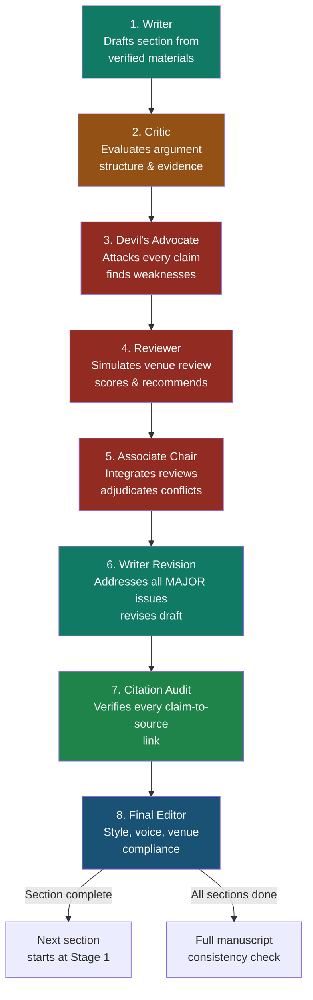

**Figure 9-2.** The adversarial editing loop. Each section of the paper (Introduction, Related Work, Methods, Results, Discussion, Abstract) goes through all eight stages independently. The loop is adversarial because each stage has a different objective: the Writer creates, the Critic evaluates, the Devil's Advocate attacks, the Reviewer judges, the Associate Chair adjudicates, the Writer revises, the Citation Verifier audits, and the Final Editor polishes. No single stage can dominate because the next stage has different priorities.

### Why each stage is necessary

| Stage | What It Does | What Happens If You Skip It |
|-------|-------------|---------------------------|
| **Writer** | Drafts from verified materials | No draft to review |
| **Critic** | Evaluates argument structure | Draft has structural flaws that go unnoticed |
| **Devil's Advocate** | Attacks every claim | Draft is defensible but not defended — reviewer attacks succeed |
| **Reviewer** | Simulates venue review | Paper is reviewed by the model that wrote it (conflict of interest) |
| **Associate Chair** | Adjudicates disagreements | Two reviewers disagree and the human must resolve without structured input |
| **Writer Revision** | Addresses MAJOR issues | Review feedback is collected but not acted upon |
| **Citation Audit** | Verifies claim-to-source links | Fabricated citations survive to submission |
| **Final Editor** | Style and venue compliance | Paper is rejected for formatting violations despite strong content |

### How to run the loop

1. **Start with the section whose inputs are most stable.** Typically: Methods (the design is fixed) → Results (the data is fixed) → Related Work (the literature matrix is fixed) → Introduction (depends on all others) → Discussion (depends on results) → Abstract (depends on everything).

2. **Run all eight stages for one section before moving to the next.** Do not draft all sections and then review them — the review of section 1 may reveal a problem that requires rewriting section 2.

3. **The human decides at each stage transition.** The Critic's output is a recommendation; the human decides whether to accept it before the draft goes to the Devil's Advocate. The Reviewer's output is a score; the human decides which issues to address before the Writer revises.

4. **Each stage uses the structured protocol from Chapter 3.** The output of each stage is a structured message (Goal, Reasoning Summary, Evidence, Confidence, Open Questions, Recommended Next Agent) that the next stage consumes.

---

## 9.9 Agent Communication in Practice

The structured protocol from Chapter 3 (Section 3.8) is the mechanism for passing messages between agents. Here is how it works in the adversarial loop.

### Example: Related Work Writer → CHI Reviewer #1

The Related Work Writer finishes its draft and sends a structured handoff to the Reviewer:

```yaml
agent_communication:
  from: "Related Work Writer"
  to: "CHI Reviewer #1"
  type: "handoff"

  goal: |
    Provide the related work draft for review. The draft establishes
    a gap in the literature on gaze+pinch selection in optical
    see-through AR.

  reasoning_summary: |
    The related work is structured in three thematic subsections:
    (1) gaze-based selection efficiency, (2) fatigue in prolonged
    gaze interaction, (3) the unaddressed interaction between
    efficiency and fatigue. The gap is evidenced by a corpus scan
    showing 0/18 papers address both within the same session.

  evidence:
    - claim: "Gaze+pinch studied in VR but not optical see-through AR"
      sources: [Pfeuffer 2021, Zhai 1999]
      confidence: high
    - claim: "Dwell has known fatigue problems in AR"
      sources: [Kollenberg 2019, Elling 2021]
      confidence: high
    - claim: "No controlled comparison exists for small targets"
      sources: [literature_matrix scan, 0 results]
      confidence: high

  confidence: high

  open_questions:
    - "Is the gap statement specific enough for a CHI audience?"
    - "Does the synthesis read as argumentative or as annotated bibliography?"

  recommended_next_agent: "CHI Reviewer #1"
  recommended_action: |
    Review the attached draft for: (1) whether the gap is clearly
    established, (2) whether the synthesis is thematic not
    bibliographic, (3) whether all citations are accurate.
    Score novelty, method quality, clarity, and importance 1-5.
```

The Reviewer consumes this structured message and produces its review. The key advantage over prose handoffs is that the Reviewer can extract the specific claims and evidence directly, without parsing narrative text.

### When to use structured vs. prose communication

| Situation | Format | Why |
|-----------|--------|-----|
| Stage transitions in the adversarial loop | Structured protocol | Machine-parseable, auditable, compact |
| Human reviewing agent output | Prose summary | Humans read prose better than YAML |
| Editor-in-Chief integrating reviews | Structured protocol | The EIC must compare structured fields across reviews |
| Emergency debugging of agent output | Either | Use whatever is fastest |

---

## 9.10 Orchestration via Hermes/OpenClaw

Hermes/OpenClaw is the workflow backend — it coordinates agents, manages file flow, and enforces stage gates. It should not generate paper text directly.

### The orchestration protocol

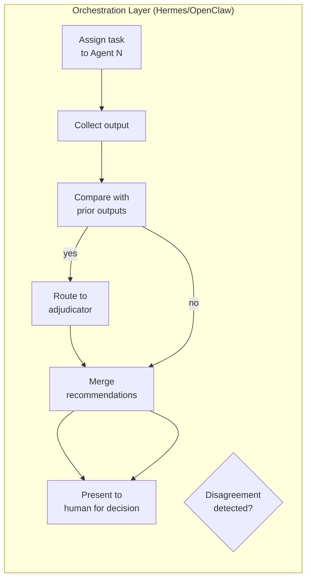

**Figure 9-3.** The orchestration protocol. Hermes/OpenClaw assigns tasks, collects outputs, compares them for disagreements, routes conflicts to an adjudicator (Editor-in-Chief or Associate Chair), merges recommendations, and presents the result to the human for a decision.

### What the orchestrator does

1. **Assign tasks** — sends the appropriate prompt and inputs to each agent at the right time (e.g., the Abstract Writer is not invoked until all other sections are complete)
2. **Collect outputs** — receives structured protocol messages from each agent and stores them in the session memory
3. **Compare disagreements** — when two agents disagree (e.g., Reviewer #1 says "accept" and Reviewer #2 says "reject"), the orchestrator flags the disagreement
4. **Route conflicts** — sends the disagreement to the designated adjudicator (Associate Chair for reviewer conflicts, Editor-in-Chief for inter-team conflicts)
5. **Produce merged recommendations** — after adjudication, produces a single set of action items for the human to approve or reject

### What the orchestrator does NOT do

- Generate paper text directly (that is the Writing Team's job)
- Make final decisions (the human decides)
- Skip stage gates (the orchestrator enforces the gates defined in Chapter 2)

### Example: Resolving a reviewer disagreement

**Scenario:** CHI Reviewer #1 scores the paper 4/5 on novelty ("the gaze+pinch comparison in optical see-through AR is novel"). CHI Reviewer #2 scores it 2/5 on novelty ("the comparison is incremental — Pfeuffer 2021 already compared gaze+pinch in VR").

**Orchestration steps:**

1. **Detect disagreement:** The orchestrator compares the two novelty scores. A difference of ≥2 points triggers conflict routing.

2. **Route to Associate Chair:** The orchestrator sends both reviews to the Associate Chair with the instruction: "Adjudicate the novelty disagreement. Reviewer 1 says 4, Reviewer 2 says 2."

3. **Associate Chair adjudicates:**
   ```
   Adjudication: The disagreement hinges on whether the VR-to-AR
   generalization is novel. Reviewer 2 is correct that Pfeuffer 2021
   compared gaze+pinch in VR. However, the current paper's contribution
   is specifically about optical see-through AR, which has different
   ergonomics (see Kollenberg 2019 on AR-specific fatigue). The novelty
   is in the domain transfer, not the technique comparison. Adjusted
   novelty score: 3/5 (moderate novelty — domain transfer with
   systematic evaluation).
   ```

4. **Merge recommendations:** The orchestrator produces a merged action list:
   - Strengthen the introduction's claim about what is specifically novel about the AR context (address Reviewer 2's concern)
   - Add a paragraph in the Discussion comparing VR and AR findings explicitly (address the generalization question)
   - The empirical rigor score (4/5 from Reviewer 1) stands unchallenged

5. **Present to human:** The human reviews the merged recommendations and decides which to implement.

---

## 9.11 Cost-Optimized Model Routing

Not every agent needs the most expensive model. Route agents to models based on task requirements:

| Agent Type | Recommended Model | Why | Estimated Cost |
|-----------|------------------|-----|---------------|
| **Editor-in-Chief** | Claude Opus / GPT-5.5 | Must integrate complex inputs, adjudicate conflicts, make nuanced judgments | High |
| **Writing Team** (all) | Claude Opus / Sonnet 5 | Long-form reasoning, synthesis, voice maintenance | High |
| **Review Team** (all) | Claude Opus / GPT-5.5 | Must simulate sophisticated review, detect subtle flaws | High |
| **Theory Team** | Claude Opus | Theoretical reasoning requires deep domain knowledge | High |
| **HCI Theorist** | Claude Opus | Framework proposal requires synthesis across theories | High |
| **Methods Writer** | Claude Sonnet 5 | Template-following with paradigm-specific constraints | Medium |
| **Statistician** | Claude Sonnet 5 | Structured reasoning about test appropriateness | Medium |
| **UX Researcher** | Claude Sonnet 5 | Protocol design is structured and bounded | Medium |
| **Trend Scout** | GPT-5.5 | Brainstorming and trend identification benefit from GPT's breadth | Medium |
| **Gap Hunter** | GPT-5.5 | Gap identification requires broad literature awareness | Medium |
| **Literature Miner** | Elicit + NotebookLM | Literature discovery is a tool task, not a reasoning task | Low |
| **Citation Verifier** | Claude Haiku 4.5 + tools | Verification is mechanical; use tools for DOI resolution | Low |
| **Style Editor** | Paperpal / Trinka | Style editing is a tool task, not a reasoning task | Low |
| **Qualitative Coding Agent** | Local model (Qwen3, DeepSeek-R1) | Confidential data must not leave the local environment | Free (local) |
| **Ethics Reviewer** | Claude Sonnet 5 | Structured checklist application | Medium |

### The confidential data rule

**Never paste confidential data into a cloud API.** This includes:
- Unpublished interview transcripts
- Patient/participant data
- Unpublished review comments
- Pre-publication manuscripts from collaborators

For any agent that processes confidential data (Qualitative Coding Agent, sometimes Results Writer), use a local model. The syllabus AI usage rules (Section 0.6) are explicit: "Do not paste confidential materials into the model."

### When to use NotebookLM

NotebookLM fills the "material conversation" role — it answers questions based only on uploaded sources. Use it for:
- Literature Q&A (upload 10–20 key papers, ask specific questions)
- Verifying claims against sources (the model can only answer from what you give it)
- Cross-referencing findings across papers

NotebookLM is not a reasoning partner — it is a source-grounded Q&A tool. Do not ask it to synthesize arguments or propose frameworks; it lacks the reasoning capability. Use it for fact-checking, not for thinking.

---

## 9.12 Failure Modes of Multi-Agent Systems

Multi-agent systems introduce their own failure modes. These are distinct from single-model failure modes and require different mitigations.

### 9.12.1 Agent Collusion

**What it is:** Agents agree too easily. The Reviewer rates the paper highly because it shares the Writer's framing. The Associate Chair splits the difference instead of adjudicating. The Devil's Advocate finds minor issues instead of attacking the core argument.

**Why it happens:** All agents are instantiated from the same model family with the same training priors. They share assumptions about what a "good paper" looks like. When the Writer produces text that matches these assumptions, the Reviewer recognizes it as good — not because it is, but because it is familiar.

**Mitigation:**
- Assign different model families to Writer and Reviewer (e.g., Claude Writer, GPT Reviewer)
- Instruct reviewers explicitly: "You are NOT the author. Your job is to find weaknesses, not to confirm strengths."
- Require the Devil's Advocate to produce at least 3 attacks on the core argument — not peripheral issues
- If all agents agree, suspect collusion and add a reviewer with a different perspective

### 9.12.2 Orchestration Overhead

**What it is:** More agents ≠ always better. Each agent adds latency, cost, and complexity. A 21-agent tree that takes 4 hours to produce one section is not better than a 6-agent tree that takes 1 hour.

**Why it happens:** The temptation to add agents for every conceivable role. The Philosophy Reviewer is useful for theoretical papers but wasted on a system paper. The Statistician is essential for quantitative studies but irrelevant for RtD.

**Mitigation:**
- Start with a minimal tree: Editor-in-Chief + 1 Writer + 1 Reviewer + 1 Citation Verifier (4 agents)
- Add agents only when a specific failure mode is observed (e.g., add a Devil's Advocate only when reviewers consistently say "the argument is not defended")
- Deactivate agents whose role is not relevant to the current paradigm
- Measure cost per section and set a budget

### 9.12.3 Context Fragmentation

**What it is:** Agents lose the thread. The Discussion Writer does not know what the Related Work Writer established. The Abstract Writer promises something the Introduction does not. Each agent operates in its own context window and does not see the full picture.

**Why it happens:** Each agent is instantiated with only the inputs it needs for its specific task. This is by design (to keep context windows manageable) but it means no agent sees the full paper.

**Mitigation:**
- Use the structured protocol (Chapter 3) for all inter-agent communication — the protocol's `reasoning_summary` and `evidence` fields carry the essential context
- Run a full-manuscript consistency check after all sections are drafted (the Editor-in-Chief loads all sections and checks for contradictions)
- The human reviews the full manuscript, not just individual sections
- Use the session handoff protocol (Chapter 3, Section 3.4) to maintain continuity across sessions

### 9.12.4 The Consensus Trap

**What it is:** The orchestrator treats agreement as correctness. If Reviewer #1 and Reviewer #2 both give a 4/5, the orchestrator concludes the paper is good. But both reviewers may share the same blind spot.

**Mitigation:**
- Track inter-reviewer agreement rates. If agreement is >90%, the reviewers are not independent enough.
- Add a third reviewer when the first two agree (expensive but necessary for borderline papers)
- The human makes the final call — the orchestrator recommends, the human decides

### 9.12.5 The Infinite Revision Loop

**What it is:** The Writer revises, the Reviewer finds new issues, the Writer revises again, the Reviewer finds more issues. The loop never converges.

**Mitigation:**
- Limit the adversarial loop to 2 iterations per section (3 for the Introduction and Discussion, which are the most important)
- After the second iteration, the human reviews and decides whether further revision is needed
- Some issues are not fixable within the paper's scope — acknowledge them in the limitations and move on

---

## 9.13 Expected Outputs

After reading this chapter and configuring your agent tree, you should be able to produce:

1. **A configured agent tree** with 12–15 agents in your orchestration tool of choice (Hermes, OpenClaw, or equivalent), each with the prompt template, inputs, outputs, and failure modes defined in this chapter
2. **A completed adversarial loop** for one section of your paper — with all eight stages (Writer → Critic → Devil's Advocate → Reviewer → Associate Chair → Writer Revision → Citation Audit → Final Editor) documented in your session memory
3. **A cost-optimized model routing table** that maps each agent to a specific model based on task requirements and data confidentiality
4. **A disagreement resolution protocol** that specifies how conflicts between agents are detected, routed, adjudicated, and merged

---

## Best Practices

1. **Start minimal, expand on failure.** Begin with 4–6 agents. Add agents only when a specific failure mode is observed. A 21-agent tree that runs perfectly is better than a 21-agent tree that was configured on day one and never debugged.

2. **Use the structured protocol for all inter-agent communication.** Prose handoffs lose precision and waste tokens. The YAML protocol from Chapter 3 is compact, auditable, and machine-parseable.

3. **Enforce the adversarial structure.** The Devil's Advocate must attack. The Reviewer must score honestly. If all agents agree, you have collusion, not consensus.

4. **Run the loop per section, not per paper.** Each section goes through all eight stages before the next section starts. This prevents cascading errors (a problem in the Methods section that affects the Results section is caught early).

5. **The human decides at every stage transition.** Agents propose; the human disposes. This is not a suggestion — it is the core principle of the entire system.

6. **Route confidential data to local models only.** Never paste unpublished interview data, participant information, or collaborator manuscripts into a cloud API.

7. **Track cost per section.** Multi-agent systems are expensive. Know how much each section costs to produce and set a budget. If the Discussion costs twice as much as the Introduction, find out why.

---

## Anti-patterns

1. **The single-prompt paper.** "Write a CHI paper about X" sent to one agent. This bypasses the entire adversarial loop and produces a paper-shaped object, not a paper.

2. **The passive orchestrator.** Hermes/OpenClaw configured to relay messages between agents without adjudicating conflicts. This is a postal service, not an editor-in-chief.

3. **The premature polish.** Running the Style Editor on a draft whose argument is not yet sound. The prose will change when the argument changes.

4. **The infinite agent tree.** Adding agents for every conceivable role without deactivating irrelevant ones. The Philosophy Reviewer should not review a system paper.

5. **The consensus assumption.** Treating agreement between agents as evidence of quality. If Reviewer #1 and Reviewer #2 both give 5/5, suspect collusion.

6. **The context dump.** Loading the entire paper into every agent's context window. Each agent should receive only the inputs it needs for its specific task.

7. **The unattended loop.** Running the adversarial loop without human oversight at stage transitions. The loop will converge on the easiest solution, not the best one.

---

## Checklist

Before declaring your multi-agent writing system operational, verify:

- [ ] Each agent has a defined role, inputs, outputs, prompt template, and failure modes (as specified in this chapter)
- [ ] The adversarial editing loop has all eight stages configured and tested on one section
- [ ] The structured protocol from Chapter 3 is used for all inter-agent communication
- [ ] The orchestrator compares agent outputs for disagreements and routes conflicts to an adjudicator
- [ ] Confidential data is routed to local models only
- [ ] Model routing is cost-optimized (not every agent uses the most expensive model)
- [ ] Stage gates are enforced — no section proceeds to the next stage without human approval
- [ ] The loop is limited to 2–3 iterations per section to prevent infinite revision
- [ ] A full-manuscript consistency check is run after all sections are drafted
- [ ] The human makes the final decision at every stage transition
- [ ] Cost per section is tracked and within budget
- [ ] Agent collusion is monitored (inter-reviewer agreement rates tracked)

---

## References

- **Chapter 2** — Multi-agent architecture overview, canonical workflow, and the principle that structure beats model power. This chapter provides the full agent definitions that Chapter 2 summarizes.
- **Chapter 3** — Context engineering and the agent communication protocol (Section 3.8). Every inter-agent message in this chapter uses the structured protocol defined there.
- **Chapter 5** — Ideation and gap analysis: the front end of the canonical workflow. The Gap Hunter and Trend Scout agents implement the techniques described there.
- **Chapter 8** — Sourced writing and the bucket method. The Writing Team agents apply these techniques.
- **Chapter 10** — Reviewer simulation: the Review Team agents implement the Mode E reviewing described there.
- **Chapter 11** — Final submission: the Citation Verifier implements the citation integrity gate described there.
- **Chapter 12** — Automation and scaling: Hermes/OpenClaw configuration, cron jobs, and cost-optimized model routing in production.
- **Appendix B** — Full agent library: prompt templates and per-role definitions for all 21 agents.
- **Appendix C** — Per-stage gate checklists derived from the syllabus.
- **Appendix D** — Tool specifications: strength, weakness, cost, and best-use for every product mentioned in this chapter.
- Anthropic. "Claude Prompting Best Practices." https://platform.claude.com/docs/en/build-with-claude/prompt-engineering/claude-prompting-best-practices
- Wobbrock, J.O. & Kientz, J.A. "Research Contributions in Human-Computer Interaction." *Interactions*, 2016. (The contribution type vocabulary used throughout this chapter.)


---

<a id="chapter-10"></a>

# Chapter 10: Reviewer Simulation

> "Real review is zero-sum with no revision loop. Simulation is the rehearsal that fixes what rehearsal can fix."

---

## Objectives

After reading this chapter, the reader will be able to:

1. Run a full Mode E reviewer simulation on a complete paper draft or individual section
2. Interpret scores across the four CHI-style dimensions (novelty, method quality, clarity, significance)
3. Apply So What ×3 and No Surprises as internal quality metrics on any section without running a full simulation
4. Execute the iterative grading loop for introductions and conclusions
5. Deploy the adversarial self-review to surface overclaims before any reviewer sees them
6. Understand what the Associate Chair agent does and what its acceptance prediction does and does not mean
7. Identify when simulation ends and human judgment begins — what simulation cannot predict
8. Run the complete simulation-revision loop until no new MAJOR issues emerge

---

## Required Background

- **Chapter 1** — The three reviewer yardsticks (Interestingness, So What ×3, No Surprises); the prediction boundary; contribution types
- **Chapter 8** — The draft-critique-rewrite loop (Section 8.9); bucket method; the `[UNSOURCED]` safety valve
- **Chapter 9** — The Review Team agents (Section 9.7): CHI Reviewer #1, CHI Reviewer #2, Associate Chair, Citation Verifier, Style Editor; the adversarial editing loop

If your sections have not yet passed the Chapter 8 quality gates (zero `[UNSOURCED]` markers, voice rewrite checklist complete, discipline-specific style gate passed), do not run reviewer simulation. Simulation on a structurally flawed draft produces feedback on surface problems that will be moot once the deeper problems are fixed. Fix the foundation before rehearsing the performance.

---

## 10.1 Why Simulate Reviewers

### The structural asymmetry

A real review at CHI, UIST, ISMAR, or ISEA has two properties that no other quality check in the research process shares:

1. **No revision loop.** The peer review process gives you at best one round of rebuttal. You cannot revise the paper and send it back to the same reviewers for a second round of evaluation before the accept/reject decision. This is fundamentally different from advisor feedback, lab meetings, or conference workshops — all of which give you a revision loop.

2. **Reviewer assignment is stochastic.** You do not choose your reviewers. The Associate Chair assigns based on keyword matching, availability, and conflict-of-interest constraints. A paper about speculative design assigned to an empirical researcher who does not value RtD contributions will be rejected regardless of quality. You cannot control for this.

Reviewer simulation addresses the first problem. It gives you multiple revision loops before the real review happens. You draft, simulate, revise, resimulate, and repeat until the paper is as strong as you can make it.

Simulation does not address the second problem. An assigned reviewer's taste, expertise, and reading of your paper are outside your control. No amount of simulation can guarantee that Reviewer 2 will understand your theoretical framework or value your contribution type. This is an irreducible uncertainty. We return to the limits of prediction in Section 10.8.

### What simulation buys you

Without simulation, your first reader is the actual reviewer. Every weakness — the gap that is not established, the method-claim misalignment, the overclaim in the discussion — is a weakness that an actual reviewer will use to argue for rejection. With simulation, these weaknesses are found and fixed in private. The reviewer sees only what survives the rehearsal.

The cost of not simulating: a paper with three preventable MAJOR issues (each fixable in a day of work) is rejected because the author did not find them in advance. The revision loop that could have caught those issues does not exist in the real review process.

### When simulation is not useful

Simulation is not useful when the draft is structurally incomplete. Running a Mode E review on a draft where the discussion section does not yet exist will produce feedback that is immediately obsolete when the discussion is written. Each section must be through Phase 4 of the Chapter 8 writing cycle (sourced draft → `[UNSOURCED]` resolution → voice rewrite → style gate) before it enters reviewer simulation.

Simulation is also not useful when you use it to reassure yourself rather than to find problems. If you run simulation, discard every MAJOR issue as "the AI doesn't understand my work," and submit anyway, simulation was wasted. The tool finds problems. You fix them. The alternative is that real reviewers find the same problems and you do not get a rebuttal.

---

## 10.2 Mode E Reviewing

Mode E reviewing is the full simulation protocol. It instructs the model to read as a CHI, ISMAR, or ISEA reviewer; run So What ×3 and No Surprises; check contribution type clarity, gap establishment, method-claim alignment, and validity acknowledgment; deliver 3 MAJOR and 3 MINOR issues with specific fixes; and score on the four standard dimensions.

### The Mode E prompt template

```text
You are a reviewer for [CHI / ISMAR / ISEA]. You have been assigned
the following paper. Evaluate it as you would in a real review.

<input>
  Paper draft: [full text of the draft under review]
  Target venue: [CHI / ISMAR / ISEA]
  Contribution claim: [one-sentence claim from the paper]
</input>

<procedure>
  1. READ as a target-venue reviewer. Adopt the standards,
     expectations, and critical posture of [venue] reviewers.
     This means: precise about methods, demanding about evidence,
     skeptical of claims that exceed data.

  2. RUN So What ×3 on the contribution claim.
     Ask "so what?" of the claim three times in succession.
     Each answer must reach a larger circle of significance
     (result → design implication → field understanding).
     Record all three levels. If the claim fails at any level,
     note which level and why.

  3. RUN No Surprises.
     Compare the abstract against the body. Does the abstract
     promise what the body delivers? Are there claims in the
     abstract that are not addressed in the paper? Are there
     major elements of the paper (methods, findings) that the
     abstract does not mention? List every mismatch.

  4. CHECK the following four structural properties:

     a. CONTRIBUTION TYPE CLARITY
        What is the primary contribution type (from Chapter 1:
        empirical, artifact, method, theory, dataset, survey,
        opinion for HCI; project description, theory & criticism,
        methods & techniques, media archaeology, speculative
        design practice for Digital Art)?
        Is it clear from the paper what type this is?
        Does the paper deliver evidence appropriate to that type?

     b. GAP ESTABLISHMENT
        Does the related work section build a clear gap — a
        specific absence in the literature that this paper fills?
        Or is it an annotated bibliography (paper-by-paper
        summary without synthesis)?
        The gap must be specific enough that the reader can
        identify what would be different about the literature
        if this paper did not exist.

     c. METHOD-CLAIM ALIGNMENT
        Does the method section actually test what the claim
        asserts? If the claim says "X improves long-term
        engagement" but the method is a 30-minute lab study,
        there is a misalignment. List every instance where
        the method does not match the claim's scope or certainty.

     d. VALIDITY ACKNOWLEDGMENT
        Does the discussion section acknowledge specific
        validity threats to THIS study? Not generic limitations
        ("our sample was limited to WEIRD participants") but
        specific threats ("our within-subjects design means
        the observed fatigue effect may include an ordering
        confound"). For each acknowledged limitation, does
        the paper state what the threat means for interpreting
        the findings?

  5. DELIVER 3 MAJOR and 3 MINOR issues.
     MAJOR = would likely trigger rejection if not addressed.
            Each must include a specific fix.
     MINOR = quality issues that do not affect the accept/reject
             decision but should be fixed.

  6. SCORE each dimension 1–5:
     - Novelty: Does the paper advance what the field knew?
       (1 = incremental, 3 = meaningful addition, 5 = field-shifting)
     - Method Quality: Are the methods sound, appropriate, and
       well-executed? (1 = fundamentally flawed, 3 = adequate,
       5 = exemplary)
     - Clarity: Can the argument be followed without re-reading?
       (1 = incoherent, 3 = readable with effort, 5 = effortless)
     - Significance: If true, does the contribution matter to
       this venue's audience? (1 = trivial, 3 = useful, 5 = important)
</procedure>

<constraints>
  - You are NOT the author. Do not defend the paper.
  - Be specific: "the method is weak" is not useful; "the
    between-subjects design for a known carryover effect
    introduces an unmeasured confound" is useful.
  - Do not suggest the author cite your own work.
  - Base scores on the actual text, not on what you imagine
    the paper could have said.
  - If a section is missing or incomplete, flag it and skip
    the corresponding checks rather than inferring content.
</constraints>

<output_format>
  ## Summary
  [2-3 sentences: what the paper claims and how]

  ## So What ×3
  - Claim restated: [contribution claim]
  - So What (Level 1)? [answer — result-level significance]
  - So What (Level 2)? [answer — design/field implication]
  - So What (Level 3)? [answer — broad field understanding]
  - Assessment: [passes all 3 / fails at level 2 / fails at level 1]

  ## No Surprises
  - Abstract promises not delivered: [list]
  - Body delivers not promised: [list]
  - Assessment: [clean / minor mismatches / major mismatches]

  ## Structural Checks
  - Contribution type: [type identified] — [clear / ambiguous / misidentified]
  - Gap establishment: [strong / adequate / weak / absent]
  - Method-claim alignment: [aligned / partially aligned / misaligned]
  - Validity acknowledgment: [honest+specific / honest+generic / missing or evasive]

  ## MAJOR Issues
  1. [Specific issue] → [Specific fix]
  2. [Specific issue] → [Specific fix]
  3. [Specific issue] → [Specific fix]

  ## MINOR Issues
  1. [Specific issue]
  2. [Specific issue]
  3. [Specific issue]

  ## Scores
  - Novelty: [X/5] — [justification]
  - Method Quality: [X/5] — [justification]
  - Clarity: [X/5] — [justification]
  - Significance: [X/5] — [justification]
  - Overall mean: [X/5]

  ## Recommendation
  [accept / weak accept / borderline / weak reject / reject] — [justification]
</output_format>
```

### What the Mode E prompt checks and why

Each check in the procedure targets a specific failure mode observed in rejected papers:

- **So What ×3** catches contribution thinness — the most common reason papers are rejected or marginal at CHI (Session 1 of the syllabus; Section 1.4 of Chapter 1). A claim that fails at level 2 is a workshop paper, not a full paper.
- **No Surprises** catches the abstract-body disconnect. Reviewers who feel misled by the abstract review more harshly regardless of the body's quality.
- **Contribution type clarity** catches the mismatch between what the paper argues and what a reviewer from the venue expects. An artifact paper evaluated on empirical rigor or an empirical paper evaluated on system novelty will fail even if well-executed.
- **Gap establishment** catches the "annotated bibliography" failure — the most common weakness in related work, criticized in every CHI reviewing workshop.
- **Method-claim alignment** catches overclaiming: the paper asserts more than its data supports. This is the single most frequent MAJOR issue across CHI, ISMAR, and ISEA reviews.
- **Validity acknowledgment** catches the absence of limitations or the presence of generic limitations that signal the author has not thought critically about what could be wrong.

### Venue-specific considerations for Mode E

When setting `[CHI / ISMAR / ISEA]`, the prompt changes its standards:

- **CHI** demands method-claim alignment above all else. Reviewers focus on whether the study design actually tests the contribution. High novelty cannot compensate for a design that does not support the claim.
- **ISMAR** adds an evaluation depth expectation. System contributions must include a user evaluation, not just a technical demonstration. Artifact papers without evaluation score 2/5 on Method Quality.
- **ISEA** and **Leonardo** (Digital Art track) demand the epistemic contribution — what does the work help us understand that could not be understood without it? Reviewers de-emphasize empirical rigor and emphasize the theoretical argument and the relationship between the artifact and the knowledge it produces. For Digital Art venues, adjust the Mode E prompt: replace "method quality" with "epistemic contribution clarity" and add a check for theoretical anchor usage (does the framework actually do work, or is it decorative?).

---

## 10.3 Internal Quality Metrics

So What ×3 and No Surprises are not just conceptual tests from Chapter 1. They are quality metrics you can compute on any section without running a full Mode E review. Use them as gate checks before simulation. If a section fails these metrics, there is no reason to run a full simulation — the section is not ready.

### So What ×3 as a section-level test

So What ×3 can be applied to any paragraph or section, not just the contribution claim. The test reveals whether the section's claims reach the significance level required.

**How to run it on a section:**

Take the strongest claim in the section and ask "so what?" three times, each time requiring an answer that reaches a larger audience:

1. **Level 1 (Result):** "This finding means [specific outcome]." → speaks to the study's participants or immediate context
2. **Level 2 (Implication):** "This means [designers/researchers] should [specific action or revised understanding]." → speaks to a broader community
3. **Level 3 (Field):** "This changes how the field understands [fundamental concept]." → speaks to the entire venue's audience

If the section cannot produce all three levels, the claims are too local. The section reports what happened without explaining why it matters.

**Where the levels map in the paper:**

| Section | So What level |
|---------|--------------|
| Introduction (gap paragraph) | Level 2–3 — why the gap matters to the field |
| Related Work (gap statement) | Level 2 — why the gap matters to researchers |
| Methods | No So What — methods are how, not why |
| Results | Level 1 — what the data shows |
  | Discussion (implications) | Level 2–3 — what the data means for the field |
| Abstract (conclusion sentence) | Level 3 — the broadest significance claim |

### No Surprises as a coherence test

No Surprises tests whether the paper's abstract and body are aligned. A reviewer who reads the abstract should be able to predict the paper; a reviewer who finishes the paper should never be surprised.

**How to run it:**

Give the model the full paper including abstract. Ask:

```text
Run the No Surprises coherence test on the following paper:

1. For each sentence in the abstract, identify what a reader
   would expect to find in the body based on that sentence.
2. For each element in the body, identify whether it was
   foreshadowed in the abstract or comes as a surprise.
3. List all mismatches:
   a. Abstract promises that the body does not deliver
   b. Body delivers what the abstract does not promise
4. For each mismatch, specify the minimum revision needed
   to restore alignment. Do not rewrite the paper — provide
   targeted edits only.
```

No Surprises violations fall into two categories:

- **Overpromising (abstract > body):** The abstract says "we demonstrate X" but the paper only shows "X under narrow conditions Y and Z." Fix: either narrow the abstract or broaden the study.
- **Underannouncing (body > abstract):** The paper includes a major finding or method that the abstract does not mention. Fix: add a sentence to the abstract. Underannouncing is less dangerous than overpromising but wastes an opportunity to signal the contribution.

---

## 10.4 Iterative Grading for Introductions and Conclusions

Introductions and conclusions (including the Discussion section's conclusion) benefit from a tighter grading loop than Mode E provides. These sections are short, high-signal, and easy to revise. A 1–3 iteration loop is usually sufficient.

**The iterative grading prompt:**

```text
Rate this [introduction / conclusion] on a 1–10 scale for each
of the following dimensions:

1. Clarity (1–10): Can a [target venue] reader understand the
   contribution claim, its motivation, and its scope within
   60 seconds of reading?

2. Academic Tone (1–10): Does the prose match the register of
   [venue]? CHI: direct, precise, active voice. Leonardo:
   reflective, first-person acceptable where it serves epistemic
   argument. ISEA: theoretically engaged, comfortable with
   abstraction.

3. Compelling Synthesis (1–10): Does the section do more than
   summarize the paper? Does it make a case for why the reader
   should care — why this contribution, at this moment, to
   this audience?

For any dimension scored below 8:
- Quote the specific sentence(s) that fail
- Explain what is wrong (not just "unclear" but "the
  contribution claim appears in sentence 4 instead of sentence 2,
  forcing the reader to hold context for three sentences before
  understanding the paper's thesis")
- Provide a specific, concrete improvement

Return: scores per dimension, specific failures, specific fixes.
```

**How to loop:**

1. Run the grading prompt on the introduction.
2. For any dimension below 8, implement the suggested fixes (or your own revision).
3. Re-run the grading prompt on the revised text.
4. Repeat until all dimensions score at least 7 and no dimension scores below 7 twice in a row.

**Stopping criteria:** If two consecutive iterations produce the same scores with no new actionable feedback, the section has converged. Further revisions are style preferences, not improvements. Stop and move on.

### Example: Before and after iterative grading

**Before (Introduction, Iteration 1):**

> Score: Clarity 5/10, Academic Tone 6/10, Compelling Synthesis 4/10
>
> Failure: "We explore the use of mixed reality for cultural heritage education." — "explore" is a report verb, not a claim verb. No contribution claim is stated in the first three sentences. A reader cannot determine what the paper demonstrates.
>
> Fix: Start with the gap (what is not known about MR + cultural heritage), then state the contribution claim using a演示 verb ("we demonstrate," "we show").

**After (Introduction, Iteration 3):**

> Score: Clarity 8/10, Academic Tone 8/10, Compelling Synthesis 8/10
>
> Remaining issue: "Cultural heritage education is an important application area" is generic. Suggest grounding it in a specific gap in the cultural heritage literature.

**Introduction contribution claim — before and after:**

| | Before | After |
|---|---|---|
| Claim | "We explore the use of mixed reality for cultural heritage education, presenting a system called HeritageLens that was evaluated with 30 museum visitors." | "We demonstrate that spatial anchoring of narrative content to physical artifacts improves visitors' recall of relational knowledge (how artifacts connect to each other) more than to isolated facts, suggesting a design principle for MR cultural heritage systems." |
| Clarity | 5 | 8 |
| Tone | 6 | 8 |
| Synthesis | 4 | 8 |

---

## 10.5 The Adversarial Self-Review

The adversarial self-review is the hardest internal check. It assumes the paper's claims are wrong or unsupported until proven otherwise. Run this after all MAJOR issues from Mode E have been addressed. Its purpose is to find the weaknesses that a hostile reviewer — one who wants to reject — would exploit.

**The adversarial self-review prompt:**

```text
Read the following paper draft. You are a hostile reviewer whose
goal is to reject the paper. Your job is to find every weakness
that could justify rejection.

Answer these questions — for each, quote the specific sentence(s)
in the paper and explain the problem:

1. What conclusions in the paper exceed the data's support?
   For each overclaim: what does the paper actually show vs.
   what does it claim to show? What evidence would be needed
   to support the claim but is missing?

2. What evidence could rebut the main argument? Identify 3
   specific findings, studies, or arguments — from the
   literature or from first principles — that contradict or
   weaken the paper's central claim.

3. Generate 3 evidence-based objections a hostile reviewer
   would raise. Each must be grounded in:
   - A specific limitation of the paper's method or data
   - A logical jump between evidence and conclusion
   - An alternative explanation the paper did not rule out

4. Identify logical jumps: places where the paper moves from
   evidence to claim without showing the intermediate steps.
   Quote the gap and provide the missing reasoning.

5. The "so what would it take" test: For each of the paper's
   key claims, state what additional evidence would be needed
   to make the claim robust. If the paper already has that
   evidence, note it. If not, note the cost of obtaining it
   (retrospective analysis, additional study, re-framing).

Do not be polite. Be specific. The goal is to find every
weakness that a real hostile reviewer could use.
```

### Using adversarial output

The adversarial self-review produces issues that are different in kind from Mode E:

- **Mode E** asks: "Does this paper meet the venue's standards?"
- **Adversarial review** asks: "How would a reviewer who wants to reject this paper build their case?"

The adversarial output will often identify that the paper's claims are *technically supported* but *defense is missing* — the paper states a claim and the data supports it, but the paper does not explain *why the data supports the claim* or *what alternative explanations were ruled out*. This is the logical jump: the gap between "the data shows X" and "therefore Y."

**Example adversarial finding:**

> Claim (Discussion): "The observed fatigue effect is attributable to gaze-based interaction specifically, not to general screen time."
>
> Adversarial objection: "The study has no control condition with an alternative input modality at the same visual engagement level. The fatigue could be caused by sustained visual attention to a near-eye display regardless of input modality. The paper needs either a control condition (gaze-only, no targets) or a citation to existing work separating input modality from display-type fatigue effects in AR."

This is not a method flaw — the study cannot add a new condition retroactively. The fix is either: (a) reframe the claim as "fatigue during gaze-based interaction in AR" rather than "fatigue attributable to gaze specifically," or (b) acknowledge the confound in the limitations and cite the relevant literature on near-eye display fatigue.

---

## 10.6 Predicting Acceptance: The Associate Chair Agent

The Associate Chair (AC) agent (defined in Chapter 9, Section 9.7.3) integrates the outputs of multiple reviewers. Its role in simulation is to do what a real AC does at a Program Committee meeting: weigh conflicting reviews, identify the issues that matter most, and render a judgment.

### What the AC does

1. **Receive two or more reviews** (Mode E output, CHI Reviewer #1, CHI Reviewer #2)
2. **Identify agreements and disagreements** across reviews
3. **Adjudicate disagreements** — when Reviewer 1 says "accept" and Reviewer 2 says "reject," the AC evaluates the substance of each argument
4. **Estimate acceptance probability** based on the paper's alignment with CHI acceptance factors
5. **Recommend action** (accept, reject, discuss) and prioritize revisions

### The AC prompt template

```text
You are the Associate Chair at CHI. You have received the following
reviews for a paper. Integrate them into a meta-review and predict
acceptance.

<input>
  Reviewer 1 review: [full review]
  Reviewer 2 review: [full review]
  Paper draft: [full draft]
  Contribution claim: [one sentence]
</input>

<analysis>
1. Identify agreements: Which issues were raised by both reviewers?
   These are the most reliable signal — when independent readers
   notice the same problem, it is real.

2. Identify disagreements: Where do reviewers differ?
   For each disagreement, evaluate whether it reflects:
   - A difference in expertise (one reviewer understands the
     paradigm better than the other)
   - A difference in threshold (what one calls MAJOR, another
     calls MINOR)
   - A substantive disagreement about the contribution's value

3. Adjudicate each disagreement: Which position is better
   supported by the text of the paper? Why?

4. Estimate acceptance probability (0-100%) based on:
   - Whether the contribution claim is clear and well-supported
   - Whether the gap is established
   - Whether the method fits the claim
   - Whether limitations are honestly acknowledged
   - Whether the paper's writing meets the venue's clarity bar

5. What factors most affect acceptance? Rank the following by
   their contribution to the accept/reject decision:
   - Clear claim
   - Strong gap
   - Method-claim fit
   - Honest limitations
   - Writing clarity
   - Novelty of the specific finding
</analysis>

<output>
  Meta-review: [integrated assessment]
  Adjudication: [which reviewer position prevails on each disagreement]
  Acceptance probability: [X%] — [justification]
  Recommendation: [accept / reject / discuss at PC meeting]
  Prioritized revisions: [ranked list of issues that would most
                        change the acceptance outcome]
</output>
```

### What correlates with CHI acceptance

From analysis of CHI review patterns (documented in the *HCI Research Companion* referenced in Chapter 1), the factors that most correlate with acceptance are:

1. **Clear claim** — The reviewer can state in one sentence what the paper contributes. If the reviewer has to infer the contribution, the paper is already in trouble.
2. **Strong gap** — The reviewer understands what the field did not know before this paper. A specific gap, not a general "more research is needed."
3. **Method-claim fit** — The reviewer believes the method actually tests what the claim asserts. Misalignment is the most cited reason for rejection.
4. **Honest limitations** — The reviewer trusts the author made an honest assessment of what the data cannot show. Obfuscated or absent limitations signal overclaiming.

Novelty and significance matter, but they matter *conditional on* these four factors. A highly novel finding stated unclearly is rejected. A moderate finding stated clearly with an honest limitations section is accepted. The AC agent weighs these factors accordingly.

### What "acceptance probability" means (and does not mean)

An AC agent's acceptance probability estimate is calibrated on patterns in the training data — what rejected and accepted papers look like in terms of review language, scores, and issues. It does not know the current year's submission volume, the specific reviewer pool, or the PC meeting dynamics.

Treat the probability as a *quality signal*, not a prediction:

- **>75%:** The paper is strong by structural standards. Remaining risk is from reviewer assignment and taste — factors outside your control.
- **50–75%:** The paper has clear quality but at least one unresolved MAJOR issue that a reviewer could build a rejection case around. Address the MAJOR, then resimulate.
- **<50%:** The paper has structural problems that simulation can identify. Address them, resimulate, and re-estimate. Do not submit a paper the AC rates below 50%.

The probability estimate is most useful *longitudinally*: does it increase after revision? If you address all MAJOR issues and the probability moves from 45% to 68%, the revision improved the paper. If it moves from 45% to 48%, you addressed surface issues without fixing the structural problems. Run the adversarial self-review and find what you missed.

---

## 10.7 External Tools for Pre-Submission Critique

Two external tools complement reviewer simulation:

### thesify — automated pre-submission critique

thesify (thesy.co) is an AI-powered review platform designed for academic papers. It provides structured feedback similar to a Mode E review but with a different algorithmic basis — the tool was trained on a large corpus of psychology and neuroscience papers, and its feedback is calibrated to empirical social science.

**What thesify does well:**
- Identifies argument structure problems (claim-evidence misalignment, missing transitions)
- Flags statistical reporting gaps (missing effect sizes, incomplete test statistics)
- Evaluates introduction and discussion sections for So What clarity
- Provides an estimated "journal readiness" score

**What thesify does not do:**
- It does not understand HCI-specific methods (RtD, practice-based, design fiction) or ISEA requirements
- Its empirical social science calibration means it penalizes qualitative and RtD papers for lacking control groups
- It does not have access to your specific literature matrix, so it cannot verify whether your gap argument is well-evidenced
- It cannot simulate the specific review criteria of CHI, ISMAR, or ISEA

**When to use thesify:** After Mode E simulation and adversarial review have been addressed. thesify catches structural issues like statistical reporting completeness, argument flow, and So What clarity that a general-purpose Mode E prompt might miss. Do not run thesify first — its empirical bias will flag valid RtD papers as "missing experimental design" and recommend inappropriate rewrites.

**Prompt equivalent:** You can replicate thesify's core checks with a Mode E prompt augmented to include statistical reporting completeness (CONSORT for experiments, COREQ for qualitative). Use thesify as a second opinion, not a substitute.

### SciScore — methodology compliance

SciScore (sciscore.com) evaluates the methodological rigor of a paper against established reporting guidelines. It checks whether the methods section includes all required elements: sample size justification, randomization details, blinding procedures, and complete statistical reporting.

**What SciScore does well:**
- Verifies compliance with reporting checklists (CONSORT, STROBE, ARRIVE, etc.)
- Flags missing methodological details that reviewers will ask about in rebuttal
- Provides a quantitative compliance score useful for power analysis and sample size justification

**What SciScore does not do:**
- It is designed for biomedical and life sciences; its checklists do not map cleanly to HCI or Digital Art methods
- It cannot evaluate RtD, practice-based, or speculative design contributions
- It does not evaluate theoretical arguments or epistemic contributions

**When to use SciScore:** For empirical HCI papers (CHI, UIST, ISMAR) with experimental or quasi-experimental designs. Run SciScore in the final revision stage, after all MAJOR issues are addressed, to catch reporting completeness gaps before submission. Do not use for qualitative or Digital Art papers — the checklists are inapplicable.

---

## 10.8 What Reviewer Simulation Cannot Predict

Reviewer simulation has a boundary. Four categories of review outcomes are outside its predictive capacity:

### 1. Taste-based rejections

A reviewer may read your paper, find no structural flaw, understand the contribution — and simply not find it interesting. This is a legitimate review judgment. The CHI review form asks reviewers to rate "How interesting is this paper to the CHI community?" — a subjective criterion that no structuralcheck addresses. Simulation can verify that your paper is clear, well-evidenced, and honestly stated. It cannot verify that your paper is *interesting*.

**Mitigation:** Run So What ×3 on the contribution claim specifically for Level 3. If Level 3 reaches a question the venue's community cares about, the paper is interesting to that community. If Level 3 is generic ("more research is needed on this topic"), the paper is not interesting regardless of its quality.

### 2. Reviewer misreading

Reviewers are human. They skim. They miss sentences. They read your abstract at 11 PM after reviewing six other papers. A sentence that is clear to you and clear in simulation may confuse a real reviewer who reads it under different conditions. Simulation assumes careful reading.

**Mitigation:** Write for the skimmer. Put the contribution claim in the first three sentences of the introduction. Lead every paragraph with a topic sentence that states the paragraph's claim. Use explicit signposting ("this finding means X" rather than hoping the reader infers X). The Adversarial Self-Review (Section 10.5) partially addresses this by finding the most vulnerable sentences — the ones most likely to be misread.

### 3. Political dynamics

The real review process includes factors unrelated to the paper:

- A reviewer may be working on a similar unpublished paper and delay or reject yours
- Two reviewers may know each other and coordinate their reviews
- A PC member may intervene in discussion to advocate for or against a paper based on their own research agenda
- A paper that contradicts a senior figure's work may receive harsher scrutiny

None of this is visible to simulation. No prompt can predict whether Reviewer 2 is your competitor's advisor.

**Mitimation:** None. This is an irreducible risk. The only mitigation is submission — at some point, the paper must leave your hands and enter a stochastic process.

### 4. The "right reviewer" problem

A paper about speculative design reviewed by an experimental psychologist will be rejected. A paper about mixed methods reviewed by someone who only values one of the two methods will be rejected. The "right reviewer" — someone whose expertise and epistemic values align with the paper's approach — may not be assigned.

**Mitigation:** Write the paper so that a *reasonable* reader from the venue's *general* population can follow it. Do not assume RtD expertise at CHI (many CHI reviewers are empirical). Do not assume UIST reviewers care about theoretical framing. Write for the venue's broadest competent reader.

---

## 10.9 The Revision Loop in Practice

The full simulation-revision workflow combines all techniques from this chapter into a loop:

```mermaid
flowchart TD
    DRAFT["Draft section<br/>(Chapter 8, Phases 1-4)"] --> GATE1{"Section passes<br/>Chapter 8 gates?"}
    GATE1 -.-> "No<br/>[UNSOURCED] remains<br/>voice rewrite incomplete"| DRAFT
    GATE1 --> "Yes" METRIC{"So What ×3<br/>passes?<br/>No Surprises<br/>clean?"}
    METRIC -.-> "No"| DRAFT
    METRIC --> "Yes" SIM["Mode E Review"]
    METRIC --> "Intro/Conclusion" ITER["Iterative Grading<br/>(1-3 iterations)"]
    ITER --> SIM
    SIM --> AC{"Score ≥ 3.5 mean?<br/>No MAJOR issues\nrequiring < 1 day?"}
    AC -.-> "No"| SIM
    AC --> "Yes" ADV["Adversarial<br/>Self-Review"]
    ADV --> REV{"New MAJOR<br/>issues?"}
    REV --> "Yes<br/>(first 2 iterations)" APPLY["Address all<br/>MAJOR issues"]
    REV --> "No new issues" READY["Section ready<br/>for submission"]
    APPLY --> RESIM["Re-run Mode E"]
    RESIM --> AC
    
    EXT["External tools:<br/>thesify, SciScore"] -.-> "After READY" FINAL["Paper enters<br/>submission"]
    
    style DRAFT fill:#2c3e50,color:#fff
    style GATE1 fill:#8e44ad,color:#fff
    style METRIC fill:#8e44ad,color:#fff
    style SIM fill:#c0392b,color:#fff
    style AC fill:#8e44ad,color:#fff
    style REV fill:#8e44ad,color:#fff
    style ADV fill:#e74c3c,color:#fff
    style ITER fill:#e67e22,color:#fff
    style READY fill:#27ae60,color:#fff
    style FINAL fill:#27ae60,color:#fff
```

**Figure 10.1 — The simulation-revision loop.** A section enters simulation only after passing Chapter 8 quality gates. Mode E review produces scored issues; if the mean score is below 3.5 or any MAJOR issue requires a revision longer than one day, the section returns to draft. After two consecutive rounds of "no new MAJOR issues," the section is ready. External tools verify completeness after the section is internally strong.

### How the loop terminates

The loop terminates when a section completes two consecutive Mode E simulations without any new MAJOR issues. A "new" MAJOR issue is one that was not raised in the previous round. The same issue raised twice (e.g., "weak gap narrative" on round 1 and round 2) counts as one issue, not two.

**Stopping criteria in detail:**

1. **Diminishing returns:** After 3 iterations, if no new MAJOR issues emerge and the same 1–2 issues persist, the remaining issues are likely inherent to the contribution (the novelty level, the method's scope) rather than fixable by revision. Do not revise an issue into moving goalposts.

2. **Score plateau:** If the Mode E mean score is ≥ 4.0 for two consecutive rounds and no MAJOR issues remain, the section is as strong as it can be made before real review. Further revision adds polish but not substance.

3. **New MAJORs from adversarial review:** After Mode E passes, run the adversarial self-review once. If it surfaces new MAJOR issues, address them and re-run Mode E. If it surfaces only MINORs, record them for the revision-after-real-review phase and stop.

### The longitudinal scorecard

Track scores across iterations:

| Section | Round 1 Mean | Round 2 Mean | Round 3 Mean | Final |
|---------|-------------|-------------|-------------|-------|
| Introduction | 3.0 | 3.75 | 4.0 | 4.0 |
| Related Work | 2.75 | 3.5 | 4.0 | 4.0 |
| Methods | 4.25 | 4.25 | — | 4.25 |
| Results | 3.5 | 4.0 | — | 4.0 |
| Discussion | 3.0 | 3.25 | 3.75 | 3.75 |
| Abstract | 4.5 | — | — | 4.5 |

A rising mean across iterations is evidence that revision improved the paper. A flat mean after 2 iterations suggests the paper has reached the ceiling of what the current study design supports.

---

## Expected Outputs

After completing this chapter's workflow, the reader should be able to produce:

1. **A Mode E review report** with scores on novelty, method quality, clarity, and significance; 3 MAJOR and 3 MINOR issues with specific fixes; So What ×3 and No Surprises assessments
2. **An iterative grading record** for at least the introduction and conclusion showing score progression across iterations
3. **An adversarial self-review report** with evidence-based objections and logical jump identifications
4. **An Associate Chair meta-review** with acceptance probability estimate and prioritized revision actions
5. **A scorecard tracking scores across simulation rounds** showing measurable improvement

---

## Best Practices

1. **Run simulation after Chapter 8 gates pass.** Do not simulate a draft that still contains `[UNSOURCED]` markers or has not been through voice rewrite. Surface feedback on surface-level problems is cheaper to avoid than to fix.

2. **Run So What ×3 and No Surprises before Mode E.** These two metrics catch 50% of common structural problems in under two minutes. Use them as pre-simulation filters.

3. **Address all MAJOR issues before re-simulating.** The MAJOR/MINOR distinction means MAJOR issues would likely trigger rejection. They are the priority. MINOR issues can wait until the paper is otherwise ready.

4. **Run the adversarial self-review last, not first.** Adversarial review finds weaknesses in an otherwise-strong paper. If you run it on a draft with obvious structural problems, it will flag those obvious problems — wasting the adversarial capacity on issues that Mode E would have caught.

5. **Track scores longitudinally.** The single most useful output of simulation is not any individual score but the trend across iterations. A flat or declining trend signals that revision is not addressing structural problems.

6. **Stop when no new MAJORs emerge.** Two consecutive rounds without new MAJOR issues means the paper has reached the ceiling of what internal quality control can achieve. At this point, real reviewer feedback — even if harsh — is more valuable than another round of simulation.

7. **Treat acceptance probability as ordinal, not cardinal.** A change from 52% to 68% means "the paper improved." A probability of 68% does not means "the paper has a 68% chance of acceptance." The calibration is unreliable; the trend is informative.

---

## Anti-patterns

1. **Simulating to reassure, not to improve.** Running Mode E and ignoring every MAJOR issue because "the AI doesn't understand my contribution." The AI understands enough. If it found a weakness, a real reviewer who is less forgiving will find it too.

2. **Revising the same issue repeatedly without score change.** If the gap narrative scores 2/5 on method-claim alignment three rounds in a row, you are not fixing the gap narrative — you are rewriting it. Stop and re-examine the contribution claim itself. The problem may be the claim, not the narrative.

3. **Running adversarial review before the draft is structurally sound.** Adversarial review on a draft with `[UNSOURCED]` markers and no clear gap statement is wasted. It will find the `[UNSOURCED]` markers and the missing gap — issues that a basic structural check would have caught. Use the right tool for the right stage.

4. **Treating simulation scores as absolute quality.** A 4.25/5 on Methods does not mean the methods are excellent — it means the methods are described clearly and aligned with the claim as simulated by a model. Real reviewers bring expertise the simulation model may lack.

5. **Submitting based solely on simulation approval.** Simulation checks structure, clarity, claim-evidence alignment, and contribution type. It does not check correctness of analysis, validity of interpretation, or theoretical coherence. These require human review by you and by colleagues who can evaluate the substance.

6. **Running simulation on sections, then never running it on the full paper.** Individual sections can each score well while the paper as a whole fails No Surprises. Always run a final No Surprises check on the complete manuscript before declaring it ready.

---

## Checklist

Before submitting a paper, verify:

- [ ] Every section has passed Chapter 8 quality gates (zero `[UNSOURCED]`, voice rewrite complete, style gate passed)
- [ ] So What ×3 passes at all three levels for the contribution claim
- [ ] No Surprises passes on the full manuscript (abstract-to-body alignment verified)
- [ ] Mode E review scores ≥ 3.5 mean on all dimensions
- [ ] All MAJOR issues from the most recent Mode E review have been addressed with specific revisions (not "will address in camera-ready")
- [ ] No new MAJOR issues emerged in two consecutive simulation rounds
- [ ] Adversarial self-review has been run and all surfaced MAJOR issues addressed
- [ ] Associate Chair meta-review estimates acceptance probability above the threshold for your risk tolerance
- [ ] Iterative grading for introduction and conclusion reached ≥ 7/10 on all dimensions for two consecutive iterations
- [ ] Scorecard shows improvement across iterations for every section that entered the loop below 3.5
- [ ] External tools (thesify for empirical papers; SciScore for experimental designs) have been run and surfaced issues addressed

---

## References

### Course Materials

- *课程详细计划_8节.md* — Session 6 (有据写作、声音与审稿模拟): the Mode E review template ("以 [CHI / ISMAR / ISEA] 审稿人身份阅读此稿"), the adversarial self-review prompt ("针对本节：哪些结论超出了所引数据的支持"), and the session's gate: "审稿模拟三条 MAJOR 均有对应修订动作"
- *AI Research Assistant Prompting Guide.md* — "So What?" Revision prompt; Iterative Grading (Introductions and Conclusions) prompt (1-10 scale on clarity/academic tone/compelling synthesis)
- *Plan.md* — thesify for pre-submission critique; SciScore for methodology compliance; iterative adversarial workflow (Writer → Critic → Devil's Advocate → Reviewer → Associate Chair → Writer Revision → Citation Audit → Final Editor)

### Chapter Cross-References

- **Chapter 1** — So What ×3 (Section 1.4), No Surprises (Section 1.4), contribution types and their evidence standards (Section 1.5), the prediction boundary (Section 1.1)
- **Chapter 2** — The canonical workflow and multi-agent architecture that simulation integrates into
- **Chapter 5** — Formal application of So What ×3 and No Surprises as ideation and gap analysis tools
- **Chapter 8** — The draft-critique-rewrite loop (Section 8.9); bucket method and Section 8.3 constraint prompt anatomy that produces the drafts simulation evaluates
- **Chapter 9** — Review Team agent definitions (Section 9.7): CHI Reviewer #1 (Empirical Rigor), CHI Reviewer #2 (Theoretical Contribution), Associate Chair, Citation Verifier, Style Editor; the adversarial editing loop (Section 9.8)
- **Chapter 11** — Final submission; citation integrity gate; venue-specific checklists that simulation prepares the paper for

### Further Reading

- Course syllabus: Session 1 (三把审稿尺子) — the three reviewer yardsticks that Mode E operationalizes
- Course syllabus: Session 6 (审稿模拟) — the complete Mode E prompt and adversarial prompt as taught exercises
- *HCI Research Companion* — Source of the three reviewer yardsticks (Interestingness, So What ×3, No Surprises) and the CHI review criteria that the Mode E template approximates


---

<a id="chapter-11"></a>

# Chapter 11: Final Submission and Integrity

> "The last gate is not where you confirm quality. It is where you confirm that the quality you think you have is real."

---

## Objectives

After this chapter, you will be able to:

1. Run the **argument spine check** — verify that your abstract's promises propagate through every section without break or drift
2. Execute the **four-step citation integrity gate** and produce a paper with zero suspected citations
3. Build a **venue-specific submission checklist** from the current year's official CFP for HCI or Digital Art venues
4. Write an **AI use disclosure** that is honest, specific, and compliant with venue policy
5. Produce a **submission-ready package** with the correct file structure, formatting, and supporting materials

---

## Required Background

- **Chapter 4** — The literature pipeline; Zotero + Better BibTeX as citation single source of truth; the literature synthesis matrix as authorized source for claims
- **Chapter 8** — The bucket method; constraint prompts; the `[UNSOURCED]` marker; discipline-specific style gates (Leonardo, ACM, ISEA)
- **Chapter 10** — Reviewer simulation; the adversarial editing loop; the So What ×3 and No Surprises tests as internal metrics

If your paper has not passed reviewer simulation (Chapter 10), do not proceed to final submission. Reviewer simulation surfaces problems that are cheaper to fix before submission than after. The citation integrity gate described in this chapter is the last gate — not the only gate.

---

## Core Content

### 11.1 The Argument Spine Check

Every paper makes a promise. The abstract says "we contribute X." The related work establishes that X is missing. The method describes how you produced X. The findings present X. The discussion interprets X and acknowledges its limits.

This chain — **abstract promise → gap → method → findings → discussion** — is the paper's argument spine. A break anywhere in this chain is a structural failure, not a prose issue.

**The check:** Read only the first and last sentence of each section. Then answer:

1. Does the abstract promise exactly what the discussion concludes?
2. Does the related work establish a gap that the method explicitly addresses?
3. Does the method test what the introduction said would be tested?
4. Do the findings answer the research question stated in the introduction?
5. Does the discussion interpret the findings — not introduce new findings, not drift to a different claim?

If any answer is "no" or "partially," the spine is broken. Fix it now. After submission, a broken spine is a revise-and-resubmit or a rejection.

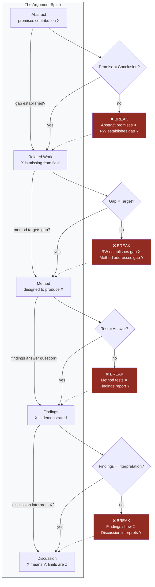

**Figure 11.1 — The argument spine with break-detection points.** Each check verifies that adjacent sections connect logically. A "no" at any check point means the paper's argument has diverged from its promise. The most common break is between method and findings: the study tests one thing, but the findings emphasize a different (usually more impressive) result that was not the original target. This is a form of claim drift (Chapter 8) that becomes visible only when you trace the spine.

**Prompt template for the spine check:**

```text
Read the following paper. I will give you the abstract, then the first
and last sentence of each section. Do not re-read the full text.

[Abstract]
[First/last sentences of each section]

Trace the single argument spine:
1. What does the abstract promise?
2. Does the related work establish the gap that the method addresses?
3. Does the method test what the introduction said would be tested?
4. Do the findings answer the stated research question?
5. Does the discussion interpret the findings without introducing new claims?

For each check, answer YES, NO, or PARTIAL. For any NO or PARTIAL,
identify the specific divergence and suggest the minimum fix.
Do not rewrite the paper. Diagnose only.
```

**When to run this check:** After reviewer simulation (Chapter 10) is complete and all major revisions have been incorporated. Running it before reviewer simulation wastes effort — the spine may change during revision.

---

### 11.2 The Four-Step Citation Integrity Gate

This is the most important gate in the entire workflow. Not because the other gates are less important, but because **fabricated citations are the most common and most damaging AI failure mode in academic writing.**

A single fabricated reference — one that looks real, sounds plausible, and does not exist — can kill a paper's credibility at review. The reviewer who checks it does not conclude "one citation was wrong." They conclude "the author did not verify their citations." Every other citation is now suspect. The paper's foundation is gone.

The `[UNSOURCED]` marker (Chapter 8) catches claims without sources. The citation integrity gate catches sources that do not exist, do not say what the text claims, or cannot be found by a reader. These are different failures requiring different protocols.

**The four steps:**

#### Step 1: In-text ↔ Bibliography Cross-Check

**Goal:** Every in-text citation has a corresponding bibliography entry; every bibliography entry is cited in the text (or explicitly included as "additional reference").

**How:** Generate two lists:
- List A: all unique citation keys from the manuscript (e.g., `[Tanaka21]`, `[Lee22]`)
- List B: all entries in the `.bib` file or reference list

Compare. Any item in A that is not in B is a **missing reference** — the text cites something that has no bibliography entry. Any item in B that is not in A is an **orphaned reference** — it was included but never cited (not necessarily an error, but worth confirming it was intentional).

**Tool:** A simple script or manual comparison. In LaTeX/BibTeX, unmatched citation keys produce warnings at compile time — read the log. In Word with Zotero, the "Refresh" operation flags unresolved citations.

**Failure mode:** A citation key exists in the `.bib` file but with a typo (`tanaka21` vs. `tanaka2021`). The cross-check catches this. The typo produces a missing reference in the compiled output or a question mark where the citation should be.

#### Step 2: Every Citation Exists

**Goal:** For each bibliography entry, verify that the work actually exists and that the metadata (author, title, venue, year) is correct.

**How:** For each reference, search the author + title + year in Google Scholar, Semantic Scholar, or the venue's digital library. Confirm:
- The author name(s) match
- The title matches (word-for-word — not a paraphrase)
- The venue and year match
- The DOI (if present) resolves to this specific work

**The high-fake problem:** AI-generated fabrications are not obviously fake. They are *high-fakes* — references that look real because they use real author names, plausible titles, credible venues, and reasonable years. The reference passes a casual glance. It fails only when someone searches for the specific combination.

**Example of a high-fake caught by the gate:**

> **Reference in the bibliography:**
> Chen, L., & Park, S. (2023). "Gaze-contingent rendering reduces simulator sickness in untethered VR." *Proceedings of the ACM Symposium on User Interface Software and Technology (UIST '23)*, 45(3), 112–124.

> **Why it looks real:** Chen and Park are common names (plausible authors). Gaze-contingent rendering and simulator sickness are active research areas in UIST. The volume and page numbers are in a reasonable range. The title is specific and uses correct terminology.

> **What Step 2 catches:** Searching "Chen Park gaze-contingent rendering simulator sickness UIST 2023" returns no result. Searching the title in quotes returns no result. Searching UIST 2023 proceedings for "gaze-contingent" returns no paper by Chen & Park. The reference does not exist.

> **How it got there:** The model generated a citation to support the claim that "gaze-contingent rendering has been shown to reduce simulator sickness in mobile VR contexts." The claim may or may not be true — but this specific reference is fabricated. The model produced a citation that fits the claim's shape without verifying that any such paper exists.

> **The fix:** Delete the fabricated citation. Search for the claim in Semantic Scholar. If a real paper supports it, replace the fabrication with the real citation. If no real paper supports it, weaken the claim to what your verified sources support, or mark it `[UNSOURCED]` and resolve it through the Chapter 8 protocol.

**Why this step is non-negotiable:** You cannot distinguish a high-fake from a real reference by reading it. Formatting, tone, and plausibility are not evidence of existence. The only verification is retrieval: can you find the paper?

#### Step 3: DOI and Links Resolve

**Goal:** Every DOI, URL, or other link in the bibliography resolves to the correct resource.

**How:** Use a DOI resolver (doi.org) or a batch DOI checker. For each reference with a DOI:
- Navigate to `https://doi.org/[the DOI]`
- Confirm it resolves to the paper cited (not a different paper, not a 404, not a redirect to an unrelated domain)

**Why this matters:** DOIs can be fabricated just like references. A fake DOI may resolve to a 404, to a completely different paper, or to a predatory journal that accepts anything. Reviewers increasingly check DOIs — especially for unfamiliar references.

**For URLs:** Check that the link is not dead, not behind a paywall that prevents verification, and not a link to a general venue page rather than the specific paper.

**Tool:** `doi.org` for manual checks; scite.ai for batch verification; Zotero's "Validate DOI" function.

#### Step 4: Every Citation Supports Its Claim

**Goal:** For each in-text citation, verify that the cited source actually says what the text claims it says.

**How:** For each citation, locate the specific passage in the source paper that supports the claim. Confirm:
- The source makes the specific claim attributed to it (not a weaker version, not a different claim in the same paper)
- The source's findings support the direction of the claim (if the text says "gaze is faster," the source found gaze is faster — not "no significant difference")
- The source's context matches the claim's context (if the text says "in AR," the source studied AR — not VR, not a desktop setting)

**This is the step most researchers skip.** Steps 1–3 verify that the reference exists and is formatted correctly. Step 4 verifies that the reference *means what you say it means*. A real paper cited for a claim it does not make is as damaging as a fabricated paper — because it shows you did not read what you cited.

**The "vaguely related" failure:** A paper about gaze interaction in VR is cited for a claim about gaze interaction in AR. The paper is real. The citation is formatted correctly. But the paper studied a different technology in a different context, and its findings may not transfer. This is not a fabrication — it is a misattribution. Reviewers in the field catch this.

**Protocol for Step 4:**

1. For each citation, open the source PDF.
2. Search for the specific finding or claim referenced.
3. If the source supports the claim: note the page number or section for your records.
4. If the source does not support the claim: replace it with a source that does, or weaken the claim.
5. If you cannot locate the source PDF: treat the citation as unverified and resolve it before submission.

**Time estimate:** For a paper with 30 references, Steps 1–3 take 30–60 minutes. Step 4 takes 2–4 hours. This is the most time-consuming gate. It is also the one that prevents the most damaging failure mode.

---

### 11.3 Why This Is the Most Important Gate

The other gates in this workflow — style gates, reviewer simulation, argument spine — catch problems that are fixable in revision. A citation integrity failure is different:

1. **It is often invisible to the author.** A high-fake looks identical to a real reference. You cannot catch it by re-reading your paper. You can only catch it by verifying against external sources.

2. **It is immediately visible to reviewers.** Reviewers are experts in the field. They know the literature. When they see a reference they do not recognize, they check it. If it does not exist, the paper's credibility is compromised — not just for that citation, but for the entire work.

3. **It is the most common AI failure mode.** When asked to generate citations, LLMs produce plausible-looking references. The training data includes millions of real citations, and the model learns the *shape* of a citation without learning which specific combinations of author-title-venue-year correspond to real papers. The result is fabrication at a rate that varies by model and prompt, but is never zero.

4. **It is the least forgivable failure.** A reviewer may forgive a weak related work section or a narrow contribution. They will not forgive a fabricated citation. It signals either dishonesty or negligence — and the reviewer cannot tell which.

**The structural solution:** The four-step gate is not a "be more careful" instruction. It is a protocol that makes fabrication structurally difficult to miss. Each step catches a different failure mode. Steps 1–3 catch fabrication. Step 4 catches misattribution. Together, they produce a reference list where every entry exists, is findable, and means what the text claims.

---

### 11.4 Venue-Specific Checklists

The argument spine and citation integrity gate are universal. Venue-specific requirements are not. Every venue has its own formatting rules, submission materials, and unwritten expectations. Missing a venue-specific requirement does not just create extra work — it can result in desk rejection.

**The principle:** Always build the checklist from the **current year's official CFP**. Never from memory, never from a previous year's checklist, never from a template you found online. Venue rules change. Word counts shift. New requirements appear (e.g., AI disclosure policies introduced in 2024–2025). A checklist built from last year's CFP is a checklist with at least one wrong item.

#### HCI Venues (CHI, UIST, CSCW, DIS, ISMAR)

| Requirement | Check | Notes |
|-------------|-------|-------|
| ACM template (LaTeX or Word) | ☐ | Download from ACM author kit — do not reuse old templates |
| Double-blind anonymization | ☐ | Author names, affiliations, acknowledgments removed; self-citations anonymized (`[anonymized, 2025]`); project URLs anonymized or blinded |
| Structured abstract | ☐ | Background, methods, results, conclusions — or as venue requires |
| CCS codes (Computing Classification System) | ☐ | Required at submission; often forgotten during drafting |
| Word count within hard ceiling | ☐ | Includes everything: abstract, body, acknowledgments, references (confirm current year's limit) |
| Supplementary video | ☐ | ISMAR/UIST commonly expect a 1–2 minute video; CHI optional but recommended for system papers |
| Accessibility tags on figures | ☐ | ACM requires alt-text for all figures as of recent policy updates |
| ORCID for all authors | ☐ | Required at submission for corresponding author; recommended for all |
| AI use disclosure | ☐ | See Section 11.5 |

**Common HCI failures:**
- Forgetting to anonymize the PDF metadata (author name embedded in the PDF properties)
- Self-citations that reveal identity ("In our previous work [Smith, 2024]..." when Smith is the author)
- CCS codes left at default or omitted entirely
- Word count exceeded because references were not counted

#### Digital Art — SIGGRAPH Art Papers

| Requirement | Check | Notes |
|-------------|-------|-------|
| Absolute word count ceiling | ☐ | Title + abstract + figure captions + references — all included. This is non-negotiable |
| 100-word "Why It Matters" statement | ☐ | Separate from abstract; explains significance to the broader SIGGRAPH audience |
| Third-person abstract | ☐ | "This paper presents..." not "We present..." |
| 20-second Fast-Forward video | ☐ | Required; shows the work in action; strict time limit |
| High-resolution visual evidence | ☐ | Minimum resolution specified in CFP; images must be publication-quality |
| Artist statement | ☐ | Contextualizes the work within the artist's practice and relevant theory |
| Technical requirements | ☐ | For installation works: dimensions, power, network, spatial needs — specific enough for production team |

**Common SIGGRAPH failures:**
- Word count exceeded because figure captions were not included in the count
- Fast-Forward video over 20 seconds (automatic disqualification at some stages)
- "Why It Materials" omitted or merged with abstract
- Visual evidence at screen resolution instead of print resolution

#### Digital Art — Leonardo

| Requirement | Check | Notes |
|-------------|-------|-------|
| American English spelling and conventions | ☐ | "color" not "colour"; "behavior" not "behaviour" |
| Zero passive voice | ☐ | Every sentence has an agent; "We designed..." not "The system was designed..." |
| All acronyms expanded on first use | ☐ | "Research-through-Design (RtD)" first; "RtD" thereafter |
| Third-person abstract | ☐ | "This paper argues..." not "In this paper, we argue..." |
| References in Leonardo format | ☐ | Author-date; full bibliographic details; specific format in author guidelines |
| Artwork documentation | ☐ | High-quality images with dimensions, materials, and year |

**Common Leonardo failures:**
- Passive voice surviving from an earlier draft (run the single-rule style gate from Chapter 8)
- Acronyms used without expansion (especially RtD, HCI, VR, AI)
- British English spelling (Leonardo is published in the US)

#### Digital Art — ISEA

| Requirement | Check | Notes |
|-------------|-------|-------|
| CV / portfolio | ☐ | Current; relevant to the submitted work |
| ~300-word artist bio | ☐ | Not a resume in paragraph form; a narrative of practice |
| Theme statement | ☐ | Explicitly positions the work within the symposium's annual theme |
| 300–800-word work proposal | ☐ | Describes the work, its context, and its contribution |
| Technical requirements | ☐ | Specific: dimensions, power, network, spatial, installation time |
| Supporting media | ☐ | Images, video, audio — in formats specified by current CFP |

**Common ISEA failures:**
- Generic theme statement that could apply to any year's theme
- Technical requirements too vague ("needs a room and electricity" is not sufficient)
- Artist bio that reads as a CV summary rather than a practice narrative

**How to build the checklist:**

1. Navigate to the venue's current year CFP page (not the general author guidelines — the specific CFP for the submission cycle you are targeting).
2. Create a spreadsheet with one row per requirement.
3. For each requirement, note the specific constraint (word count, file format, deadline, required section).
4. Check each item against your submission package.
5. Any unchecked item is a desk-rejection risk.

---

### 11.5 AI Use Disclosure

**What to disclose:** Any use of AI in the research or writing process. This includes:
- Literature search and synthesis (Elicit, ResearchRabbit, Consensus)
- Writing assistance (drafting, editing, translation)
- Code generation (analysis scripts, visualization)
- Image generation (figures, diagrams — check venue policy; some prohibit AI-generated artwork)
- Proofreading and grammar tools (Grammarly, Paperpal, Trinka)

**Where to disclose:** Follow the venue's specific policy. As of 2024–2025, most HCI and Digital Art venues require disclosure in a section that is **not** part of the word count — typically an "Author Statement" or "AI Use Statement" at the end of the paper, or in the submission form.

**The CHI style (Akera et al. 2024):** The CHI 2024 AI Use Statement asks authors to describe:
1. Which AI tools were used
2. How they were used in the research process
3. What the human authors contributed
4. What responsibilities the authors accept for the work's integrity

**How to describe your workflow honestly:**

> **Weak disclosure (avoid):** "We used AI tools in the preparation of this manuscript."

> **Strong disclosure (use):** "We used Claude (Anthropic) for drafting assistance: generating initial drafts of the related work and discussion sections from our verified literature matrix, which we then revised for argument, voice, and accuracy. We used Elicit (Ought Inc.) for structured extraction of method and findings from candidate papers. We used Zotero + Better BibTeX for citation management. All claims were verified against primary sources by the authors. The authors take full responsibility for the accuracy and integrity of this work."

**Why specificity matters:** A vague disclosure ("AI was used") tells the reviewer nothing. A specific disclosure ("Claude was used for initial drafting from verified sources; all claims were human-verified") tells the reviewer that you used AI as a tool within a structured process — not as a substitute for authorship.

**What not to disclose as AI use:** Standard software (LaTeX, Word, Python, R) is not AI use. Spell-checkers are not AI use. The disclosure targets tools that *generate* content — text, code, images — that appears in or supports the submission.

**The migration test as evidence:** The syllabus (Session 1 and Session 8) includes a migration test: a 20-minute unassisted writing sample collected at the start of the course, repeated at the end. The comparison demonstrates whether the researcher's independent writing ability has been maintained or degraded through AI use. If your post-course sample shows the same or greater clarity, specificity, and argumentative force as the baseline, you have evidence that the human is still the author. This is not a requirement for submission — but it is a useful internal check. If your unassisted writing has atrophied, you have delegated too much.

---

### 11.6 Final File Organization

The submission-ready package lives in the `10_final/` directory. The structure mirrors the workflow state machine (Chapter 2) and contains everything needed for submission.

```
10_final/
├── README.md                    # Submission manifest: venue, deadline, package contents
├── manuscript/
│   ├── main.pdf                 # Anonymized manuscript (for review)
│   ├── main.tex                 # Source (if LaTeX)
│   ├── references.bib           # Zotero-exported bibliography
│   └── appendix.pdf             # Supplementary materials (if any)
├── figures/
│   ├── figure_01.png            # Publication-resolution figures
│   ├── figure_02.png
│   └── README.md                # Figure captions + alt-text for accessibility
├── supplementary/
│   ├── video_fast_forward.mp4   # SIGGRAPH: 20-second Fast-Forward
│   ├── video_supplement.mp4     # HCI: supplementary demonstration video
│   └── dataset.zip              # If applicable
├── disclosure/
│   ├── ai_use_statement.md      # AI use disclosure (Section 11.5)
│   └── irb_approval.pdf         # If human subjects research
├── venue_checklist.md           # Completed checklist (Section 11.4)
├── citation_audit.md            # Step 4 results: every citation verified
└── submission_form.pdf          # Venue-specific submission form (if paper)
```

**What goes in the submission-ready package:**

| File | Purpose | Required by |
|------|---------|-------------|
| `main.pdf` | Anonymized manuscript | All venues |
| `references.bib` | Citation source | Your records; regenerate PDF if needed |
| `figures/` | Publication-resolution images | All venues with figures |
| `video_fast_forward.mp4` | 20-second preview | SIGGRAPH |
| `video_supplement.mp4` | System demonstration | ISMAR, UIST (common) |
| `ai_use_statement.md` | AI disclosure | CHI, most ACM venues |
| `irb_approval.pdf` | Ethics approval | Human subjects research |
| `venue_checklist.md` | Completed checklist | Your records; proves due diligence |
| `citation_audit.md` | Verification log | Your records; proves citation integrity |

**The README.md manifest** is the single file that describes the entire package. It should list every file, its purpose, and its status. Before submission, read the README and confirm every file is present and current.

---

### 11.7 Putting It All Together: The Final Sequence

The final submission workflow is a linear sequence of gates. Each gate must be passed before the next is attempted.

```
Argument Spine Check (11.1)
        ↓ PASS
Citation Integrity Gate (11.2)
    ├── Step 1: Cross-check
    ├── Step 2: Existence
    ├── Step 3: DOI resolution
    └── Step 4: Claim support
        ↓ ALL PASS
Venue Checklist (11.4)
        ↓ ALL CHECKED
AI Use Disclosure (11.5)
        ↓ WRITTEN
File Organization (11.6)
        ↓ PACKAGE COMPLETE
Submission
```

**Time budget:** For a typical paper (30 references, 8,000 words, ACM template):
- Argument spine check: 15 minutes
- Citation integrity Steps 1–3: 45 minutes
- Citation integrity Step 4: 2–3 hours
- Venue checklist: 30 minutes
- AI disclosure: 15 minutes
- File organization: 30 minutes
- **Total: 4–5 hours**

This is not a single afternoon. Plan for at least one full working day between "draft complete" and "submission." Rushing the final gate is how high-fakes survive.

---

## Expected Outputs

After completing this chapter's workflow, you will have:

1. **A verified argument spine** — The abstract's promise propagates through every section without break; documented in a spine check report
2. **A citation audit log** — Every reference verified for existence (Step 2), DOI resolution (Step 3), and claim support (Step 4); stored in `10_final/citation_audit.md`
3. **A completed venue checklist** — Built from the current year's CFP; every item checked; stored in `10_final/venue_checklist.md`
4. **An AI use disclosure** — Specific, honest, and compliant with venue policy; stored in `10_final/disclosure/ai_use_statement.md`
5. **A submission-ready package** — All files in `10_final/`; README manifest complete; ready for upload

---

## Best Practices

1. **Build the venue checklist from the current year's CFP, not from memory.** Venue rules change. A checklist from a previous year is a liability, not an asset.
2. **Run the citation integrity gate as a separate pass.** Do not combine it with proofreading or formatting. Each verification step requires focused attention.
3. **Verify claim support (Step 4) for every citation, not just the ones you "suspect."** High-fakes are indistinguishable from real references by reading. The only verification is retrieval.
4. **Treat the argument spine check as a diagnostic, not a formality.** If the spine is broken, fix the paper — not the check.
5. **Write the AI disclosure with specificity.** Name the tools, describe their use, and state what the human authors contributed. Vague disclosures erode trust.
6. **Use the README manifest as the final verification.** If a file is not in the README, it does not exist for submission purposes.
7. **Budget a full working day for the final gate sequence.** Rushing produces the failures the gate is designed to catch.

---

## Anti-patterns

1. **"I checked the citations and they look fine."** Looking fine is not verification. A high-fake looks fine. Verification requires retrieval — searching for the specific paper and confirming it exists.
2. **Running the citation gate before the argument spine check.** If the spine is broken and you revise the paper, citations may change. Run the spine check first; the citation gate second.
3. **Using a venue checklist from a previous year.** The word count ceiling changed. The AI disclosure requirement is new. The CCS code format was updated. Last year's checklist will have at least one wrong item.
4. **Writing the AI disclosure as an afterthought.** "We used AI" is not a disclosure — it is a warning flag. The disclosure should demonstrate that you used AI within a structured process, not as a substitute for authorship.
5. **Skipping Step 4 (claim support) because Steps 1–3 passed.** Steps 1–3 verify that the reference exists. Step 4 verifies that it means what you say it means. A real paper cited for a claim it does not make is a misattribution — and reviewers catch it.
6. **Submitting without the README manifest.** The manifest is your final verification that the package is complete. Without it, you are relying on memory — and memory is what produces "I thought I included the supplementary video."
7. **Treating the final gate as a single check.** It is a sequence of independent checks, each catching a different failure mode. Combining them into one pass means each gets less attention and more errors survive.

---

## Checklist

Before submitting, verify:

- [ ] Argument spine check passed: abstract promise = discussion conclusion; gap = method target; method = findings answer; findings = discussion interpretation
- [ ] Citation Step 1: Every in-text citation has a bibliography entry; no orphaned references
- [ ] Citation Step 2: Every reference exists — author, title, venue, year confirmed via search
- [ ] Citation Step 3: Every DOI resolves to the correct paper; no dead links
- [ ] Citation Step 4: Every citation supports the specific claim it is attached to — verified against the source PDF
- [ ] Venue checklist built from current year's CFP (not memory, not previous year)
- [ ] Venue checklist: every item checked
- [ ] ACM anonymization (if applicable): author names, affiliations, self-citations, PDF metadata all blinded
- [ ] Word count within hard ceiling (including references, captions, acknowledgments — as venue defines)
- [ ] AI use disclosure written with specificity: tools named, uses described, human contributions stated
- [ ] Supplementary materials present and correctly formatted (video, dataset, appendix)
- [ ] Figures at publication resolution; alt-text provided
- [ ] README manifest in `10_final/` lists every file; every file is present
- [ ] Citation audit log stored in `10_final/citation_audit.md`
- [ ] At least one full working day between "draft complete" and submission

---

## References

### Chapter Cross-References

- **Chapter 1** — The So What ×3 and No Surprises tests; the prediction boundary; contribution-first thinking. The argument spine check is the No Surprises test applied to the full paper.
- **Chapter 2** — The canonical workflow (`Idea → ... → Submission`); the file-system-as-memory principle. The `10_final/` directory is the final node in this workflow.
- **Chapter 3** — Source grounding protocol; the `[UNSOURCED]` marker. The citation integrity gate extends source grounding from individual claims to the entire reference list.
- **Chapter 4** — The literature pipeline; Zotero + Better BibTeX as citation single source of truth (Section 4.9); the literature synthesis matrix. The citation audit (Step 4) verifies that matrix-derived claims match their sources.
- **Chapter 8** — The bucket method; constraint prompts; discipline-specific style gates (Section 8.8). The venue checklists in this chapter implement those style gates as binary submission checks.
- **Chapter 10** — Reviewer simulation; the adversarial editing loop. The argument spine check is a final diagnostic after reviewer simulation is complete.

### Source Materials

- *课程详细计划_8节.md* — Session 8 (收口与提交): the argument spine check, four-step citation integrity gate, venue-specific checklists (HCI and Digital Art), and migration test are derived from this session's content
- *Plan.md* — Iterative adversarial workflow (Writer → Critic → Devil's Advocate → Reviewer → Writer Revision → Citation Audit → Final Editor); the final gate sequence in this chapter implements the Citation Audit and Final Editor stages
- *AI Research Assistant Prompting Guide.md* — The "So What?" revision prompt (used in argument spine diagnosis); the clarity and academic tone check (used in final polish)
- *Prompting best practices.md* — XML structuring for prompts; constraint language design (used in the spine check prompt template)

### Further Reading

- Akera, A., et al. (2024). "AI Use Statements in HCI: Toward Transparent Disclosure." *CHI '24.* — Proposes the CHI-style AI use disclosure framework referenced in Section 11.5.
- Kang, S. & Harty, A. E. (2024). "Use of AI-Based Literature Review Tools in Research." — Documents citation fabrication as the most frequent AI failure mode in academic writing.
- Syed, S. & Le Meur, E. (2024). "PaperEngage: An AI-powered system for reading academic papers." *CHI '24.* — Demonstrates structured extraction and verification workflows relevant to citation integrity.
- Wobbrock, J. O. & Kientz, J. A. (2016). "Research contributions in human-computer interaction." *Interactions*, 23(3), 38–44. — The contribution type taxonomy that determines what the argument spine must deliver.


---

<a id="chapter-12"></a>

# Chapter 12: Automation and Scaling

## Objectives

After reading this chapter, you will be able to:

1. Distinguish between tasks that should be automated and tasks that must remain human — and articulate why the distinction matters
2. Configure a working Hermes/OpenClaw agent tree with 12–15 agents, each routed to a cost-appropriate model
3. Set up a weekly cron job for automated literature monitoring across CHI/UIST/CSCW/SIGGRAPH proceedings
4. Run the full pipeline from idea to camera-ready with automated handoffs and human gates
5. Produce a reproducibility bundle that documents your AI workflow for replication
6. Scale your RAG corpus from 50 to 5,000 papers without collapsing context windows
7. Adapt the manual's workflow for a multi-member research lab

## Required Background

- **Chapter 2** — The canonical workflow (Idea → Archive), the multi-agent tree structure, and the principle that structure beats model power. This chapter assumes you can draw the workflow from memory.
- **Chapter 9** — Full agent definitions: the 21-agent tree, prompt templates, the adversarial editing loop, and the cost-optimized model routing table. This chapter shows how to instantiate that tree in a real orchestration system.
- **Chapter 13** — The future of AI-native research. This chapter's automation decisions are designed to remain adaptable as tools evolve; Chapter 13 explains why adaptability is the only durable strategy.

If you have not read Chapter 9's section on orchestration (Section 9.10), read it now. The protocol described there — assign, collect, compare, route, merge, present — is the backbone of this chapter.

---

## 12.1 From Manual to Automated: What Gets Automated and What Does Not

The goal of automation is not to remove the human from the research process. The goal is to remove the mechanical so the human can focus on the judgmental.

### The principle: automate the mechanical, not the judgment

| Mechanical (Automate) | Judgmental (Human) |
|----------------------|-------------------|
| Literature discovery across databases | Deciding which problems are interesting |
| Citation network analysis | Deciding which gap is worth filling |
| Extracting metadata into matrices | Deciding whether a paper belongs in the corpus |
| Drafting section text from verified materials | Deciding what the contribution claim is |
| Formatting citations and references | Deciding whether a claim is defensible |
| Checking DOI resolution | Deciding whether to accept or reject reviewer feedback |
| Scanning proceedings for new papers | Deciding whether a trend is genuine or artifact |
| Running statistical tests | Deciding what the results mean |

This division is not arbitrary. It maps directly onto the AI usage rules in the syllabus (Section 0.6): "AI proposes, human disposes." Every automation in this chapter follows this rule. The system generates candidates, drafts, and alerts. The human decides which to act on.

### Why this boundary exists

Mechanical tasks share three properties: they are **rule-governed** (the procedure is specifiable), **verifiable** (you can check whether the output is correct), and **low-stakes in isolation** (a formatting error is fixable; a wrong contribution claim is not). Judgment tasks share the opposite properties: they are **context-dependent** (the right answer depends on your specific research identity and goals), **unverifiable before the fact** (you cannot know if a research direction is fruitful until you pursue it), and **high-stakes** (a wrong framing decision wastes months).

**Failure mode:** The most common automation failure is not technical — it is conceptual. Researchers automate a judgment task (e.g., "which gap should we fill?") and then treat the system's recommendation as a decision. The system recommended a gap because it was structurally visible in the citation network, not because it was interesting. The human's job is to evaluate interestingness — a task that requires the research identity file, domain knowledge, and the tacit sense of what matters that no model possesses.

---

## 12.2 Hermes/OpenClaw Agent Tree Configuration

Chapter 9 defines the 21-agent tree. This section shows how to instantiate it in a real orchestration system.

### The Editor-in-Chief as your interface

You do not interact with 21 agents directly. You interact with the Editor-in-Chief (EIC), which orchestrates the rest. The EIC is your single point of contact — it receives your instructions, dispatches tasks to the appropriate team, collects outputs, flags disagreements, and presents merged recommendations for your decision.

**What you say to the EIC:**
```
I want to start a new paper on gaze+pinch selection in optical 
see-through AR. Here is my research identity file and three seed 
papers. Please:
1. Run the Trend Scout and Gap Hunter on these seeds
2. Build a literature matrix (target: 20 verified rows)
3. Propose a gap statement for my review
Do not draft any sections yet. Stop after the gap statement.
```

**What the EIC does internally:**
1. Reads your research identity and seed papers
2. Dispatches Trend Scout with venue list and seed papers
3. Dispatches Gap Hunter with the same seeds
4. Dispatches Literature Miner to build the matrix
5. Collects all three outputs
6. Checks for consistency (does the gap align with the trend data?)
7. Presents a merged gap statement with evidence and asks for your approval

You approve the gap statement. Only then does the EIC proceed to the next stage.

### Minimal viable tree

You do not need 21 agents on day one. Start with the minimal tree and expand on failure:

| Stage | Agents Active | Why |
|-------|--------------|-----|
| **Front end** (Idea → Gap) | EIC, Trend Scout, Gap Hunter, Literature Miner | These four cover the entire front end |
| **Writing** (first draft) | EIC + 1 Writer per section | One writer per section, no review yet |
| **Review** (first pass) | EIC, CHI Reviewer #1, Citation Verifier | One reviewer + citation audit |
| **Revision** | EIC + Writer Revision | Address MAJOR issues, re-verify citations |

This gives you a 7-agent system that covers the full pipeline. Add agents only when a specific failure mode appears:

- Reviewer consistently misses theoretical gaps → add HCI Theorist
- Reviewer is too lenient → add Devil's Advocate
- Reviewers disagree and you need adjudication → add Associate Chair
- Prose sounds generic → add Style Editor
- Methods section uses wrong paradigm language → add UX Researcher

**Anti-pattern:** Configuring all 21 agents before running the first section. A 21-agent tree that has never been tested is a 21-agent tree with 21 unknown bugs. Start with 7. Debug. Expand.

### Configuration file structure

Each agent in Hermes/OpenClaw is configured with the following fields (derived from the agent definitions in Chapter 9):

```yaml
# Example: Trend Scout configuration
agent_id: trend_scout
team: research_director
model: gpt-5.5  # See cost-routing table, Section 12.4
system_prompt: |
  You are a Trend Scout for HCI/Digital Art research. Your job is 
  to identify emerging themes in [target venues] over the past 
  [time period].
  
  <constraints>
    - Identify themes by citation velocity, not by your own judgment
    - Distinguish between a genuine trend and a single highly-cited paper
    - Do not recommend which trend to pursue
  </constraints>
input_schema:
  - seed_papers: list[Paper]
  - venues: list[string]
  - date_range: DateRange
output_schema:
  - trend_report: TrendReport
  # Structured output: themes, key papers, growth rates
tools:
  - research_rabbit
  - litmaps
  - semantic_scholar
failure_modes:
  - confuses_popularity_with_importance
  - detects_conference_theme_artifacts
when_not_to_use:
  - literature_matrix_fewer_than_15_rows
  - research_question_already_fixed
```

The full configuration for all 21 agents appears in Appendix B. The key point is that every agent's configuration includes not just the prompt but also its failure modes and when-not-to-use conditions — these are what prevent the orchestrator from dispatching agents inappropriately.

---

## 12.3 Cron Jobs for Literature Monitoring

The Trend Scout is most valuable as a scheduled agent — one that runs weekly, scans target venues, and alerts you to papers matching your interest profile. This section shows how to configure this.

### The weekly scan

**What it does:** Every week, the Trend Scout scans the latest proceedings of your target venues (CHI, UIST, CSCW, DIS, SIGGRAPH, Leonardo, ISEA), compares them against your interest profile (from `research_identity.md`), and produces an alert if it finds papers that match.

**Cron job configuration:**

```bash
# crontab entry — runs every Monday at 08:00
0 8 * * 1 /Users/qiushizhou/research/scout/run_weekly_scout.sh
```

```bash
#!/bin/bash
# run_weekly_scout.sh
# Weekly literature monitoring for HCI/Digital Art research

PROJECT_DIR="/Users/qiushizhou/research/scout"
VENUES="CHI,UIST,CSCW,DIS,SIGGRAPH,Leonardo,ISEA"
DATE_RANGE="last_7_days"
IDENTITY_FILE="$PROJECT_DIR/research_identity.md"
OUTPUT_DIR="$PROJECT_DIR/alerts/$(date +%Y-%m-%d)"

mkdir -p "$OUTPUT_DIR"

# Step 1: Scan proceedings for new papers
# (This uses Semantic Scholar API + Elicit as backend)
claude --model sonnet \
  --system-prompt "$PROJECT_DIR/agents/trend_scout.md" \
  --prompt "Scan [$VENUES] proceedings for papers published in [$DATE_RANGE]. 
            Compare against the interest profile in [$IDENTITY_FILE].
            Output only papers that match at least 2 of the 3 interest 
            dimensions (topic, method, theoretical framework)." \
  --output "$OUTPUT_DIR/scan_results.json"

# Step 2: Filter and format alerts
python3 "$PROJECT_DIR/scripts/filter_alerts.py" \
  --input "$OUTPUT_DIR/scan_results.json" \
  --identity "$IDENTITY_FILE" \
  --min-match-score 0.7 \
  --output "$OUTPUT_DIR/alert_summary.md"

# Step 3: Send notification if matches found
if [ -s "$OUTPUT_DIR/alert_summary.md" ]; then
  # macOS notification
  osascript -e "display notification \"$(wc -l < $OUTPUT_DIR/alert_summary.md) new papers match your interests\" with title \"Trend Scout\""
  
  # Optional: email summary
  # mail -s "Trend Scout Weekly: $(date +%Y-%m-%d)" you@institution.edu < "$OUTPUT_DIR/alert_summary.md"
fi
```

### Interest profile matching

The Trend Scout matches new papers against your interest profile using three dimensions:

| Dimension | From `research_identity.md` | Example |
|-----------|---------------------------|---------|
| **Topic** | Research interests (specific to problem level) | "gaze interaction in AR/VR," "fatigue in prolonged use" |
| **Method** | Methodological preferences | "controlled experiment," "qualitative," "RtD" |
| **Theory** | Theoretical commitments | "embodied interaction," "distributed cognition" |

A paper matches if it aligns on at least 2 of 3 dimensions. This threshold is adjustable — set it higher (3/3) for a focused scan, lower (1/3) for a broad scan.

### Alert format

```markdown
# Trend Scout Alert — 2026-07-14

## High Match (3/3 dimensions)
- **Pfeuffer et al. (2026)** "Gaze+Pinch Selection in Optical See-Through AR 
  with Small Targets." *CHI '26.* 
  Topic: gaze+pinch AR ✓ | Method: controlled experiment ✓ | 
  Theory: embodied interaction ✓
  Why relevant: Directly addresses the gap you identified in your 
  2026-03-10 gap analysis. Uses a 2-alternative forced choice design 
  with 32 participants.

## Partial Match (2/3 dimensions)
- **Kollenberg et al. (2026)** "Fatigue Decay Functions for Mid-Air 
  Gestures in AR." *UIST '26.*
  Topic: AR interaction ✓ | Method: controlled experiment ✓ | 
  Theory: (not applicable — no theoretical framework)
  Why relevant: Extends your fatigue analysis with a longitudinal 
  design (5 sessions over 2 weeks).

## Trend Signal
- Citation velocity for "gaze+pinch" papers: +40% over last quarter
- New methodological trend: 3 papers use continuous fatigue 
  measurement (EDA + eye tracking) instead of post-hoc questionnaires
```

### What the cron job does NOT do

The cron job does not add papers to your literature matrix automatically. It alerts you. You decide whether to read the paper, and if so, whether to add it to the matrix. This is a deliberate human gate — automated inclusion would let the model's matching criteria override your judgment about relevance.

---

## 12.4 Cost-Optimized Model Routing

Not every agent needs the most expensive model. This section provides a detailed routing table with per-task cost estimates.

### The routing table

| Agent | Recommended Model | Task Complexity | Est. Cost/Task | When to Upgrade | When to Downgrade |
|-------|------------------|----------------|----------------|-----------------|-------------------|
| **Editor-in-Chief** | Claude Opus 4.8 | Integration, adjudication, conflict resolution | $0.15–0.30 | Always use best available | Never |
| **Introduction Writer** | Claude Opus 4.8 | Long-form reasoning, voice, argument structure | $0.10–0.20 | Final draft | First draft: Sonnet 5 |
| **Related Work Writer** | Claude Opus 4.8 | Synthesis across 15+ sources | $0.10–0.20 | Final draft | First draft: Sonnet 5 |
| **Methods Writer** | Claude Sonnet 5 | Template-following with paradigm constraints | $0.03–0.06 | Complex multi-study design | Never (Sonnet is sufficient) |
| **Results Writer** | Claude Sonnet 5 | Structured reporting, no interpretation | $0.03–0.06 | Never | Confidential data: local model |
| **Discussion Writer** | Claude Opus 4.8 | Theory connection, implications, limitations | $0.10–0.20 | Always | Never |
| **Abstract Writer** | Claude Sonnet 5 | Compression, self-contained summary | $0.02–0.04 | Never | Haiku 4.5 (if budget-constrained) |
| **CHI Reviewer #1** | Claude Opus 4.8 | Sophisticated review, subtle flaw detection | $0.10–0.20 | Always | Never |
| **CHI Reviewer #2** | GPT-5.5 | Different model family reduces collusion | $0.08–0.15 | Always | Never |
| **Associate Chair** | Claude Opus 4.8 | Adjudication, acceptance prediction | $0.08–0.15 | Always | Never |
| **Citation Verifier** | Claude Haiku 4.5 + tools | Mechanical verification, DOI resolution | $0.005–0.01 | Never | Always (cheapest adequate) |
| **Style Editor** | Paperpal / Trinka | Tool task, not reasoning task | $0.01–0.02 (tool subscription) | Never | Never |
| **HCI Theorist** | Claude Opus 4.8 | Framework proposal, theory synthesis | $0.08–0.15 | Always | Never |
| **Digital Art Critic** | Claude Opus 4.8 | Epistemic contribution analysis | $0.08–0.15 | Always | Never |
| **Philosophy Reviewer** | Claude Sonnet 5 | Logical validity checking | $0.03–0.06 | Complex philosophical arguments | Never |
| **UX Researcher** | Claude Sonnet 5 | Protocol design, structured output | $0.03–0.06 | Multi-study longitudinal design | Never |
| **Statistician** | Claude Sonnet 5 | Test appropriateness, assumption checking | $0.03–0.06 | Complex mixed models | Never |
| **Qualitative Coding Agent** | Local model (Qwen3) | Confidential data, first-pass coding | $0 (local) | Never | Always local for confidential data |
| **Ethics Reviewer** | Claude Sonnet 5 | Checklist application | $0.02–$0.04 | Vulnerable populations (upgrade to Opus) | Never |
| **Trend Scout** | GPT-5.5 | Broad literature scanning | $0.03–0.06 | Never | Sonnet 5 (if budget-constrained) |
| **Gap Hunter** | GPT-5.5 | Citation network analysis | $0.03–0.06 | Never | Sonnet 5 |
| **Literature Miner** | Elicit + NotebookLM | Tool task, not reasoning task | $0.01–0.02 (tool cost) | Never | Never |

### Cost comparison: full paper production

Using the routing table above, here is the estimated cost to produce one full paper (6 sections, 2 review rounds):

| Stage | Agents Used | Model | Est. Cost |
|-------|------------|-------|-----------|
| **Front end** (Trend → Gap → Matrix) | Trend Scout, Gap Hunter, Literature Miner | GPT-5.5, GPT-5.5, Elicit | $0.10 |
| **Writing** (6 sections) | 6 Writers | 4× Opus, 2× Sonnet | $0.60 |
| **Review round 1** | 2 Reviewers + AC + Citation Verifier | Opus, GPT-5.5, Opus, Haiku | $0.45 |
| **Revision** (6 sections) | 6 Writers | 4× Opus, 2× Sonnet | $0.45 |
| **Review round 2** | 2 Reviewers + AC + Citation Verifier | Opus, GPT-5.5, Opus, Haiku | $0.45 |
| **Final polish** | Style Editor + Abstract Writer | Paperpal, Sonnet | $0.05 |
| **Total** | | | **~$2.10** |

This is an estimate. Actual costs depend on context length, number of iterations, and model pricing at the time of use. The key insight is that **80% of the cost comes from 20% of the agents** — the Writing Team and Review Team using Opus. The front-end and verification agents are cheap.

### When to spend on Opus

Use Opus (or the most expensive available model) when:

1. **The task requires integrating multiple complex inputs** — the Editor-in-Chief adjudicating between two reviewers with different theoretical commitments
2. **The output is hard to revise** — the Introduction's contribution claim, once set, constrains the entire paper. Getting it right on the first try is cheaper than revising it later.
3. **The failure mode is subtle** — a reviewer who misses a theoretical gap, a discussion writer who over-claims. These require the deepest reasoning.
4. **Voice matters** — the Introduction and Discussion are the sections where the author's voice is most visible. Sonnet produces competent prose; Opus produces prose with a point of view.

### When Sonnet suffices

Use Sonnet when:

1. **The task is template-governed** — the Methods Writer follows a paradigm-specific template. The creativity required is low; the constraint-following is high. Sonnet handles this well.
2. **The output is mechanical** — the Citation Verifier checks DOIs. The Abstract Writer compresses. These are structured tasks that do not benefit from deeper reasoning.
3. **The task is bounded** — the Statistician evaluates a specific test for a specific design. The context is small and well-defined.

### When local free models are the right call

Use local models (Qwen3, DeepSeek-R1, Llama) when:

1. **The data is confidential** — interview transcripts, participant data, unpublished manuscripts. Never send these to a cloud API.
2. **The task is high-volume and low-stakes** — first-pass qualitative coding of 20 transcripts. The local model proposes codes; the human disposes. If the local model misses nuance, the human catches it.
3. **Cost is the binding constraint** — a lab with 10 students and no budget can run local models for first drafts and reserve cloud API calls for final review.

---

## 12.5 The Full Pipeline: Idea to Camera-Ready

This section shows how the stages chain together with automated handoffs and human gates.

### The automated pipeline

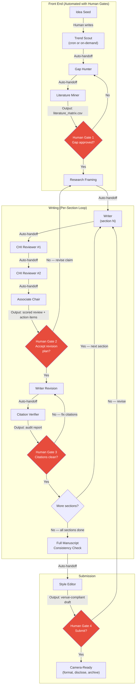

**Figure 12-1.** The automated pipeline with four human gates. Automated handoffs (solid arrows) happen without human intervention — the orchestrator dispatches the next agent as soon as the current one finishes. Human gates (red diamonds) require explicit human approval before the pipeline proceeds. The four gates correspond to: (1) gap approval, (2) revision plan approval, (3) citation cleanliness, (4) final submission approval. No section proceeds past a gate without the human saying yes.

### What triggers each human gate

| Gate | Triggered By | Human Decides | If Rejected |
|------|-------------|---------------|-------------|
| **Gate 1: Gap approved** | Gap Hunter output + literature matrix | Is this gap real, fillable, and interesting? | Return to Gap Hunter with revised seeds |
| **Gate 2: Revision plan** | Associate Chair meta-review | Are the MAJOR issues correctly identified? Is the revision plan feasible? | Return to Writer with revised instructions |
| **Gate 3: Citations clean** | Citation Verifier audit | Are all citations verified? Are any claims unsupported? | Return to Writer to fix specific citations |
| **Gate 4: Submit** | Style Editor output + full manuscript | Is this paper ready to put my name on? | Return to any prior stage |

### Automated handoffs

Between gates, the pipeline runs without human intervention:

1. **Trend Scout → Gap Hunter:** The trend report is automatically fed as input to the Gap Hunter. No human action needed.
2. **Gap Hunter → Literature Miner:** The gap statement automatically seeds the literature search.
3. **Writer → Reviewer:** The draft is automatically dispatched to both reviewers simultaneously (parallel execution).
4. **Reviewer → Associate Chair:** Both reviews are automatically sent to the AC for integration.
5. **Writer Revision → Citation Verifier:** The revised draft is automatically audited.

These handoffs are fast (seconds to minutes) and do not require human attention. The human is involved only at the gates — where judgment is required.

---

## 12.6 Reproducibility Pipeline

A paper produced with AI assistance is only reproducible if another researcher could replicate your workflow. This requires documenting not just the final manuscript but the entire process.

### The reproducibility bundle

For each paper, produce the following archive:

```
reproducibility_bundle/
├── README.md                    # Overview: what this project is, what AI was used
├── research_identity.md         # Your interest profile at the time of the research
├── prompts/                     # Every prompt used, versioned
│   ├── trend_scout_v1.md
│   ├── gap_hunter_v1.md
│   ├── related_work_writer_v1.md
│   └── ...
├── agent_configs/               # Hermes/OpenClaw configuration files
│   ├── trend_scout.yaml
│   ├── gap_hunter.yaml
│   └── ...
├── model_versions.txt           # Exact model versions used
├── tools/                       # Tool versions and configurations
│   ├── zotero_version.txt
│   ├── claude_api_version.txt
│   └── ...
├── process_log/                 # Chronological log of every agent invocation
│   ├── 2026-03-10_trend_scout.json
│   ├── 2026-03-12_gap_hunter.json
│   └── ...
├── literature_matrix.csv        # Final verified matrix
├── gap_analysis.md              # Final gap statement
├── drafts/                      # All section drafts (v1, v2, final)
│   ├── introduction_v1.md
│   ├── introduction_v2.md
│   ├── introduction_final.md
│   └── ...
├── reviews/                     # All reviewer outputs
│   ├── reviewer1_round1.md
│   ├── reviewer2_round1.md
│   ├── meta_review_round1.md
│   └── ...
└── final/
    ├── manuscript.pdf
    ├── citation_audit.md
    └── disclosure_statement.md  # Per venue requirements
```

### The model versions file

```
# model_versions.txt
# Generated: 2026-07-14

Editor-in-Chief:     claude-opus-4-8 (2025-05-01)
Introduction Writer: claude-opus-4-8 (2025-05-01)
Related Work Writer:  claude-opus-4-8 (2025-05-01)
Methods Writer:       claude-sonnet-5 (2025-06-01)
Results Writer:       claude-sonnet-5 (2025-06-01)
Discussion Writer:    claude-opus-4-8 (2025-05-01)
Abstract Writer:      claude-sonnet-5 (2025-06-01)
CHI Reviewer #1:      claude-opus-4-8 (2025-05-01)
CHI Reviewer #2:      gpt-5.5 (2026-04-01)
Associate Chair:     claude-opus-4-8 (2025-05-01)
Citation Verifier:    claude-haiku-4-5 (2025-03-01)
Trend Scout:         gpt-5.5 (2026-04-01)
Gap Hunter:          gpt-5.5 (2026-04-01)
Literature Miner:    elicit-2.0 + notebooklm-2026-05
Qualitative Coder:   qwen3-72b (local, 2026-01-15)
```

This file is critical. Without it, you cannot reproduce the results — a different model version may produce different outputs for the same prompt. The syllabus (Section 0.5) requires this for the citation integrity gate; we extend it to the entire workflow.

### The process log

Every agent invocation is logged with: timestamp, agent ID, model version, input hash, output hash, and human decision (if at a gate). This creates an audit trail that answers the溯源答辩 (source tracing defense) question: "Where did this sentence come from?"

```json
{
  "timestamp": "2026-03-10T14:23:01Z",
  "agent": "gap_hunter",
  "model": "gpt-5.5",
  "model_version": "2026-04-01",
  "input_hash": "a3f2b7c1...",
  "output_hash": "d8e9f0a2...",
  "input_summary": "3 seed papers, 18-row literature matrix",
  "output_summary": "3 gap statements ranked by evidence strength",
  "human_decision": "Approved gap #2 (structural: gaze+pinch in AR vs VR)",
  "human_decision_timestamp": "2026-03-10T15:45:12Z"
}
```

---

## 12.7 What NOT to Automate

Some tasks must never be automated. Not because the technology is insufficient, but because automating them violates the core principle of the manual: **the human owns the judgment.**

### Final judgment calls

**Is this claim defensible?** The system can check whether a claim has a citation. It cannot check whether the claim is true, whether the cited source actually supports it, or whether the claim overreaches the evidence. This requires the human's domain knowledge and intellectual honesty.

**Should we submit to CHI or UIST?** The system can compare your paper's characteristics against venue acceptance criteria. It cannot predict whether your specific contribution will be seen as novel by this year's PC, which depends on the specific papers in the pool and the composition of the committee.

**Is this limitation fatal?** The system can list limitations. It cannot assess whether a limitation is fatal for the specific venue — a confound that would sink a CHI paper might be acceptable in a workshop paper.

### Ethical decisions

**Should we collect data from this population?** The Ethics Reviewer flags issues. It does not make the decision. The human must weigh the research value against the participant risk.

**How do we handle a participant who withdraws mid-study?** The system cannot make this decision. It depends on the study design, the participant's reasons, and the ethical framework of the institution.

**Do we disclose this AI usage?** The system can generate a disclosure statement. The human must decide what to disclose, per the venue's policy and the AI usage rules (syllabus Section 0.6).

### Acceptance/rejection of reviewer comments

**Should we implement this reviewer suggestion?** The Associate Chair can categorize suggestions by importance. The human decides which to implement, which to push back on in the rebuttal, and which to acknowledge without implementing. This decision requires understanding the paper's argument well enough to know which suggestions strengthen it and which dilute it.

**Anti-pattern:** The "auto-rebuttal" — a system that generates responses to reviewer comments without human review. This is dangerous because it may commit to changes the human does not agree with, or push back on suggestions that should be accepted.

---

## 12.8 Scaling the RAG Corpus

Chapter 4 describes the literature pipeline for 15–30 papers. This section addresses what happens when your corpus grows to 500 or 5,000 papers — the scale where no single context window can hold the entire corpus.

### The three scales

| Corpus Size | Strategy | Context Required | Tools |
|-------------|----------|-----------------|-------|
| **50 papers** | Load all into context | ~500K tokens (fits in most long-context models) | Claude Projects, NotebookLM |
| **500 papers** | Hierarchical RAG | Query-time retrieval of top-10 relevant papers | Vector DB + embedding model |
| **5,000 papers** | Full RAG pipeline | Multi-stage retrieval: cluster → rank → extract | ChromaDB/Pinecone + reranker |

### When your corpus is too big for one context

At 500 papers, you cannot load all PDFs into a single prompt. The model's context window (even at 200K tokens) cannot hold 500 papers' worth of text. More importantly, performance degrades — the model's attention dilutes across too many documents, and retrieval accuracy drops.

**The solution: hierarchical RAG**

1. **Cluster:** Group the 500 papers into 20–30 thematic clusters (using embeddings + k-means or hierarchical clustering)
2. **Index:** Store each paper's abstract, key findings, and metadata in a vector database
3. **Retrieve:** At query time, find the top-3 most relevant clusters, then the top-10 most relevant papers within those clusters
4. **Load:** Load only those 10 papers into the agent's context window

This is the architecture that the Literature Miner uses at scale. The agent never sees the full 500-paper corpus — it sees only the 10 papers most relevant to the current query.

### Implementation sketch

```python
# Pseudocode for hierarchical RAG at 500-paper scale

# Step 1: Embed all papers
papers = load_papers("corpus/")  # 500 papers
embeddings = embed([p.abstract for p in papers])

# Step 2: Cluster into themes
clusters = kmeans(embeddings, k=25)
# Each cluster has a centroid and a label (auto-generated from top TF-IDF terms)

# Step 3: Index in vector DB
db = ChromaDB("literature_corpus")
for paper, cluster in zip(papers, clusters):
    db.add(
        id=paper.id,
        embedding=embed(paper.abstract),
        metadata={
            "cluster": cluster.label,
            "title": paper.title,
            "year": paper.year,
            "method": paper.method,
            "finding": paper.core_finding
        }
    )

# Step 4: Query-time retrieval
def retrieve_for_query(query: str, top_k: int = 10) -> list[Paper]:
    query_embedding = embed(query)
    
    # Stage 1: Find top-3 clusters
    cluster_scores = score_clusters(query_embedding, clusters)
    top_clusters = cluster_scores.top(3)
    
    # Stage 2: Within those clusters, find top-10 papers
    candidates = db.filter(cluster=top_clusters)
    paper_scores = score_papers(query_embedding, candidates)
    return paper_scores.top(top_k)
```

### When to scale

**Do not scale prematurely.** A 50-paper corpus with careful human curation is more valuable than a 5,000-paper corpus with automated inclusion. Scale when:

1. Your research question spans multiple subfields (each with 50+ papers)
2. You are conducting a systematic review (where completeness is a requirement, not a luxury)
3. You have verified that your 50-paper corpus is saturated (new papers add no new themes)

**Failure mode:** The "corpus as credential" — believing that a larger corpus makes a stronger paper. It does not. A paper with 30 well-chosen, human-verified papers is stronger than a paper with 5,000 automatically included papers. The literature section's strength comes from synthesis quality, not from citation count.

---

## 12.9 Team Deployment

The manual's workflow is designed for an individual researcher. This section adapts it for a research lab with multiple members.

### Shared vs. individual resources

| Resource | Shared | Individual |
|----------|--------|-----------|
| **Literature matrix** | Core matrix (50–100 papers relevant to the lab's research agenda) | Personal additions (papers specific to your project) |
| **Agent tree** | Standard tree (configured once, shared via version control) | Personal agents (e.g., your voice profile for the Style Editor) |
| **Research identity** | Lab identity (shared theoretical commitments, methods, venues) | Personal identity (your specific interests within the lab's scope) |
| **Cron jobs** | Lab-wide Trend Scout (scans all target venues) | Personal Trend Scout (filtered to your specific interests) |
| **Writing** | Shared templates and style guides | Individual drafts (you write your own sections) |
| **Review** | Shared reviewer pool (multiple reviewer personas) | Personal review history (your own revision patterns) |

### Shared literature matrix

The lab maintains a shared literature matrix in a version-controlled repository (e.g., Git + CSV). Each member can add papers, but additions require:

1. A human-written inclusion reason
2. A second lab member's verification (like a code review)
3. A note on which project(s) the paper is relevant to

This prevents the shared matrix from becoming a dumping ground. The ≥15-row minimum from Chapter 4 applies to each project's sub-matrix, not to the shared corpus.

### Shared agent tree

The agent tree is configured once and stored in version control. Each lab member has their own Hermes/OpenClaw profile that references the shared tree but overrides:

- **System prompt personalization:** The Style Editor uses your voice profile
- **Interest profile filtering:** The Trend Scout filters to your specific interests
- **Project memory:** Each project has its own memory directory

```yaml
# Lab-wide agent tree (shared)
# File: lab_config/agent_tree.yaml
agents:
  trend_scout:
    model: gpt-5.5
    venues: [CHI, UIST, CSCW, DIS, SIGGRAPH, Leonardo, ISEA]
  
  # ... all 21 agents configured ...

# Personal override (individual)
# File: personal_config/overrides.yaml
personal:
  name: "Qiushi Zhou"
  voice_profile: "configs/voice_qiushi.md"
  interest_filter:
    topics: ["gaze interaction", "AR/VR", "fatigue"]
    methods: ["controlled experiment", "qualitative"]
  projects:
    - name: "gaze_pinch_ar"
      directory: "/Users/qiushizhou/research/gaze_pinch_ar/"
```

### Individual writing in a shared system

Each lab member writes their own papers. The shared system provides:

1. **Shared literature matrix** — you start from the lab's corpus, not from zero
2. **Shared reviewer personas** — the CHI Reviewer #1 persona is calibrated to the lab's quality standards
3. **Shared style guide** — the Style Editor enforces the lab's writing conventions

But the writing itself is individual. You draft your own sections. You make your own contribution claims. You own your own limitations. The system provides infrastructure, not content.

### Coordination mechanisms

- **Weekly lab meeting:** Each member presents their Trend Scout alerts. The lab discusses which trends are genuine and which projects they affect.
- **Shared process log:** All agent invocations are logged to a shared repository (with personal identifiers for individual projects). This enables the lab to learn from each other's workflows.
- **Cross-review:** Lab members review each other's papers using the Review Team agents, then discuss the reviews together. This is the "cross-track peer review" described in the syllabus (Section 0.1).

---

## Expected Outputs

After reading this chapter, you should be able to produce the following artifacts:

1. **A configured agent tree** with 7–15 agents in Hermes/OpenClaw, each with the prompt template, model routing, and failure modes defined
2. **A weekly cron job** for literature monitoring that scans your target venues and alerts you to matching papers
3. **A cost-optimized model routing table** specific to your lab's budget and data confidentiality requirements
4. **A reproducibility bundle** for one of your papers, including prompts, model versions, process logs, and the final manuscript
5. **A team deployment plan** showing which resources are shared and which are individual

---

## Best Practices

1. **Automate the mechanical, not the judgment.** If a task is rule-governed, verifiable, and low-stakes in isolation, automate it. If it requires context, tacit knowledge, or has irreversible consequences, keep it human.

2. **Start with 7 agents, not 21.** A minimal tree that runs is better than a maximal tree that is configured but untested. Expand only when a specific failure mode appears.

3. **Route models by task complexity, not by habit.** Most agents do not need Opus. Use the routing table. Track cost per section. Set a budget.

4. **Gate at four points:** gap approval, revision plan, citation cleanliness, final submission. No section proceeds past a gate without human approval.

5. **Log everything.** Every agent invocation, every model version, every human decision. The process log is what makes your paper reproducible and defensible.

6. **Scale the corpus only when necessary.** A 50-paper curated corpus beats a 5,000-paper automated corpus. Scale when your question spans subfields, not to impress reviewers.

7. **Share infrastructure, not content.** In a team, share the agent tree, literature matrix, and style guide. Keep writing, contribution claims, and limitations individual.

---

## Anti-patterns

1. **The auto-rebuttal.** Generating responses to reviewer comments without human review. The system may commit to changes you do not agree with.

2. **The infinite agent tree.** Adding agents for every conceivable role without deactivating irrelevant ones. The Philosophy Reviewer should not review a system paper.

3. **The unattended pipeline.** Running the full pipeline from idea to submission without stopping at gates. The pipeline will converge on the easiest solution, not the best one.

4. **The corpus as credential.** Scaling to 5,000 papers to impress reviewers. Reviewers evaluate synthesis quality, not citation count.

5. **The shared draft.** Multiple people writing into the same document via the same agent. Voice homogenization is guaranteed. Each person writes their own sections; the Style Editor harmonizes afterward.

6. **The premature automation.** Setting up cron jobs and agent trees before you have a working manual workflow. Automating a broken process produces broken output faster.

7. **The model upgrade fallacy.** "If I use Opus for everything, the paper will be better." Opus on a mechanical task (citation verification) produces the same result as Haiku at 10× the cost.

---

## Checklist

Before declaring your automation system operational, verify:

- [ ] You can articulate which tasks are automated and which remain human — and why
- [ ] The agent tree is configured with 7–15 agents, each with prompt template, model routing, and failure modes
- [ ] The Editor-in-Chief is your single point of contact — you do not interact with 21 agents directly
- [ ] A weekly cron job for literature monitoring is running and producing alerts
- [ ] The cost-optimized model routing table is implemented and cost per section is tracked
- [ ] The four human gates (gap, revision plan, citations, submission) are configured and enforced
- [ ] The reproducibility bundle template is ready (prompts, model versions, process logs, final manuscript)
- [ ] Confidential data is routed to local models only
- [ ] The adversarial loop is limited to 2–3 iterations per section
- [ ] Agent collusion is monitored (inter-reviewer agreement rates tracked)
- [ ] The RAG corpus strategy matches your actual corpus size (50/500/5,000)
- [ ] Team deployment distinguishes shared infrastructure from individual content
- [ ] The process log captures every agent invocation with timestamp, model version, and human decision

---

## References

- **Chapter 2** — The canonical workflow (Idea → Archive) and the multi-agent architecture. This chapter's pipeline is an automated implementation of the workflow defined there.
- **Chapter 3** — Context engineering and the agent communication protocol. The structured handoffs between agents in this chapter use the protocol defined in Section 3.8.
- **Chapter 4** — The literature pipeline. The Trend Scout and Literature Miner agents implement the discovery → network → extraction → consensus pipeline described there.
- **Chapter 5** — Ideation and gap analysis. The Gap Hunter agent implements the gap hunting techniques described there.
- **Chapter 9** — Full agent definitions. This chapter instantiates the agent tree defined in Chapter 9 in a real orchestration system.
- **Chapter 10** — Reviewer simulation. The Review Team agents implement the Mode E reviewing described there.
- **Chapter 11** — Final submission. The Citation Verifier implements the citation integrity gate described there.
- **Chapter 13** — The future of AI-native research. The automation decisions in this chapter are designed to remain adaptable as tools evolve; Chapter 13 explains the principles for staying adaptable.
- **Appendix B** — Full agent library: the complete configuration for all 21 agents referenced in this chapter.
- **Appendix C** — Per-stage gate checklists derived from the syllabus. The four human gates in this chapter correspond to checklists C1, C4, C7, and C8.
- **Appendix D** — Tool specifications: cost models for every tool mentioned in this chapter.
- Anthropic. "Claude Prompting Best Practices." https://platform.claude.com/docs/en/build-with-claude/prompt-engineering/claude-prompting-best-practices (Agentic systems and subagent orchestration sections.)


---

<a id="chapter-13"></a>

# Chapter 13: The Future of AI-Native Research

> \"The goal is not to predict the future of tools. It is to build a workflow that does not depend on any single future.\"

---

## Objectives

After reading this chapter, you will be able to:

1. Distinguish between durable trends (those that will define the next 5–10 years) and transient ones (those that will be replaced within 18 months)
2. Apply the "tool half-life" principle from Chapter 2 to evaluate any new tool by its role-potential, not its feature list
3. Articulate why the human role in research persists even as AI capabilities expand
4. Design a personal workflow that absorbs toolchange without requiring a full rebuild
5. Identify what will and will not change in research practice as AI becomes infrastructure

---

## Required Background

- **Chapter 1: The AI-Native Researcher** — The orgamite paradigm (AI as organ, not tool), the prediction boundary, contribution-first thinking, and the So What ×3 test. This chapter extends all four into the future. If the distinction between tasks *inside* the prediction boundary (delegable) and *outside* it (human-owned) is not intuitive yet, re-read Section 1.1 before continuing.
- **Chapter 12: Automation and Scaling** — The Hermes/OpenClaw agent tree, the four human gates, cost-optimized model routing, and the reproducibility pipeline. This chapter asks: which of those automation decisions will survive the next generation of tools?

You should also be familiar with the **canonical workflow** (Idea → Archive) and the **role-based tool table** from Chapter 2. Both are referenced throughout.

---

## 13.1 Convergent Trends: What the Signals Agree On

Not all trends are equally durable. Some are extrapolations of real capability curves. Others are marketing narratives that will not survive contact with the constraints of peer review. This section identifies the trends that the evidence — from the model capability literature, from the tool ecosystem, and from shifts in review culture — converges on.

### Model capabilities: three curves that matter

Three capability trajectories are relevant to research workflows:

1. **Multimodal reasoning.** Models increasingly process images, diagrams, video, and audio alongside text. For HCI, this means a model can analyze a screenshot of an interface, describe interaction patterns in a video prototype, or code a visualization from a hand-drawn sketch. For Digital Art, it means a model can reason about visual and temporal properties of a work from documentation, not just from description. The research implication: the bottleneck shifts from *describing* your artifact or data to *evaluating* the model's description against the source. The human role does not shrink; it moves upstream to verification.

2. **Long-context reliability.** Context windows have grown from 8K to 200K+ tokens, and the research question is no longer "can the model see the whole corpus?" but "does it attend to the right parts?" As we noted in Chapter 3 (Context Engineering), a large context window is a workbench, not a landfill — performance degrades when the window is filled indiscriminately. The durable implication is not that you will load 5,000 papers into one prompt. It is that **hierarchical retrieval** (cluster → rank → extract, Chapter 12) becomes the default architecture regardless of how large the context window grows. The principle — load only what is relevant to the current query — is invariant to window size.

3. **Agentic execution.** Models increasingly take actions in the world: running code, calling APIs, filling forms, scheduling tasks. This is the curve that enabled the automation pipeline in Chapter 12 — the Trend Scout that runs weekly, the Citation Verifier that checks DOIs programmatically, the agent tree that chains handoffs without human intervention between gates. The research implication: the scope of automable tasks grows, but the **scope of human gates does not shrink**. More automation means more decisions about what *not* to automate.

### Tool ecology: specialization and integration

Two opposing forces shape the tool landscape:

- **Specialization:** New agents appear for narrower tasks — a qualitative coding agent that knows Grounded Theory coding families, a statistical agent that runs Bayesian models, a formatting agent that outputs ACM-compliant Typst. Each is better at its niche than the general-purpose model. This is healthy. It is the same trajectory in Chapter 9's agent tree: general writers get replaced by specialized writers (Methods Writer, Results Writer) because specialization reduces failure modes.

- **Deeper OS integration:** Tools increasingly live inside the file system, not inside a chat window. Claude Code operates on a directory; Cursor edits a file; Zotero's API connects to the writing pipeline. The principle from Chapter 2 — files are memory, chat is weather — hardens into infrastructure. The durable skill is **pipeline design**, not prompt engineering. The researcher who can architect a flow from Zotero → RAG corpus → synthesis matrix → section draft → citation audit will remain productive regardless of which products fill each role.

### Research culture: norms that are forming

Three cultural shifts are underway at the time of writing:

1. **AI disclosure norms.** ACM, IEEE, and major venues (CHI, UIST, SIGGRAPH) now require or encourage disclosure of AI usage. This will become standard, not exceptional. The form will vary (some venues want a footnote; others want a methods-section description describing what was delegated and what was human-verified), but the expectation of transparency will only intensify. This is why the reproducibility bundle from Chapter 12 — with its model version log and process audit — is not paranoia. It is the infrastructure of future disclosure.

2. **Evolving review guidelines.** Reviewers increasingly assume AI assistance and calibrate their expectations accordingly. The baseline of expected rigor rises: if AI makes it cheap to produce fluent prose, then fluency is no longer impressive — evidence is. This is the subject of Section 13.4.

3. **New contribution types.** The taxonomies in Chapter 1 (Wobbrock's seven HCI types; the Digital Art categories) will not be replaced, but they will be *extended*. AI-assisted method, AI-augmented dataset, and human-AIRtist collaboration are already emerging as recognizable contribution types. The principle from Section 1.5 — one primary contribution type determines the evidence standard — still applies. A paper whose primary contribution is "we built an AI system that generates interactive art" is an artifact paper, and it needs the evidence standard of an artifact: a working implementation and a demonstration of new capability.

---

## 13.2 The Tool Half-Life Revisited

Chapter 2 introduced the tool half-life principle: **teach roles, not products**. Every product in the role table will change pricing, features, or existence within 18 months. The role it fills will not change.

This principle is the single most durable idea in the book. Let us make it operational for future tool evaluation.

### How to read a new tool's role-potential

When a new tool appears — a new agent platform, a new model capability, a new integration — evaluate it by asking three questions:

| Question | What you are assessing | Example |
|----------|----------------------|---------|
| **What role does this fill?** | Map it to the role table from Chapter 2. Is it a reasoning partner? A literature discovery engine? A formatting tool? | "AI StudyRunner" — a tool that autonomously recruits participants, runs a study, and analyzes results — fills the **Data Collection** role from the canonical workflow (Chapter 2, Section 2.2). |
| **What failure mode does it introduce that current tools do not?** | Every tool has a characteristic failure mode (Chapter 9, agent table). The new tool's failure mode tells you where the human gate must be placed. | AI StudyRunner's failure mode: it may recruit convenience samples without flagging selection bias, or run analyses appropriate for the data shape but wrong for the research question. The human gate is **before data collection** (approve the protocol) and **after results** (own the interpretation). |
| **What happens to my workflow if this tool disappears tomorrow?** | If the answer is "my workflow collapses," you built around a product, not a role. | If you built your data collection around AI StudyRunner specifically (proprietary protocol format, no export), you are locked in. If you built it around the role (protocol document + IRB approval + recruitment plan + analysis plan), swapping tools is a config change, not a rebuild. |

### What survives product obsolescence

The following from this book will outlive every specific tool:

- **The canonical workflow** (Idea → Archive) — it describes stages of research, not stages of a product's UI
- **The prediction boundary** — it is a property of next-token computation, not of any specific model
- **The role-based tool table** — products change; roles do not
- **The stage gates and their checklists** — they encode the non-negotiable verification points of scholarly work
- **The reproducibility bundle** — it documents process, not product
- **So What ×3 and No Surprises** — they test argument quality, not prose quality

If you internalized these, a new tool is a configuration problem, not an existential one.

---

## 13.3 The Enduring Human Role

This section is the book's answer to the question every researcher eventually asks: "If AI can do all of this, what is left for me?"

The answer is not a consolation. It is a specification. There are four research tasks that shift *toward* the human as AI capability expands — because AI's expansion makes these tasks more bottlenecked, not less.

### Asking better questions (AI answers; humans ask)

As AI makes it cheap to answer questions, the scarce resource becomes **question quality**. A mediocre question produces a fluent, well-sourced, irrelevant answer. A sharp question — one that identifies the exact tension in the literature that nobody has resolved — produces research.

The narrowing process from Chapter 5 (Interest → Domain → Tension → Question) is not a step that AI can do for you, because it depends on information AI does not have: your access to participants, your material constraints, your theoretical commitments, your willingness to stake a claim that might be wrong. AI can *criticize* your question (Devil's Advocate role, Chapter 9). It cannot *originate* your question. Origination requires a standpoint, and a standpoint requires a person.

**Concrete prediction:** In five years, the difference between a strong researcher and a weak one will not be writing ability. It will be question-forming ability. The researcher who can frame a question that is risky, specific, and answerable will always have work. The one who can only answer questions that others frame will compete directly with AI.

### Framing contribution (AI drafts positions; humans own them)

AI can draft a contribution claim. It can even draft a good one, if given the literature matrix, the findings, and the tension statement. But drafting a claim is not the same as *owning* it.

Owning means: you are willing to stand behind the claim in a溯源答辩, in a Q&A session, in a peer review rebuttal. You can explain why it is true, what would make it false, and what the evidence threshold is. If the claim is challenged, you respond — not by saying "the AI wrote it," but by understanding the challenge deeply enough to defend or revise it.

The prediction boundary from Chapter 1 draws this line precisely: anything inside the boundary (pattern completion from the training distribution) can be delegated. Anything outside (a claim that is specific, debatable, and owned) cannot. As AI's training distribution grows, the boundary moves — but there is always an outside. It is the frontier where your claim has not yet been written by anyone. If you are not operating there, you are not doing research.

### Ethical judgment (AI simulates; humans decide)

AI can simulate ethical reasoning. The Ethics Reviewer agent (Chapter 9) flags issues, applies checklists, and notes discrepancies between a protocol and IRB requirements. But simulation is not judgment. Judgment requires the ability to *act* on the conclusion — to stop a study, to redesign a protocol, to decide that the research value does not justify the participant risk.

This is why Section 12.7 explicitly excludes ethical decisions from automation. Not because AI is bad at pattern-matching ethical frameworks, but because the consequence of being wrong is borne by the participant and the researcher, not by the model. Delegating ethical judgment is not a workflow optimization. It is an abdication.

### Taste and style (AI converges; humans diverge)

AI converges on the mean of its training distribution. Given the same inputs, it produces similar outputs. This is a feature, not a bug — it is what makes AI useful for mechanical tasks. But research requires the opposite: divergence. The strong researcher has taste — a sense of what matters, what is elegant, what is worth pursuing. Taste is formed by reading, by practice, by failure. It is not statistically average.

Style in writing works the same way. AI produces competent prose that sounds like everyone. Your style — the specific cadence of your arguments, the way you frame a problem, the connections that only you see — is what makes your paper yours. The voice injection techniques from Chapter 8 (constraint prompts, before/after rewriting) exist precisely because the default output is not yours. As AI improves, this becomes more important, not less. When everyone has access to the same competent prose, the differentiating factor is not competence — it is specificity of thought.

---

## 13.4 What Will Change

Some aspects of research practice will shift as AI becomes infrastructure. Planning for these shifts is not futurism — it is workflow design.

### The baseline of expected rigor will rise

Reviewers in 2027 and beyond will assume AI assistance. They will calibrate accordingly. "The prose is fluent and well-organized" will not be a strength — it will be table stakes. What earns a positive review:

- **Evidence density.** Not more citations, but better-integrated evidence. Every claim tied to a specific source or finding.
- **Method-claim alignment.** The study design actually tests what the introduction promises (Chapter 6). AI makes it easy to write a method section; it also makes it easy to write a method section that does not match the claim.
- **Replication appendix.** The reproducibility bundle from Chapter 12 will become expected at top venues for empirical contributions. If you cannot produce it, your paper will be at a disadvantage against those who can.

**Failure mode:** The researcher who uses AI to produce more of the same (more fluent prose, more citations, longer related work) without raising the evidentiary bar will find that AI assistance has made their paper more average, not more competitive.

### Reproduction and replication become cheap — and expected

AI makes it cheap to reproduce a study's analysis: feed the paper and its data to the model, ask it to replicate the statistical tests, verify the conclusions. This is a tool for the reproducer. It is a threat to the researcher whose results do not replicate.

**The implication:** If your paper's findings are fragile — if they depend on a specific analytical choice that an informed reader would question — reproduction will find this quickly. The response is not to avoid AI-assisted research. It is to **build the reproduction before publication.** Run the replication yourself (Chapter 12's reproducibility pipeline). Find the fragility before a reviewer or reader does.

### The pace of the literature accelerates

The Trend Scout (Chapter 12) runs weekly because the literature moves weekly. This will intensify. New preprints, new proceedings, new artifacts appear faster than any human can read. The researcher who relies on manual reading will miss relevant work; the one who relies entirely on AI summarization will miss the nuance that matters. The sustainable practice is the one the book has built toward: **AI scans, human selects.** The Trend Scout flags candidates; the human decides which enter the matrix and which do not. The gate is human. The scanning is automated.

---

## 13.5 What Will Not Change

Some principles in this book are not trends. They are features of scholarly work that persist regardless of the tooling.

| Principle | Source | Why it persists |
|-----------|--------|-----------------|
| **A clear contribution claim** | Chapter 1, Section 1.3 | A paper is an argument for a contribution. Without the claim, there is no argument. This is a property of scholarly communication, not of any tool. |
| **The So What ×3 test** | Chapter 1, Section 1.4; Chapter 5 | It tests whether the contribution reaches beyond its immediate context. Interestingness is a property of the claim, not of the prose. |
| **The citation integrity gate** | Chapter 8; Chapter 11; Chapter 12 | Every claim traces to a retrievable source. This is the invariant of honest scholarship. It does not matter whether the claim was drafted by a human or AI — the traceability requirement is identical. |
| **The centrality of human judgment** | Throughout, especially Chapter 1 and Chapter 12 | The human owns the contribution, the interpretation, and the ethical responsibility. AI is infrastructure. Infrastructure does not take responsibility. |

These four principles are the book's bedrock. If you retain nothing else, retain these. They will outlive every model, every agent platform, and every workflow tool discussed in this manual.

---

## 13.6 Designing for Adaptability

The book's architecture was designed for obsolescence. Not the obsolescence of its ideas — the obsolescence of its tools. This section makes that design explicit and shows how to extend it.

### The architecture: roles > products

Every chapter in this manual teaches roles before products:

- Chapter 2 teaches the canonical workflow (stages, gates) before specific tools
- Chapter 3 teaches context engineering (memory hierarchy, source grounding) before specific prompting techniques
- Chapter 4 teaches the literature pipeline (discovery → network → extraction → consensus) before Elicit or ResearchRabbit
- Chapter 9 teaches agent roles (Writer, Reviewer, Citation Verifier) before the specific prompt templates
- Chapter 12 teaches the automation pipeline (assign, collect, compare, route, merge, present) before Hermes/OpenClaw configuration

This ordering is deliberate. Each chapter answers "what needs to happen" before "what product does it." When the product changes, the chapter's core content remains valid. Only the tool-specific appendix (Appendix D) needs updating.

### How to future-proof your workflow

1. **Build around roles, not products.** When you configure your workflow, name each step by its role ("literature discovery," "citation verification," "argument review") and map the product to the role. When the product changes, you change a mapping, not a workflow. (Chapter 2, Section 2.4.)

2. **Externalize memory in open formats.** Store your literature matrix as CSV, your notes as Markdown, your agent configurations as YAML. Proprietary formats create lock-in; open formats create optionality. (Chapter 3, Section 3.3; Chapter 12, Section 12.6.)

3. **Gate at the judgment points, not at the production points.** The four human gates from Chapter 12 (gap, revision plan, citations, submission) are judgment-intensive. They should remain human regardless of how capable the AI becomes. Production-intensive tasks (formatting, citation lookup, grammar checking) will continue to automate. Put your human effort where judgment lives.

4. **Audit annually, not monthly.** Tool churn is high; workflow principles are stable. Do not redesign your workflow every time a new model is released. Instead, do an annual review: which roles are now better served by a different product? Which gates are being bypassed? Which failure modes have emerged? Update incrementally.

5. **Maintain the reproducibility bundle from day one.** The bundle (prompts, model versions, process log, final manuscript) is your insurance against tool change. If you must migrate to a new platform, the bundle documents what you did and why. A future researcher (including future you) can reconstruct the workflow even if the original tools no longer exist.

---

## 13.7 Example: The Autonomous User Study Agent

To make the book's framework concrete in a future context, consider a hypothetical tool: an **Autonomous StudyRunner** — an AI agent that, given a research question and a population specification, recruits participants (via Prolific or a similar platform), obtains consent, runs the study protocol, collects data, analyzes results, and writes a results section.

Which existing roles does it replace? Which remain human?

### Role mapping

| Canonical Workflow Stage | Current Agent/Role | StudyRunner Replacement? | Human Role That Remains |
|--------------------------|-------------------|--------------------------|------------------------|
| **Study design** | UX Researcher (Ch9) | **Partially.** StudyRunner can draft a protocol from the research question. | The human must approve the protocol: Does it actually test the claim? Is the design appropriately powered? Are confounds acknowledged? |
| **Ethics review** | Ethics Reviewer (Ch9) | **No.** StudyRunner can simulate checklist application. | The human (and the IRB) must make the ethical judgment. Simulation is not authorization. |
| **Data collection** | Human conduct | **Yes, largely.** StudyRunner recruits, consents, runs. | The human monitors for anomalies: participant dropout, gaming of the protocol, technical failures. |
| **Data analysis** | Statistician + Results Writer (Ch9) | **Partially.** StudyRunner runs the tests and drafts the section. | The human evaluates: Are the right tests? Do the results support the claim being made, or a different claim? |
| **Interpretation** | Discussion Writer (Ch9) | **Outside the boundary.** StudyRunner drafts a discussion, but interpretation is human territory. | The human owns what the results mean. The draft is a starting input, not a conclusion. |

### What this example demonstrates

1. **The prediction boundary shifts, but does not disappear.** StudyRunner moves data collection and basic analysis inside the boundary (now delegable). Interpretation, ethical judgment, and protocol approval remain outside. The human role becomes *more* focused on the judgment-intensive tasks and *less* on production.

2. **The book's architecture absorbs this without a rebuild.** StudyRunner fills the **Data Collection** role in the canonical workflow (Chapter 2). It replaces some of what the UX Researcher and Statistician currently do. The human gates (approve protocol, review results, own interpretation) are unchanged. The reproducibility bundle now includes StudyRunner's configuration and process log. The book's framework does not need a new chapter — it needs an updated role-table entry and a new failure mode for the Data Collection stage.

3. **New failure modes require new gates.** StudyRunner introduces a failure mode that did not exist when data collection was entirely human: **protocol drift** — the agent modifies the study protocol in response to early participant behavior without human authorization. The gate must be explicit: "The protocol runs as approved. Any modification requires human sign-off." This is the same principle as the four existing gates: automate the mechanical, gate the judgment.

---

## 13.8 Durable Principles vs. Transient Tools

The following diagram maps what persists (principles, roles, gates) to what evolves (products, models, features). The left column is the book's architecture. The right column is what you will swap over time. The arrows show that the architecture *contains* the tools — tools are instances of roles, not replacements for them.

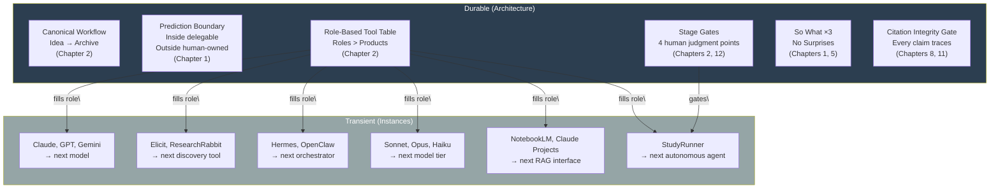

**Figure 13.1 — Durable principles vs. transient tools.** The left column is the book's architecture: workflow stages, the prediction boundary, role table, stage gates, argument tests, and citation integrity. These are structural properties of scholarly work with AI. The right column is a snapshot of tools at the time of writing. Each tool fills a role defined in the architecture (arrows). When a tool is replaced, the role persists and the new tool fills it. The architecture requires no redesign; only the mapping between role and product changes.

---

## 13.9 Closing: The Book's Central Argument, Restated

AI-native research is not about writing faster. It is about **thinking more rigorously, evidence-groundedly, and reflectively, with AI as an organ you have learned to relate to correctly.**

This has been the argument of every chapter:

- **Chapters 1–3** established the conceptual foundation: contribution-first thinking, the prediction boundary, the orgamite paradigm, source-grounded memory.
- **Chapters 4–7** built the workflow: literature as pipeline (not pile), question-forming as narrowing, study design as methodological matching, analysis as human-owned interpretation.
- **Chapters 8–11** addressed the writing itself: sourced prose, multi-agent orchestration, adversarial review simulation, citation integrity, venue-specific disclosure.
- **Chapter 12** automated the pipeline: agent trees, cron jobs, cost routing, reproducibility.
- **Chapter 13** (this chapter) ensured the entire system adapts: roles over products, principles over features, human judgment over mechanistic delegation.

The through-line is not a tool. It is a stance: **structure determines quality**. A well-designed workflow with modest tools outperforms an undirected workflow with the best model. This was true when the syllabus that informed this book was written (课程详细计划_8节.md, Session 0.4: "tool stack logic roles, not product loyalty"). It will be true when the next generation of models makes today's tools obsolete.

The future belongs not to the researcher with the most powerful model. It belongs to the researcher who has designed a workflow that makes the model accountable.

---

## 13.10 Staying Current: A Reading List

No book can stay current. The following sources will. Check them quarterly.

### For model capabilities and limitations

- **Anthropic Research Blog** (https://www.anthropic.com/research) — Interpretability, capability evaluations, and safety research from the Claude team. Valuable for understanding what models can and cannot do at a mechanistic level.
- **OpenAI Research** (https://openai.com/research) — Capability benchmarks and system cards. Read the system cards for honest limitation disclosure.
- **arXiv: cs.CL and cs.HCI** — The primary literature. Use the Trend Scout pipeline (Chapter 12) to monitor.

### For HCI/AI research practice

- **ACM CHI Proceedings** — Watch for changes to review guidelines, AI disclosure requirements, and emerging contribution types.
- **ACM TOCHI (Transactions on Computer-Human Interaction)** — Methodological papers that often establish or challenge evidence standards.
- **SIGGRAPH Art Papers + Leonardo** — For Digital Art researchers, these venues are where the norms for AI-augmented practice-based research are being negotiated.

### For research integrity and AI ethics

- **COPE (Committee on Publication Ethics)** — Guidelines on AI and authorship. These are adopted by most major publishers.
- **ACM Publications Board — AI Statements Policy** — The specific disclosure requirements for ACM venues.

### For workflow evolution

- **"Bridging the Prospected Actual" AI Workflow Resources** (referenced in Plan.md and syllabus) — The original workflow report that informed the syllabus. Updated periodically.

### A practice, not a list

The reading list is not a reading assignment. It is a **monitoring protocol.** Set up a quarterly alert. When a venue updates its AI disclosure policy, note it. When a new capability (multimodal reasoning, agentic execution) appears in a system card, evaluate its role-potential using the framework in Section 13.2. When a tool in your role table changes pricing or features, check whether a better option has emerged. The monitoring itself should follow the principle from Chapter 12: AI scans, human selects.

---

## Expected Outputs

After reading this chapter and completing the exercises, you should be able to produce:

1. **A durability assessment** of any current tool in your workflow — classified by the role it fills, with a plan for what you would do if it disappeared
2. **A role-potential evaluation** of one new tool (real or hypothetical) using the three-question framework from Section 13.2
3. **A future-proofed workflow document** that maps each stage of your research to roles (not products), with open-format file standards and explicit human gates
4. **A personal human-role statement** — one paragraph articulating what you own in your research that cannot be delegated, now or in any foreseeable future

---

## Best Practices

1. **Build around roles, not products.** When configuring your workflow, specify the role first. The product is an implementation detail.
2. **Gate at judgment points, not production points.** As more production tasks automate, protect the judgment-intensive gates: contribution claim, interpretation, ethical approval, final submission.
3. **Audit annually, not monthly.** Tool churn is high; principles are stable. Review your workflow once a year and update incrementally.
4. **Maintain the reproducibility bundle.** It is your insurance against tool obsolescence and your infrastructure for future disclosure.
5. **Treat new tools as role-candidates, not as upgrades.** Evaluate by role-potential (Section 13.2): what role does it fill, what failure mode does it introduce, what happens if it disappears?
6. **Own what the model cannot.** Interpretation, question-forming, ethical judgment, and stylistic divergence are human territory. As AI expands, move your effort there.

---

## Anti-patterns

1. **The tool-chaser.** Redesigning their workflow every time a new model is released. The workflow becomes unstable; research output drops during each migration. Better: wait, evaluate, adopt only when a clear role is better filled.
2. **The capability-optimist.** "Soon AI will be able to do X, so I don't need to learn X." Even if true in the future, you still need X now to evaluate whether the AI's output is correct. You cannot verify what you do not understand.
3. **The architecture-denier.** "This time is different — the new model makes the old principles obsolete." It does not. The prediction boundary moves; it does not vanish. The roles persist; only the products change.
4. **The passive futurist.** Reading about AI trends but not updating their workflow. The point of trend awareness is to make concrete adaptation decisions, not to be impressed.
5. **The disclosure-afterthought.** Treating AI disclosure as a final-step formality rather than a process documented from day one. The reproducibility bundle makes disclosure automatic. Without it, you will not remember which tools did what.

---

## Checklist

Before closing this book, verify:

- [ ] I can distinguish between a durable trend (multimodal reasoning, deeper OS integration, rising review standards) and a transient one (a specific product's pricing, a specific model's benchmark score)
- [ ] I can evaluate a new tool using the three-question role-potential framework (role, failure mode, dependency risk)
- [ ] I can articulate the four enduring human roles (question-forming, contribution-framing, ethical judgment, taste/style) and explain why they persist
- [ ] I can name what will change (rigor baseline, reproduction expectations, literature pace) and what will not (contribution claim, So What ×3, citation integrity, human judgment)
- [ ] My workflow is built around roles, not products — I can swap any tool without redesigning stages or gates
- [ ] My reproducibility bundle (Chapter 12) is set up from day one and documents process, not just output
- [ ] I have a quarterly monitoring practice for model capabilities, venue policies, and tool changes
- [ ] I can state the book's central argument in one sentence: structure determines quality; the human owns judgment; AI is infrastructure

---

## References

- **Chapter 1: The AI-Native Researcher** — Prediction boundary, orgamite paradigm, contribution types, So What ×3, the human role shift. This chapter extends all into the future.
- **Chapter 2: Research Operating Systems** — The canonical workflow, role-based tool table, the tool half-life principle, the adversarial workflow, orchestration vs. generation. Chapter 13's framework is an application of Chapter 2's architecture to future tooling.
- **Chapter 5: Ideation and Gap Analysis** — The narrowing process, tension-based question formation, Trend Scout operation. The human role in question-forming (Section 13.3) is the same role that Chapter 5 operationalizes.
- **Chapter 9: Multi-Agent Writing Systems** — Agent role definitions, failure modes, the adversarial editing loop. Section 13.4's StudyRunner example maps new capabilities onto this existing agent framework.
- **Chapter 10: Reviewer Simulation** — Mode E reviewing, acceptance prediction, the limits of simulation. Section 13.4's "reviewers will assume AI assistance" is a direct extension of Chapter 10's calibration argument.
- **Chapter 12: Automation and Scaling** — The four human gates, the reproducibility pipeline, cost-optimized model routing. Section 13.6's "designing for adaptability" is the application of Chapter 12's principles to a future-tool context.
- **Syllabus (课程详细计划_8节.md)** — Section 0.4 ("tool stack organized by roles; products reviewed and updated before each offering"), Section 0.6 (AI usage rules: "AI proposes, human disposes"). This chapter's "roles > products" argument is the syllabus's core pedagogical stance, extended to a future-facing context.
- **Plan.md** — Multi-agent architecture and adversarial workflow design. The agent tree that Chapter 13 maps new capabilities onto.
- **Wobbrock, J. O., & Kientz, J. A. (2016).** Research contributions in human-computer interaction. *Interactions*, 23(3), 38–44. [Source of HCI contribution taxonomy; the types persist even as new, AI-specific contribution types emerge.]


---

<a id="appendix-a-prompt-templates"></a>

# Appendix A: Prompt Templates

This appendix collects every reusable prompt template in the book, organized by workflow stage. Each template includes the prompt text, when to use it, the key constraints that make it work, and the chapter where it is discussed in detail. Templates follow the architecture defined in the master specification: Persona → Objective → Context → Constraints → Expected Output → Verification.

Every template that involves generating or synthesizing claims includes the `[UNSOURCED]` safety valve. This is not optional. The marker exists because a model without a source for a claim will fabricate a citation, generate a vague claim that sounds supported, or omit the claim entirely — all more readily than flagging the gap unless explicitly instructed otherwise. The `[UNSOURCED]` instruction makes flagging the path of least resistance.

---

## A.1 Ideation Templates

These templates move a broad interest through narrowing, gap detection, and identity articulation. The AI's role throughout is critic and questioner — never the author of your research question.

### A.1.1 Narrowing Interest → Research Question

```text
Role: Research methodology mentor.

Here is my research identity:
[paste research_identity.md — interests, theoretical commitments,
methodological tendencies, 2–3 anchor papers]

Here is my broad interest:
[one paragraph — a domain or phenomenon, not a question]

Do NOT write a research question for me. Instead:
1. List 3 assumptions my interest implicitly makes about the
   phenomenon.
2. Identify where novelty might exist and where it probably
   does not (name the specific gap type: theoretical,
   methodological, or empirical).
3. Judge whether my interest is too broad for one paper or
   too narrow for a meaningful contribution.
4. Ask me 3 questions whose answers will help me converge on
   a research question I can answer given my resources, access,
   and timeline.

After I respond to your questions, I will draft my own
research question and return it to you for challenge.
```

**When to use it:** When you have a broad topic or domain interest and need to identify the specific, unresolved tension that could anchor a paper. Use at the IDEATION → QUESTION transition (Stage 2 of the canonical workflow).

**Key constraints:**
- The model must NOT write the research question. It identifies assumptions, challenges novelty, and poses questions *to you*.
- The model must evaluate scope — too broad for one paper or too narrow for significance.

**Source:** Chapter 5 (Section 5.2, Narrowing Process); Session 4 of the course syllabus (Section 4.1 AI's role).

---

### A.1.2 Gap Hunter

```text
I have a literature synthesis matrix with [N] rows. Here it is:
[paste matrix — columns: id, author_year, method, sample,
 core_finding, linkage, inclusion_rationale]

Identify gaps across these sources. Ground every gap in the
matrix — do not import external knowledge.

For each gap:
1. Classify it: theoretical / methodological / empirical
2. State the specific absence as one sentence
3. Cite the matrix rows that demonstrate the absence (e.g.,
   "Rows 3, 7, 12 all measure cognitive load but none measure
   it during prolonged use — a methodological gap if the
   research question concerns extended interaction")
4. Rate the gap's actionability: can one paper fill it?

Constraints:
- Every gap must be linked to specific matrix rows.
- Do not suggest gaps that exist in the world but not in my
   matrix — only absences visible in the provided data.
- If the matrix itself is too thin to support a gap claim,
   say so and name what additional papers would be needed.
```

**When to use it:** After building a literature synthesis matrix (≥15 rows, Stage 3 of the literature pipeline). Use before finalizing your research question to verify that a real, specific absence exists.

**Key constraints:**
- Gaps must be grounded in the matrix — the model cannot import external papers or claims.
- If the matrix is insufficient to establish a gap, the model must say so rather than manufacture one.
- Each gap must be classified by type (theoretical, methodological, empirical).

**Source:** Chapter 5 (Section 5.4, Gap Hunting); *AI Research Assistant Prompting Guide.md* (Gap Hunter template).

---

### A.1.3 Identity File (Research Identity)

```text
I am building a research identity file to improve every
downstream AI interaction. Here is my draft:
[partial draft or blank structure below]

Fill in or refine each section. Where my entries are too
generic, challenge me with a specific question that would
sharpen them.

## Structure

1. Research interests (specific to the question level, not
   domain level):
   - What specific question drives my work?
   - What population, phenomenon, or system do I focus on?

2. Theoretical commitments:
   - HCI track: which frameworks organize my thinking?
   - Art track: which philosophical anchor(s) ground my practice?

3. Methodological tendencies:
   - Which paradigms do I work within? Which do I reject?
   - What counts as evidence in my view?

4. Anchor papers (2–3):
   - [paper]: why its structure or argument succeeds as a model
   - [paper]: what it demonstrates about the kind of work
     I want to produce

5. Voice description:
   - How do I sound when I am at my best as a writer?
   - What stylistic tics or disciplinary vocabularies define
     my prose?

6. Known blind spots:
   - What do I tend to overlook in my own work?
   - What does my target venue's reviewing culture catch that
     I usually miss?

Constraints:
- Push back on any entry that could describe any researcher.
  If an entry is that generic, it is not yet useful.
- Challenge me to make each entry specific, concrete, and
  actionable for an AI trying to adopt my perspective.
```

**When to use it:** At the start of any project (Stage 0, before the canonical workflow begins). The identity file is the foundation that makes every downstream prompt return output calibrated to your actual research.

**Key constraints:**
- Entries must be specific enough to distinguish you from any other researcher. "I am interested in HCI" is not sufficient; "I study how AR target-selection modality interacts with target size for users with motor tremor" is.
- The identity file is a living document — update it as your project crystallizes.

**Source:** Chapter 2 (research identity foundation); Session 2 of the course syllabus (Research Identity file exercise, Section 1.35).

---

## A.2 Literature Templates

These templates support the four-stage literature pipeline: Discovery → Network → Extraction → Consensus. The output is always structured data that feeds the next stage.

### A.2.1 Literature Matrix Extraction (Elicit → Human Correction)

```text
Research question: [paste your finalized research question]

Target columns to extract from each paper:
- Author / Year
- Study Design (be specific: "within-subjects experiment,
  3 conditions" not "controlled experiment")
- Sample (participants, artifacts, corpus — with demographics
  where available)
- Core Finding (one sentence, with effect sizes or boundary
  conditions if the paper reports them)
- Limitations (only those explicitly stated by the authors)

Working from these papers:
[list of paper titles / PDFs / DOIs — the curated 15–25 from
Stage 2 of the literature pipeline]

Extract the target columns for each paper. Then, for papers
where you are uncertain about any field, mark the cell with
[LOW CONFIDENCE].

After extraction, I will:
- Correct errors in Author, Year, Study Design, Sample
- Sharpen Core Finding with specificity you missed
- Replace generic Limitations with ones from the paper
- Add Linkage (how each paper connects to others)
- Add Inclusion Rationale (human-written — why this paper
  is in my matrix)

You extract. I verify and own.
```

**When to use it:** At Stage 3 of the literature pipeline, after Discovery (30–60 candidate papers) and Network (curated to 15–25) are complete. Use with Elicit or any batch extraction tool, followed by human correction.

**Key constraints:**
- The model must mark uncertain cells with `[LOW CONFIDENCE]` rather than guessing.
- Limitations must be explicitly stated by the authors — not invented.
- Human correction is mandatory. The extraction is the first draft; the corrected matrix is the authorized source.

**Source:** Chapter 4 (Section 4.4, Structured Extraction); Session 4 of the course syllabus (Elicit demonstration).

---

### A.2.2 Related-Work Outline

```text
Here is my literature synthesis matrix:
[paste CSV — columns: id, author_year, method, sample,
 core_finding, linkage, relevance_to_our_work,
 inclusion_rationale]

My contribution claim: [one sentence]
My research question: [one sentence]

Using ONLY the matrix entries, produce a related work outline
(bullet points, not prose paragraphs):

1. Group the papers into 3–4 thematic clusters. For each
   cluster, name the theme in 3–5 words.
2. Within each cluster, state:
   - What consensus exists (what most papers agree on)
   - What分歧 exists (where papers disagree)
   - Where the silence is (what no paper addresses)
3. End the outline with the gap my work fills — stated as
   a specific absence visible in the matrix.
4. Map each outline point to specific matrix row IDs.

Constraints:
- Do not introduce any source not in the matrix.
- If a claim cannot be supported by matrix rows, mark it
  [UNSOURCED].
- No prose paragraphs. Bullet points only at this stage.
- The outline must end with the gap my work addresses —
  not a generic "more research is needed."
```

**When to use it:** After the literature matrix is complete (≥15 rows, all with human-written inclusion rationale). Use before drafting the related work section to establish the thematic architecture.

**Key constraints:**
- Only matrix entries may be used — no external sources.
- `[UNSOURCED]` marks any claim that lacks matrix support.
- Output is bullets only — prose comes later (Chapter 8).

**Source:** Chapter 4 (Section 4.4, matrix as authorized source); Session 4 of the course syllabus (outline prompt template).

---

### A.2.3 Consensus Check

```text
I am building my paper on the following foundational claims.
For each, check whether the claim has consensus support or is
contested in the literature.

Claims my argument depends on:
1. [claim — e.g., "Gaze+pinch reduces target-selection time
   compared to dwell in optical see-through AR"]
2. [claim]
3. [claim]

For each claim:
- Run Consensus or an equivalent synthesis: does the general
  literature support, contradict, or leave this claim unresolved?
- Run scite-style analysis on the key papers: how many
  supporting, mentioning, and contrasting citations exist?
- Classify the claim's consensus status:
   - consensus: multiple papers agree
  - mixed: disagreement but majority supports
  - contested: significant disagreement or direct
    contradiction by later work
  - unverified: insufficient citing papers to judge
- If the claim is contested or mixed, provide the 3 strongest
  contradictory citations (author, year, what they found).

If any foundational claim is contested, I need to decide:
(a) rely on it and acknowledge the controversy,
(b) avoid it and find an alternative foundation, or
(c) make the controversy my contribution.

Give me the consensus data. I will make the decision.
```

**When to use it:** At Stage 4 of the literature pipeline, after extraction is complete and before writing begins. Anytime your paper's argument depends on prior work being valid.

**Key constraints:**
- Foundational claims are those your own argument depends on — not every paper needs consensus verification.
- The model provides consensus data but does not decide whether to rely on a contested claim. That is a human decision.
- Status classification must be one of: consensus, mixed, contested, unverified.

**Source:** Chapter 4 (Section 4.5, Consensus Verification); Session 4 of the course syllabus (Consensus and scite demonstration).

---

## A.3 Study Design Templates

These templates produce method drafts, coding proposals, and RtD reverse engineering. The critical discipline: AI drafts, human audits. The audit checklist is always human-written.

### A.3.1 Method Drafting with Audit (Experimental)

```text
Paradigm: [Controlled experiment / within-subjects /
between-subjects / mixed]
Research question: [paste from 01_research_question.md]
Contribution type: [e.g., Empirical (comparative)]
Domain context: [paste 2 paragraphs from your identity file —
  domain, prior work, known confounds]

Draft the method section with these headers:
1. Experimental Design
2. Participants (include inclusion/exclusion criteria)
3. Apparatus
4. Procedure
5. Measures
6. Analysis Plan

For each section, mark any claim that requires my domain
verification with [VERIFY]. Do not populate measures I did
not specify — if I name a construct, do not select the
questionnaire for me unless I provide it.

Then, separately, list:
- 5 confounds this domain's reviewers would ask about
- Population-specific ethics concerns for the participant
  pool I named
- Internal validity threats I may not have addressed

Constraints:
- The Method section is MY responsibility. Your draft is
  the first input — I rewrite and own.
- [VERIFY] tags identify claims that need my domain
  knowledge. Do not resolve these yourself.
- If you do not know the domain-specific measure, say:
  "I do not know the standard instrument for this
  construct in this subfield. The human author must specify."
```

**When to use it:** After your research question is finalized and your paradigm is declared. Use at the METHOD stage of the canonical workflow.

**Key constraints:**
- Paradigm must be declared first. Without it, the model defaults to a generic experimental template.
- `[VERIFY]` tags protect claims requiring domain knowledge — the model does not resolve them.
- Measure selection does not drift to the AI unless the human specifies the instrument.

**Source:** Chapter 6 (Section 6.2, Controlled Experiment); Session 5 of the course syllabus (HCI track method drafting).

---

### A.3.2 Qualitative Code Review

```text
I am conducting a [thematic analysis / grounded theory /
other approach] study. My research question:
[paste]

Here are [N] pages of interview transcript:
[attach or paste]

Do the following:
1. Propose 15–25 initial codes. Each code must be a short
   phrase with a 1-sentence definition and an illustrative
   quote from the transcript (include line numbers).
2. Group the candidate codes into 4–7 tentative categories.
3. Flag any codes that seem to point in conflicting
   directions.

Constraints:
- Do not interpret. Propose, do not conclude.
- Every code must be tied to a specific quote.
- Mark codes where you are uncertain with [LOW CONFIDENCE].
- Do not name theoretical constructs not in the transcript.

The final codebook, mergings, renamings, and theoretical
categorization are mine. After I review and revise, I may
ask you to apply the revised codebook to additional
transcripts — but the codebook itself is owned by me.
```

**When to use it:** After qualitative data collection (interviews, field notes, think-aloud protocols) and before thematic analysis begins. Use at the CODING stage.

**Key constraints:**
- The model proposes; the human disposes. The codebook is a human-owned artifact.
- Every code must be anchored in a specific quote with line numbers — no floating interpretations.
- `[LOW CONFIDENCE]` flags codes the model is unsure about. The human decides whether to keep them.
- No theoretical constructs may be imported from outside the data.

**Source:** Chapter 6 (Section 6.3, Qualitative Research); Session 5 of the course syllabus (qualitative coding demonstration).

---

### A.3.3 RtD Reverse Engineering

```text
Paradigm: Research-through-Design (RtD).
Artwork / process notes: [paste — design rationale, process
  notes, iterations, photo descriptions]
Theoretical anchor: [e.g., individuation / cosmotechnics /
  post-phenomenology]

Help me surface the epistemic content. Do NOT fabricate
process facts I did not provide. Wherever you infer, mark
with [INFERENCE — CONFIRM].

Answer:
1. What research question does this work implicitly answer?
   (Not a hypothesis — a retrospectively reconstructed
   question.)
2. What is the contribution type per Chapter 1 taxonomy?
3. Sequence the key design decisions as a chain of conceptual
   propositions: "Decision X tests whether Y holds in
   context Z."
4. What did the making reveal that the theoretical anchor
   alone could not have predicted or arrived at? Be specific.
5. Where is the process archive thin — where would a
   reviewer ask for more evidence of the research trajectory?

Constraints:
- Honest framing: the question was retrospectively
  reconstructed from practice. Standard in RtD, provided
  it is stated as such.
- Process facts I did not provide must not appear as
  established facts — mark inferences explicitly.
- The epistemic contribution (what practice knows that
  theory alone does not) must be stated, not implied.
```

**When to use it:** When entering the workflow with a finished or near-finished artifact (Entry B in the syllabus, Session 7). Use to reverse-engineer the research argument from an existing practice.

**Key constraints:**
- The model must not fabricate process details. All inferences must be marked `[INFERENCE — CONFIRM]`.
- The retrospectively reconstructed question must be stated as retrospective — not misrepresented as an a priori hypothesis.
- The central product is the epistemic contribution: what the making revealed that theory alone could not.

**Source:** Chapter 6 (Section 6.6, RtD); Session 7 of the course syllabus (Entry B, five-step reverse engineering).

---

## A.4 Sourced Writing Templates

These templates implement the bucket method: section-by-section drafting with verified materials fed one bucket at a time. The `[UNSOURCED]` marker is the structural constraint that converts invisible failures into visible ones.

### A.4.1 Section Drafting with Constraints

```text
You are writing a [section name] for a [venue type] paper.

## Sources
[Insert bucket extraction — the ONLY material the model may
use. For related work: 5–8 relevant rows from the literature
matrix. For methods: paradigm declaration + process archive.
For results: findings tables, quotes, or statistical output.]

## Task
Draft [length constraint — e.g., "one subsection of 200–250
words"] covering [specific focus — e.g., "how cognitive load
has been measured in AR target selection studies"].

## Required structure
[Specify the argumentative shape — e.g., "Open with the
dominant measurement approach → note what it misses → close
with the gap your work addresses."]

## Constraints
- Use ONLY the sources provided above. Do not import any
  claim from general knowledge.
- End every claim with an inline citation in the format
  [Author, Year] referencing a source in the provided
  material.
- If a sentence cannot be supported by the provided
  sources, mark it [UNSOURCED] instead of dropping the
  citation.
- Do not introduce sources not in the provided material.
- Word limit: [specific number]. Stop when you reach it.
- Avoid stock transitions ("In this section, we...",
  "It is worth noting that...", "Furthermore...").

## Output format
Return only the draft text. No preamble, no "Here is your
draft," no meta-commentary.
```

**When to use it:** At the WRITING stage, for each section of the paper (methods, results, related work, introduction, discussion, abstract — in that order). Use one prompt per section, one bucket per prompt.

**Key constraints:**
- "Use ONLY the sources provided" closes the door on training-data improvisation.
- `[UNSOURCED]` is mandatory when a claim lacks source support — not optional, not a failure.
- Word limit forces prioritization. Stop when reached.
- Output is draft only — no hedging language wrapping the text.

**Source:** Chapter 8 (Section 8.3, Constraint Prompt Anatomy); Session 6 of the course syllaus (bucket method).

---

### A.4.2 [UNSOURCED] Resolution

```text
I have a draft section with [N] [UNSOURCED] markers. Here
is the draft:
[paste draft]

For each [UNSOURCED] marker, I will now do exactly one of
the following:
1. SUPPORT IT: provide a source from my literature matrix
   or a verified paper.
2. DELETE IT: the claim is not essential; remove it.
3. REWRITE IT: the claim is essential but needs rephrasing
   so it follows from provided sources — often by weakening
   the claim to what the evidence actually supports.

Here is my decision for each marker:
- Marker 1 (sentence: "[quote]"): [SUPPORT / DELETE / REWRITE]
  [if SUPPORT: source added] [if REWRITE: revised sentence]
- Marker 2 (sentence: "[quote]"): [SUPPORT / DELETE / REWRITE]
  ...

Do not resolve the markers for me. Confirm that each
decision is clear and that zero [UNSOURCED] markers remain
in the revised draft. If any marker is ambiguous, flag it.

I will then produce the revised section myself.
```

**When to use it:** Immediately after receiving any AI draft. Use before voice rewrite, before polishing, before anything else. The section is not complete until zero `[UNSOURCED]` markers remain.

**Key constraints:**
- The human makes the decision for each marker — support, delete, or rewrite. The AI does not resolve its own markers.
- Deleting the marker is not the same as resolving the claim. If the claim was essential, it still needs a source.
- The marker makes quality measurable: count the remaining markers, track resolution.

**Source:** Chapter 8 (Section 8.4, The [UNSOURCED] Marker as Safety Valve); Chapter 3 (source grounding protocol).

---

## A.5 Voice Injection Templates

AI drafts are sterile clay. These templates force the human contribution back into the prose — through significance testing (So What) and systematic voice injection.

### A.5.1 The So What Check

```text
A reviewer reading this paragraph would ask "so what?" after
reading it. I need you to identify the significance I am
not making explicit and point out any logical jumps.

[paste paragraph or section]

For each claim in the text, ask "so what?" three times in
succession:
- Level 1 (Result): What does this finding imply for the
  study's participants or immediate context?
- Level 2 (Implication): What should designers,
  researchers, or practitioners do differently?
- Level 3 (Field): How does this change what the field
  understands about a fundamental concept?

If a claim fails at any level, identify which level and why.
For failures, state explicitly what additional evidence or
argument would be needed to reach the missing level.

DO NOT rewrite the text. Give me specific feedback on:
1. Logical flow — where the argument skips steps
2. Whether the evidence supports the claims
3. Weak areas where a reviewer would push back
4. The gap between what you found and what you are saying
   about what you found
```

**When to use it:** At any stage where a claim's significance is asserted — contribution claims, gap statements, discussion implications. Use as a section-level gate before full reviewer simulation.

**Key constraints:**
- DO NOT rewrite the text. This is diagnostic only.
- All three levels must be evaluated. Claims that fail at Level 1 are findings, not contributions.
- The output is feedback to the human, who then revises.

**Source:** Chapter 5 (Section 5.7, So What ×3 in Detail); *AI Research Assistant Prompting Guide.md* ("So What?" Revision template).

---

### A.5.2 The Rewrite Checklist (Voice Injection)

```text
Here is my draft section:
[paste section — after [UNSOURCED] resolution, before voice
rewrite]

Here is my voice profile (from research identity file):
[voice description — diction, rhythm, disciplinary terminology,
stylistic tendencies]

Apply the following checklist systematically. For each item,
quote the specific sentence(s) that need changing and provide
a rewrite:

1. INJECT STANCE AND DICTION: Replace neutral language with
   my disciplinary voice. If I think in terms of "tradeoffs"
   and "boundaries," use those — not the AI's default
   "implications" and "considerations."

2. ALIGN DISCIPLINARY TERMINOLOGY: Check every term against
   my identity file. If I call it "target acquisition" in my
   identity and the draft says "selection tasks," align it.

3. STRENGTHEN SIGNPOSTING: Replace "Furthermore," "In
   addition," "It is worth noting that" with the actual
   logical relationship — contrast (But, Yet), consequence
   (So, Which means), concession (Granted, Even so).

4. VARY RHYTHM: Do all sentences have the same length? Break
   one in half. Combine two short ones into a long one.

5. READ ALOUD PREPARATION: Flag any sentence that would
   sound mechanical if read aloud — over-qualified, circling
   without landing, too even in rhythm.

After rewriting, state: "This draft now reads as [my name]
arguing, not as a generic researcher reporting."
If you cannot say that honestly, flag the remaining problems.
```

**When to use it:** After `[UNSOURCED]` resolution and before AI polishing (Phase 3 of the Chapter 8 cycle). This is the step that distinguishes your paper from anyone else's.

**Key constraints:**
- Stance injection is not synonym substitution. Replacing "shows" with "demonstrates" is not voice — voice is argumentative positioning, diction, and rhythm.
- Signposting must convey the *type* of logical connection, not just signal that a connection exists.
- If the draft still sounds generic after rewriting, it is not done.

**Source:** Chapter 8 (Section 8.6, Voice Injection); Session 6 of the course syllabus (voice injection checklist).

---

## A.6 Reviewer Simulation Templates

These templates simulate the review process before it happens for real. They are the rehearsal that fixes what rehearsal can fix — and nothing else.

### A.6.1 Mode E Full Review

```text
You are a reviewer for [CHI / ISMAR / ISEA]. You have been
assigned the following paper. Evaluate it as you would in
a real review.

<input>
  Paper draft: [full text of the draft under review]
  Target venue: [CHI / ISMAR / ISEA]
  Contribution claim: [one-sentence claim from the paper]
</input>

<procedure>
  1. READ as a target-venue reviewer. Adopt the standards,
     expectations, and critical posture of [venue] reviewers.

  2. RUN So What ×3 on the contribution claim. Record all
     three levels. If the claim fails at any level, note
     which level and why.

  3. RUN No Surprises. Compare the abstract against the
     body. List every mismatch.

  4. CHECK structural properties:
     a. CONTRIBUTION TYPE CLARITY — is it clear what type
        this is? Does the evidence match the type?
     b. GAP ESTABLISHMENT — does the related work build a
        gap or produce an annotated bibliography?
     c. METHOD-CLAIM ALIGNMENT — does the method test what
        the claim asserts?
     d. VALIDITY ACKNOWLEDGMENT — are specific threats
        acknowledged, not generic limitations?

  5. DELIVER 3 MAJOR and 3 MINOR issues. MAJOR = would likely
     trigger rejection. Each must include a specific fix.

  6. SCORE each dimension 1–5:
     - Novelty, Method Quality, Clarity, Significance
</procedure>

<constraints>
  - You are NOT the author. Do not defend the paper.
  - Be specific: "the method is weak" is not useful.
  - Do not suggest the author cite your own work.
  - Base scores on the actual text, not on what you imagine
    the paper could have said.
</constraints>

<output_format>
  ## Summary
  ## So What ×3
  ## No Surprises
  ## Structural Checks
  ## MAJOR Issues (with specific fixes)
  ## MINOR Issues
  ## Scores (Novelty / Method Quality / Clarity / Significance)
  ## Recommendation (accept / weak accept / borderline /
     weak reject / reject)
</output_format>
```

**When to use it:** After all sections have passed the Chapter 8 quality gates (zero `[UNSOURCED]`, voice rewrite complete, style gate passed). Use on a complete draft or on individual sections that are through Phase 4 of the writing cycle. Never run Mode E on a structurally incomplete draft — the feedback will be obsolete when the deeper problems are fixed.

**Key constraints:**
- The model must not defend the paper. It is the reviewer, not the author's advocate.
- Every MAJOR issue must include a specific fix, not just a complaint.
- If a section is missing or incomplete, flag it and skip the corresponding check rather than inferring content.

**Source:** Chapter 10 (Section 10.2, Mode E Reviewing); Session 6 of the course syllabus (reviewer simulation demonstration).

---

### A.6.2 Iterative Grading (Introductions and Conclusions)

```text
Rate this [introduction / conclusion] on a 1–10 scale for
each of the following dimensions:

1. Clarity (1–10): Can a [target venue] reader understand
   the contribution claim, its motivation, and its scope
   within 60 seconds?

2. Academic Tone (1–10): Does the prose match the register
   of [venue]? [CHI: direct, precise, active voice.
   Leonardo: reflective, theoretically engaged. ISEA:
   comfortable with abstraction.]

3. Compelling Synthesis (1–10): Does the section make a
   case for why this contribution, at this moment, to this
   audience?

For any dimension scored below 8:
- Quote the specific sentence(s) that fail
- Explain what is wrong — not just "unclear" but the
  specific weakness ("the contribution claim appears in
  sentence 4 instead of sentence 2, forcing the reader
  to hold context for three sentences")
- Provide a specific, concrete improvement

Return: scores per dimension, specific failures, specific
fixes.

I will revise and resubmit. We repeat this loop until:
- All dimensions score at least 7, AND
- No dimension scores below 7 twice in a row, OR
- Two consecutive iterations produce the same scores with
  no new actionable feedback (convergence).
```

**When to use it:** For introductions, conclusions, and discussion sections — the short, high-signal sections where 1–3 iterations yield measurable improvement. Not for methods or results (Mode E is stronger for those).

**Key constraints:**
- Stopping criteria: two consecutive identical scores with no new feedback = convergence. Further revision is style preference, not improvement.
- Each failure must quote specific sentences. Vague feedback ("it's unclear") is not useful — the fix must name the structural problem.
- The human revises; the model grades. The model does not rewrite the section.

**Source:** Chapter 10 (Section 10.4, Iterative Grading); *AI Research Assistant Prompting Guide.md* (Iterative Grading template).

---

### A.6.3 Adversarial Self-Review

```text
Read the following paper draft. You are a hostile reviewer
whose goal is to reject the paper. Your job is to find
every weakness that could justify rejection.

[paste full draft]

Answer these questions — for each, quote the specific
sentence(s) in the paper and explain the problem:

1. What conclusions exceed the data's support? For each
   overclaim: what does the paper actually show vs. what
   does it claim to show? What evidence would be needed
   to support the claim but is missing?

2. What evidence could rebut the main argument? Identify
   3 specific findings, studies, or arguments — from the
   literature or from first principles — that contradict
   or weaken the central claim.

3. Generate 3 evidence-based objections a hostile reviewer
   would raise. Each must be grounded in:
   - A specific limitation of the paper's method or data
   - A logical jump between evidence and conclusion
   - An alternative explanation the paper did not rule out

4. Identify logical jumps: places where the paper moves
   from evidence to claim without showing the intermediate
   steps. Quote the gap and provide the missing reasoning.

5. The "so what would it take" test: For each key claim,
   state what additional evidence would be needed to make
   the claim robust. If the paper already has that evidence,
   note it. If not, note the cost of obtaining it.

Do not be polite. Be specific. The goal is to find every
weakness a real hostile reviewer could use.
```

**When to use it:** After all MAJOR issues from Mode E have been addressed. This is the final internal check — it finds the weaknesses that a reviewer who *wants* to reject would exploit, including logical jumps that are technically supported but defensively missing.

**Key constraints:**
- DO NOT run this on a draft that has not passed Mode E. Mode E catches structural problems; adversarial review catches argumentual vulnerabilities in an otherwise sound draft.
- The output is diagnostic — it identifies weaknesses but does not fix them. The human decides how to address each one.
- If a weakness cannot be fixed retroactively (e.g., a missing experimental condition), the adversarial output should note the reframing or acknowledgment that resolves it.

**Source:** Chapter 10 (Section 10.5, Adversarial Self-Review); Session 6 of the course syllabus (adversarial self-review demonstration).

---

## A.7 Submission Templates

The final stage is not where you confirm quality — it is where you confirm that the quality you think you have is real.

### A.7.1 Citation Integrity Gate

```text
I am at the final citation integrity gate. Here is my
manuscript and bibliography:

[full manuscript text]
[full bibliography / .bib file]

Execute the four-step gate:

STEP 1 — CROSS-CHECK:
Generate two lists: (A) all unique citation keys from
the manuscript, (B) all entries in the bibliography.
Compare. Flag:
- Any citation in A not in B (missing reference)
- Any entry in B not in A (orphaned reference)
- Any key with a near-match typo (tanaka21 vs. tanaka2021)

STEP 2 — EXISTENCE CHECK:
For each bibliography entry, confirm the work actually
exists and metadata matches (author, title, venue, year).
Use Google Scholar, Semantic Scholar, or DOI resolution.
For references where you cannot confirm existence, mark
[VERIFY — NOT CONFIRMED]. I will manually check these.

STEP 3 — DOI RESOLUTION:
For each reference with a DOI, confirm it resolves to the
the correct paper. Mark any DOI that resolves to a 404,
a different paper, or an unrelated domain as
[VERIFY — DOI MISMATCH].

STEP 4 — SUPPORT CHECK (sample):
For a sample of [10] in-text citations, locate the
specific passage in the source paper that supports the
claim. For each, confirm:
- The source makes the specific claim attributed to it
- The source's findings support the direction of the claim
- The source's context matches the claim's context
For any citation where the source does not support the
claim, mark [VERIFY — SUPPORT FAILED].

Output: a structured report with findings per step and
a count of items requiring my manual verification.

I will resolve every [VERIFY] item before submission.
No [VERIFY] item may remain unresolved.
```

**When to use it:** At the SUBMISSION stage, after reviewer simulation is complete and all major revisions are incorporated. This is the most important gate in the entire workflow — fabricated citations are the most common and most damaging AI failure mode in academic writing.

**Key constraints:**
- Steps 1–3 catch fabrication (references that don't exist). Step 4 catches misattribution (real references cited for claims they don't make).
- Step 4 is the step most researchers skip. It is the one that prevents the most damaging non-fabrication failure. It is also the most time-consuming (2–4 hours for 30 references).
- No `[VERIFY]` item may remain unresolved. A single unresolved item means the paper is not ready.

**Source:** Chapter 11 (Section 11.2, The Four-Step Citation Integrity Gate); Session 8 of the course syllabus (citation integrity gate).

---

### A.7.2 Spine Check (Argument Consistency)

```text
Read the following paper. I will give you the abstract,
then the first and last sentence of each section. Do not
re-read the full text.

[Abstract]
[First/last sentences of each section]

Trace the single argument spine:
1. What does the abstract promise?
2. Does the related work establish the gap that the
   method addresses?
3. Does the method test what the introduction said would
   be tested?
4. Do the findings answer the stated research question?
5. Does the discussion interpret the findings without
   introducing new claims?

For each check, answer YES, NO, or PARTIAL. For any NO or
PARTIAL:
- Identify the specific divergence
- Suggest the minimum fix (targeted edit, not rewrite)

Then run the No Surprises test:
- For each sentence in the abstract, what does a reader
  expect to find in the body?
- For each element in the body, was it foreshadowed?
- List all mismatches (overpromising and underannouncing).

Do not rewrite the paper. Diagnose only. I will fix the
breaks.
```

**When to use it:** After reviewer simulation is complete and all major revisions have been incorporated — immediately before the citation integrity gate. Running earlier wastes effort because the spine may change during revision.

**Key constraints:**
- Do not rewrite. Diagnose only. The output is a list of breaks with minimum fixes.
- The model must answer YES, NO, or PARTIAL for each of the five spine checks. "PARTIAL" means the connection exists but is weak or imprecise — name the weakness.
- The No Surprises test is part of the spine check, not a separate pass. Overpromising and underannouncing must both be listed.

**Source:** Chapter 11 (Section 11.1, The Argument Spine Check); Session 8 of the course syllabus (full paper No Surprises).

---

## Usage Notes

**Template modification.** These templates are starting points, not scripture. Adapt the venue names, section headers, and bucket structures to your project. Do not remove constraint lines — they are load-bearing.

**Model selection.** Templates that require literary or theoretical reasoning (So What, Gap Hunter, adversarial review) benefit from the strongest available model. Templates that are primarily structural (extraction, cross-checking, [UNSOURCED] resolution) can run on faster, cheaper models. See Appendix D for tool specifications and Chapter 12 for cost-optimized routing.

**The human decision point.** Every template in this appendix produces a recommendation, a draft, or a diagnosis. None of them produce a final decision. The human approves or rejects every agent recommendation. This is not a limitation of the templates — it is the core design principle of the system (Chapter 1, Chapter 2, and Session 2 of the syllabus).

**Cross-references by chapter:**

| Template | Chapter 1 | 2 | 3 | 4 | 5 | 6 | 7 | 8 | 9 | 10 | 11 |
|----------|:---:|:---:|:---:|:---:|:---:|:---:|:---:|:---:|:---:|:---:|:---:|
| A.1.1 Narrowing | | | | | 5.2 | | | | | | |
| A.1.2 Gap Hunter | | | | 4.4 | 5.4 | | | | | | |
| A.1.3 Identity File | | 2.1 | | | 5.1 | | | | | | |
| A.2.1 Matrix Extraction | | | | 4.4 | | | | | | | |
| A.2.2 RW Outline | | | | 4.4 | 5.4 | | | 8.2 | | | |
| A.2.3 Consensus Check | | | | 4.5 | | | | | | | |
| A.3.1 Method + Audit | | | | | | 6.2 | | | | | |
| A.3.2 Qualitative Coding | | | | | | 6.3 | 7.2 | | | | |
| A.3.3 RtD Reverse Eng. | | | | | | 6.6 | | | | | |
| A.4.1 Section Drafting | | | 3.7 | | | | | 8.3 | 9.4 | | |
| A.4.2 [UNSOURCED] Resolution | | | 3.7 | | | | | 8.4 | | | |
| A.5.1 So What Check | 1.4 | | | | 5.7 | | | | | 10.3 | |
| A.5.2 Rewrite Checklist | | | | | | | | 8.6 | | | |
| A.6.1 Mode E Review | | | | | | | | | 9.7 | 10.2 | |
| A.6.2 Iterative Grading | | | | | | | | | | 10.4 | |
| A.6.3 Adversarial Self-Review | | | | | | | | | 9.7 | 10.5 | |
| A.7.1 Citation Integrity | | | 3.7 | | | | | 8.4 | | | 11.2 |
| A.7.2 Spine Check | 1.4 | | | | | | | | | | 11.1 |


---

<a id="appendix-b-agent-library"></a>

# Appendix B: Agent Library

This appendix is a flip-to reference for every agent in the canonical multi-agent tree. Each section opens with a quick-reference table listing all agents in that team, followed by detailed per-agent tables with the fields you need to configure, invoke, and debug each role.

**Field definitions:**
- **Role** — the agent's name in the tree
- **Team** — which team the agent reports to
- **One-Line Responsibility** — what the agent does, in one sentence
- **Primary Model Recommendation** — the best-fit model for this agent's task (see Section 9.11 for cost-routing rationale)
- **Input Source** — what the agent reads before it begins
- **Output Destination** — the file or artifact the agent produces
- **Key Tool** — the tool the agent relies on most (not the model — the external tool or database)
- **Failure Mode** — the most likely way this agent fails when misconfigured or unattended

Cross-references to the chapters where each agent is used appear in the notes below each table and in the summary at the end of the appendix.

---

## B.1 Editor-in-Chief

| Role | Team | One-Line Responsibility | Model | Input | Output | Key Tool | Failure Mode |
|------|------|------------------------|-------|-------|--------|----------|-------------|
| Editor-in-Chief | — (root) | Orchestrates the workflow: assigns tasks, collects outputs, detects disagreements, routes conflicts, produces merged recommendations, presents to human for decision | Claude Opus / GPT-5.5 | All agent outputs, stage gate status, project memory | Merged action items, conflict adjudications, final integrated manuscript | Hermes / OpenClaw | Becomes a passive relay; fails to adjudicate disagreements |

**Notes:**
- The Editor-in-Chief does not generate paper text (Section 9.10).
- Modeled on the lab PI: sets direction, resolves conflicts, makes final calls after human approval (Section 2.3).
- Must enforce stage gates defined in Appendix C.
- Failure mode is critical: a passive orchestrator is a postal service, not an editor-in-chief (Anti-patterns, Section 2).

**Used in:** Chapter 2 (architecture), Chapter 9 (orchestration), Chapter 12 (automation).

---

## B.2 Research Director Team

| Role | Team | One-Line Responsibility | Model | Input | Output | Key Tool | Failure Mode |
|------|------|------------------------|-------|-------|--------|----------|-------------|
| Trend Scout | Research Director | Monitors target venues for emerging themes, citation spikes, and methodological shifts | GPT-5.5 | Seed papers, citation network data, target venue list | `trend_report.md` — top 5 emerging themes, declining themes, methodological shifts, key papers | ResearchRabbit, Litmaps, Semantic Scholar | Confuses popularity with importance; detects conference artifacts rather than intellectual shifts |
| Gap Hunter | Research Director | Identifies structural gaps in the citation network — disconnects between subfields or unapplied methodological approaches | GPT-5.5 | Literature matrix (≥15 rows), citation network data, research question | `gap_analysis.md` — ranked gaps with evidence, feasibility, relevance | ResearchRabbit, Litmaps, Connected Papers | Finds gaps that are gaps because the question is uninteresting; confuses citation disconnect with knowledge disconnect |
| Literature Miner | Research Director | Runs the four-stage discovery pipeline (discovery → network → extraction → consensus) and maintains the literature matrix | Elicit + NotebookLM (tool task, not reasoning) | Research question, seed papers (3–5), target databases | `literature_matrix.csv`, `consensus_report.md` | Elicit, Semantic Scholar, ResearchRabbit, Consensus, scite, Zotero | Treats AI extraction as ground truth; includes irrelevant papers; misses non-English or older foundational work |

**Team notes:**
- The Research Director manages the front end of the workflow: idea → trend → gap → literature (Section 2.3).
- Trend Scout and Gap Hunter require GPT-5.5's breadth for brainstorming and broad literature awareness (Section 9.11).
- Literature Miner is a tool task — Elicit handles discovery and extraction; the human verifies every row.
- All three agents feed into the Gap Analysis gate (Appendix C) before the literature stage is deemed complete.

**Used in:** Chapter 4 (literature pipeline), Chapter 5 (ideation and gap analysis), Chapter 9 (agent definitions).

---

## B.3 Theory Team

| Role | Team | One-Line Responsibility | Model | Input | Output | Key Tool | Failure Mode |
|------|------|------------------------|-------|-------|--------|----------|-------------|
| HCI Theorist | Theory Team | Proposes conceptual frameworks connecting findings to broader HCI theory | Claude Opus | Contribution claim, research findings, theoretical framework file | `theoretical_framework.md` — 2–3 candidate frameworks with origins, constructs, mapping, contributions, requirements, risks | NotebookLM (for theory literature) | Proposes unfalsifiable frameworks; suggests frameworks requiring data the study did not collect; uses theory as decoration |
| Digital Art Critic | Theory Team | Connects artistic practice to theoretical discourse; ensures epistemic (not just aesthetic) contribution | Claude Opus | Artwork description, process documentation, theoretical anchor | `epistemic_contribution.md` — epistemic contribution, theoretical anchor engagement, medium/method knowledge, claims requiring evidence | Claude (reasoning), NotebookLM | Confuses description with argument; applies theory as a sticker; over-claims epistemic contribution |
| Philosophy Reviewer | Theory Team | Reviews philosophical and epistemic foundations for conceptual clarity and logical validity | Claude Opus | Contribution claim, theoretical framework, key arguments | `philosophy_review.md` — conceptual clarity, logical validity, scope appropriateness, assumptions needing defense | Claude (reasoning) | Imposes inappropriate philosophical standards (e.g., demands falsifiability from RtD); focuses on logical minutiae while missing the big-picture argument |

**Team notes:**
- The Theory Team requires Claude Opus for deep domain reasoning and synthesis across theories (Section 9.11).
- Digital Art Critic is specific to RtD / practice-based / Digital Art research — irrelevant for standard HCI user studies.
- Philosophy Reviewer is essential for theoretical papers and Digital Art research engaging philosophical frameworks; wasteful for straightforward empirical studies.
- All three agents propose — the human chooses the final framework (Chapter 9, Section 9.4).

**Used in:** Chapter 6 (study design), Chapter 9 (agent definitions).

---

## B.4 Methods Team

| Role | Team | One-Line Responsibility | Model | Input | Output | Key Tool | Failure Mode |
|------|------|------------------------|-------|-------|--------|----------|-------------|
| UX Researcher | Methods Team | Designs the study protocol — recruitment, apparatus, procedure, measures, analysis plan | Claude Sonnet 5 | Research question, contribution claim, paradigm, domain context | `method_draft.md` (full method section), `audit_checklist.md` (confounds, ethics, validity threats) | Claude (reasoning), Zotero | Defaults to convenience sampling; produces over-ambitious designs; uses template language mismatching the actual paradigm |
| Statistician | Methods Team | Advises on the quantitative analysis plan — test appropriateness, assumptions, power, misinterpretations — but does NOT interpret results | Claude Sonnet 5 | Research design (factors, levels, DVs), data structure, analysis plan draft | `statistical_advice.md` — test appropriateness, assumption checks, violation handling, effect size/power, misinterpretation warnings | Claude (reasoning), R or Python (power analysis) | Suggests tests that are technically correct but answer the wrong question; fails to flag multiple-comparison problems |
| Qualitative Coding Agent | Methods Team | Proposes initial codes from interview/transcript data and groups codes into candidate themes | Local model (Qwen3, DeepSeek-R1) | Interview transcripts or field notes, research question, paradigm | `codebook_proposal.md`, `theme_candidates.md` | Local model (data must not leave the local environment) | Over-interprets (imposes model assumptions); induces from theory instead of data; fragments or over-aggregates codes |
| Ethics Reviewer | Methods Team | Flags ethical issues (consent, vulnerability, data handling, harm) before IRB submission — does NOT replace IRB review | Claude Sonnet 5 | Study protocol, participant population, data collection/storage plan | `ethics_review.md` — consent adequacy, vulnerability, privacy, harm, retention/sharing plan | Claude (reasoning) | Flags non-issues (over-cautious); misses cultural/institutional context; provides false reassurance |

**Team notes:**
- All Methods Team agents use Claude Sonnet 5 except Qualitative Coding Agent, which requires a local model when processing confidential data (Section 9.11; AI usage rules, Section 0.6 of syllabus).
- The UX Researcher's audit checklist must be human-written — AI drafts the method; humans own the limitations (Section 9.5.1).
- The Statistician explicitly does NOT interpret results — interpretation belongs in the Discussion.
- Ethics Reviewer is a pre-IRB check, not a substitute for committee review.

**Used in:** Chapter 6 (study design), Chapter 7 (data collection and analysis), Chapter 9 (agent definitions).

---

## B.5 Writing Team

| Role | Team | One-Line Responsibility | Model | Input | Output | Key Tool | Failure Mode |
|------|------|------------------------|-------|-------|--------|----------|-------------|
| Introduction Writer | Writing Team | Drafts the introduction — contribution claim, motivation, gap, paper structure — passing So What ×3 and No Surprises tests | Claude Opus / Sonnet 5 | Contribution claim, gap statement, key findings, target venue, word limit | `introduction_draft.md` — motivation, gap, contribution claim, structure | Claude (writing), Zotero | Writes a literature review instead of an argument; paraphrases the contribution claim; promises more than the paper delivers |
| Related Work Writer | Writing Team | Synthesizes the literature matrix into a gap narrative (not an annotated bibliography) | Claude Opus / Sonnet 5 | Literature matrix (≥15 verified rows), gap statement, contribution claim, venue, word limit | `related_work_draft.md` — thematic subsections building toward the gap | Claude (writing), NotebookLM | Produces annotated bibliography; asserts gap without evidencing it; introduces hallucinated citations |
| Methods Writer | Writing Team | Drafts the method section from the approved design with paradigm-appropriate language | Claude Sonnet 5 | Approved method design, audit checklist, reporting guideline (COREQ/CONSORT), word limit | `methods_draft.md` — design, participants, apparatus, procedure, measures, analysis | Claude (writing), Zotero | Uses template language from the wrong paradigm; omits reporting guideline elements; describes results in the method |
| Results Writer | Writing Team | Reports findings without interpretation — answers "what happened," not "what does it mean" | Claude Opus / Sonnet 5 | Analysis output, analysis plan, data files or summary tables | `results_draft.md` — descriptive/inferential statistics or thematic findings with captions | Claude (writing), R/Python | Smuggles interpretation into results; omits non-significant results; uses vague language instead of actual statistics |
| Discussion Writer | Writing Team | Connects findings to broader theory, acknowledges limitations honestly, states implications | Claude Opus / Sonnet 5 | Contribution claim, key findings, gap statement, theoretical framework, limitations, venue, word limit | `discussion_draft.md` — summary, theory connection, implications, limitations, future work, conclusion | Claude (writing), Zotero | Over-claims; states limitations generically; introduces new results not in Results; fails to connect back to theoretical framework |
| Abstract Writer | Writing Team | Compresses the full paper into the venue's word limit — self-contained, accurate, no over-promising | Claude Opus / Sonnet 5 | Full paper draft, contribution claim, venue, abstract word limit | `abstract_draft.md` — structured abstract per venue format | Claude (writing) | Promises more than the paper delivers; includes details not in the paper; exceeds word limit; written before paper is complete |

**Team notes:**
- The Writing Team is the most heavily used team during drafting (Section 9.6).
- All writers follow the same structural pattern: receive the relevant bucket of verified materials, draft under [UNSOURCED] constraints, produce output that feeds into the adversarial review loop (Section 9.6).
- Writing order matters: Methods → Results → Related Work → Introduction → Discussion → Abstract (the Abstract is written last because it compresses everything).
- Input dependencies are strict: Introduction Writer requires finalized contribution claim; Related Work Writer requires ≥15-row matrix; Abstract Writer requires complete paper.

**Used in:** Chapter 8 (sourced writing and voice), Chapter 9 (multi-agent writing systems), Chapter 10 (reviewer simulation).

---

## B.6 Review Team

| Role | Team | One-Line Responsibility | Model | Input | Output | Key Tool | Failure Mode |
|------|------|------------------------|-------|-------|--------|----------|-------------|
| CHI Reviewer #1 | Review Team | Reviews the paper focused on empirical rigor — methods, analyses, evidence quality | Claude Opus / GPT-5.5 | Full paper draft, contribution claim, target venue (CHI) | `reviewer1_review.md` — summary, strengths, 3 MAJOR issues with fixes, 3 MINOR issues, 4 dimension scores (1–5), recommendation | Claude (reasoning) | Is too lenient (shares author's framing); focuses on minor issues while missing major ones; suggests infeasible fixes |
| CHI Reviewer #2 | Review Team | Reviews the paper focused on theoretical contribution — framework appropriateness, theoretical advancement, broader implications | Claude Opus / GPT-5.5 | Full paper draft, contribution claim, theoretical framework, target venue (CHI) | `reviewer2_review.md` — same format as Reviewer #1 but focused on theory | Claude (reasoning) | Focuses on theory when the contribution is empirical; demands theoretical contributions inappropriate for the paradigm |
| Associate Chair | Review Team | Integrates the two reviews, adjudicates disagreements, predicts acceptance probability | Claude Opus / GPT-5.5 | Reviewer #1 review, Reviewer #2 review, full paper draft, contribution claim | `meta_review.md` — consensus summary, disagreement adjudication, acceptance probability, action items | Claude (reasoning) | Splits the difference instead of adjudicating; estimates acceptance based on scores rather than actual quality; cannot simulate genuine novelty detection |
| Citation Verifier | Review Team | Audits every claim-to-source link — paper exists, DOI resolves, citation supports the claim | Claude Haiku 4.5 + tools | Full paper draft, reference list, literature matrix | `citation_audit.md` — verification status per citation, problems found, remaining [UNSOURCED] tags, overall assessment | Zotero, DOI resolution, Semantic Scholar, scite | Misses paraphrased misrepresentations; provides false confidence ("all verified" when only existence was checked) |
| Style Editor | Review Team | Enforces venue style, voice consistency, and formatting on the final draft — after the argument is sound | Paperpal / Trinka (tool task) | Full paper draft (post-review), venue style guide, voice profile | `style_edit.md` — style compliance issues, voice inconsistencies, generic prose, word count, recommended changes | Paperpal, Trinka, Overleaf | Polishes prose before argument is sound (wasted effort); enforces style rules that conflict with clarity; homogenizes voice to bland uniformity |

**Team notes:**
- The Review Team simulates the CHI review process with two independent reviewers focused on different dimensions (Section 9.7).
- Reviewers #1 and #2 require Claude Opus / GPT-5.5 for sophisticated review simulation (Section 9.11).
- Citation Verifier is a low-cost verification task — mechanical DOI resolution plus targeted source checking.
- Style Editor is a final-pass tool task — never run before the argument and evidence are finalized.
- Disagreement ≥2 points on any dimension triggers conflict routing to the Associate Chair (Section 9.10).

**Used in:** Chapter 10 (reviewer simulation), Chapter 11 (final submission), Chapter 12 (automation and scaling).

---

## Cross-Reference Summary

| Agent | Defined in Chapter | Used in Chapters | Gate (Appendix C) |
|-------|---------------|-----------------|-------------------|
| Editor-in-Chief | 2, 9, 12 | 2, 9, 12 | All gates (enforces) |
| Trend Scout | 9 | 4, 5 | Trend analysis gate |
| Gap Hunter | 9 | 4, 5 | Gap analysis gate |
| Literature Miner | 9 | 4 | Literature gate |
| HCI Theorist | 9 | 6 | Research framing gate |
| Digital Art Critic | 9 | 6 | Research framing gate |
| Philosophy Reviewer | 9 | 6 | Research framing gate |
| UX Researcher | 9 | 6 | Study design gate |
| Statistician | 9 | 6, 7 | Study design gate |
| Qualitative Coding Agent | 9 | 7 | Analysis gate |
| Ethics Reviewer | 9 | 6 | Study design gate |
| Introduction Writer | 9 | 8, 9, 10 | Writing gate |
| Related Work Writer | 9 | 8, 9, 10 | Writing gate |
| Methods Writer | 9 | 8, 9, 10 | Writing gate |
| Results Writer | 9 | 8, 9, 10 | Writing gate |
| Discussion Writer | 9 | 8, 9, 10 | Writing gate |
| Abstract Writer | 9 | 8, 9, 10 | Writing gate |
| CHI Reviewer #1 | 9 | 10 | Review gate |
| CHI Reviewer #2 | 9 | 10 | Review gate |
| Associate Chair | 9 | 10 | Review gate |
| Citation Verifier | 9 | 10, 11 | Citation integrity gate |
| Style Editor | 9 | 11 | Formatting gate |


---

<a id="appendix-c-checklists"></a>

# Appendix C: Checklists

> This appendix collects every stage-gate checklist in the book in one place. Use it as a practical reference: before declaring any stage complete, run the corresponding checklist. Every item is binary — you can definitively say yes or no. An unchecked item means the gate is not passed.

The checklists are organized by the workflow stage they gate. Cross-references point to the chapters where each checklist is introduced and explained.

---

## C.1 Contribution Claim Gate (Session 1)

**Source:** Session 1 — "What is publishable" · Chapter 1 (Sections 1.3–1.5)

**Artifact:** `00_idea/contribution_claim.md`

Before proceeding to research identity or literature work, verify:

- [ ] **Target venue is named.** A specific venue (CHI, UIST, SIGGRAPH Art Papers, Leonardo, ISEA, etc.) is identified — not "a top HCI conference."
- [ ] **One-sentence contribution claim is stated.** The claim says what the field will know after your paper that it does not know now — not what you built or what you did.
- [ ] **Contribution type is identified.** HCI track: one of Wobbrock's seven (empirical, artifact, method, theory, dataset, survey, opinion). Digital Art track: one of SIGGRAPH/Leonardo categories (Project Description, Theory & Criticism, Methods & Techniques, Media Archaeology, Speculative Design Practice).
- [ ] **So What ×3 self-test is complete.** All three levels are answered: (1) result → design implication, (2) design implication → field understanding, (3) field understanding → broader consequence. If the third level cannot be answered, the contribution is documented as too thin for a full paper.
- [ ] **The claim is not a report.** It does not say "we built X" or "we conducted Y." It says "we demonstrate that Z" or "we show the field that Z."
- [ ] **The claim is falsifiable.** A reviewer could, in principle, argue the evidence does not support it. "Our work is interesting" is not falsifiable; "gaze+pinch reduces acquisition time by 15% for targets under 2°" is.

**Gate outcome:** All six items checked → proceed to Session 2. Any item unchecked → revise `contribution_claim.md` before moving on.

---

## C.2 Research Identity Gate (Session 2)

**Source:** Session 2 — "Organ and boundary" · Chapter 5 (Section 5.4)

**Artifact:** `research_identity.md`

Before using AI for any generative task, verify:

- [ ] **Research interests are stated at the problem level.** Not "I am interested in HCI" but "I study how gaze-based interaction changes agency attribution in spatial computing."
- [ ] **Theoretical commitments are named (if any).** For HCI: the theoretical tradition you work within (phenomenology, activity theory, embodied cognition, etc.). For Digital Art: the philosophical anchor that does real work in your argument (individuation, cosmotechnics, etc.) — not decorative references.
- [ ] **Methodological tendencies are specified.** The methods you default to and why — e.g., "I work primarily through Research-through-Design and constructive design research" or "I use within-subjects controlled experiments with physiological measures."
- [ ] **2–3 anchor papers are identified.** Each anchor paper includes a one-sentence explanation of *why its argument structure is a model for your work* — not "it is well-cited" but "it demonstrates how to connect a single artifact to a theoretical contribution via a specific form of critical reflection."
- [ ] **Writing voice is described.** Key traits (sentence rhythm, stance, diction) and anti-voice (what to avoid: literature review as list, discussion as summary, abstract as table of contents).
- [ ] **Known blind spots are listed.** At least one — e.g., "I tend to understate limitations" or "I default to quantitative framing even when qualitative would be more appropriate."
- [ ] **No purely generic entries exist.** Every line would be wrong if applied to another researcher in the same lab.

**Gate outcome:** All seven items checked → AI interactions can now be calibrated to your identity. Any item unchecked → the identity file is too vague to constrain AI output; revise before proceeding.

---

## C.3 Workspace Initialization Gate (Session 3)

**Source:** Session 3 — "Architecture of relationships" · Chapter 2 (Section 2.2)

**Artifact:** `/project` directory skeleton

Before beginning any literature or writing work, verify:

- [ ] **Skeleton is complete.** All stage directories exist: `00_idea/`, `01_research_question/`, `02_literature/`, `03_theory/`, `04_method/`, `05_data/`, `06_analysis/`, `07_figures/`, `08_drafts/`, `09_feedback/`, `10_final/`.
- [ ] **Each directory has a README** stating the stage's purpose, allowed input, required output format, and gate criteria.
- [ ] **Session 1 output (`contribution_claim.md`) is filed** in `00_idea/`.
- [ ] **Session 2 output (`research_identity.md`) is filed** in `00_idea/` or the project root.
- [ ] **Archive-reactor exercise: 6/6 files correctly sorted.** Given six sample files (interview transcript, figure, reviewer comment, idea note, method draft, reference), all are placed in the correct stage directory.
- [ ] **Git repository is initialized** with an initial commit containing the skeleton.

**Gate outcome:** All six items checked → workspace is operational. Any item unchecked → fix the skeleton before proceeding. A missing directory discovered mid-draft costs more than five minutes of setup now.

---

## C.4 Literature Matrix Gate (Session 4)

**Source:** Session 4 — "Front end: research question and literature pipeline" · Chapter 4 (Sections 4.4, 4.11) · Chapter 5 (Section 5.2)

**Artifacts:** `02_literature/literature_matrix.csv` · `02_literature/related_work_outline.md` · `01_research_question/research_question.md`

Before proceeding to study design, verify:

- [ ] **Matrix has ≥15 rows.** Each row is one paper with complete metadata (author, year, method, core finding, limitation, link).
- [ ] **Every row has a human-written inclusion rationale.** The rationale explains *why this paper is in the corpus* — not a summary of its content. If you cannot explain why a paper is there, remove it.
- [ ] **Related work outline has zero `[UNSOURCED]` markers.** Every claim in the outline traces to a matrix row.
- [ ] **No sources appear in the outline that are not in the matrix.** The matrix is the single authorized source. Any claim that requires a source not in the matrix must first add that source to the matrix (with human-written rationale) before appearing in the outline.
- [ ] **Research question passes the Novelty check.** You have verified (not assumed) that the question is unanswered — via the synthesis matrix, not via "I have not seen it studied."
- [ ] **Research question passes the Scope check.** The question can be answered by one study or one project. If it requires three studies, it is a research program, not a research question.
- [ ] **Research question passes the Gap check.** The gap is stated as a specific absence in the literature — named as a missing cell in the citation network, not as a feeling that "more work is needed."
- [ ] **Research question is a question, not a topic.** It contains a population, a comparison or relationship, and an outcome. "AR gaze interaction" is a topic. "In AR small-object selection, does gaze+pinch outperform dwell, and why?" is a question.

**Gate outcome:** All eight items checked → proceed to study design (Chapter 6). Any item unchecked → the literature foundation is incomplete; study design built on an incomplete matrix will require rework.

---

## C.5 Method Section Gate (Session 5)

**Source:** Session 5 — "Middle: method, data, and analysis" · Chapter 6 (Sections 6.1, 6.12)

**Artifact:** `04_method/method.md` (including audit checklist)

Before proceeding to data collection, verify:

- [ ] **Paradigm is declared.** The method section opens with a one-paragraph paradigm statement: which paradigm (controlled experiment, qualitative, mixed, system evaluation, RtD, practice-based, speculative-critical) and why it fits the contribution type and research question.
- [ ] **Evidence logic matches the paradigm.** The method produces the kind of evidence the paradigm requires: statistical inference for experiments, trustworthy category emergence for qualitative, traceable design rationale for RtD. The evidence standard from Chapter 6's paradigm menu is met.
- [ ] **Audit checklist is non-empty and human-written.** The checklist (`04_method/audit_checklist.md`) covers confounds, ethics, and validity threats — in the author's own words, not copied from a template. Every item is study-specific.
- [ ] **Every `[VERIFY]` tag in the AI-drafted method has been resolved** by the human author.
- [ ] **Mixed-methods studies include an integration design.** If the paper claims mixed methods, the method section describes *how the strands integrate* — not just that both exist.
- [ ] **Art track: method reads as inquiry, not portfolio.** The method section documents design rationale, process archive (iterations, dead ends, pivots), and critical reflection — not a description of the finished artifact. The artifact is evidence; the inquiry is the contribution.
- [ ] **Devil's Advocate pass has been run** on the method and major critiques have been addressed.
- [ ] **`/06_analysis/` directory exists and is empty** — waiting for data, not pre-populated with predicted findings.
- [ ] **No interpretation has leaked into the findings directory.** Findings describe what happened; discussion (later) will interpret what it means.

**Gate outcome:** All nine items checked → proceed to data collection (Chapter 7). Any item unchecked → the method is not ready to execute. Collecting data with an unverified method produces unverifiable data.

---

## C.6 Writing Section Gate (Session 6)

**Source:** Session 6 — "Back end: sourced writing, voice, and reviewer simulation" · Chapter 8 (Sections 8.6, 8.9, 8.11)

**Artifact:** One complete section draft in `08_drafts/section_drafts/`

Before declaring any section draft complete, verify:

- [ ] **Zero unhandled `[UNSOURCED]` markers.** Every `[UNSOURCED]` has been resolved by supporting (adding a source), deleting (removing the claim), or rewriting (weakening the claim to what the evidence supports).
- [ ] **Bucket extraction contains only verified materials** relevant to this section — not the entire matrix, not general knowledge.
- [ ] **Constraint prompt included:** scope limit, citation format, `[UNSOURCED]` rule, no-outside-sources rule, word limit.
- [ ] **Voice rewrite checklist applied:** stance injected, terminology aligned with identity file, signposting strengthened (actual logical relationships, not "furthermore"), rhythm varied.
- [ ] **Read aloud test passed.** The section sounds like you — not like anyone. If a colleague hearing it blind could not identify it as your work, rewrite.
- [ ] **Discipline-specific style gate run** as a dedicated single-rule pass (Leonardo: zero passive voice, acronyms expanded, American English; ACM: structured abstract, CCS codes, anonymized self-citations; ISEA: artist statement voice, specific technical requirements).
- [ ] **Diff between AI draft and final draft shows substantive human edits.** The changes are stance injection, terminology alignment, signposting, and rhythm variation — not synonym substitution ("shows" → "demonstrates").
- [ ] **Drafting sequence followed:** methods drafted before results, results before related work, related work before introduction, introduction before discussion, discussion before abstract.
- [ ] **AI polish (Phase 4) applied only after human rewrite (Phase 3) is complete.** The prose was owned before it was polished.

**Gate outcome:** All nine items checked → section is ready for reviewer simulation (Chapter 10). Any item unchecked → the section is not ready; reviewer simulation on an unowned draft produces feedback on problems that should have been fixed before simulation.

---

## C.7 Non-Linear Entry Gate (Session 7)

**Source:** Session 7 — "Entering from any stage" · Chapter 7 (Section 7.11)

**Artifact:** `entry_point_plan.md`

For students entering the workflow at a non-ideal stage (with an existing artwork, dataset, or draft), verify:

- [ ] **Entry point plan has all three elements:** (1) diagnosis of which entry type (A/B/C/D) applies, (2) list of missing stage files, (3) ordered catch-up sequence with minimum viable content for each missing file.
- [ ] **First missing file has been actually produced.** Not outlined, not described — produced. The file exists in the correct directory with content that meets that stage's gate criteria.
- [ ] **Entry C (data-first entrants): no HARKing.** If the research question was formulated after data collection or analysis, the paper declares this honestly as an *exploratory* study. The question is not presented as an a priori hypothesis. The method section does not claim "we predicted X" when X was observed first and the hypothesis was constructed after.
- [ ] **Entry B (artwork-first entrants): reverse-engineering is documented as retrospective.** The paper states that the research question was reconstructed from the work — this is legitimate in RtD, provided it is not disguised as a pre-registered hypothesis.
- [ ] **Entry D (draft-first entrants): diagnostic reviewer simulation has been run** and MAJOR issues have been traced to their upstream root cause (gap unclear → literature; claim drift → question; method insufficient → method).

**Gate outcome:** All five items checked → the project has successfully entered the workflow and can proceed through the remaining stages. Any item unchecked → the entry plan is incomplete; the project will accumulate structural debt that surfaces as rejection reasons at review.

---

## C.8 Final Submission Gate (Session 8)

**Source:** Session 8 — "Closing and submission" · Chapter 11 (Sections 11.1, 11.7)

**Artifact:** `10_final/` submission-ready package

Before uploading to the submission system, verify:

- [ ] **Citation integrity gate: zero残留 (zero remaining issues).**
  - [ ] Step 1: Every in-text citation has a bibliography entry; no orphaned references.
  - [ ] Step 2: Every reference exists — author, title, venue, year confirmed via search (not assumed from formatting).
  - [ ] Step 3: Every DOI resolves to the correct paper; no dead links.
  - [ ] Step 4: Every citation supports the specific claim it is attached to — verified against the source PDF.
- [ ] **Venue checklist is complete.** Built from the current year's official CFP (not memory, not a previous year's checklist). Every item checked.
- [ ] **Argument spine check passed.** Abstract promise = discussion conclusion; gap = method target; method = findings answer; findings = discussion interpretation. No breaks in the chain.
- [ ] **All argument spine breaks have been addressed.** Each break identified in the spine check has a corresponding fix in the manuscript — not a note to fix later.
- [ ] **Migration test completed.** A 20-minute unassisted writing sample has been collected and compared to the Session 1 baseline. The comparison is stored for the student's own calibration (not submitted).
- [ ] **ACM anonymization (if applicable):** author names, affiliations, acknowledgments removed; self-citations anonymized; project URLs blinded; PDF metadata stripped.
- [ ] **Word count within hard ceiling** — including references, captions, acknowledgments, and everything else the venue defines as countable.
- [ ] **Supplementary materials present and correctly formatted** (video, dataset, appendix).
- [ ] **Figures at publication resolution; alt-text provided.**
- [ ] **README manifest in `10_final/` lists every file; every file is present.**
- [ ] **Citation audit log stored in `10_final/citation_audit.md`.**
- [ ] **At least one full working day between "draft complete" and submission.**

**Gate outcome:** All items checked → submit. Any citation integrity item unchecked → do not submit. A single fabricated reference discovered by a reviewer destroys the paper's credibility entirely. Any venue checklist item unchecked → desk rejection risk.

---

## C.9 Citation Integrity Gate (Chapter 11)

**Source:** Chapter 11 (Section 11.2)

This gate is repeated here from C.8 in expanded form because it is the most important gate in the workflow. Each step catches a different failure mode. Do not combine them into one pass.

**Step 1: In-text ↔ Bibliography Cross-Check**

- [ ] Every unique citation key in the manuscript has a corresponding entry in the `.bib` file or reference list.
- [ ] Every bibliography entry is cited in the text (or explicitly included as "additional reference" with documented intent).
- [ ] No citation key has a typo that produces a missing reference in the compiled output.

**Step 2: Every Citation Exists**

- [ ] For each reference, the author name(s) match a retrievable record.
- [ ] For each reference, the title matches word-for-word — not a paraphrase.
- [ ] For each reference, the venue and year match a retrievable record.
- [ ] The DOI (if present) resolves to this specific work.
- [ ] No "high-fake" survives: a reference that looks real but does not exist has been caught by searching the specific author-title-venue-year combination.

**Step 3: DOIs Resolve**

- [ ] Every DOI resolves via `https://doi.org/[DOI]` to the correct paper — not a 404, not a different paper, not a predatory journal.
- [ ] Every URL is not dead, not behind a paywall that prevents verification, and not a general venue page rather than the specific paper.

**Step 4: Every Citation Supports Its Claim**

- [ ] For each in-text citation, the source makes the specific claim attributed to it — not a weaker version, not a different claim in the same paper.
- [ ] The source's findings support the direction of the claim (if the text says "gaze is faster," the source found gaze is faster — not "no significant difference").
- [ ] The source's context matches the claim's context (if the text says "in AR," the source studied AR — not VR, not desktop).
- [ ] No "vaguely related" citations: a paper about VR cited for a claim about AR, or a paper about one modality cited for a claim about another.

**Time budget:** Steps 1–3: 30–60 minutes. Step 4: 2–4 hours for a 30-reference paper. This is the most time-consuming gate. It is also the one that prevents the most damaging failure mode.

---

## C.10 Ethics and Disclosure Gate (Chapter 11)

**Source:** Chapter 11 (Sections 11.5, 11.6) · Course syllabus Section 0.6 (AI usage rules)

Before submission, verify:

- [ ] **No confidential data has been pasted to cloud models.** Interview transcripts, unpublished reviews, sensitive participant material, and any data covered by institutional protocol have been processed on local models only. This is not a recommendation — it is a protocol requirement.
- [ ] **AI use has been disclosed per venue policy.** The disclosure names the specific tools used (Claude, Elicit, Zotero, etc.), describes how each was used, states what the human authors contributed, and accepts responsibility for the work's integrity. "We used AI tools in the preparation of this manuscript" is not sufficient.
- [ ] **Disclosure is placed where the venue requires it** — typically an "Author Statement" or "AI Use Statement" that is not part of the word count, or in the submission form.
- [ ] **Human authorship is defensible.** For every claim in the paper, the human author can explain why it is true and why it means what the paper says it means. If asked to defend any sentence (the "source defense" described in the syllabus), the author can point to the specific source and explain the reasoning.
- [ ] **No AI-generated artwork appears without disclosure** (and no AI-generated artwork appears where the venue prohibits it — check the current CFP).
- [ ] **Standard software (LaTeX, Python, R, spell-checkers) is not disclosed as AI use.** The disclosure targets tools that *generate* content — text, code, images — that appears in or supports the submission.
- [ ] **The migration test (if administered) shows maintained or improved unassisted writing ability.** If the post-course unassisted sample shows atrophied clarity, specificity, or argumentative force compared to the baseline, the human has delegated too much and needs to reclaim ownership before submitting work produced in this workflow.

**Gate outcome:** All items checked → the paper meets the ethical and disclosure standards of the target venue. Any item unchecked → fix before submission. A disclosure failure is a retractable offense. A confidential data breach is an institutional violation.

---

## Usage Notes

**Gates are sequential but not rigid.** The canonical workflow (Chapter 2) is a map, not a rail. You may return to an earlier gate when a later stage reveals a problem — e.g., reviewer simulation (Chapter 10) may surface a gap narrative failure that sends you back to the literature matrix (C.4). This is not failure; it is the workflow working as designed.

**Gates are necessary, not sufficient.** Passing a gate means the stage meets the minimum standard for the next stage. It does not mean the stage is perfect. Perfection is not the goal — structural soundness is.

**Every unchecked item is a documented risk.** If you proceed with an unchecked item, write down what you are skipping and why. This is your audit trail. If a reviewer later identifies the weakness, your documentation shows you made an explicit decision — not that you were careless.


---

<a id="appendix-d-tool-specs"></a>

# Appendix D: Tool Specifications

> **Disclaimer:** This appendix reflects capabilities and pricing as of early-to-mid 2026. Tool capabilities and pricing change rapidly. Use this table to understand each tool's **role** in the workflow, then verify current specifications before integrating.

Each tool is organized by role (following the role table in Chapter 2, Section 2.4). Every row uses the same seven columns:

| Column | Meaning |
|--------|---------|
| **Tool** | Product or model name |
| **Role** | What it does in one phrase |
| **Strengths** | What it does notably well, based on practitioner reports and documented behavior |
| **Weaknesses** | Known failure modes — these are structural, not fixable by prompting alone |
| **Typical Cost** | Approximate 2026 pricing; hedged because most providers adjust every 3–6 months |
| **Best Use** | Where it earns a place in the workflow |
| **When NOT to Use** | Conditions under which it will produce worse output than the alternative |

Cross-chapter references are prefixed with the relevant chapter number.

---

## D.1 Reasoning / Conversation Partners

**Role in workflow:** General-purpose reasoning, synthesis, writing, and critique (Chapter 2, Section 2.4). These are the models that power most agents in the tree. Specific agents should be routed to cost-appropriate models — see the cost-optimized routing table in Chapter 12, Section 12.4.

| Tool | Role | Strengths | Weaknesses | Typical Cost | Best Use | When NOT to Use |
|------|------|-----------|------------|-------------|----------|----------------|
| **Claude Opus (latest)** | Highest-capability reasoning and writing | Long-form argumentation; maintains voice and structure across 10K+ token outputs; strong at integrating multiple complex inputs | Expensive at scale; slower iteration on mechanical tasks | Premium — typically 10× the cost of Sonnet per token (API pricing tiered by context length) | Introduction writer, Discussion writer, CHI Reviewer, Editor-in-Chief — anywhere the failure mode is subtle (over-claim, voice loss, missed theoretical gap) | Mechanical tasks (citation verification, formatting); budget-constrained labs — use Sonnet or Haiku |
| **Claude Sonnet** | Mid-tier reasoning and drafting | Handles most section-drafting tasks; strong template-following; good balance of cost and capability | Less consistent on voice and argumentative synthesis at the extremes; can produce "competent but generic" prose in Introduction/Discussion sections | Mid-range — typically 5–6× cheaper than Opus per token | Methods Writer, Results Writer, UX Researcher, Statistician — structured tasks with clear templates | When the output requires a distinct authorial voice or deep theoretical integration |
| **Claude Haiku** | Low-cost mechanical reasoning | Extremely cheap; fast; handles well-defined bounded tasks | Cannot reason about argument structure; over-synthesizes; prone to flattening nuance | Near-free relative to other models — typically 10–20× cheaper than Opus per token | Citation Verifier, Abstract draft compression, initial sorting tasks | Anything requiring synthesis of more than one source or any judgment about quality |
| **GPT-5** (latest flagship) | Broad reasoning and structured analysis | Strong at brainstorming and structured analysis; good at enumerating options and tradeoffs; different model family useful for adversary | May hallucinate more readily in niche HCI literature; less transparent about uncertainty; can be sycophantic in critique modes | Comparable high-end pricing to Claude Opus, often slightly lower; verify current rates | Trend Scout, Gap Hunter, CHI Reviewer #2 (as the "second opinion" from a different model family — see Section 12.4 on model diversity for reviewers) | As the sole writer for an entire section — use alongside a different model for cross-checking |
| **Gemini** (latest flagship) | Multimodal reasoning | Handles multimodal inputs (figures, charts, images); strong Google ecosystem integration; strong math capabilities | Less established track record in HCI-specific writing; prompting conventions differ from Claude/GPT; may be less reliable on long-form argumentative synthesis | Mid-range pricing, competitive with Sonnet; verify tiered access levels | Multimodal analysis (annotating figures, reading charts from papers); statistical reasoning tasks alongside the Statistician agent | As a replacement for Claude/GPT in drafting sections when your library is entirely HCI text-based literature |
| **DeepSeek** (latest flagship) | Lower-cost reasoning, strong in Chinese-English bilingual contexts | Competitive reasoning at substantially lower cost; strong in STEM and technical domains; rapid model improvement cycle | Less nuanced handling of qualitative/theoretical argumentation in HCI; training data may underrepresent niche venues (ISEA, Leonardo); hallucination rates on Western-medium HCI literature reported higher by some practitioners | Typically the lowest API cost among comparable reasoning models — often 5–10× cheaper than Claude Opus; verify | Drafting when budget is the binding constraint; Chinese-language literature synthesis; initial gap brainstorming where cost matters more than polish | Final draft writing in venues where stylistic nuance affects reviewer judgment (CHI, SIGGRAPH Art Papers) |
| **DeepSeek-R1** | Reasoning-focused model variant | Explicit reasoning traces useful for verifying logical steps; strong on structured problems | Higher latency; may over-allocate compute to reasoning when the task doesn't require it | Pricing competitive with other DeepSeek models; check tiered API access | Logic-heavy reasoning tasks (philosophy review, methods critique); problems where you want to inspect the reasoning chain | High-volume, fast-turnaround tasks where reasoning traces add latency without value |

**Why multiple models:** Chapter 9 and Chapter 12 argue that different agents should be routed to different model families to prevent **agent collusion** — when two agents from the same model family agree because they share the same biases, not because they're correct. The CHI Reviewer #1 and Reviewer #2 agents are intentionally from different families (Chapter 9, Section 9.7).

---

## D.2 Workflow Backends

**Role in workflow:** File-system-level orchestration across sessions (Chapter 12, Section 12.2). These tools manage agent trees, dispatch tasks, collect outputs, and enforce stage gates. They do **not** generate paper text directly — that is a category error.

| Tool | Role | Strengths | Weaknesses | Typical Cost | Best Use | When NOT to Use |
|------|------|-----------|------------|-------------|----------|----------------|
| **Claude Code** | Terminal-based coding assistant and project orchestrator | Operates directly on local files; supports `--add-dir` to mount entire research libraries; handles multi-file edits; can invoke scripts and manage git integration | Requires comfort with command-line interfaces; less visual than IDE-based alternatives; token limits require careful context management | Tied to Anthropic API pricing with usage-based tiers; verify current Pro/team plans | Multi-file projects (literature matrices across directories, batch processing); the demonstration in Section 3.2 of the syllabus uses it to run a 4-station mini-pipeline | Quick one-off queries; tasks that don't require file-system read/write; confidential data that shouldn't leave local storage |
| **Cursor** | AI-native code editor with chat integration | Visual IDE reduces friction for non-terminal users; context-aware cursor placement; good for Python data analysis scripts and LaTeX editing | Less suited for agent-tree orchestration (designed as IDE, not workflow engine); AI features tied to specific model subscriptions | Freemium with paid tiers ($20/month Pro tier widely reported; verify) | Data analysis scripting in Python; LaTeX editing in Overleaf alternatives; students who are uncomfortable with terminal interfaces | Full workflow orchestration — it's an editor, not an agent scheduler |
| **Hermes / OpenClaw** | Agent orchestration and personal research operating system | Purpose-built for agent configuration, memory management, and multi-agent dispatch; supports cron jobs, structured agent definitions, and cross-session persistence; central to the architecture in Chapter 12 | Steeper learning curve; agent debugging can be opaque when agents "agree" due to collusion; configuration overhead before first paper | Currently offered across multiple tiers; see hermes-agent.nousresearch.com for current pricing | The Editor-in-Chief interface, Trend Scout cron jobs, adversarial review loops — anything that requires multiple agents to coordinate across time | Single-task queries; quick writing tasks; users who need an answer today without configuration |

**Critical principle (Chapter 2, Section 2.5):** These tools *orchestrate*. They should not generate paper text directly. The orchestration protocol is: assign → collect → compare → route → merge → present. When the backend is used to *write* rather than *coordinate*, you get a postal service, not an editor-in-chief.

---

## D.3 Literature Discovery

**Role in workflow:** Natural-language search across citation databases to find leads (Chapter 4). The goal is to discover relevant papers you would not find via keyword search alone. These tools produce candidates for the literature matrix — **not** ground truth.

| Tool | Role | Strengths | Weaknesses | Typical Cost | Best Use | When NOT to Use |
|------|------|-----------|------------|-------------|----------|----------------|
| **Semantic Scholar** (AI-powered search) | AI-enhanced academic search with open API | Natural language queries ("What are the cognitive load tradeoffs in AR selection?"); open API allows automated integration; citation counts and influence metrics built in | Coverage gaps in arts and humanities venues (Leonardo, ISEA proceedings under-indexed); less effective for practice-based research; abstracts rather than full-text for many results | Free with API rate limits; commercial tiers available | First-pass broad discovery; automating Trend Scout queries; integrating with custom Python discovery pipelines | Venues with poor indexing; when you need PDF-level access to filter full-text content |
| **Google Scholar** | Comprehensive academic search | Widest coverage of any academic search engine; indexes preprints, theses, books, and grey literature; finds papers Semantic Scholar misses | No structured API (scraping required, which violates terms); full-text access inconsistent behind paywalls; algorithmic ranking changes without notice; duplicate entries common | Free to search | Supplementing Semantic Scholar for completeness; finding older or niche papers; discovering grey literature (theses, technical reports) | Automated workflows (no reliable API); when you need structured, reproducible search outputs |
| **Bohrium** | AI-powered scientific research platform | Designed for scientific research workflows; AI literature analysis and recommendation features; Chinese-language literature strength; integrates discovery with note-taking | Less established in HCI-specific venues; smaller English-language corpus compared to Semantic Scholar/Google Scholar | Tiers reported; verify Chinese and English access levels | Chinese-language literature discovery; supplementing Western-centric discovery tools; labs with bilingual research programs | English-only HCI workflows where it adds a tool without net new discovery coverage |
| **Elicit** (discussed further in D.5) | Natural-language literature discovery + structured extraction | Combines discovery and extraction in one pipeline; batch processing of questions across paper sets; systematic review features | Extraction accuracy is not perfect; abstracts-only extraction misses full findings; can miss papers outside its indexed corpus | Usage-based tiers with free tier limitations | Initial discovery where you want to go directly from question to structured matrix; systematic review pre-screening | As a sole discovery source — always supplement with seed-paper expansion (see D.4) |

**Anti-pattern (Section 2.4, syllabus warning):** Discovery tools change their pricing and features every 6–12 months. Build your workflow around the "discovery" role, not around one product. When Semantic Scholar's API changes, you need a new discovery tool, not a new workflow.

---

## D.4 Citation Networks

**Role in workflow:** Maps seed papers to related work and identifies structural gaps (Chapter 4, Section 4.2). These tools answer: given my three seed papers, what do I not know? Who cites whom? Where are two subfields adjacent but disconnected?

| Tool | Role | Strengths | Weaknesses | Typical Cost | Best Use | When NOT to Use |
|------|------|-----------|------------|-------------|----------|----------------|
| **ResearchRabbit** | Seed-to-network citation expansion | Rapid expansion from 2–5 seed papers to 50+ related works; visual clustering; "similar work" and "cited by" graphs; no login required for basic use | Accuracy depends on seed paper quality; can expand into tangentially related domains; no temporal trend visualization; no structured gap output | Free (web-based) | Front-end gap scouting; finding adjacent subfields that don't cite each other; verifying that your gap is structural (visible in the network) rather than asserted | As a replacement for reading — it finds candidates, not verified literature |
| **Litmaps** | Temporal and thematic citation mapping | Shows how a concept or method evolved over time; identifies pivotal papers; visual timeline of theoretical/methodological development; good for tracking when a concept emerged or merged | Requires higher-quality seed papers than ResearchRabbit; less effective for very niche topics (few papers to cluster); subscription required for full features | Freemium with paid tiers for advanced features | Tracing how "gaze interaction" evolved from 2D to AR/VR; identifying the "origin paper" for a methodological tradition; showing reviewers you understand the historical lineage of your work | Finding structural gaps between currently disconnected subfields (use ResearchRabbit or Connected Papers for that) |
| **Connected Papers** | Visual citation graphing | Generates a visual graph of the most closely related papers to a seed; simple one-click interface; color-coded clusters | Limited to a single seed paper or small set; less control over expansion parameters than ResearchRabbit; primarily visual (hard to export structured data) | Free tier with usage limits; premium for unlimited graphs | Quick orientation: "What are the most closely related papers to my primary citation?"; teaching visualization of a literature's structure | Automated workflows; systematic review (no export of structured data); when you need more than top-50 related papers |

**Gap identification protocol (Chapter 4, Section 4.2):** All three tools identify *candidate* gaps. The human decides whether the gap is real, fillable, and interesting. A gap visible in the citation network is a structural observation — it is not yet a research gap. The difference between "nobody has studied X" and "subfield A and subfield B both address mechanism Y but neither cites the other" is the difference between asserted and evidenced.

---

## D.5 Structured Extraction

**Role in workflow:** Batch-extracts metadata and findings into matrices for the literature pipeline (Chapter 4, Section 4.2). AI extracts; human signs every row.

| Tool | Role | Strengths | Weaknesses | Typical Cost | Best Use | When NOT to Use |
|------|------|-----------|------------|-------------|----------|----------------|
| **Elicit** | AI-powered structured extraction from paper sets | Batch extraction of research questions, methods, key findings, and limitations across 10–200 papers; exports to CSV for literature matrices; systematic review screening mode | Extraction is from abstracts, not full text — full findings missed; accuracy degrades on poor-quality PDFs and non-standard formats; can misattribute findings across papers in a batch | Usage-based with free tier; higher-volume tiers are subscription-based | Building the initial literature matrix (target: 15+ rows in a single session); extracting methods and findings at systematic-review scale | Qualitative nuance extraction (subtle theoretical contributions, which require reading) |
| **scite** | Citation context classifier | Goes beyond extraction to classify *how* a paper is cited — "supporting," "contrasting," or "mentioning"; provides the citation sentence so you can verify the claim in context | Coverage gaps for less-cited papers; classification accuracy degrades for non-English contexts; secondary citations may be misclassified | Subscription tiers with free limits ("Smart Citations" are paid) | Verifying that a claim actually has support in the literature (not just that someone cited the paper); checking whether your foundational claims are contested or consensus | Novel claims (by definition, no citations classify them); when you need full extraction of findings (use Elicit) |

**Human gate (Chapter 4, syllabus Section 4):** Every row in the literature matrix must have a human-written inclusion reason. AI extracts the metadata; the human signs. If an inclusion reason reads "Elicit determined this paper is relevant," it fails the matrix gate.

---

## D.6 Consensus Verification

**Role in workflow:** Checks whether a claim has support or contradiction in the literature (Chapter 4, Section 4.2). This is the final stage of the literature pipeline, before moving to research framing.

| Tool | Role | Strengths | Weaknesses | Typical Cost | Best Use | When NOT to Use |
|------|------|-----------|------------|-------------|----------|----------------|
| **Consensus** | Evidence-based claim verification | Search a claim and see whether the literature supports, contradicts, or is mixed on it; returns actual study excerpts (not just paper-level labels); useful for validating foundational assumptions before building on them | Coverage limited to its indexed corpus; cannot verify claims outside biomedical/scientific literature domain with equal confidence; may miss recent preprints; "conclusive" results are not the same as "consensus" | Subscription tiers; verify medical/scientific vs. general scope | Checking whether your claim's foundational premise ("gaze interaction causes measurable fatigue") has empirical support; preventing building a paper on a contested premise | Novel claims (no literature exists to verify); qualitative/theoretical claims that don't reduce to factual propositions; as a substitute for reading the papers yourself |

**Failure mode (Chapter 5, Section 5.1):** Consensus verifies what the literature says. It does not verify whether your *interpretation* of the literature is correct. Two papers with the same finding can be used to support opposite arguments depending on framing. Consensus catches the first error, not the second.

---

## D.7 Reference Management

**Role in workflow:** Single source of truth for all citations (Chapter 8 — the citation integrity gate depends on it). The ≥15-row literature matrix gate in Chapter 4 and the citation integrity gate in Chapter 11 both require this to be built from day one.

| Tool | Role | Strengths | Weaknesses | Typical Cost | Best Use | When NOT to Use |
|------|------|-----------|------------|-------------|----------|----------------|
| **Zotero** | Citation library management | Free, open-source, cross-platform; 99% of venues supported for export formats; powerful browser integration for capture; group libraries for team projects (see Chapter 12, Section 12.9); PDF annotation and note-taking built in | UI can be cluttered; sync storage limits (300MB free); requires discipline in folder/tag structuring; can slow with very large corpora (1000+ items) unless organized | Free for base storage; additional storage tiers available ($20/yr for 2GB; verify) | Every reference you cite — from day one; as the integration hub between your web browser, writing environment, and Word/LaTeX; group libraries for shared lab corpora | As a substitute for reading — collecting without consuming is the "infinite literature loop" anti-pattern (Section 2.4) |
| **Zotero + Better BibTeX** (plugin combination) | Citation library + LaTeX integration | Better BibTeX provides stable citation keys that persist across exports; essential for any BibTeX/Typst/Overleaf workflow; auto-export to `.bib` files that stay in sync with Zotero changes | Plugin maintenance required across Zotero updates; citation key format must be configured deliberately (not the default); compatibility issues between Zotero versions can break the workflow | Better BibTeX is free (open-source); requires Zotero (also free) | Any paper written in LaTeX or Typst; managing citation keys across a multi-paper dissertation; ensuring that "Zhai_1999" is always Zhai 1999, regardless of export | Pure Microsoft Word manuscripts using Zotero's built-in Word plugin (Better BibTeX is LaTeX/BibTeX specific) |
| **Paperpal** | AI academic writing assistant with citation checking | Grammar, style, and paraphrasing for academic writing; citation consistency detection ("this in-text citation doesn't match your reference list"); designed specifically for research papers, not general English; integrates with Word and web editors | Not a replacement for reference management — it works *alongside* your existing library, not as one; citation checking detects format/consistency errors but does not verify whether the cited source supports the claim; pricing tiers limit features | Subscription-based (monthly/annual tiers reported; verify) | As a pre-submission polish pass; checking that in-text citations match the bibliography; catching format-level citation errors before the human audit | As a reference manager itself (use Zotero); as a substitute for human reading of your citations |

**Important note on Paperpal:** Paperpal is listed in both D.7 and D.10. In D.7, it serves as a citation-formatting consistency checker. In D.10, it serves its primary role as an AI academic polisher. It is **not** a replacement for Zotero — it is a pre-submission verification tool that reads outputs from Zotero/BibTeX.

---

## D.8 Material Conversation

**Role in workflow:** Q&A over uploaded sources only — source-grounded answers that cannot invent references the model has not been given (Chapter 4, Section 4.3; Chapter 3 on context engineering).

| Tool | Role | Strengths | Weaknesses | Typical Cost | Best Use | When NOT to Use |
|------|------|-----------|------------|-------------|----------|----------------|
| **NotebookLM** (Google) | Source-grounded research assistant | Answers based only on uploaded PDFs/sources — cannot hallucite a paper it hasn't been given; handles large corpora (up to 50 sources per notebook); audio summary feature useful for literature review; Google's infrastructure means fast processing | Limited to uploaded sources — no general knowledge access in source-grounded mode; notebook model requires re-upload or re-indexing as corpus grows; citation output sometimes imprecise; no structured matrix export | Free tier with limitations; "NotebookLM Plus" for higher limits and advanced features (part of Google One AI Premium or separate tier; verify) | Literature review over a curated corpus (15–50 papers); asking "what does the uploaded literature say about X?"; finding contradictions across sources without manual re-reading | General knowledge questions; questions about papers you haven't uploaded; tasks requiring structured output (CSV, matrices) — it gives prose, not tables |
| **Claude Projects** (Projects / Artifacts workspace) | Long-context workspace with uploaded materials | Can load PDFs as project knowledge; supports long-context reasoning across them; allows structured output and multi-turn investigation; integrates with the broader Claude ecosystem (can switch to Opus for difficult queries) | Source selection in responses can be imprecise (the model may not report which document a claim came from); no explicit "source-only" mode like NotebookLM; large PDFs consume expensive tokens quickly; no audio summary | Part of Claude Pro/Team subscription; API available for higher volume | When you need structured output (matrices, outlines) from a curated set of sources; cross-referencing findings across 5–15 papers in a single project; building the literature matrix alongside extraction | Very large corpora (50+ papers — use hierarchical RAG instead, see Chapter 12, Section 12.8); when you need provable provenance (Claude cannot limit itself to source-only mode as strictly as NotebookLM) |

**Why "material conversation" matters (Chapter 3, Section 3.5):** The core insight is that these tools have a **retrieval boundary** — they can only answer from what you give them. This converts the AI from a confident fabricator into a less-confident but more-trustworthy assistant. You trust the answer not because the model is smarter, but because the model has no source to fabricate from beyond what you've provided.

---

## D.9 Qualitative Analysis

**Role in workflow:** Proposes codes and themes from interview/transcript data (Chapter 7, Section 7.2). AI proposes; human disposes — codebook ownership is human.

| Tool | Role | Strengths | Weaknesses | Typical Cost | Best Use | When NOT to Use |
|------|------|-----------|------------|-------------|----------|----------------|
| **Claude / GPT (coding assistance)** | AI proposing initial codes and themes | Fast first-pass coding of transcripts; can handle large volumes of text; consistent application of coding rules once defined; finds patterns a human reader might miss due to fatigue | Not trained on YOUR specific coding framework; will impose codes from generic qualitative frameworks rather than inducing from your data; over-interprets (smuggles inference into coding); blind to context that only the researcher knows (interview tone, participant body language, etc.) | Standard API pricing for Claude/GPT models used | First-pass open coding of transcripts; theme generation from initial code sets; the "proposing" phase before human "disposing" | Final codebook determination; interpreting themes (findings vs. interpretation boundary — Section 7.2); coding where theoretical sensitivity matters |
| **ATLAS.ti AI** | AI-assisted qualitative analysis with built-in AI coding | Purpose-built for qualitative research; AI coding suggestions with human review; visualization of code relationships; handles mixed media (text, video, audio); project-level quota management | Expensive (institutional licenses common); AI features may send data to cloud (verify privacy settings); AI suggestions can nudge toward dominant theories in its training data; steep learning curve for full feature use | Institutional licenses common for universities; individual tiers available | Multi-modal qualitative analysis (interview audio + text); team-based coding with consensus visualization; projects where audit trails and project files are required by IRB or methodology | Budget-constrained individual researchers; projects with confidential data requiring local-only processing (check cloud policies) |
| **MAXQDA AI** | Mixed-methods qualitative analysis with AI-assisted features | Strong mixed-methods integration (quant + qual); AI-assisted coding with transparency (shows which AI generated vs. human confirmed); structured project files suitable for methodology documentation; good visualization of code co-occurrence | Similar to ATLAS.ti: AI features may use cloud services; institutional licensing often required; AI coding suggestions can be biased toward English-language and quantitative frameworks | Subscription tiers for individuals/institutional packages | Mixed-methods studies (Chapter 7, Section 7.3); projects requiring transparent audit trails of human vs. AI contribution; team environments where different coders need shared project files | Pure quantitative work; single-researcher studies where simpler tools suffice |

**Human ownership rule (Chapter 7, Section 7.2):** The system can code; the human owns the codebook. Every code that appears in your findings must pass through human review. The audit trail (which codes were AI-proposed vs. human-created) should be documented in the reproducibility bundle (Chapter 12, Section 12.6).

---

## D.10 Academic Polishing

**Role in workflow:** Grammar, style, and venue-specific formatting (Chapter 8, Section 8.4). Used **only after** argument and evidence are finalized. Premature polish is waxing a car with no engine.

| Tool | Role | Strengths | Weaknesses | Typical Cost | Best Use | When NOT to Use |
|------|------|-----------|------------|-------------|----------|----------------|
| **Paperpal** | AI academic English polishing for researchers | Trained on research paper corpora (not general English); venue-specific style checks (active/passive balance, hedging strength, term consistency); paraphrasing suggestions that maintain technical meaning; integrates with Word and web editors | Can over-correct (remove intentional voice markers); subscription required for full features; limited to English; style suggestions may not match HCI-specific conventions (e.g., first-person plural in methods) | Monthly/annual subscription tiers; free tier limited | Post-drafting polish pass; catching passive voice in journals where it's proscribed; term consistency checks before submission | Pre-argument polish (structure must come first); as a substitute for human-level voice ownership; non-English manuscripts |
| **Yomu** | AI academic writing and editing | Designed specifically for academic manuscripts; pre-submission technical checks; structuring suggestions for journal papers; maintains logical flow awareness | Less established than Grammarly/Paperpal; smaller user corpus for style prediction; may not support all venue templates | Tiered subscription (verify) | Manuscript structuring checks ("does the argument flow from gap to method to results?"); pre-polish structural edit; journal submission formatting | Detailed grammar/voice work (use Paperpal or Trinka); creative or highly discipline-specific writing |
| **Grammarly** | General English grammar and style checking | Excellent grammar detection; plagiarism detection (Premium tier); tone detection; cross-platform integration; widely known so team adoption is frictionless | Not academic-specific (suggests simplifying dense prose that is intentional); can "correct" sentences that are correct in your discipline's conventions; free tier limited; privacy concerns (text passes through its servers) | Freemium (Premium ~$12/month reported; Business tiers for teams) | Catching genuine grammatical errors in final drafts; plagiarism detection on your own manuscript against published literature; ensuring consistent tense and agreement | As a stylistic editor for academic voice; for papers containing code, formulas, or discipline-specific jargon (will flag these as errors) |
| **Trinka** | Academic and technical English editing | Purpose-built for academic/non-native English researcher polishing; discipline-aware (can specify HCI, computer science, or disciplinary context); technical term awareness; good at catching academic tone errors (over-hedging, informal transitions) | Smaller market share than Grammarly/Paperpal; may not cover all venue-specific style guides; feature set narrower (focus on correctness, not creativity) | Subscription tiers for individuals and institutions | Non-native English speakers polishing for English-medium venues; catching discipline-specific tone errors; maintaining academic formality | Creative writing; major structural revision (it polishes sentences, not arguments) |

**Order of operations (Chapter 8, Section 8.4):** Argument → Evidence → Structure → Voice → Polish. Running Paperpal on a draft whose argument is not yet sound wastes subscription tokens and creates a polished product that hides structural failure from the reviewer.

---

## D.11 Formatting and Collaboration

**Role in workflow:** Template compliance and typesetting (Chapter 11, Section 11.1). The goal is a manuscript that meets venue formatting requirements before submission, not after.

| Tool | Role | Strengths | Weaknesses | Typical Cost | Best Use | When NOT to Use |
|------|------|-----------|------------|-------------|----------|----------------|
| **Overleaf** | Collaborative LaTeX editor with venue templates | ACM, IEEE, Springer, and most major venue templates maintained in the library; real-time collaboration; version history; no local LaTeX install required; widely known in HCI/CS venues (CHI, UIST, CSCW use ACM templates in Overleaf) | Less control than local LaTeX builds; collaboration features require premium accounts for full functionality; slow compile time for large bibliographies; UI overhead for non-LaTeX users | Free tier limited; paid tiers for collaboration and compilation speed | Any paper targeting ACM template venues; multi-author collaboration on LaTeX manuscripts; when your co-authors already use Overleaf | Users who have never used LaTeX (steep learning curve); manuscripts not well-suited to LaTeX (Digital Art with heavy visual layout may prefer Word/DOCX) |
| **Typst** | Modern typesetting markup language | Faster compilation than LaTeX; cleaner markup syntax (more readable than LaTeX); modern font handling; better error messages; good for CV/dissertation formatting; growing template support | Much smaller user community than LaTeX; fewer venue templates (ACM/UIST templates are community-maintained, not official); fewer integrations with reference managers; some journals do not accept Typst-format output | Free and open-source | Dissertations, CVs, and custom formatting needs; users frustrated with LaTeX's arcane syntax; technical typesetting where speed matters | When the target venue explicitly requires Word or LaTeX output; when your team's workflow depends on Overleaf collaboration features |
| **Microsoft Word with Zotero plugin** | Traditional word processor with reference integration | Many venues explicitly require ACM Word format; Zotero inserts live citations; familiar UI for non-technical collaborators; track changes and comments well-supported | Poor typesetting quality for complex layouts; version control harder than git/LaTeX; template drift common (manual formatting breaks when text changes); not reproducible across OS/Word versions | Word license (part of Office suite; institutional licenses common) | Venues requiring Word format (some SIGGRAPH tracks, some art venues); collaboration with non-LaTeX co-authors; when your institution's workflow is Word-only | Long documents (dissertations); reproducible pipelines (harder to automate); any workflow requiring version-controlled text |

**Venue-specific note (Chapter 11):** Always check the venue's current CFP for formatting requirements. SIGGRAPH Art Papers have a hard word count (title, abstract, captions, and references all count toward the limit — this cannot be negotiated). ACM venues typically accept either LaTeX or Word. Verify with the current year's author kit.

---

## D.12 Reviewer Simulation

**Role in workflow:** Generate realistic pre-submission reviews to predict acceptance and find flaws before submission (Chapter 10).

| Tool | Role | Strengths | Weaknesses | Typical Cost | Best Use | When NOT to Use |
|------|------|---------------|------------|-------------|----------|----------------|
| **thesify (ThesisGPT / thesify)** | AI thesis and paper review | Designed for academic paper review (not generic feedback); structure-aware reviewing; citation verification checks; designed to produce actionable revision guidance rather than vague criticism | Coverage limited to indexed literature; cannot simulate genuine novelty detection (it knows what has been published, not what is new); may miss venue-specific norms that are not explicit in its training data | Per-review or subscription pricing; verify tiers | Pre-submission self-review; identifying missing citations and structural weaknesses; generating a "reviewer's eye" pass before human review | As a substitute for actual peer review; for detecting genuinely novel contributions (it reviews against existing knowledge) |
| **SciScore** | Methodology compliance checking | Focuses on methodological rigor (experimental design, statistical reporting, transparency checklist); calculates a structured compliance score; useful for catching reporting standards (ARRIVE, CONSORT, etc.) before reviewers do | Focused on biomedical/methodological compliance; less applicable to qualitative, RtD, or practice-based research from the Digital Art track; limited ability to evaluate theoretical contribution | Per-manuscript or subscription pricing; verify IRB/transparency-focused tiers | Studies with clinical or experimental methodology; ensuring CONSORT/ARRIVE/STAR compliance; catching missing transparency markers | Qualitative studies, practice-based work, theory chapters; as a measure of paper quality (compliance ≠ quality); as a replacement for methodological review |

**Important limitation (Chapter 10, Section 10.1):** Reviewer simulation tools can identify whether your paper matches the pattern of accepted papers. They cannot simulate genuine novelty — a paper that does something truly new will always receive a lower "predicted acceptance" score because it does not match the training data. Use these tools to find flaws, not to score your ambition.

---

## D.13 Local / Open-Source Models

**Role in workflow:** Run inference locally for confidential data, high-volume tasks, and budget-constrained labs (Chapter 12, Section 12.4 on cost-optimized routing).

| Tool | Role | Strengths | Weaknesses | Typical Cost | Best Use | When NOT to Use |
|------|------|-----------|------------|-------------|----------|----------------|
| **Qwen3** (latest model size per your hardware) | Open-source general reasoning and coding | Strong coding and tool-use capabilities; multiple model sizes (run smaller versions on consumer hardware); active development; multilingual capability; good at first-pass qualitative coding tasks | Reasoning depth below frontier models (Claude Opus, GPT-5) for complex HCI argumentation; smaller models may miss theoretical nuances; setup and maintenance effort required; hardware requirements for larger variants are significant | Free to download and run; cost is hardware (GPU with sufficient VRAM — varies by model size; laptop-size models run on 8GB RAM, largest models require multi-GPU setups) | First-pass qualitative coding; tasks where data must stay local (IRB-protected, participant data); high-volume low-stakes tasks where cloud API costs would accumulate | As sole reviewer/final writer; tasks requiring frontier reasoning; when your hardware cannot load the model you need |
| **DeepSeek-R1** (various sizes) | Open-source reasoning with explicit traces | Explicit reasoning output (the model shows its work); competitive performance to proprietary models on technical and logical tasks; smaller quantization versions usable on consumer hardware | Higher latency due to reasoning traces; resource-intensive for larger model variants; multilingual capability varies across versions; less tested on qualitative HCI reasoning specifically | Free (Apache 2.0 license); hardware cost is your compute (8GB+ VRAM recommended for substantive work) | Methods critique (inspect the reasoning chain); statistical reasoning checks; problem domains where you want to verify the logical steps, not just the output | Fast drafting passes; voice-dependent writing; tasks needing the highest reasoning frontier |
| **Llama** (latest open-weight release) | Open-weight foundation model | Broad model size range (from small/edge-optimized to large distributed); extensive community and ecosystem; tool-calling capabilities improving; Meta's continued investment in open weights | Performance gap to frontier closed-source models on complex HCI synthesis and writing tasks; open-weight licensing may have use restrictions; setup complexity for non-technical users | Free to download; hardware requirements scale with model size (largest variants require substantial compute) | Exploration and experimentation; labs wanting full model control without API dependency; custom fine-tuning on your own data | Production writing tasks where quality matters more than cost; when you don't have technical staff to manage model deployment |

**Three conditions for local models (Chapter 12, Section 12.4):**
1. **Confidential data** (IRB-protected interviews, participant data, unpublished manuscripts) — never send to a cloud API.
2. **High volume / low stakes** — first-pass coding of 20 transcripts where the human disposes regardless.
3. **Cost is the binding constraint** — a lab with 10 students and no budget can run local models for first drafts and reserve cloud API calls for final review and revision.

**Hardware note:** "Local" does not mean "free" — it means "you pay for hardware instead of API tokens." A consumer laptop with 16–32GB RAM can run 7B–14B parameter models. Researchers needing 70B+ models should budget for a dedicated GPU workstation or cloud GPU rental.

---

## Reference Map

Each tool above is discussed in greater depth in the following chapters:

| Tool | Primary chapters |
|------|-----------------|
| Claude / GPT / DeepSeek (models) | Ch 2 (role table), Ch 12 (model routing) |
| Claude Code / Cursor / Hermes-OpenClaw | Ch 2 (orchestration principle), Ch 12 (automation pipeline) |
| Semantic Scholar / Google Scholar / Bohrium | Ch 3 (discovery), Ch 4 (literature pipeline Stage 1) |
| ResearchRabbit / Litmaps / Connected Papers | Ch 4 (Stage 2: citation networks) |
| Elicit / scite | Ch 4 (Stage 3: extraction), Ch 11 (citation integrity) |
| Consensus | Ch 4 (Stage 4: verification), Ch 5 (foundational claims) |
| Zotero / Better BibTeX / Paperpal (citation checking) | Ch 4 (reference management setup), Ch 11 (citation integrity gate) |
| NotebookLM / Claude Projects | Ch 3 (material conversation / source-grounded Q&A), Ch 4 (Stage 2) |
| Claude or GPT (coding) / ATLAS.ti / MAXQDA | Ch 7 (qualitative analysis) |
| Paperpal / Yomu / Grammarly / Trinka | Ch 8 (academic polishing), Ch 11 (pre-submission checklist) |
| Overleaf / Typst | Ch 11 (venue templates and formatting) |
| thesify / SciScore | Ch 10 (reviewer simulation) |
| Qwen3 / DeepSeek-R1 / Llama | Ch 12 (local model routing, cost optimization) |

For the AI usage rules governing data and disclosure, see the syllabus (Section 0.6). For the four human gates that these tools cannot replace, see Appendix C.


---
