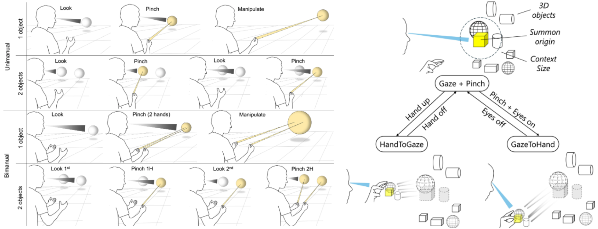
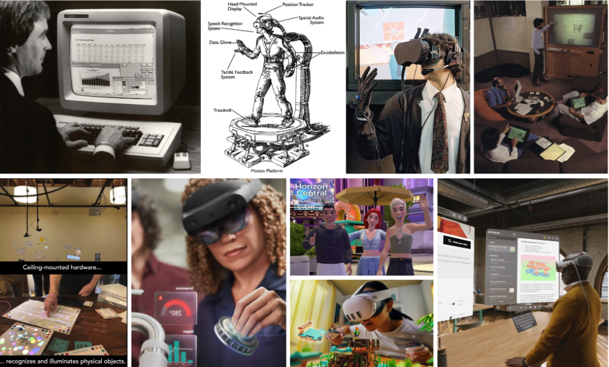
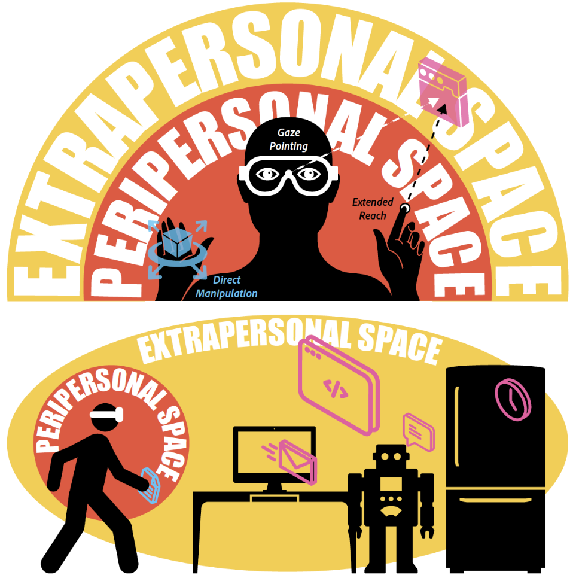
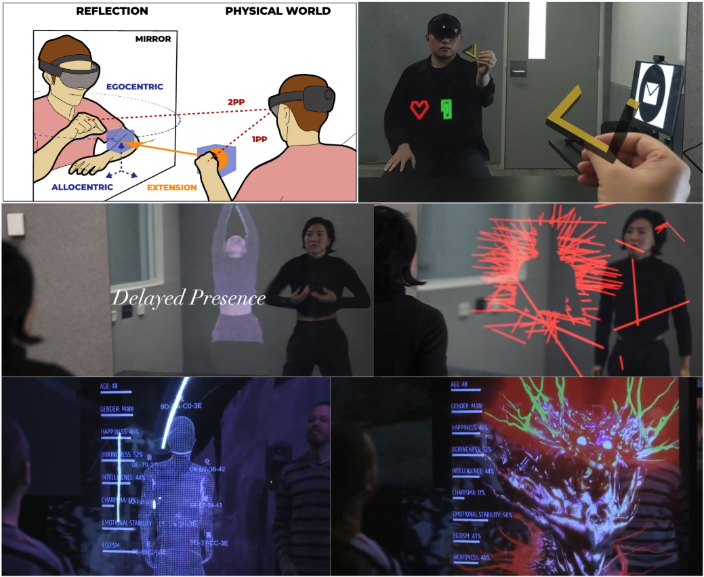
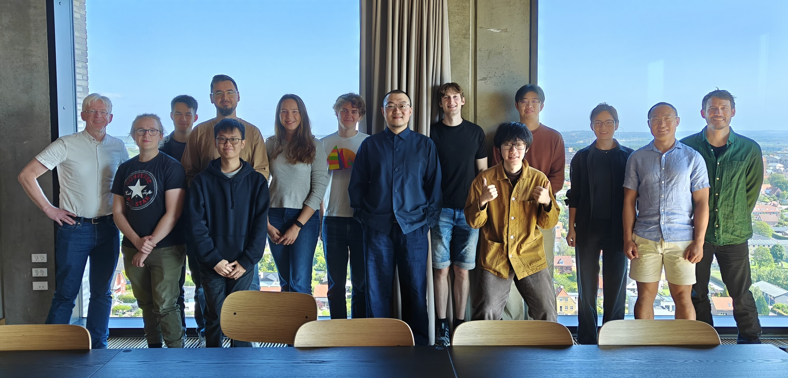

I am someone who have been very lucky to have received great mentorship from my PhD and Postdoc supervisors, and I am excited to pass it along to future generations of students who are driven by their curiosity to understand and make better interactive technologies. From October 2025, I have multiple open PhD positions along with Research Assistant and Postdoc opportunities for applicants at varying stages of study. I am also looking to advise MPhil research projects on topics related to the ones listed below. 

# Details

For detailed information on entry requirements, admission timeline, studenship, tuition fee, and else, please refer to official resources <a href="https://fytgs.hkust-gz.edu.cn/admissions/before-submitting-an-application">HERE</a>.

# Requirements 

For all positions, I am looking for self-motivated applicants with strong drive for excellence. Some combinations of the following traits are desired:
<ul>
  <li>Any educational background that makes you confident for the position</li>
  <li>Strong technical skills, including but not limited to XR Prototyping in Unity C#, Motion Capture, Computer Vision, Machine Learning, Arduino, and Digital Fabrication</li>
  <li>Basic understanding of the current research/industry landscape of HCI/XR</li>
  <li>Good command of English for communication and academic writing</li>
  <li>Interest in theoretical and conceptual thinking regarding interaction design and the use and development of computing technology</li>
</ul>

# Research Topics

## Multimodal Input for Next-Gen XR Devices

## Theoretical and Historical Reflections on Interaction Design Concepts and Principles

## Novel Interaction Combining XR and Physical Devices

## Artistic Exploration of HCI Conepts,

## AI-assisted mirror interaction
Mirror provides a specific context for interaction, as the goal is typically the same and the image one expected to see "oneself" is typically the same, enabling a much simper context space for recognition of user intention and action. 
art proj: "what do you expect?" eye contact for glance interaction?

## HCI in the Chinese Context - Cultural Studies, Media Theory, and Art

Research Environment
The University of Glasgow is ranked among the top 100 universities globally and 6th in the UK for Computer Science (Times Sunday Times Good University Guide 2025). In the UK's 2021 independent research exercise, 100% of our impact was judged as world-leading. As part of GIST, you'll be in a vibrant and diverse PhD community, thriving on collaboration and innovation. Our state-of-the-art facilities and supportive academic network provide an fantastic environment to pursue your research passions and make a meaningful impact in the field of AR technology. Our team size allows for a rich diversity of interests while also fostering a close-knit community where everyone knows each other. Glasgow is a fantastic city with lots of activities and a vibrant community.

As a supervisor, I take a hands-on, collaborative approach and view PhD students as equal partners in the research process. I thrive on open dialogue, mutual respect, and shared problem-solving, and I am committed to fostering an environment where you are empowered to take intellectual ownership of their work.

*Prof. Hans Gellersen and Prof. Ken Pfeuffer's Aarhus-Lancaster team meetup on gaze-based XR interaction  (June 2025)*

Get in Touch!
If you are interested, please reach out to me at florian.weidner [at] glasgow.ac.uk. I look forward to hearing from you. Please include:

- Your CV (long form),
- your publications or latest thesis,
- your transcripts / grades from your current or most recent degree, and
- a short description of how your prior experience matches my area of research (max. 200 words),
- an idea of your research direction (max. 200 words).
No cover letter or certificates needed.
More information
Postgraduate Research @ SoCS
My Profile @ Glasgow
GIST Section