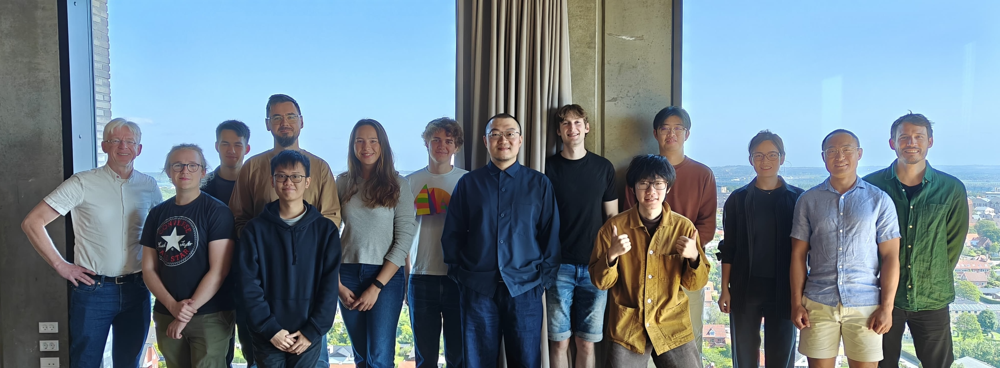

I am someone who have been very lucky to have received great mentorship from my PhD and Postdoc supervisors, and I am excited to pass it along to future generations of academics. From October 2025, I have multiple open PhD positions along with Research Assistant and Postdoc opportunities for applicants at varying stages of study. I am also looking to advise MPhil research projects on topics related to the ones listed below. 

# Details:

For detailed information on entry requirements, admission timeline, studenship, tuition fee, and else, please refer to official resources <a href="https://www.linkedin.com/posts/hkust-gz-information-hub_ai-cma-dsa-activity-7353801086882779137-kSIA?utm_source=share&utm_medium=member_desktop&rcm=ACoAABVMZ8MBBiVO8-i72U2ARtt03Fr5Sr3w9s0">HERE</a>.

# Requirements 

For all positions, I am looking for self-motivated applicants with strong drive for excellence in HCI. Some combinations of the following traits are desired:
<ul>
  <li>Strong technical skills, including but not limited to Unity C#, XR Prototyping, Motion Capture, Computer Vision, Machine Learning, Arduino, and Digital Fabrication</li>
  <li>Basic understanding of the current research/industry landscape of HCI/XR</li>
  <li>Good command of English for communication and academic writing</li>
  <li>Interest in theoretical and conceptual thinking regarding interaction design and the use and development of computing technology</li>
</ul>

# Research Topics

## Ken eye+hand next0gen XR input methods prototyping-evaluation

## historical and theoretical reflections of interactino design concepts and principles

## XR and physical devices for novel intraction

## Artistic exploration of HCI conepts, such as dance and embodied perception

## AI-assisted mirror interaction
Mirror provides a specific context for interaction, as the goal is typically the same and the image one expected to see "oneself" is typically the same, enabling a much simper context space for recognition of user intention and action. 
art proj: "what do you expect?" eye contact for glance interaction?

## Cultural studies and HCI in the Chinese context 

*Prof. Hans Gellersen and Prof. Ken Pfeuffer's Aarhus-Lancaster team meetup on gaze-based XR interaction  (June 2025)*