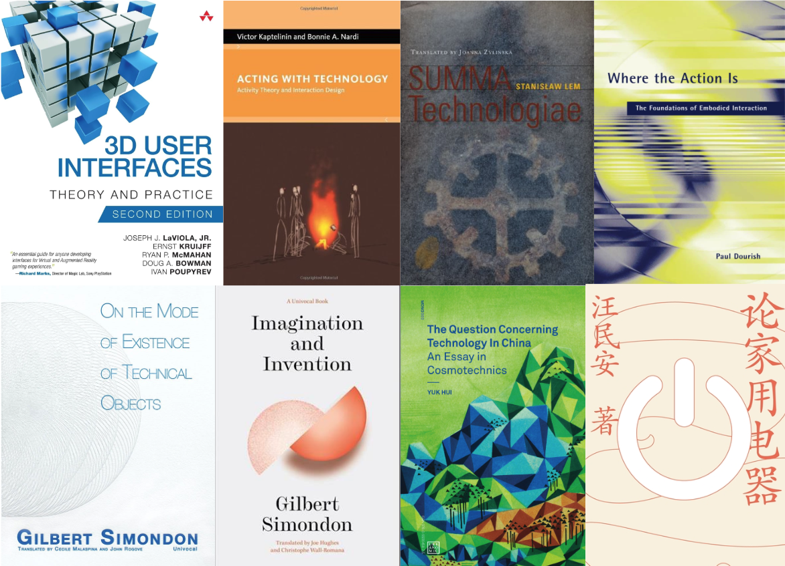

From October 2025, I will join <a href="https://www.hkust-gz.edu.cn/">HKUST(GZ)</a> as a Tenure-Track Assistant Professor affiliated with <a href="https://cma.hkust-gz.edu.cn/"> Thrust of Computational Media and Arts (CMA)</a> and <a href="https://iott.hkust-gz.edu.cn/"> Thrust of Internet of Things (IoT)</a> of the <a href="https://infh.hkust-gz.edu.cn/">Information Hub</a>. I have multiple open PhD positions along with Research Assistant and Postdoc opportunities for applicants at varying stages of study. I am also looking to advise MPhil research projects on topics related to the ones listed below. 

For detailed information on entry requirements, admission timeline, studenship, tuition fee, and else, please refer to official resources <a href="https://fytgs.hkust-gz.edu.cn/admissions/before-submitting-an-application">HERE</a>.

# Supervision and Research Environment

*Aarhus-Lancaster GEMINI team meetup on gaze-based XR interaction  (June 2025)*

I am someone who have been very lucky to have received great mentorship from my PhD and Postdoc supervisors, and I am excited to pass it along to future generations of students who are driven by their curiosity to understand and make better interactive technologies. I had the pleasure of co-supervising many PhD and Master projects with academics in Europe and in Australia. As a supervisor, I take an adaptive approach to cater for each student's diverse backgrounds and skillsets, while fostering an environment that maximises their empowerment and growth. 

*Campus and facilities of HKUST(GZ)*

Hong Kong University of Science and Technology (HKUST) was ranked 44th by QS World University Rankings 2026, and 28th in Computer Science by Times Higher Education World University Rankings 2025. At Information Hub, you'll be in a vibrant PhD community, thriving on interdisciplinary collaboration and innovation. Our <a href="https://youtu.be/EbzmQCtSNFU?si=6yz_qI4kRpYR1bV5">state-of-the-art facilities</a> and supportive academic network provide an fantastic environment to pursue your research passions and make a meaningful impact in the field of HCI. 

# Requirements 

For all positions, I am looking for self-motivated applicants with strong drive for excellence. Some combinations of the following traits are desired:
<ul>
  <li>Any educational background that makes you confident for the position</li>
  <li>Strong technical skills, including but not limited to XR Development in Unity, Motion Capture, Computer Vision, Arduino, and Digital Fabrication</li>
  <li>Basic understanding of the current research/industry landscape of HCI/XR</li>
  <li>Good command of English for academic writing and communication</li>
  <li>Interest in theoretical and conceptual thinking regarding interaction design and the use and development of computing technology</li>
</ul>

If you are interested, please reach out at qiushizhou [at] outlook.com with:

- Your CV 
- Your publications or latest thesis
- Your transcripts from your current or most recent degree
- A short description of how your skillset/experience matches my interests
- A short description of your proposed research topic(s)

### Additional Information

- <a href="https://fytgs.hkust-gz.edu.cn/programs/computational-media-and-arts-5">Postgraduate Programs @ CMA</a>
- <a href="https://fytgs.hkust-gz.edu.cn/programs/internet-of-things-5">Postgraduate Programs @ IoT</a>
- <a href="https://scholar.google.com.au/citations?user=a-FggqcAAAAJ&hl=en">My Google Scholar Profile</a>

# Research Topics

While the following topics show some of my immediate research interests, they can only work if they become tailored for the right candidate. We will discuss and determine together the detailed directions within a generic frame, according to your skills and experience. I would also love to work with people who are interested in and capable of working on something that touches on multiple topics.

## Interaction Techniques for Next-Gen XR Devices

My latest postdoctoral research has contributed to <a href="https://medium.com/sigchi/announcing-the-2025-acm-sigchi-awards-17c1feaf865f">an award-winning team</a> that pioneers foundational input methods and interaction guidelines for XR operating systems, including the latest Apple Vision Pro and Android XR. Our research output has been mostly on eye+hand interaction with a prototyping-based interaction design and engineering process. These works rely on our knowledge around the nature of gaze fixations and saccades, patterns of eye-hand coordination, and the metaphors of input that users are familiar with from using previous technologies, such as mouse and touchscreen. 

Continuing this line of research, I will explore interaction techniques for future XR devices. While we have seen the development in the capabilities of many novel input modalities inculding gaze, gestures, and even brain-computer interface, I believe that the "winner" technique that will be adopted in the future can only be discovered with the consideration of the past and current uses of interactive technologies. In this project, we will collaboratively brainstorm, design, and develop novel input techniques for future XR devices by incorporating empirical knowledge on human cognition and behaviour with past experiences in the design and engineering of input devices and techniques. I would love to work with people who enjoy reading the following papers and articles and are eager to apply these thinking in their practice. Together, our research will yield immediate real-world impact and would inform the industry to benefit current and future users.  

### Reading Material

- <a href="https://kenpfeuffer.com/eye-hand-symbiosis-what-guide/">Eye-Hand Symbiosis</a>
- <a href="https://kenhinckley.wordpress.com/wp-content/uploads/2024/07/input-technologies-and-techniques-hci-handbook-3rd-edition.pdf">Input Technologies and Techniques</a>
- <a href="https://www.dgp.toronto.edu/OTP/papers/bill.buxton/3state.html">A Three-State Model of Graphical Input</a>
- <a href="https://dl.acm.org/doi/pdf/10.1145/174630.174631">Integrality and Separability of Input Devices</a>
- <a href="https://ieeexplore.ieee.org/abstract/document/10919211">Sensorimotor Regularities for Superpower Interactions in MR</a>
- <a href="https://qiushi-zhou.github.io/PDF/UIST-2025-SightWarp.pdf">Direct Manipulation for Distant Objects Through Gaze-based Summoning</a>

## Novel Interaction Combining XR and IoT Devices

I believe that the future of XR lies in its capability of augmenting and modifying the experience with the physical reality instead of hiding it. However, because the development of XR has been mostly driven by VR, little consistent effort was made to re-design the physical reality to make it work with XR. At the same time, other previous works that are not typically as part of the XR field, such as UbiComp, Dynamicland, and Proxemic Interaction, have accumulated insights in how to embed interactive capabilities with computing in the domestic physical spaces. These insights set the stage for re-thinking the physical reality in the context of XR. 

In this project, we will explore novel interaction affordances by combining the capabilities of the XR interface and the opportunities of re-designing the physical reality in an IoT context. Specifically, we can explore how the position and relative movement of the XR-wearing body and its immediate peripersonal space among the extrapersonal space that is computationally defined by "smart" objects equipped with sensors and actuators, together in the domestic space that is full of apparent and hidden significations, rules, functions, and habits. Through physical and robot programming, we can demonstrate novel interaction affordances and concepts of XR x IoT that contribute interaction design principles and frameworks in this direction. 

### Reading Material

- <a href="https://dynamicland.org/">Dynamicland</a>
- <a href="https://www.sciencedirect.com/science/article/pii/000437029400017U">The intelligent use of space</a>
- <a href="https://www.lri.fr/~mbl/Stanford/CS477/papers/Weiser-SciAm.pdf">The Computer for the 21st Century</a>
- <a href="https://dl.acm.org/doi/pdf/10.1145/1897239.1897250">Proxemic Interactions: The New Ubicomp?</a>
- <a href="https://book.douban.com/subject/26077095/">论家用电器</a> / <a href="https://www.routledge.com/
Domestic-Spaces-in-Post-Mao-China-On-Electronic-Household-Appliances/Minan/p/book/9780367886523">On Electronic Household Appliances</a> 
- <a href="https://qiushi-zhou.github.io/PDF/HRI-2025-Assisting.pdf">Assisting MoCap-Based Teleoperation of Robot Arm using AR Visualisations</a>

## AI-assisted Interaction with Mirrors

Easily found in most domestic and public spaces, mirrors are strange objects that afford a specific type of interaction, as the goal is typically seeing oneself. This specificity in the context of its use simplifies the task of recognsing user intention and action, and allows us to design richer interaction capabilities with mirrors. While the main theme of my PhD research was designing novel interaction with mirrors in XR, I am now interested in exploring opportunities of enriching the interaction with mirrors with AI. 

In this project, we will explore ways of integrating the capability of AI, including LLM and generative models, into the interactive experience with mirrors that are beyond the typical conversational-agent or heads-up-display ideas. Starting from a more substantial understanding of the relationship between the user and their reflected image in the mirror, we will identify opportunities to augment/modify this experience through visual medium, with XR headsets and/or smart mirrors. Together, we will design and build flashy prototypes that can be used in research projects and art installations. 

### Reading Material

- <a href="https://qiushi-zhou.github.io/PDF/IMWUT-2023-RR.pdf">Reflected Reality: Augmented Reality through the Mirror</a>
- <a href="https://qiushi-zhou.github.io/PDF/CHI-2023-Dance.pdf">Here and Now: Creating Improvisational Dance Movements with an MR Mirror</a>
- <a href="https://qiushi-zhou.github.io/PDF/DIS-2022-Movement.pdf">Movement Guidance using a Mixed Reality Mirror</a>
- <a href="https://www.biometricmirror.com/">Biometric Mirror</a>

## Theoretical and Historical Reflections on Interaction Design Concepts and Principles

Aarhus University, my current institution, holds an important position in the international HCI community with its rich history in activity theory (AT) research that contributes to one of the cornerstone theoretical foundations of HCI research. In recent decades, this research effort has been led by Prof. Susanne Bødker [9] who had published influential papers that shaped contemporary HCI research. Since my appointment as a postdoc, I have been working with Prof. Bødker on analysing the use of XR through the lens of AT. 

### Reading Material

- <a href="https://mitpress.mit.edu/9780262513319/acting-with-technology/">Acting with Technology: Activity Theory and Interaction Design</a>
- <a href="https://tidsskrift.dk/daimipb/article/download/6666/5796/">Beyond the interface: Encountering artifacts in use</a>
- <a href="https://qiushi-zhou.github.io/PDF/CHI-2021-dance.pdf">Dance and Choreography in HCI: A Two-Decade Retrospective</a>
- <a href="https://dl.acm.org/doi/10.1145/3025453.3025765">What Is Interaction?</a>
- <a href="https://dl.acm.org/doi/10.1145/332040.332473">Instrumental interaction: an interaction model for post-WIMP interfaces</a>
- <a href="https://www.lri.fr/~mbl/Stanford/CS477/papers/Weiser-SciAm.pdf">The Computer for the 21st Century</a>
- <a href="https://direct.mit.edu/books/monograph/3875/Where-the-Action-IsThe-Foundations-of-Embodied">Where the Action Is: The Foundations of Embodied Interaction</a>
- <a href="https://dl.acm.org/doi/full/10.1145/3468505">Generative Theories of Interaction</a>
- <a href="https://press.uchicago.edu/ucp/books/book/chicago/M/bo3637992.html">Metaphors We Live By</a>
- <a href="https://dl.acm.org/doi/pdf/10.1145/1744161.1744163">Natural user interfaces are not natural</a>

## HCI in the Chinese Context - Cultural Studies, Media Theory, and Artistic Explorations

interdisciplinary research with dancers on using XR mirrors (Victorian College of the Arts), and to high-profile art projects (Science Gallery Melbourne and Melbourne Fringe Festival).

- <a href="https://book.douban.com/subject/26077095/">论家用电器</a> / <a href="https://www.routledge.com/Domestic-Spaces-in-Post-Mao-China-On-Electronic-Household-Appliances/Minan/p/book/9780367886523">On Electronic Household Appliances</a> 
- <a href="https://www.upress.umn.edu/9781517904876/on-the-mode-of-existence-of-technical-objects/">On the Mode of Existence of Technical Objects</a>
- <a href="https://www.upress.umn.edu/9781517914455/imagination-and-invention/">Imagination and Invention</a>
- <a href="https://mitpress.mit.edu/9780995455009/the-question-concerning-technology-in-china/">The Question Concerning Technology in China</a> / <a href="https://book.douban.com/subject/34954806/">论中国的技术问题
</a>
- <a href="https://mitpress.mit.edu/9780262513319/acting-with-technology/">Acting with Technology: Activity Theory and Interaction Design</a>
- <a href="https://www.upress.umn.edu/9780816675777/summa-technologiae/">Summa Technologiae</a> / <a href="https://book.douban.com/subject/35660021/">技术大全</a>
- <a href="https://mitpress.mit.edu/9780262693264/shaping-things/">Shaping Things</a>
- <a href="https://qiushi-zhou.github.io/PDF/CHI-2023-Dance.pdf">Here and Now: Creating Improvisational Dance Movements with an MR Mirror</a>
- <a href="https://qiushi-zhou.github.io/PDF/CHI-2021-dance.pdf">Dance and Choreography in HCI: A Two-Decade Retrospective</a>